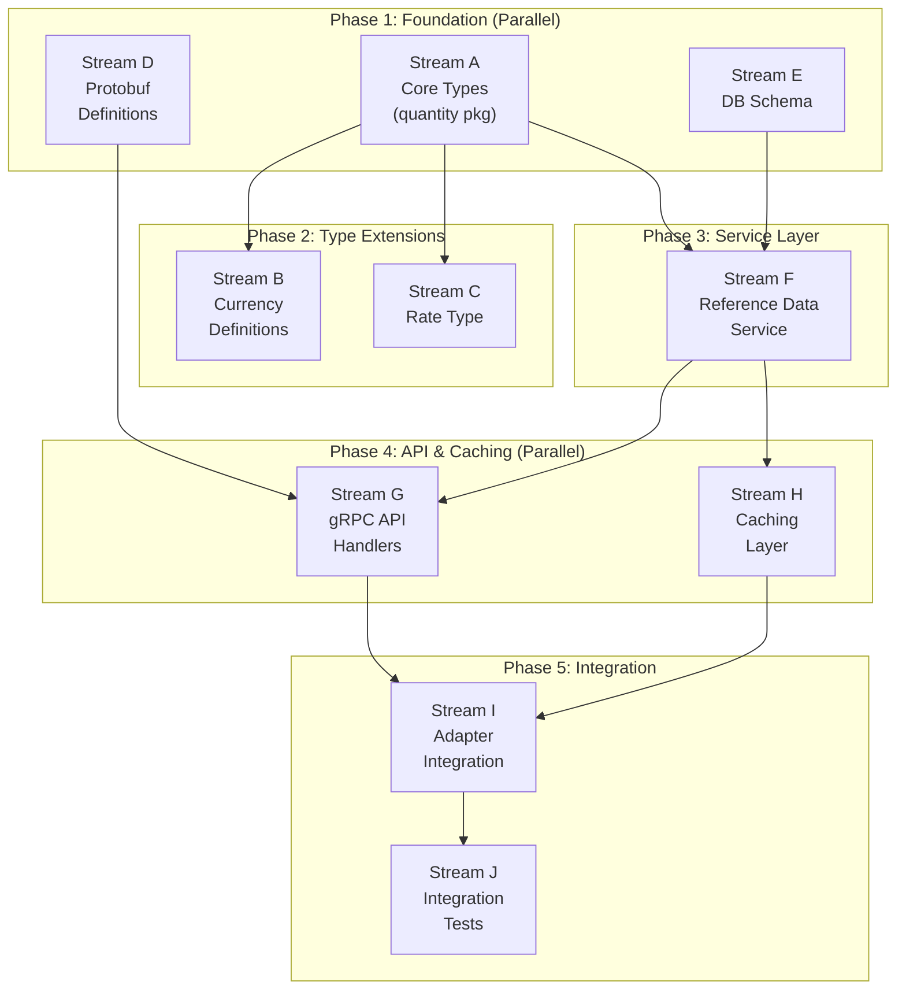

# PRD: Universal Asset System

**Status:** Draft
**ADRs:** [0013 - Universal Quantity Type System](../adr/0013-generic-asset-quantity-types.md), [0014 - Dynamic Asset Registry](../adr/0014-dynamic-asset-registry.md)
**Target Task Master Tag:** `universal-asset-system`

## Overview

Extend Meridian's ledger from fiat-only to multi-asset support. Enable tenants to define
custom assets (energy, commodities, vouchers) without code deployment while maintaining
compile-time dimensional safety.

### Goals

1. **Compile-time safety**: Prevent physics errors (money + rice) at build time
2. **Runtime flexibility**: New assets via database configuration, not code
3. **Tenant isolation**: Each tenant has their own asset catalog
4. **Valuation foundation**: Rate type for asset-to-currency conversion (providers in future PRD)

### Non-Goals (Simplified Scope)

- ~~Migration from legacy `Money` types~~ - clean implementation, no backwards compatibility
- ~~Migration-as-Trade pattern~~ - no existing positions to migrate
- ~~Version deprecation lifecycle~~ - not needed pre-production
- ~~Distributed cache invalidation~~ - simple caching sufficient for now

---

## CEL Validation Pattern

We use **Google CEL (Common Expression Language)** for attribute validation instead of JSON Schema.
CEL is non-Turing complete, compiles to bytecode, executes in nanoseconds, and can express
cross-field validation that JSON Schema cannot.

### Why CEL over JSON Schema

| Aspect | JSON Schema | CEL |
|--------|-------------|-----|
| **Performance** | ~1ms (parse + validate) | ~100ns (execute compiled) |
| **Cross-field validation** | Limited | Native: `a.x > a.y` |
| **Type coercion** | Strict | Explicit: `int(attrs['expiry'])` |
| **Ecosystem** | Web-standard | Google/Proto-native |
| **Safety** | Schema validation | Guaranteed termination |

### Example: Defining a Custom Instrument with CEL

A tenant registers "GPU-H100-SPOT" with this validation expression:

```javascript
// Rule: Must have region, and if US region, zone must be 1 or 2
has(attributes.region) &&
(attributes.region != 'us-east' || attributes.zone in ['1', '2'])
```

### Example: Validation at Ingestion

When `RecordMeasurement` receives:

```json
{
  "instrument": "GPU-H100-SPOT",
  "attributes": { "region": "us-east", "zone": "5" }
}
```

The cached CEL program executes → returns `false` → measurement rejected **before** domain layer.

### CEL Expression Examples

| Use Case | CEL Expression |
|----------|----------------|
| No constraints | `true` |
| Require field | `has(attributes.region)` |
| Enum validation | `attributes.type in ['spot', 'reserved', 'committed']` |
| Numeric check | `int(attributes.expiry) > 1700000000` |
| Cross-field | `attributes.tier == 'premium' \|\| !has(attributes.sla)` |

---

## Work Streams

Designed for parallel execution across multiple developers. Dependencies shown in diagram below.



---

## Stream A: Core Types Package

**Location:** `pkg/platform/quantity/`
**Dependencies:** None (foundational)

### Deliverables

1. **Dimensions** (`dimension.go`)

   ```go
   type Monetary struct{}
   type Commodity struct{}
   ```

2. **UnitDef** (`unit.go`)

   ```go
   type UnitDef struct {
       Code      string    // "USD", "KWH", "GPU-H100"
       Version   uint32    // Schema version
       Dimension string    // "Monetary" or "Commodity" - required for deserialization
       Precision int       // Decimal places
   }
   ```

   > **Serialization note**: `Dimension` is stored as a string (not type parameter) because
   > Go generics are erased at runtime. When deserializing from DB/proto, we use `Dimension`
   > to reconstruct the correct `Quantity[Monetary]` or `Quantity[Commodity]` at the boundary.

3. **Quantity[D]** (`quantity.go`)

   ```go
   type Quantity[D any] struct {
       Amount decimal.Decimal
       Unit   UnitDef
   }

   // Type aliases
   type Money = Quantity[Monetary]
   type Asset = Quantity[Commodity]
   ```

4. **Operations**: `Add`, `Subtract`, `Multiply`, `Divide`, `Neg`, `IsZero`, `Compare`
   - Same-dimension operations: compile-time safe
   - Same-unit validation: runtime check returning error

5. **PositionKey** (`position.go`)

   ```go
   type PositionKey struct {
       AccountID  string
       AssetCode  string
       Version    uint32
       Attributes map[string]string
   }
   ```

6. **Generic Bridge Factory** (`factory.go`)

   > **The Problem**: Go generics are erased at runtime, but DB/Proto use string dimensions.
   > This factory is the **only** boundary where runtime strings become compile-time types.

   ```go
   // ParseQuantity converts raw data into a typed Quantity.
   // This is the boundary between runtime (Proto/DB) and compile-time (Go generics).
   func ParseQuantity(amount decimal.Decimal, def UnitDef) (any, error) {
       switch def.Dimension {
       case "Monetary":
           return Quantity[Monetary]{Amount: amount, Unit: def}, nil
       case "Commodity":
           return Quantity[Commodity]{Amount: amount, Unit: def}, nil
       default:
           return nil, ErrUnknownDimension
       }
   }
   ```

### Acceptance Criteria

- [ ] `Quantity[Monetary].Add(Quantity[Commodity])` fails at compile time
- [ ] `USD.Add(EUR)` returns `ErrUnitMismatch` at runtime
- [ ] `USD(v1).Add(USD(v2))` returns `ErrVersionMismatch` at runtime
- [ ] `ParseQuantity` correctly bridges runtime strings to compile-time types
- [ ] 100% test coverage on arithmetic operations

---

## Stream B: Currency Definitions

**Location:** `pkg/platform/quantity/currency/`
**Dependencies:** Stream A (UnitDef type)

### Deliverables

1. **Predefined UnitDefs** for major currencies (ISO 4217):
   - USD, EUR, GBP, JPY, CHF, AUD, CAD, NZD
   - Precision: 2 for most, 0 for JPY

2. **Lookup function**:

   ```go
   func ByCode(code string) (UnitDef, bool)
   ```

3. **Constructor helpers**:

   ```go
   func USD(amount decimal.Decimal) Money
   func EUR(amount decimal.Decimal) Money
   // etc.
   ```

### Acceptance Criteria

- [ ] All major fiat currencies defined with correct precision
- [ ] `currency.USD(decimal.NewFromInt(100))` creates valid Money

---

## Stream C: Rate Type

**Location:** `pkg/platform/quantity/`
**Dependencies:** Stream A (Quantity, UnitDef types)

> **Scope boundary**: This stream covers the Rate data structure and basic conversion math only.
> ValuationProvider interface and orchestration belongs in a future Valuation Engine PRD (ADR-019).

### Deliverables

1. **Rate type** (`rate.go`)

   ```go
   type Rate struct {
       From      UnitDef
       To        UnitDef
       Factor    decimal.Decimal
       ValidFrom time.Time
       ValidTo   time.Time
   }

   // Convert applies the rate to a quantity, returning the converted amount.
   // Returns error if quantity's unit doesn't match Rate.From.
   func (r Rate) Convert(q Quantity[Monetary]) (Quantity[Monetary], error)
   ```

2. **Identity rate helper**:

   ```go
   // IdentityRate returns a 1:1 rate for same-currency operations
   func IdentityRate(unit UnitDef) Rate
   ```

3. **Rate validation**: Ensure `From != To` unless identity, validate temporal bounds

### Acceptance Criteria

- [ ] `Rate.Convert()` correctly multiplies amount by factor
- [ ] `Rate.Convert()` returns error if unit mismatch
- [ ] `IdentityRate()` returns factor of 1.0
- [ ] Rate with `ValidFrom > ValidTo` rejected

---

## Stream D: Protobuf Definitions

**Location:** `proto/platform/v1/`
**Dependencies:** Stream A (type design, can work from ADR spec)

> **Proto vs CEL**: Protobuf defines the **Container** (data structure). CEL is the **Gatekeeper**
> (validation logic). Proto messages are pure data carriers with no behavior. CEL expressions
> are compiled and executed by the service layer to validate attribute payloads.

### Deliverables

1. **InstrumentAmount message** (`quantity.proto`) - *The Data Carrier*

   ```protobuf
   message InstrumentAmount {
       string amount = 1;              // Decimal as string for precision
       string instrument_code = 2;     // "USD", "KWH", "GPU-H100"
       uint32 version = 3;             // Schema version

       // The "Payload": Raw key-value pairs.
       // Checked against validation_expression at ingestion time.
       // All values are strings; CEL handles type coercion.
       map<string, string> attributes = 4;
   }
   ```

   > **Why `map<string, string>`**: Using `google.protobuf.Struct` adds marshalling overhead
   > and CEL environment complexity. String maps are fast, simple, and CEL can coerce types
   > explicitly: `int(attributes['expiry']) > 1700000000`.

2. **InstrumentDefinition message** (`reference_data.proto`) - *Structure + Rules*

   ```protobuf
   message InstrumentDefinition {
       string id = 1;
       string tenant_id = 2;
       string code = 3;
       uint32 version = 4;
       string dimension = 5;           // "Monetary" or "Commodity"
       int32 precision = 6;

       // The "Gatekeeper": A CEL expression that validates if a
       // position's attributes are allowed for this instrument.
       // Compiled and cached by the service layer.
       // Example: "has(attributes.region) && int(attributes.expiry) > 0"
       string validation_expression = 7;

       string display_name = 8;
       string description = 9;
   }
   ```

3. **Rate message**

   ```protobuf
   message Rate {
       string from_code = 1;
       string to_code = 2;
       string factor = 3;
       google.protobuf.Timestamp valid_from = 4;
       google.protobuf.Timestamp valid_to = 5;
   }
   ```

4. **Buf breaking change detection** configured

### Acceptance Criteria

- [ ] Proto compiles without errors
- [ ] Generated Go code matches domain types
- [ ] Buf lint passes
- [ ] `validation_expression` field documented with CEL examples

---

## Stream E: Database Schema

**Location:** `services/reference-data/migrations/`
**Dependencies:** Stream A (UnitDef field design)

> **BIAN alignment**: This service maps to the BIAN `FinancialInstrumentReferenceDataManagement`
> service domain, which maintains a directory of financial instrument reference data including
> currencies, equities, debt instruments, and commodities.

### Deliverables

1. **Instrument definitions table**

   ```sql
   CREATE TABLE instrument_definitions (
       id UUID PRIMARY KEY DEFAULT gen_random_uuid(),
       tenant_id UUID NOT NULL,
       code VARCHAR(32) NOT NULL,
       version INTEGER NOT NULL DEFAULT 1,
       dimension VARCHAR(32) NOT NULL,
       precision INTEGER NOT NULL,
       validation_expression TEXT NOT NULL DEFAULT 'true',  -- CEL expression
       display_name VARCHAR(128),
       description TEXT,
       created_at TIMESTAMPTZ NOT NULL DEFAULT NOW(),

       UNIQUE(tenant_id, code, version),
       CHECK (precision >= 0 AND precision <= 18),
       CHECK (dimension IN ('Monetary', 'Commodity')),
       CHECK (validation_expression <> '')  -- Must have some expression
   );

   CREATE INDEX idx_instrument_definitions_lookup
       ON instrument_definitions(tenant_id, code, version);
   ```

   > **CEL over JSON Schema**: We use CEL (Common Expression Language) instead of JSON Schema
   > for attribute validation. CEL compiles to bytecode, executes in nanoseconds, guarantees
   > termination, and can express cross-field validation that JSON Schema cannot.

2. **System tenant seed data**:

   ```sql
   -- System tenant ID: 00000000-0000-0000-0000-000000000000
   -- Platform-wide instruments accessible to ALL tenants
   -- validation_expression='true' means no attribute constraints
   INSERT INTO instrument_definitions
       (tenant_id, code, version, dimension, precision, validation_expression, display_name)
   VALUES
       ('00000000-0000-0000-0000-000000000000', 'USD', 1, 'Monetary', 2, 'true', 'US Dollar'),
       ('00000000-0000-0000-0000-000000000000', 'EUR', 1, 'Monetary', 2, 'true', 'Euro'),
       ('00000000-0000-0000-0000-000000000000', 'GBP', 1, 'Monetary', 2, 'true', 'British Pound');
   ```

### Acceptance Criteria

- [ ] Migration applies cleanly
- [ ] Unique constraint prevents duplicate code+version per tenant
- [ ] Index supports efficient lookups
- [ ] System tenant seed data inserted
- [ ] `validation_expression` column stores valid CEL expressions
- [ ] Default `'true'` allows permissive instruments (no attribute constraints)

---

## Stream F: Reference Data Service

**Location:** `services/reference-data/`
**Dependencies:** Stream A, Stream E

### Deliverables

1. **InstrumentRegistry interface** (`registry.go`)

   ```go
   // SystemTenantID is the well-known UUID for platform-wide instruments
   var SystemTenantID = uuid.MustParse("00000000-0000-0000-0000-000000000000")

   type InstrumentRegistry interface {
       // GetDefinition looks up instrument by tenant, falling back to SystemTenant if not found.
       // Lookup order: tenant_id → SystemTenantID
       GetDefinition(ctx context.Context, tenantID uuid.UUID, code string, version uint32) (InstrumentDefinition, error)

       // GetLatestDefinition returns highest version, with same fallback logic
       GetLatestDefinition(ctx context.Context, tenantID uuid.UUID, code string) (InstrumentDefinition, error)

       // CreateDefinition creates tenant-specific instrument (cannot create in SystemTenant via API)
       // Compiles CEL expression at creation time - fails fast on syntax errors
       CreateDefinition(ctx context.Context, def InstrumentDefinition) (InstrumentDefinition, error)

       // ListDefinitions returns tenant instruments + all SystemTenant instruments
       ListDefinitions(ctx context.Context, tenantID uuid.UUID) ([]InstrumentDefinition, error)

       // ValidateAttributes executes compiled CEL program against attribute map
       ValidateAttributes(ctx context.Context, def InstrumentDefinition, attrs map[string]string) error
   }
   ```

2. **System Tenant Inheritance Logic**:

   ```go
   func (r *PostgresRegistry) GetDefinition(
       ctx context.Context, tenantID uuid.UUID, code string, version uint32,
   ) (InstrumentDefinition, error) {
       // 1. Try tenant-specific lookup
       def, err := r.queries.GetInstrumentDefinition(ctx, tenantID, code, version)
       if err == nil {
           return def, nil
       }
       if !errors.Is(err, sql.ErrNoRows) {
           return InstrumentDefinition{}, err
       }

       // 2. Fallback to System Tenant
       return r.queries.GetInstrumentDefinition(ctx, SystemTenantID, code, version)
   }
   ```

3. **CEL Compiler** (`cel.go`) using `github.com/google/cel-go`:

   ```go
   type CELCompiler struct {
       env *cel.Env
   }

   func NewCELCompiler() (*CELCompiler, error) {
       env, err := cel.NewEnv(
           cel.Variable("attributes", cel.MapType(cel.StringType, cel.StringType)),
       )
       if err != nil {
           return nil, err
       }
       return &CELCompiler{env: env}, nil
   }

   // Compile parses and compiles a CEL expression. Called at instrument creation.
   func (c *CELCompiler) Compile(expr string) (cel.Program, error) {
       ast, issues := c.env.Compile(expr)
       if issues != nil && issues.Err() != nil {
           return nil, fmt.Errorf("CEL compile error: %w", issues.Err())
       }
       return c.env.Program(ast)
   }

   // Evaluate runs a compiled program against attributes. Called at ingestion.
   func (c *CELCompiler) Evaluate(prog cel.Program, attrs map[string]string) (bool, error) {
       out, _, err := prog.Eval(map[string]interface{}{"attributes": attrs})
       if err != nil {
           return false, err
       }
       return out.Value().(bool), nil
   }
   ```

4. **PostgreSQL implementation** with sqlc-generated queries

5. **Error types**:
   - `ErrInstrumentNotFound`
   - `ErrDuplicateInstrument`
   - `ErrCELCompileError` - syntax/semantic error in validation expression
   - `ErrAttributeValidationFailed` - CEL evaluated to `false`

### Acceptance Criteria

- [ ] CRUD operations work correctly
- [ ] Tenant lookup falls back to System Tenant when not found
- [ ] `ListDefinitions` includes both tenant and System Tenant instruments
- [ ] Cannot create instruments in System Tenant via API (admin-only seed data)
- [ ] CEL expression compiled at `CreateDefinition` - syntax errors rejected immediately
- [ ] `ValidateAttributes` executes compiled CEL and returns clear error on `false`

---

## Stream G: gRPC API Handlers

**Location:** `services/reference-data/handler/`
**Dependencies:** Stream D, Stream F

### Deliverables

1. **ReferenceDataService** proto definition:

   ```protobuf
   service ReferenceDataService {
       rpc RegisterInstrument(RegisterInstrumentRequest) returns (InstrumentDefinition);
       rpc RetrieveInstrument(RetrieveInstrumentRequest) returns (InstrumentDefinition);
       rpc ListInstruments(ListInstrumentsRequest) returns (ListInstrumentsResponse);
   }
   ```

2. **Handler implementation** with:
   - Tenant extraction from context
   - Input validation
   - Error mapping to gRPC codes

3. **Adapter layer** for proto ↔ domain conversion

### Acceptance Criteria

- [ ] All endpoints functional
- [ ] Proper gRPC error codes returned
- [ ] Tenant context required and enforced

---

## Stream H: Caching Layer

**Location:** `services/reference-data/cache/`
**Dependencies:** Stream F (registry interface)

### Deliverables

1. **CachedInstrumentRegistry** wrapper with **compiled CEL programs**:

   ```go
   // CachedInstrument holds both the definition and its pre-compiled CEL program
   type CachedInstrument struct {
       Definition InstrumentDefinition
       Program    cel.Program  // Pre-compiled - parsing CEL is expensive, execution is cheap
   }

   type CachedInstrumentRegistry struct {
       delegate InstrumentRegistry
       compiler *CELCompiler
       cache    *lru.Cache[string, CachedInstrument]  // Bounded LRU
       ttl      time.Duration
   }
   ```

   > **Why cache compiled programs**: CEL parsing/compilation is ~100μs. CEL execution is ~100ns.
   > By caching `cel.Program` alongside the definition, we pay the compilation cost once.

2. **Read-through caching** on `GetDefinition` and `GetLatestDefinition`
   - On cache miss: fetch from DB, compile CEL, store both

3. **Cache invalidation** on `CreateDefinition` (local only, no distributed)

### Acceptance Criteria

- [ ] Cache hit returns pre-compiled CEL program
- [ ] TTL-based expiration works
- [ ] Creation invalidates relevant cache entries
- [ ] `ValidateAttributes` uses cached `cel.Program` (no re-compilation)

---

## Stream I: Adapter Integration

**Location:** Existing service adapters (Position Keeping, Current Account, etc.)
**Dependencies:** Stream F, Stream G, Stream H

> **Performance critical**: Position Keeping may process 100k+ TPS. Every `RecordMeasurement`
> call must NOT make a synchronous gRPC call to Reference Data. Instrument definitions AND
> compiled CEL programs must be cached aggressively in-process.

### Deliverables

1. **Reference Data client** injected into transaction adapters

2. **Bounded LRU cache** within Position Keeping using `hashicorp/golang-lru`:

   ```go
   // LocalInstrumentCache provides sub-microsecond lookups for hot-path operations.
   // Uses bounded LRU to prevent memory explosion from temporary assets.
   type LocalInstrumentCache struct {
       registry InstrumentRegistry              // Remote client (fallback)
       compiler *CELCompiler                    // For compiling on cache miss
       cache    *lru.Cache[string, CachedInstrument]  // Bounded: max 10,000 entries
       ttl      time.Duration                   // Refresh interval (e.g., 5 minutes)
   }

   func (c *LocalInstrumentCache) Get(
       ctx context.Context, tenantID uuid.UUID, code string, version uint32,
   ) (CachedInstrument, error) {
       key := fmt.Sprintf("%s:%s:%d", tenantID, code, version)

       // 1. Check LRU cache (O(1) lookup)
       if cached, ok := c.cache.Get(key); ok {
           return cached, nil
       }

       // 2. Cache miss: fetch from Reference Data service
       def, err := c.registry.GetDefinition(ctx, tenantID, code, version)
       if err != nil {
           return CachedInstrument{}, err
       }

       // 3. Compile CEL program
       prog, err := c.compiler.Compile(def.ValidationExpression)
       if err != nil {
           return CachedInstrument{}, fmt.Errorf("CEL compile: %w", err)
       }

       // 4. Store in bounded LRU (evicts oldest if full)
       cached := CachedInstrument{Definition: def, Program: prog}
       c.cache.Add(key, cached)
       return cached, nil
   }
   ```

   > **Why bounded LRU over sync.Map**: If a tenant defines 10,000+ temporary voucher codes,
   > an unbounded `sync.Map` will leak memory. LRU evicts least-recently-used entries,
   > keeping memory bounded while retaining hot instruments.

3. **Background refresh goroutine**: Periodically refresh cached definitions to pick up new
   instruments without requiring restarts

4. **Validation Checkpoint** (the ingestion pipeline):

   When `RecordMeasurement` is called, the adapter executes this sequence:

   ```text
   ┌─────────────────────────────────────────────────────────────────┐
   │  1. PROTO DECODE                                                │
   │     Receive InstrumentAmount (pure data)                        │
   ├─────────────────────────────────────────────────────────────────┤
   │  2. CACHE LOOKUP                                                │
   │     Fetch CachedInstrument using instrument_code + version      │
   │     (LRU hit = ~10ns, miss = gRPC + CEL compile)                │
   ├─────────────────────────────────────────────────────────────────┤
   │  3. CEL EXECUTION                                               │
   │     Run cached.Program.Eval(attributes)                         │
   │     → false or error: REJECT (400 Bad Request)                  │
   │     → true: CONTINUE                                            │
   ├─────────────────────────────────────────────────────────────────┤
   │  4. TYPE BRIDGE                                                 │
   │     ParseQuantity(amount, def) → Quantity[Monetary/Commodity]   │
   │     Only NOW does data become a typed domain object             │
   ├─────────────────────────────────────────────────────────────────┤
   │  5. DOMAIN ENTRY                                                │
   │     Pass typed Quantity to Position Keeping domain layer        │
   └─────────────────────────────────────────────────────────────────┘
   ```

   ```go
   func (a *TransactionAdapter) validateInstrument(
       ctx context.Context, req *pb.InstrumentAmount,
   ) error {
       // Step 2: Cache lookup
       cached, err := a.localCache.Get(ctx, tenantID, req.InstrumentCode, req.Version)
       if err != nil {
           return status.Errorf(codes.NotFound, "unknown instrument")
       }

       // Step 3: CEL execution (~100ns)
       valid, err := a.compiler.Evaluate(cached.Program, req.Attributes)
       if err != nil {
           return status.Errorf(codes.Internal, "CEL eval error: %v", err)
       }
       if !valid {
           return status.Errorf(codes.InvalidArgument, "attributes failed validation")
       }
       return nil
   }
   ```

5. **Position creation** using validated `PositionKey` and `ParseQuantity` factory

### Acceptance Criteria

- [ ] Invalid instruments rejected at adapter layer
- [ ] Invalid attributes rejected with clear errors (CEL returns false)
- [ ] Cache hit rate > 99% after warm-up
- [ ] No gRPC calls on hot path (cache hit)
- [ ] No CEL compilation on hot path (use cached `cel.Program`)
- [ ] Memory bounded by LRU max size (e.g., 10,000 entries)
- [ ] New instruments visible within TTL window (e.g., 5 minutes)

---

## Stream J: Integration Tests

**Location:** `services/reference-data/integration_test.go`
**Dependencies:** All streams

### Deliverables

1. **End-to-end tests** using Testcontainers:
   - Create custom instrument definition
   - Create position with instrument
   - Validate attribute rejection
   - Tenant isolation verification
   - System Tenant fallback verification

2. **Performance baseline**: Registry lookup latency under load

### Acceptance Criteria

- [ ] Full workflow tested
- [ ] Tenant isolation proven
- [ ] System Tenant inheritance works (tenant can use "USD" without defining it)
- [ ] No flaky tests (use `await` package, not `time.Sleep`)

---

## Parallel Execution Summary

| Stream | Can Start After | Developers |
|--------|-----------------|------------|
| A: Core Types | Immediately | 2 |
| B: Currency | A | 1 |
| C: Rate Type | A | 1 |
| D: Protobuf | Immediately (from ADR spec) | 1 |
| E: DB Schema | Immediately (from ADR spec) | 1 |
| F: Reference Data Service | A + E | 2 |
| G: gRPC Handlers | D + F | 1 |
| H: Caching | F | 1 |
| I: Adapter Integration | F + G | 2 |
| J: Integration Tests | All | 1 |

**Critical path:** A → F → G → I → J

**Maximum parallelism at start:** 4 streams (A, D, E, and potentially B/C if working from ADR spec)

---

## Decisions Made

| Question | Decision |
|----------|----------|
| Service naming | `reference-data` (BIAN: FinancialInstrumentReferenceDataManagement) |
| System Tenant ID | `00000000-0000-0000-0000-000000000000` |
| Lookup inheritance | Tenant → System Tenant fallback |
| Valuation scope | Rate struct only; ValuationProvider deferred to future PRD |
| Attribute validation | CEL expressions (not JSON Schema) - 100x faster, cross-field capable |
| Local cache type | Bounded LRU (`hashicorp/golang-lru`) to prevent memory leaks |
| CEL caching | Cache compiled `cel.Program` alongside definitions |

---

## Open Questions

1. **Initial commodity catalog**: Which non-currency instruments should be seeded (if any)?
2. **Cache TTL**: What's the acceptable staleness window for instrument definitions? (Proposed: 5 min)

---

## Success Metrics

- [ ] All streams completed and merged
- [ ] Custom instrument creation works end-to-end
- [ ] System Tenant inheritance works (any tenant can use "USD")
- [ ] No compile-time dimensional safety regressions
- [ ] Reference Data lookup p99 < 10ms (with service-level caching)
- [ ] Position Keeping cache hit rate > 99% (with local caching)
