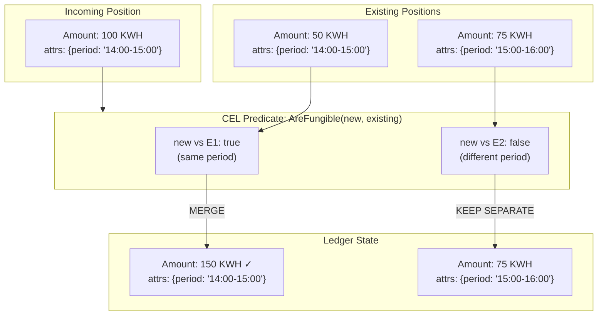
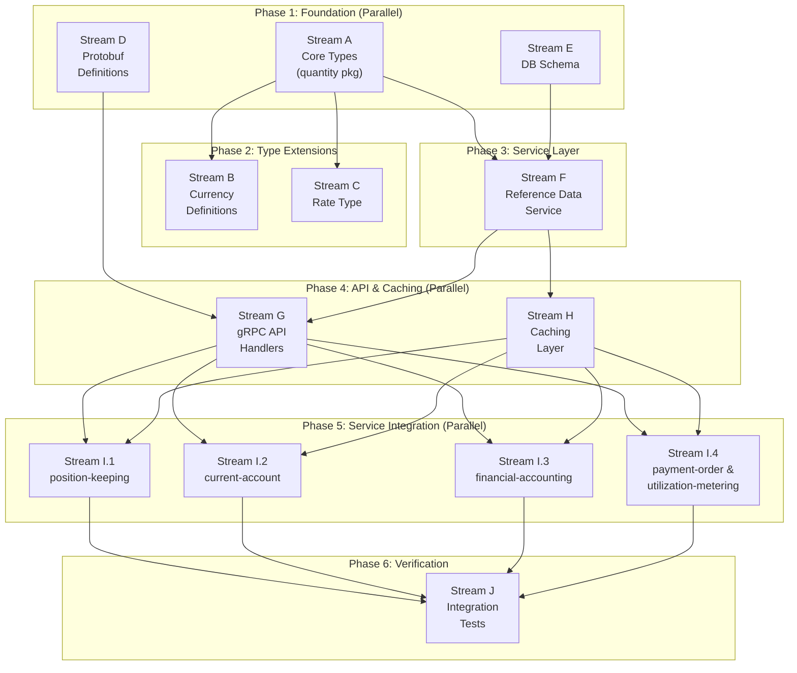

# PRD: Universal Asset System

**Status:** Draft
**ADRs:** [0013 - Universal Quantity Type System](../adr/0013-generic-asset-quantity-types.md), [0014 - Dynamic Asset Registry](../adr/0014-dynamic-asset-registry.md)
**Target Task Master Tag:** `universal-asset-system`

## Overview

Extend Meridian's ledger from fiat-only to multi-asset support. Enable tenants to define
custom assets (energy, commodities, vouchers) without code deployment while maintaining
compile-time dimensional safety.

### Goals

1. **Compile-time safety**: Prevent physics errors (money + rice) at build time
2. **Runtime flexibility**: New assets via database configuration, not code
3. **Tenant isolation**: Each tenant has their own asset catalog
4. **Valuation foundation**: Rate type for asset-to-currency conversion (providers in future PRD)

### Non-Goals (Simplified Scope)

- ~~Migration from legacy `Money` types~~ - clean implementation, no backwards compatibility
- ~~Migration-as-Trade pattern~~ - no existing positions to migrate
- ~~Version deprecation lifecycle~~ - not needed pre-production
- ~~Distributed cache invalidation~~ - simple caching sufficient for now

---

## CEL Validation Pattern

We use **Google CEL (Common Expression Language)** for attribute validation instead of JSON Schema.
CEL is non-Turing complete, compiles to bytecode, executes in nanoseconds, and can express
cross-field validation that JSON Schema cannot.

### Why CEL over JSON Schema

| Aspect | JSON Schema | CEL |
|--------|-------------|-----|
| **Performance** | ~1ms (parse + validate) | ~100ns (execute compiled) |
| **Cross-field validation** | Limited | Native: `a.x > a.y` |
| **Type coercion** | Strict | Explicit: `int(attrs['expiry'])` |
| **Ecosystem** | Web-standard | Google/Proto-native |
| **Safety** | Schema validation | Guaranteed termination |

### Example: Defining a Custom Instrument with CEL

A tenant registers "GPU-H100-SPOT" with this validation expression:

```javascript
// Rule: Must have region, and if US region, zone must be 1 or 2
has(attributes.region) &&
(attributes.region != 'us-east' || attributes.zone in ['1', '2'])
```

### Example: Validation at Ingestion

When `RecordMeasurement` receives:

```json
{
  "instrument": "GPU-H100-SPOT",
  "attributes": { "region": "us-east", "zone": "5" }
}
```

The cached CEL program executes → returns `false` → measurement rejected **before** domain layer.

### CEL Expression Examples

| Use Case | CEL Expression |
|----------|----------------|
| No constraints | `true` |
| Require field | `has(attributes.region)` |
| Enum validation | `attributes.type in ['spot', 'reserved', 'committed']` |
| Numeric check | `int(attributes.expiry) > 1700000000` |
| Cross-field | `attributes.tier == 'premium' \|\| !has(attributes.sla)` |

---

## Data Contract: Proto + CEL + Go

This table visualizes how the three technologies work together:

| Concept | Defined In (Static) | Instance Data (Runtime) | Connected By |
|---------|---------------------|-------------------------|--------------|
| **Structure** | **Protobuf** (`InstrumentAmount`) | `map<string,string> attributes` | The Wire Format |
| **Logic** | **CEL** (Reference Data) | `validation_expression`, `fungibility_expression` | The Validation Engine |
| **Bridge** | **Go** (`quantity.ParseQuantity`) | `env.Program.Eval(vars)` | Variable Injection |

**How they connect at runtime:**

```go
// 1. PROTO holds the payload (dumb container)
protoMsg := &pb.InstrumentAmount{
    Amount:         "100.50",
    InstrumentCode: "KWH",
    Version:        1,
    Attributes:     map[string]string{"tou_period": "14", "region": "us-east"},
}

// 2. CEL holds the rules (smart logic) - loaded from Reference Data
cachedInstrument := cache.Get(tenantID, "KWH", 1)
// validation_expression: "has(attributes.tou_period) && int(attributes.tou_period) >= 0"

// 3. GO bridges them via Variable Injection
celVars := map[string]interface{}{
    "attributes": protoMsg.Attributes,  // Proto data → CEL environment
}
result, _ := cachedInstrument.ValidationProgram.Eval(celVars)
// result: true (attributes are valid for this instrument)
```

**The Architectural Moat:**

- **Proto** provides infinite flexibility (any `map<string,string>`)
- **CEL** provides rigid safety (tenant-defined validation rules)
- **Go Generics** provide compile-time physics (`Quantity[Monetary]` vs `Quantity[Commodity]`)

---

## Fungibility Resolution

Beyond ingestion validation, CEL handles **operational predicates** that determine position
behavior. This extends CEL from "is this data valid?" to "can these positions be combined?"

### The Performance Guardrail

```text
┌─────────────────────────────────────────────────────────────────────────┐
│  NATIVE GO (Hot Path)              │  CEL (Policy Decisions)           │
├─────────────────────────────────────────────────────────────────────────┤
│  Quantity.Add()                    │  validation_expression            │
│  Quantity.Sub()                    │  fungibility_expression           │
│  decimal.Decimal arithmetic        │  AreFungible(ctx_a, ctx_b)        │
│  Position aggregation loop         │  Temporal overlap policy          │
└─────────────────────────────────────────────────────────────────────────┘
```

**Rule**: CEL evaluates predicates (boolean decisions). Native Go performs arithmetic.
We never offload `Add`/`Sub` to CEL in the hot loop.

### Fungibility Expression

Each instrument defines a CEL expression that determines whether two positions can be merged:

```javascript
// Input: 'a' and 'b' are attribute maps from two positions
// Output: Boolean - true if positions can be combined into one row

// Example 1: Same expiry = fungible
a.expiry == b.expiry

// Example 2: Same region AND same tier = fungible
a.region == b.region && a.tier == b.tier

// Example 3: Temporal overlap allowed if same contract
a.contract_id == b.contract_id &&
(int(a.valid_to) >= int(b.valid_from) || int(b.valid_to) >= int(a.valid_from))
```

### How Fungibility Affects the Ledger



### The Aggregation Contract

When Position Keeping aggregates positions:

1. **Dimension check** (compile-time): `Quantity[Monetary]` cannot combine with `Quantity[Commodity]`
2. **Instrument check** (runtime): USD cannot combine with EUR
3. **Version check** (runtime): USD(v1) cannot combine with USD(v2)
4. **Fungibility check** (CEL): `fungibility_expression.Eval({a: pos1.attrs, b: pos2.attrs})`

If all checks pass, positions are merged (`SUM(amount)`). Otherwise, they remain distinct rows.

### Fungibility Execution Context (Critical)

**WHERE does merge happen?**

- ❌ **Not at database level**: SQL cannot execute CEL. SQL can only `GROUP BY` exact columns.
- ✅ **At application level**: Aggregation via CEL fungibility expressions.

#### Default Strategy: Append-Only (High Throughput)

For 100k+ TPS targets, write-time merging with row locks creates bottlenecks on hot accounts
(omnibus wallets, platform inventory). Instead, use **Append-Only writes with Read-Time aggregation**:

```go
// Position Keeping: Append-Only (High Throughput) - DEFAULT
func (s *Service) RecordMeasurement(ctx context.Context, tenantID uuid.UUID, new Position) error {
    // NO LOCKING. Constant time O(1) writes.

    // 1. Validate attributes via CEL (cached program, ~100ns)
    cached, err := s.cache.Get(ctx, tenantID, new.InstrumentCode, new.Version)
    if err != nil {
        return err
    }
    if valid, _ := s.cel.Validate(cached.ValidationProgram, new.Attributes); !valid {
        return ErrAttributeValidationFailed
    }

    // 2. Insert new row immediately - no read-modify-write
    return s.repo.Insert(ctx, new)
}

// Aggregation happens on READ (cacheable)
func (s *Service) GetAggregatedPosition(
    ctx context.Context, tenantID uuid.UUID, accountID, instrumentCode string,
) ([]AggregatedPosition, error) {
    // 1. Load all raw position rows
    rows, err := s.repo.FindAllByAccountAndInstrument(ctx, accountID, instrumentCode)
    if err != nil {
        return nil, err
    }

    // 2. Run CEL fungibility in-memory to aggregate
    cached, _ := s.cache.Get(ctx, tenantID, instrumentCode, rows[0].Version)
    return s.aggregateByFungibility(cached.FungibilityProgram, rows), nil
}
```

**Why Append-Only is better:**

- Write path is O(1) constant time - no locks, no reads
- Read path pays aggregation cost, but reads are **cacheable**; writes are not
- Background compaction can merge rows during low-traffic windows

#### Alternative: Write-Time Merging (Low Throughput)

For accounts with low transaction volume where real-time balance accuracy is critical:

```go
// Position Keeping: Write-Time Merge (Low Throughput) - OPT-IN
func (s *Service) UpsertPositionWithMerge(ctx context.Context, tenantID uuid.UUID, new Position) error {
    // WARNING: Row lock becomes bottleneck at high TPS
    lock := s.locks.Acquire(new.AccountID, new.InstrumentCode)
    defer lock.Release()

    candidates, _ := s.repo.FindByAccountAndInstrument(ctx, new.AccountID, new.InstrumentCode, new.Version)
    cached, _ := s.cache.Get(ctx, tenantID, new.InstrumentCode, new.Version)

    for _, candidate := range candidates {
        if fungible, _ := s.cel.AreFungible(cached.FungibilityProgram, candidate.Attributes, new.Attributes); fungible {
            return s.repo.UpdateAmount(ctx, candidate.ID, candidate.Amount.Add(new.Amount))
        }
    }
    return s.repo.Insert(ctx, new)
}
```

> **Decision**: Default to Append-Only. Opt-in to write-time merging per-account or per-instrument
> configuration when real-time balance accuracy outweighs throughput requirements.

### Temporal Logic

Time-bound assets (energy, licenses, subscriptions) need temporal overlap policy:

```javascript
// Can merge if periods are adjacent or overlapping AND same tariff
(int(a.period_end) >= int(b.period_start) ||
 int(b.period_end) >= int(a.period_start)) &&
a.tariff_code == b.tariff_code
```

**Edge case**: If CEL returns `false` for a merge attempt, the operation either:

- Creates a new distinct position (accumulation), OR
- Fails with `ErrPositionsNotFungible` (strict mode)

The behavior is configurable per instrument.

---

## Service Impact Matrix

Overview of all services and the changes required for Universal Asset System.

| Service | Impact | Change Type | Description |
|---------|--------|-------------|-------------|
| `reference-data` | **NEW** | Full service | New BIAN service for instrument definitions |
| `position-keeping` | **HIGH** | Domain + Adapter | Core asset tracking, CEL validation, fungibility |
| `current-account` | **HIGH** | Domain + Adapter | Multi-asset balance support |
| `financial-accounting` | **HIGH** | Domain + Adapter | Multi-dimensional ledger entries |
| `payment-order` | **MODERATE** | Adapter | Multi-asset payment instructions |
| `utilization-metering-consumer` | **MODERATE** | Domain + Adapter | Native fit for `Quantity[Commodity]` |
| `gateway` | **LOW** | Pass-through | Route new Reference Data API |
| `tenant` | **NONE** | No changes | Tenant context unchanged |
| `party` | **NONE** | No changes | Party management independent |
| `audit-worker` | **NONE** | No changes | Consumes events, no money logic |

### Shared Package Migration

The existing `shared/domain/money` package is re-exported by all services. Migration path:

```text
BEFORE                              AFTER
──────                              ─────
shared/domain/money/                pkg/platform/quantity/
├── money.go (Money struct)         ├── quantity.go (Quantity[D])
├── currency.go                     ├── dimension.go (Monetary, Commodity)
└── errors.go                       ├── instrument.go (Instrument)
                                    └── currency/ (predefined fiat)

services/*/domain/money.go          services/*/domain/quantity.go
└── re-exports shared/domain/money  └── re-exports pkg/platform/quantity
```

**Migration sequence:**

1. Stream A creates `pkg/platform/quantity` (new, no breaking changes)
2. Per-service streams (I.1-I.4) migrate from `shared/domain/money` → `pkg/platform/quantity`
3. After all services migrated, deprecate `shared/domain/money`

---

## Work Streams

Designed for parallel execution across multiple developers. Dependencies shown in diagram below.



---

## Stream A: Core Types Package

**Location:** `pkg/platform/quantity/`
**Dependencies:** None (foundational)

### Deliverables

1. **Dimensions** (`dimension.go`)

   ```go
   type Monetary struct{}
   type Commodity struct{}
   ```

2. **Instrument** (`instrument.go`)

   ```go
   // Instrument identifies an asset type for quantity operations.
   // Maps to InstrumentDefinition from Reference Data service.
   type Instrument struct {
       Code      string    // "USD", "KWH", "GPU-H100"
       Version   uint32    // Schema version
       Dimension string    // "Monetary" or "Commodity" - required for deserialization
       Precision int       // Decimal places (for display formatting; math uses arbitrary precision)
   }
   ```

   > **Serialization note**: `Dimension` is stored as a string (not type parameter) because
   > Go generics are erased at runtime. When deserializing from DB/proto, we use `Dimension`
   > to reconstruct the correct `Quantity[Monetary]` or `Quantity[Commodity]` at the boundary.

3. **Quantity[D]** (`quantity.go`)

   ```go
   type Quantity[D any] struct {
       Amount     decimal.Decimal
       Instrument Instrument
   }

   // Type aliases for common use cases
   type Money = Quantity[Monetary]
   type Asset = Quantity[Commodity]
   ```

4. **Operations**: `Add`, `Subtract`, `Multiply`, `Divide`, `Neg`, `IsZero`, `Compare`
   - Same-dimension operations: compile-time safe
   - Same-unit validation: runtime check returning error

5. **PositionKey** (`position.go`)

   ```go
   type PositionKey struct {
       AccountID  string
       AssetCode  string
       Version    uint32
       Attributes map[string]string
   }
   ```

6. **Generic Bridge Factory** (`factory.go`)

   > **The Problem**: Go generics are erased at runtime, but DB/Proto use string dimensions.
   > This factory is the **only** boundary where runtime strings become compile-time types.

   ```go
   // ParseQuantity converts raw data into a typed Quantity.
   // Returns 'any' because the concrete type depends on runtime dimension string.
   //
   // NOTE: Returning 'any' requires type assertions at call sites. For code paths
   // where the dimension is known at compile time, prefer NewQuantity[D] instead.
   func ParseQuantity(amount decimal.Decimal, inst Instrument) (any, error) {
       switch inst.Dimension {
       case "Monetary":
           return Quantity[Monetary]{Amount: amount, Instrument: inst}, nil
       case "Commodity":
           return Quantity[Commodity]{Amount: amount, Instrument: inst}, nil
       default:
           return nil, ErrUnknownDimension
       }
   }

   // For services that handle mixed dimensions (e.g., generic ledger),
   // consider defining a QuantityValue interface for common operations:
   type QuantityValue interface {
       GetAmount() decimal.Decimal
       GetInstrument() Instrument
       IsZero() bool
   }
   ```

   **When to use which:**

   | Scenario | Use | Returns |
   |----------|-----|---------|
   | Unknown dimension at compile time | `ParseQuantity()` | `any` (requires type assertion) |
   | Known dimension (e.g., Current Account = Monetary) | `NewQuantity[Monetary]()` | `Quantity[Monetary]` |
   | Generic operations on any quantity | `QuantityValue` interface | Avoids type assertions |

7. **Typed Rehydration Constructor** (`quantity.go`)

   > **The Rehydration Problem**: When loading from DB/Proto, we need to validate that
   > the stored dimension matches the expected compile-time type. This constructor
   > provides a type-safe bridge with explicit dimension validation.

   ```go
   // NewQuantity creates a quantity from raw data, validating the dimension.
   // Use this when you KNOW the expected dimension at compile time.
   func NewQuantity[D Dimension](amount decimal.Decimal, inst Instrument) (Quantity[D], error) {
       // Runtime check: does D match inst.Dimension?
       var zero D
       if inst.Dimension != zero.Name() {
           return Quantity[D]{}, ErrDimensionMismatch
       }
       return Quantity[D]{Amount: amount, Instrument: inst}, nil
   }

   // Dimension interface for type-safe rehydration
   type Dimension interface {
       Name() string
   }

   func (Monetary) Name() string  { return "Monetary" }
   func (Commodity) Name() string { return "Commodity" }
   ```

### Acceptance Criteria

- [ ] `Quantity[Monetary].Add(Quantity[Commodity])` fails at compile time
- [ ] `USD.Add(EUR)` returns `ErrInstrumentMismatch` at runtime
- [ ] `USD(v1).Add(USD(v2))` returns `ErrVersionMismatch` at runtime
- [ ] `ParseQuantity` correctly bridges runtime strings to compile-time types
- [ ] `NewQuantity[Monetary]` with `Commodity` instrument returns `ErrDimensionMismatch`
- [ ] 100% test coverage on arithmetic operations

---

## Stream B: Currency Definitions

**Location:** `pkg/platform/quantity/currency/`
**Dependencies:** Stream A (Instrument type)

### Deliverables

1. **Predefined Instruments** for major currencies (ISO 4217):
   - USD, EUR, GBP, JPY, CHF, AUD, CAD, NZD
   - Precision: 2 for most, 0 for JPY

2. **Lookup function**:

   ```go
   func ByCode(code string) (Instrument, bool)
   ```

3. **Constructor helpers**:

   ```go
   func USD(amount decimal.Decimal) Money
   func EUR(amount decimal.Decimal) Money
   // etc.
   ```

### Acceptance Criteria

- [ ] All major fiat currencies defined with correct precision
- [ ] `currency.USD(decimal.NewFromInt(100))` creates valid Money

---

## Stream C: Rate Type

**Location:** `pkg/platform/quantity/`
**Dependencies:** Stream A (Quantity, Instrument types)

> **Scope boundary**: This stream covers the Rate data structure and basic conversion math only.
> ValuationProvider interface and orchestration belongs in a future Valuation Engine PRD (ADR-019).

### Deliverables

1. **Rate type** (`rate.go`)

   ```go
   type Rate struct {
       From      Instrument
       To        Instrument
       Factor    decimal.Decimal
       ValidFrom time.Time
       ValidTo   time.Time
   }

   // Convert applies the rate to a quantity, returning the converted amount.
   // Returns error if quantity's instrument doesn't match Rate.From.
   func (r Rate) Convert(q Quantity[Monetary]) (Quantity[Monetary], error)
   ```

2. **Identity rate helper**:

   ```go
   // IdentityRate returns a 1:1 rate for same-currency operations
   func IdentityRate(inst Instrument) Rate
   ```

3. **Rate validation**: Ensure `From != To` unless identity, validate temporal bounds

4. **Precision Handling**:

   > **Rule**: `Rate.Convert()` outputs a result with the **target instrument's precision**.

   ```go
   func (r Rate) Convert(q Quantity[Monetary]) (Quantity[Monetary], error) {
       if q.Instrument.Code != r.From.Code {
           return Quantity[Monetary]{}, ErrInstrumentMismatch
       }

       // Multiply by factor
       rawResult := q.Amount.Mul(r.Factor)

       // Round to target instrument's precision (e.g., USD = 2 decimal places)
       roundedResult := rawResult.Round(int32(r.To.Precision))

       return Quantity[Monetary]{
           Amount:     roundedResult,
           Instrument: r.To,
       }, nil
   }
   ```

   **Example**: Converting 1 Gold Bar (precision=4) to USD (precision=2) at rate 2,847.5312:
   - Raw: `1 * 2847.5312 = 2847.5312`
   - Rounded to USD precision: `2847.53`

### Acceptance Criteria

- [ ] `Rate.Convert()` correctly multiplies amount by factor
- [ ] `Rate.Convert()` rounds result to target instrument's precision
- [ ] `Rate.Convert()` returns error if source instrument mismatch
- [ ] `IdentityRate()` returns factor of 1.0
- [ ] Rate with `ValidFrom > ValidTo` rejected

---

## Stream D: Protobuf Definitions

**Location:** `proto/platform/v1/`
**Dependencies:** Stream A (type design, can work from ADR spec)

> **Proto vs CEL**: Protobuf defines the **Container** (data structure). CEL is the **Gatekeeper**
> (validation logic). Proto messages are pure data carriers with no behavior. CEL expressions
> are compiled and executed by the service layer to validate attribute payloads.

### Deliverables

1. **InstrumentAmount message** (`quantity.proto`) - *The Data Carrier*

   ```protobuf
   message InstrumentAmount {
       string amount = 1;              // Decimal as string for precision
       string instrument_code = 2;     // "USD", "KWH", "GPU-H100"
       uint32 version = 3;             // Schema version

       // The "Payload": Raw key-value pairs.
       // Checked against validation_expression at ingestion time.
       // All values are strings; CEL handles type coercion.
       map<string, string> attributes = 4;
   }
   ```

   > **Why `map<string, string>`**: Using `google.protobuf.Struct` adds marshalling overhead
   > and CEL environment complexity. String maps are fast, simple, and CEL can coerce types
   > explicitly: `int(attributes['expiry']) > 1700000000`.

   **CEL Type Coercion Table**: Force developers to rely on CEL's casting, not custom Go parsing:

   | User Intent | Attribute Value (Proto) | CEL Expression |
   |-------------|-------------------------|----------------|
   | **Integer** | `"100"` | `int(attributes['val'])` |
   | **Float** | `"99.5"` | `double(attributes['val'])` |
   | **Boolean** | `"true"` | `bool(attributes['val'])` |
   | **Timestamp** | `"2025-01-01T00:00:00Z"` | `timestamp(attributes['val'])` |
   | **String** | `"us-east"` | `attributes['val']` (no coercion) |

   > **Rule**: All type conversion happens in CEL expressions. Go code only sees `map[string]string`.

2. **InstrumentDefinition message** (`reference_data.proto`) - *Structure + Rules*

   ```protobuf
   message InstrumentDefinition {
       string id = 1;
       string tenant_id = 2;
       string code = 3;
       uint32 version = 4;
       string dimension = 5;           // "Monetary" or "Commodity"
       int32 precision = 6;

       // The "Gatekeeper": Validates if attributes are allowed for this instrument.
       // Compiled and cached. Input: attributes map. Output: bool.
       // Example: "has(attributes.region) && int(attributes.expiry) > 0"
       string validation_expression = 7;

       // The "Arbiter": Determines if two positions can be merged (fungible).
       // Compiled and cached. Input: 'a' and 'b' attribute maps. Output: bool.
       // Example: "a.expiry == b.expiry && a.region == b.region"
       // Default: "a == b" (exact attribute match required)
       string fungibility_expression = 8;

       string display_name = 9;
       string description = 10;
   }
   ```

3. **Rate message**

   ```protobuf
   message Rate {
       string from_code = 1;
       string to_code = 2;
       string factor = 3;
       google.protobuf.Timestamp valid_from = 4;
       google.protobuf.Timestamp valid_to = 5;
   }
   ```

4. **Buf breaking change detection** configured

### Acceptance Criteria

- [ ] Proto compiles without errors
- [ ] Generated Go code matches domain types
- [ ] Buf lint passes
- [ ] `validation_expression` field documented with CEL examples

---

## Stream E: Database Schema

**Location:** `services/reference-data/migrations/`
**Dependencies:** Stream A (Instrument field design)

> **BIAN alignment**: This service maps to the BIAN `FinancialInstrumentReferenceDataManagement`
> service domain, which maintains a directory of financial instrument reference data including
> currencies, equities, debt instruments, and commodities.

### Deliverables

1. **Instrument definitions table**

   ```sql
   CREATE TABLE instrument_definitions (
       id UUID PRIMARY KEY DEFAULT gen_random_uuid(),
       tenant_id UUID NOT NULL,
       code VARCHAR(32) NOT NULL,
       version INTEGER NOT NULL DEFAULT 1,
       dimension VARCHAR(32) NOT NULL,
       precision INTEGER NOT NULL,

       -- CEL Expressions (compiled and cached by service layer)
       validation_expression TEXT NOT NULL DEFAULT 'true',  -- Ingestion gatekeeper
       fungibility_expression TEXT NOT NULL DEFAULT 'a == b',  -- Position merge arbiter

       display_name VARCHAR(128),
       description TEXT,
       created_at TIMESTAMPTZ NOT NULL DEFAULT NOW(),

       UNIQUE(tenant_id, code, version),
       CHECK (precision >= 0 AND precision <= 18),
       CHECK (dimension IN ('Monetary', 'Commodity')),
       CHECK (validation_expression <> ''),
       CHECK (fungibility_expression <> '')
   );

   CREATE INDEX idx_instrument_definitions_lookup
       ON instrument_definitions(tenant_id, code, version);
   ```

   > **Two CEL expressions per instrument**:
   > - `validation_expression`: "Is this data valid?" (ingestion)
   > - `fungibility_expression`: "Can these positions merge?" (aggregation)

2. **System tenant seed data**:

   ```sql
   -- System tenant ID: 00000000-0000-0000-0000-000000000000
   -- Platform-wide instruments accessible to ALL tenants
   -- validation_expression='true' means no attribute constraints
   INSERT INTO instrument_definitions
       (tenant_id, code, version, dimension, precision, validation_expression, display_name)
   VALUES
       ('00000000-0000-0000-0000-000000000000', 'USD', 1, 'Monetary', 2, 'true', 'US Dollar'),
       ('00000000-0000-0000-0000-000000000000', 'EUR', 1, 'Monetary', 2, 'true', 'Euro'),
       ('00000000-0000-0000-0000-000000000000', 'GBP', 1, 'Monetary', 2, 'true', 'British Pound');
   ```

### Acceptance Criteria

- [ ] Migration applies cleanly
- [ ] Unique constraint prevents duplicate code+version per tenant
- [ ] Index supports efficient lookups
- [ ] System tenant seed data inserted
- [ ] `validation_expression` column stores valid CEL expressions
- [ ] Default `'true'` allows permissive instruments (no attribute constraints)

---

## Stream F: Reference Data Service

**Location:** `services/reference-data/`
**Dependencies:** Stream A, Stream E

### Deliverables

1. **InstrumentRegistry interface** (`registry.go`)

   ```go
   // SystemTenantID is the well-known UUID for platform-wide instruments
   var SystemTenantID = uuid.MustParse("00000000-0000-0000-0000-000000000000")

   type InstrumentRegistry interface {
       // GetDefinition looks up instrument by tenant, falling back to SystemTenant if not found.
       // Lookup order: tenant_id → SystemTenantID
       GetDefinition(ctx context.Context, tenantID uuid.UUID, code string, version uint32) (InstrumentDefinition, error)

       // GetLatestDefinition returns highest version, with same fallback logic
       GetLatestDefinition(ctx context.Context, tenantID uuid.UUID, code string) (InstrumentDefinition, error)

       // CreateDefinition creates tenant-specific instrument (cannot create in SystemTenant via API)
       // Compiles CEL expression at creation time - fails fast on syntax errors
       CreateDefinition(ctx context.Context, def InstrumentDefinition) (InstrumentDefinition, error)

       // ListDefinitions returns tenant instruments + all SystemTenant instruments
       ListDefinitions(ctx context.Context, tenantID uuid.UUID) ([]InstrumentDefinition, error)

       // ValidateAttributes executes compiled CEL program against attribute map
       ValidateAttributes(ctx context.Context, def InstrumentDefinition, attrs map[string]string) error
   }
   ```

2. **System Tenant Inheritance Logic**:

   ```go
   func (r *PostgresRegistry) GetDefinition(
       ctx context.Context, tenantID uuid.UUID, code string, version uint32,
   ) (InstrumentDefinition, error) {
       // 1. Try tenant-specific lookup
       def, err := r.queries.GetInstrumentDefinition(ctx, tenantID, code, version)
       if err == nil {
           return def, nil
       }
       if !errors.Is(err, sql.ErrNoRows) {
           return InstrumentDefinition{}, err
       }

       // 2. Fallback to System Tenant
       return r.queries.GetInstrumentDefinition(ctx, SystemTenantID, code, version)
   }
   ```

3. **System Tenant Write Protection**:

   ```go
   var ErrSystemTenantReadOnly = errors.New("system tenant instruments are read-only")

   func (r *PostgresRegistry) CreateDefinition(
       ctx context.Context, def InstrumentDefinition,
   ) (InstrumentDefinition, error) {
       // Enforce: System Tenant instruments are admin-only (seeded via migrations)
       if def.TenantID == SystemTenantID {
           return InstrumentDefinition{}, ErrSystemTenantReadOnly
       }

       // Compile CEL expressions before persisting (fail fast on syntax errors)
       if _, err := r.compiler.CompileValidation(def.ValidationExpression); err != nil {
           return InstrumentDefinition{}, fmt.Errorf("%w: %v", ErrCELCompileError, err)
       }
       if _, err := r.compiler.CompileFungibility(def.FungibilityExpression); err != nil {
           return InstrumentDefinition{}, fmt.Errorf("%w: %v", ErrCELCompileError, err)
       }

       return r.queries.CreateInstrumentDefinition(ctx, def)
   }
   ```

   > **Bootstrap Clarification**: `CreateDefinition` validates **CEL syntax** (does it compile?),
   > NOT position attributes. This avoids a chicken-and-egg problem - we can't validate attributes
   > because no positions exist yet. The `ValidateAttributes` method is called by **Position Keeping**
   > at ingestion time, not by Reference Data during definition creation.

4. **Attribute Key Validation** (CEL Compatibility):

   > **Rule**: Attribute keys referenced in CEL expressions MUST be `snake_case`
   > (alphanumeric + underscores only, starting with a letter).

   ```go
   var validAttributeKeyRegex = regexp.MustCompile(`^[a-z][a-z0-9_]*$`)

   // validateAttributeKeys extracts attribute references from CEL and validates format
   func validateAttributeKeys(expr string) error {
       // Extract keys referenced as attributes.KEY or attributes['KEY']
       keys := extractAttributeKeys(expr)
       for _, key := range keys {
           if !validAttributeKeyRegex.MatchString(key) {
               return fmt.Errorf("%w: '%s' must be snake_case (e.g., 'expiry_date' not 'expiry-date')",
                   ErrInvalidAttributeKey, key)
           }
       }
       return nil
   }
   ```

   **Why**: CEL interprets `attributes.user-id` as subtraction (`attributes.user` minus `id`).
   Forcing `snake_case` ensures `attributes.user_id` works without bracket syntax `attributes['user-id']`.

5. **CEL Compiler** (`cel.go`) using `github.com/google/cel-go`:

   ```go
   type CELCompiler struct {
       validationEnv  *cel.Env  // For validation_expression (single attrs map)
       fungibilityEnv *cel.Env  // For fungibility_expression (two attrs maps: a, b)
   }

   func NewCELCompiler() (*CELCompiler, error) {
       // Environment for ingestion validation: attributes → bool
       valEnv, err := cel.NewEnv(
           cel.Variable("attributes", cel.MapType(cel.StringType, cel.StringType)),
       )
       if err != nil {
           return nil, err
       }

       // Environment for fungibility check: a, b → bool
       fungEnv, err := cel.NewEnv(
           cel.Variable("a", cel.MapType(cel.StringType, cel.StringType)),
           cel.Variable("b", cel.MapType(cel.StringType, cel.StringType)),
       )
       if err != nil {
           return nil, err
       }

       return &CELCompiler{validationEnv: valEnv, fungibilityEnv: fungEnv}, nil
   }

   // CompileValidation compiles ingestion validation expression.
   func (c *CELCompiler) CompileValidation(expr string) (cel.Program, error) {
       return c.compile(c.validationEnv, expr)
   }

   // CompileFungibility compiles position merge predicate.
   func (c *CELCompiler) CompileFungibility(expr string) (cel.Program, error) {
       return c.compile(c.fungibilityEnv, expr)
   }

   // AreFungible evaluates whether two positions can be merged.
   func (c *CELCompiler) AreFungible(
       prog cel.Program, attrsA, attrsB map[string]string,
   ) (bool, error) {
       out, _, err := prog.Eval(map[string]interface{}{"a": attrsA, "b": attrsB})
       if err != nil {
           return false, err
       }
       result, ok := out.Value().(bool)
       if !ok {
           return false, fmt.Errorf("CEL expression must return bool, got %T", out.Value())
       }
       return result, nil
   }
   ```

6. **PostgreSQL implementation** with sqlc-generated queries

7. **Error types**:
   - `ErrInstrumentNotFound`
   - `ErrDuplicateInstrument`
   - `ErrCELCompileError` - syntax/semantic error in validation expression
   - `ErrAttributeValidationFailed` - CEL evaluated to `false`
   - `ErrSystemTenantReadOnly` - attempt to create/modify System Tenant instrument

### Acceptance Criteria

- [ ] CRUD operations work correctly
- [ ] Tenant lookup falls back to System Tenant when not found
- [ ] `ListDefinitions` includes both tenant and System Tenant instruments
- [ ] Cannot create instruments in System Tenant via API (admin-only seed data)
- [ ] CEL expression compiled at `CreateDefinition` - syntax errors rejected immediately
- [ ] `ValidateAttributes` executes compiled CEL and returns clear error on `false`

---

## Stream G: gRPC API Handlers

**Location:** `services/reference-data/handler/`
**Dependencies:** Stream D, Stream F

### Deliverables

1. **ReferenceDataService** proto definition:

   ```protobuf
   service ReferenceDataService {
       rpc RegisterInstrument(RegisterInstrumentRequest) returns (InstrumentDefinition);
       rpc RetrieveInstrument(RetrieveInstrumentRequest) returns (InstrumentDefinition);
       rpc ListInstruments(ListInstrumentsRequest) returns (ListInstrumentsResponse);
   }
   ```

2. **Handler implementation** with:
   - Tenant extraction from context
   - Input validation
   - Error mapping to gRPC codes

3. **Adapter layer** for proto ↔ domain conversion

### Acceptance Criteria

- [ ] All endpoints functional
- [ ] Proper gRPC error codes returned
- [ ] Tenant context required and enforced

---

## Stream H: Caching Layer

**Location:** `services/reference-data/cache/`
**Dependencies:** Stream F (registry interface)

### Deliverables

1. **CachedInstrumentRegistry** wrapper with **compiled CEL programs**:

   ```go
   // CachedInstrument holds the definition and BOTH pre-compiled CEL programs
   type CachedInstrument struct {
       Definition         InstrumentDefinition
       ValidationProgram  cel.Program  // For ingestion: attributes → bool
       FungibilityProgram cel.Program  // For aggregation: (a, b) → bool
   }

   // cachedEntry wraps CachedInstrument with timestamp for TTL enforcement
   type cachedEntry struct {
       instrument CachedInstrument
       cachedAt   time.Time
   }

   type CachedInstrumentRegistry struct {
       delegate InstrumentRegistry
       compiler *CELCompiler
       cache    *lru.Cache[string, cachedEntry]  // Bounded LRU with TTL
       ttl      time.Duration
   }
   ```

   > **Why cache compiled programs**: CEL parsing/compilation is ~100μs. CEL execution is ~100ns.
   > By caching both `cel.Program` instances alongside the definition, we pay compilation once.

2. **Read-through caching with TTL enforcement**:

   ```go
   func (c *CachedInstrumentRegistry) GetDefinition(
       ctx context.Context, tenantID uuid.UUID, code string, version uint32,
   ) (CachedInstrument, error) {
       key := fmt.Sprintf("%s:%s:%d", tenantID, code, version)

       // Check cache with TTL validation
       if entry, ok := c.cache.Get(key); ok {
           if time.Since(entry.cachedAt) < c.ttl {
               return entry.instrument, nil  // Cache hit, still valid
           }
           c.cache.Remove(key)  // Expired, remove stale entry
       }

       // Cache miss or expired: fetch from delegate, compile, cache
       def, err := c.delegate.GetDefinition(ctx, tenantID, code, version)
       if err != nil {
           return CachedInstrument{}, err
       }

       inst, err := c.compileAndCache(key, def)
       if err != nil {
           return CachedInstrument{}, err
       }
       return inst, nil
   }
   ```

3. **Cache invalidation** on `CreateDefinition` (local only, no distributed)

4. **TTL Jitter** (Thundering Herd Prevention):

   ```go
   func (c *CachedInstrumentRegistry) jitteredTTL() time.Duration {
       // Base TTL: 5 minutes, Jitter: ±30 seconds
       // Prevents all nodes from refreshing cache simultaneously
       jitter := time.Duration(rand.Int63n(int64(60 * time.Second))) - 30*time.Second
       return c.ttl + jitter
   }
   ```

5. **Emergency Cache Purge** (Safety Valve):

   ```go
   // PurgeAll clears the entire cache - use for emergency recovery.
   // Exposed via admin API endpoint: POST /admin/cache/purge
   // Or trigger via pod restart (cache is in-memory only).
   func (c *CachedInstrumentRegistry) PurgeAll() {
       c.cache.Purge()
   }

   // PurgeInstrument clears a specific instrument from cache.
   // Use when a bad definition got cached and needs immediate eviction.
   func (c *CachedInstrumentRegistry) PurgeInstrument(tenantID uuid.UUID, code string, version uint32) {
       key := fmt.Sprintf("%s:%s:%d", tenantID, code, version)
       c.cache.Remove(key)
   }
   ```

   > **Recovery scenario**: If a malformed CEL expression passes compile-time checks but causes
   > runtime errors, operators can purge the bad definition from cache while fixing the DB record.

### Acceptance Criteria

- [ ] Cache hit returns pre-compiled CEL program
- [ ] TTL-based expiration works with jitter (4m30s - 5m30s range)
- [ ] Creation invalidates relevant cache entries
- [ ] `ValidateAttributes` uses cached `cel.Program` (no re-compilation)
- [ ] Admin API exposes cache purge endpoints
- [ ] Pod restart clears cache (no persistent state)

---

## Stream I: Service Integration (Per-Service Sub-Streams)

**Dependencies:** Stream F, Stream G, Stream H
**Parallel execution:** All I.x streams can run in parallel after Phase 4 completes.

> **Performance critical**: Position Keeping may process 100k+ TPS. Every `RecordMeasurement`
> call must NOT make a synchronous gRPC call to Reference Data. Instrument definitions AND
> compiled CEL programs must be cached aggressively in-process.

### Shared Infrastructure (All Services)

Before per-service work, establish shared caching infrastructure:

```go
// LocalInstrumentCache provides sub-microsecond lookups for hot-path operations.
// Used by all services that handle quantities.
type LocalInstrumentCache struct {
    registry InstrumentRegistry              // Remote client (fallback)
    compiler *CELCompiler                    // For compiling on cache miss
    cache    *lru.Cache[string, CachedInstrument]  // Bounded: max 10,000 entries
    ttl      time.Duration                   // Refresh interval (e.g., 5 minutes)
}
```

### The Rehydration Pattern (Critical)

**Problem**: Database rows and Proto messages store instrument codes as strings. How do we safely
reconstruct `Quantity[D]` when loading, ensuring the dimension matches?

**Solution**: The Rehydration Pattern is a 4-step process at every persistence adapter boundary:

```go
// Persistence Adapter: Loading a position from the database
func (a *PostgresAdapter) LoadPosition(ctx context.Context, id uuid.UUID) (any, error) {
    // 1. Read row: Amount (decimal) + InstrumentCode + Version + Attributes
    row, err := a.queries.GetPosition(ctx, id)
    if err != nil {
        return nil, err
    }

    // 2. Hot path lookup: Get cached instrument (includes dimension)
    cached, err := a.cache.Get(ctx, row.TenantID, row.InstrumentCode, row.Version)
    if err != nil {
        return nil, fmt.Errorf("unknown instrument %s (v%d): %w", row.InstrumentCode, row.Version, err)
    }

    // 3. Dimension check: Validate dimension BEFORE instantiating generic type
    // This prevents type confusion attacks and data corruption
    inst := cached.Definition.ToInstrument()

    // 4. Instantiate via bridge: Runtime string → Compile-time type
    return quantity.ParseQuantity(row.Amount, inst)
}
```

**Type-Safe Alternative** (when caller knows expected dimension):

```go
// When the calling code KNOWS it expects Monetary (e.g., Current Account balance)
func (a *PostgresAdapter) LoadMonetaryPosition(ctx context.Context, id uuid.UUID) (quantity.Money, error) {
    row, err := a.queries.GetPosition(ctx, id)
    if err != nil {
        return quantity.Money{}, err
    }

    cached, err := a.cache.Get(ctx, row.TenantID, row.InstrumentCode, row.Version)
    if err != nil {
        return quantity.Money{}, err
    }

    inst := cached.Definition.ToInstrument()

    // NewQuantity validates dimension matches type parameter
    return quantity.NewQuantity[quantity.Monetary](row.Amount, inst)
}
```

**Key Insight**: The rehydration boundary is the **adapter layer**, not the domain layer.
Domain code receives fully-typed `Quantity[D]` values. Adapters handle the runtime→compile-time bridge.

---

### Stream I.1: Position Keeping Integration

**Location:** `services/position-keeping/`
**Developer allocation:** 2

#### Scope

Position Keeping is the **primary consumer** of multi-asset quantities. Changes span:

| Layer | Files | Changes |
|-------|-------|---------|
| Domain | `domain/money.go` | Replace with `domain/quantity.go` re-exporting `pkg/platform/quantity` |
| Domain | `domain/measurement.go` | Use `Quantity[D]` instead of `Money` |
| Domain | `domain/events.go` | Update event payloads to use `InstrumentAmount` |
| Adapter | `adapters/grpc/*.go` | Add CEL validation, `ParseQuantity` bridge |
| Adapter | `adapters/persistence/*.go` | Update SQL to store instrument_code + version + attributes |
| Service | `service/*.go` | Inject `LocalInstrumentCache`, use `AreFungible` for position merge |

#### Deliverables

1. **Domain migration**: Replace `Money` type with `Quantity[D]`

   ```go
   // BEFORE
   type Position struct {
       Amount   Money
       Currency Currency
   }

   // AFTER
   type Position struct {
       Amount     Quantity[D]  // D is Monetary or Commodity
       Attributes map[string]string
   }
   ```

2. **Fungibility integration** in position aggregation:

   ```go
   func (s *Service) canMergePositions(
       ctx context.Context, existing, incoming Position,
   ) (bool, error) {
       // Same dimension, same instrument, same version already checked
       cached, _ := s.cache.Get(ctx, tenantID, existing.InstrumentCode, existing.Version)
       return s.celCompiler.AreFungible(
           cached.FungibilityProgram,
           existing.Attributes,
           incoming.Attributes,
       )
   }
   ```

3. **Validation checkpoint** in `RecordMeasurement`:

   ```go
   func (a *Adapter) RecordMeasurement(ctx context.Context, req *pb.RecordMeasurementRequest) error {
       // 1. Cache lookup
       cached, err := a.cache.Get(ctx, tenantID, req.Amount.InstrumentCode, req.Amount.Version)
       if err != nil {
           return status.Errorf(codes.NotFound, "unknown instrument: %s", req.Amount.InstrumentCode)
       }

       // 2. CEL validation (~100ns)
       valid, err := a.cel.Validate(cached.ValidationProgram, req.Amount.Attributes)
       if !valid {
           return status.Errorf(codes.InvalidArgument, "attributes failed validation")
       }

       // 3. Type bridge
       qty, err := quantity.ParseQuantity(amount, cached.Definition.ToInstrument())
       if err != nil {
           return status.Errorf(codes.Internal, "type bridge failed: %v", err)
       }

       // 4. Domain entry
       return a.service.RecordMeasurement(ctx, qty, req.Amount.Attributes)
   }
   ```

4. **Database migration**: Add `attributes JSONB` column to positions table

#### Acceptance Criteria

- [ ] `RecordMeasurement` accepts multi-asset instruments
- [ ] CEL validation rejects invalid attributes before domain entry
- [ ] Fungibility expression controls position merging
- [ ] Existing fiat-only tests still pass (backwards compatible)
- [ ] No gRPC calls on hot path (cache hit rate > 99%)

---

### Stream I.2: Current Account Integration

**Location:** `services/current-account/`
**Developer allocation:** 1

#### Scope

Current Account manages account balances. Changes:

| Layer | Files | Changes |
|-------|-------|---------|
| Domain | `domain/money.go` | Replace with `domain/quantity.go` |
| Domain | `domain/account.go` | Balance as `Quantity[Monetary]` (fiat accounts) |
| Domain | `domain/lien.go` | Lien amounts as `Quantity[Monetary]` |
| Adapter | `adapters/persistence/*.go` | Update balance storage |
| Service | `service/*.go` | Inject cache, validate on deposit/withdrawal |

#### Deliverables

1. **Domain migration**: Update `Account.Balance` to use `Quantity[Monetary]`

   ```go
   type Account struct {
       ID        uuid.UUID
       Balance   Quantity[Monetary]  // Was: Money
       Currency  string              // Instrument code (e.g., "GBP")
   }
   ```

2. **Deposit/Withdrawal validation**: Validate instrument exists before accepting

3. **Multi-currency foundation**: Structure supports future multi-currency accounts

#### Acceptance Criteria

- [ ] Account creation accepts instrument code (not just currency string)
- [ ] Deposits/withdrawals validated against Reference Data
- [ ] Balance queries return `InstrumentAmount` in proto responses
- [ ] Existing account tests pass

---

### Stream I.3: Financial Accounting Integration

**Location:** `services/financial-accounting/`
**Developer allocation:** 1

#### Scope

Financial Accounting maintains the double-entry ledger. Changes:

| Layer | Files | Changes |
|-------|-------|---------|
| Domain | `domain/money.go` | Replace with `domain/quantity.go` |
| Domain | `domain/ledger_posting.go` | Postings use `Quantity[D]` |
| Adapter | `adapters/persistence/*.go` | Ledger entries store instrument + attributes |
| Service | `service/*.go` | Validate instruments on posting |

#### Deliverables

1. **Domain migration**: Ledger postings support any dimension

   ```go
   type LedgerPosting struct {
       DebitAccount  uuid.UUID
       CreditAccount uuid.UUID
       Amount        Quantity[D]  // Generic: can be Monetary or Commodity
       Attributes    map[string]string
   }
   ```

2. **Dimension-aware validation**: Ensure debit/credit use same dimension

3. **Audit trail**: Attributes stored with each posting for full traceability

#### Acceptance Criteria

- [ ] Ledger accepts multi-asset postings
- [ ] Dimension mismatch in double-entry rejected at domain layer
- [ ] Existing fiat posting tests pass
- [ ] Audit queries return full attribute context

---

### Stream I.4: Secondary Services Integration

**Location:** `services/payment-order/`, `services/utilization-metering-consumer/`
**Developer allocation:** 1

#### Scope (Payment Order)

Payment Order orchestrates payment instructions:

| Layer | Files | Changes |
|-------|-------|---------|
| Domain | `domain/money.go` | Replace with `domain/quantity.go` |
| Domain | `domain/payment_order.go` | Amount as `Quantity[Monetary]` |
| Adapter | `adapters/persistence/*.go` | Store instrument code |

#### Scope (Utilization Metering Consumer)

This service already tracks non-fiat measurements - **native fit for `Quantity[Commodity]`**:

| Layer | Files | Changes |
|-------|-------|---------|
| Domain | `domain/measurement.go` | Replace `Quantity int64` + `UnitOfMeasure string` with `Quantity[Commodity]` |
| Adapter | `adapters/grpc/*.go` | Use `InstrumentAmount` for Position Keeping calls |

#### Deliverables

1. **Payment Order**: Update to use `Quantity[Monetary]` for payment amounts

2. **Utilization Metering**: Natural migration to typed quantities

   ```go
   // BEFORE
   type UtilizationMeasurement struct {
       Quantity      int64   // e.g., 1
       UnitOfMeasure string  // e.g., "transaction"
   }

   // AFTER
   type UtilizationMeasurement struct {
       Amount Quantity[Commodity]  // Instrument: "TRANSACTION", "API_CALL", etc.
   }
   ```

3. **Instrument definitions**: Create system-tenant instruments for utilization types

#### Acceptance Criteria

- [ ] Payment orders accept multi-asset amounts
- [ ] Utilization measurements use typed `Quantity[Commodity]`
- [ ] Position Keeping receives properly typed measurements
- [ ] Existing payment/metering tests pass

---

## Stream J: Integration Tests

**Location:** `services/reference-data/integration_test.go`
**Dependencies:** All streams

### Deliverables

1. **End-to-end tests** using Testcontainers:
   - Create custom instrument definition
   - Create position with instrument
   - Validate attribute rejection
   - Tenant isolation verification
   - System Tenant fallback verification

2. **Performance baseline**: Registry lookup latency under load

### Acceptance Criteria

- [ ] Full workflow tested
- [ ] Tenant isolation proven
- [ ] System Tenant inheritance works (tenant can use "USD" without defining it)
- [ ] No flaky tests (use `await` package, not `time.Sleep`)

---

## Parallel Execution Summary

| Stream | Can Start After | Developers | Service |
|--------|-----------------|------------|---------|
| A: Core Types | Immediately | 2 | `pkg/platform/quantity` |
| B: Currency | A | 1 | `pkg/platform/quantity/currency` |
| C: Rate Type | A | 1 | `pkg/platform/quantity` |
| D: Protobuf | Immediately (from ADR spec) | 1 | `proto/platform/v1` |
| E: DB Schema | Immediately (from ADR spec) | 1 | `services/reference-data` |
| F: Reference Data Service | A + E | 2 | `services/reference-data` |
| G: gRPC Handlers | D + F | 1 | `services/reference-data` |
| H: Caching | F | 1 | `services/reference-data` |
| **I.1: Position Keeping** | G + H | 2 | `services/position-keeping` |
| **I.2: Current Account** | G + H | 1 | `services/current-account` |
| **I.3: Financial Accounting** | G + H | 1 | `services/financial-accounting` |
| **I.4: Payment + Metering** | G + H | 1 | `services/payment-order`, `services/utilization-metering-consumer` |
| J: Integration Tests | All I.x | 1 | Cross-service |

**Critical path:** A → F → G → I.1 → J

**Maximum parallelism:**

- **Phase 1:** 4 streams (A, D, E, and B/C if working from ADR spec)
- **Phase 5:** 4 streams (I.1, I.2, I.3, I.4 all run in parallel)

**Total developer allocation:** 14 developer-streams across 10 developers

---

## Decisions Made

| Question | Decision |
|----------|----------|
| Service naming | `reference-data` (BIAN: FinancialInstrumentReferenceDataManagement) |
| System Tenant ID | `00000000-0000-0000-0000-000000000000` |
| Lookup inheritance | Tenant → System Tenant fallback |
| Valuation scope | Rate struct only; ValuationProvider deferred to future PRD |
| Attribute validation | CEL `validation_expression` - 100x faster than JSON Schema |
| Fungibility policy | CEL `fungibility_expression` - determines position merge eligibility |
| Arithmetic | Native Go `decimal.Decimal` - CEL never in hot loop |
| Local cache type | Bounded LRU (`hashicorp/golang-lru`) to prevent memory leaks |
| CEL caching | Cache both compiled programs (validation + fungibility) |
| Integration strategy | Per-service streams (I.1-I.4) for parallel execution |
| Shared package | New `pkg/platform/quantity`; deprecate `shared/domain/money` after migration |

---

## Open Questions

1. **Initial commodity catalog**: Which non-currency instruments should be seeded (if any)?
2. **Cache TTL**: What's the acceptable staleness window for instrument definitions? (Proposed: 5 min)

---

## Success Metrics

- [ ] All streams completed and merged
- [ ] Custom instrument creation works end-to-end
- [ ] System Tenant inheritance works (any tenant can use "USD")
- [ ] No compile-time dimensional safety regressions
- [ ] Reference Data lookup p99 < 10ms (with service-level caching)
- [ ] Position Keeping cache hit rate > 99% (with local caching)
