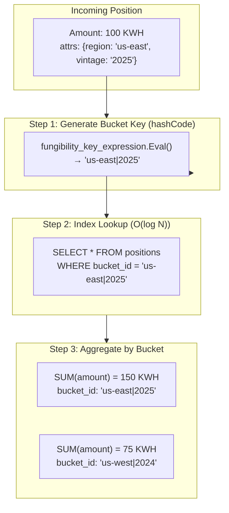
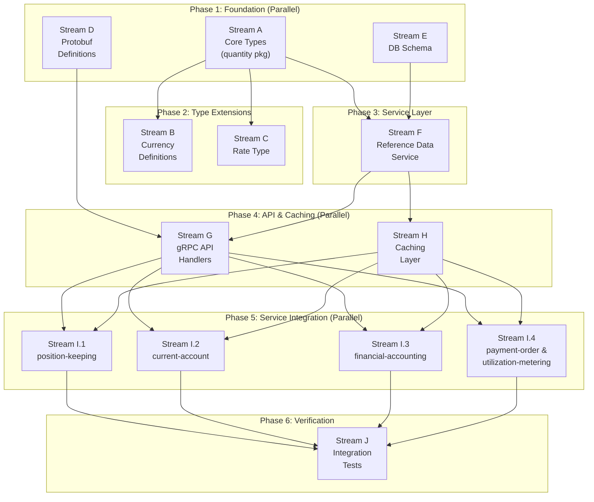

# PRD: Universal Asset System

**Status:** Draft
**ADRs:**

- [0013 - Universal Quantity Type System](../adr/0013-generic-asset-quantity-types.md)
- [0014 - Financial Instrument Reference Data](../adr/0014-financial-instrument-reference-data.md)

**Target Task Master Tag:** `universal-asset-system`

## Overview

Extend Meridian's ledger from fiat-only to multi-asset support. Enable tenants to define
custom assets (energy, commodities, vouchers) without code deployment while maintaining
dimensional safety.

### Goals

1. **Dimensional safety**: Prevent physics errors (money + rice) via Go generics
   > *Clarification*: In a distributed system with dynamic schemas, you cannot have true "compile-time"
   > safety for tenant-defined assets (the compiler doesn't know "Rice" exists). What we have is
   > **dimensional safety**: the platform knows at compile time that `Monetary` math is distinct from
   > `Commodity` math, preventing accidental treatment of commodity balances as cash during settlement.
2. **Runtime flexibility**: New assets via database configuration, not code
3. **Tenant isolation**: Each tenant has their own asset catalog
4. **Valuation foundation**: Rate type for asset-to-currency conversion (providers in future PRD)

### Non-Goals (Simplified Scope)

- ~~Migration from legacy `Money` types~~ - clean implementation, no backwards compatibility
- ~~Migration-as-Trade pattern~~ - no existing positions to migrate
- ~~Version deprecation lifecycle~~ - not needed pre-production
- ~~Distributed cache invalidation~~ - simple caching sufficient for now
  > **Future consideration**: When scaling beyond single-region, consider Redis pub/sub or Kafka
  > topic for cross-node cache invalidation. For now, TTL jitter + pod restarts provide recovery.

---

## Table of Contents

- [CEL Validation Pattern](#cel-validation-pattern)
- [Data Contract: Proto + CEL + Go](#data-contract-proto--cel--go)
- [Asset Catalog (Open Source Library)](#asset-catalog-open-source-library)
- [Fungibility Resolution](#fungibility-resolution)
- [Service Impact Matrix](#service-impact-matrix)
- [Work Streams](#work-streams)
  - [Stream A: Core Types Package](#stream-a-core-types-package)
  - [Stream B: Currency Definitions](#stream-b-currency-definitions)
  - [Stream C: Rate Type](#stream-c-rate-type)
  - [Stream D: Protobuf Definitions](#stream-d-protobuf-definitions)
  - [Stream E: Database Schema](#stream-e-database-schema)
  - [Stream F: Reference Data Service](#stream-f-reference-data-service)
  - [Stream G: gRPC API Handlers](#stream-g-grpc-api-handlers)
  - [Stream H: Caching Layer](#stream-h-caching-layer)
  - [Stream I: Service Integration](#stream-i-service-integration-per-service-sub-streams)
  - [Stream J: Integration Tests](#stream-j-integration-tests)
- [Parallel Execution Summary](#parallel-execution-summary)
- [Integration Coordination Strategy](#integration-coordination-strategy)
- [Decisions Made](#decisions-made)
- [Open Questions](#open-questions)
- [Success Metrics](#success-metrics)

---

## CEL Validation Pattern

We use **Google CEL (Common Expression Language)** for attribute validation instead of JSON Schema.
CEL is non-Turing complete, compiles to bytecode, executes in nanoseconds, and can express
cross-field validation that JSON Schema cannot.

### Why CEL over JSON Schema

| Aspect | JSON Schema | CEL |
|--------|-------------|-----|
| **Performance** | ~1ms (parse + validate) | ~100ns (execute compiled) |
| **Cross-field validation** | Limited | Native: `a.x > a.y` |
| **Type coercion** | Strict | Explicit: `int(attrs['expiry'])` |
| **Ecosystem** | Web-standard | Google/Proto-native |
| **Safety** | Schema validation | Guaranteed termination |

### Example: Defining a Custom Instrument with CEL

A tenant registers "GPU-H100-SPOT" with this validation expression:

```javascript
// Rule: Must have region, and if US region, zone must be 1 or 2
has(attributes.region) &&
(attributes.region != 'us-east' || attributes.zone in ['1', '2'])
```

### Example: Validation at Ingestion

When `RecordMeasurement` receives:

```json
{
  "instrument": "GPU-H100-SPOT",
  "attributes": { "region": "us-east", "zone": "5" }
}
```

The cached CEL program executes → returns `false` → measurement rejected **before** domain layer.

### CEL Expression Examples

| Use Case | CEL Expression |
|----------|----------------|
| No constraints | `true` |
| Require field | `has(attributes.region)` |
| Enum validation | `attributes.type in ['spot', 'reserved', 'committed']` |
| Numeric check | `int(attributes.expiry) > 1700000000` |
| Cross-field | `attributes.tier == 'premium' \|\| !has(attributes.sla)` |

---

## Data Contract: Proto + CEL + Go

### The Sealed Envelope Pattern

This is a **schema-less schema** pattern. Protobuf defines the physical container; CEL defines the logical shape.

```text
┌─────────────────────────────────────────────────────────────────────────┐
│  InstrumentAmount (The Sealed Envelope)                                 │
├─────────────────────────────────────────────────────────────────────────┤
│                                                                         │
│  ┌─────────────────────────────────┐   ┌─────────────────────────────┐  │
│  │  ENVELOPE (Go handles)          │   │  LETTER (CEL handles)       │  │
│  │  ─────────────────────          │   │  ──────────────────         │  │
│  │  • amount: "100.50"             │   │  • attributes: {...}        │  │
│  │  • instrument_code: "KWH"       │   │                             │  │
│  │  • version: 1                   │   │  Go NEVER introspects this  │  │
│  │  • valid_from/valid_to          │   │  map for business logic.    │  │
│  └─────────────────────────────────┘   └─────────────────────────────┘  │
│                                                                         │
└─────────────────────────────────────────────────────────────────────────┘
```

**The Contract:**

| Layer | Responsibility | Touches `attributes`? |
|-------|----------------|----------------------|
| **Protobuf** | Physical container, wire format | Serializes blindly |
| **Go** | Envelope handling (Amount, Code, Version) | **NEVER** introspects for business logic |
| **CEL** | Letter handling (Attributes validation, bucket key) | **SOLE** accessor for business rules |

> **Critical Rule**: Go code **blindly passes** the `attributes` map to CEL. It never reads attribute
> keys or values for business logic. This guarantees that adding a new asset type **never requires
> Go code changes** - only a new CEL expression in the database.

### How the Layers Connect

| Concept | Defined In (Static) | Instance Data (Runtime) | Connected By |
|---------|---------------------|-------------------------|--------------|
| **Structure** | **Protobuf** (`InstrumentAmount`) | `map<string,string> attributes` | The Wire Format |
| **Logic** | **CEL** (Reference Data) | `validation_expression`, `fungibility_key_expression` | The Validation Engine |
| **Bridge** | **Go** (`quantity.ParseQuantity`) | `env.Program.Eval(vars)` | Variable Injection |

**Runtime flow:**

```go
// 1. PROTO holds the payload (the Sealed Envelope)
protoMsg := &pb.InstrumentAmount{
    Amount:         "100.50",
    InstrumentCode: "KWH",
    Version:        1,
    Attributes:     map[string]string{"tou_period": "14", "region": "us-east"},
}

// 2. GO handles the Envelope (Amount, Code) - NEVER reads attribute keys
amount := decimal.RequireFromString(protoMsg.Amount)
cached := cache.Get(tenantID, protoMsg.InstrumentCode, protoMsg.Version)

// 3. CEL handles the Letter (Attributes) - Go passes map blindly
celVars := map[string]interface{}{
    "attributes": protoMsg.Attributes,  // Go doesn't know what's in here
}
result, _ := cached.ValidationProgram.Eval(celVars)
// CEL knows: "has(attributes.tou_period) && int(attributes.tou_period) >= 0"
```

**The Architectural Moat:**

- **Proto** provides infinite flexibility (any `map<string,string>`)
- **CEL** provides rigid safety (tenant-defined validation rules)
- **Go Generics** provide compile-time physics (`Quantity[Monetary]` vs `Quantity[Commodity]`)
- **Go blindness** ensures new asset types never require code deployment

---

## Asset Catalog (Open Source Library)

The PRD defines a flexible system where tenants can create custom instruments with CEL expressions.
However, expecting every tenant to write CEL from scratch is operationally impractical. We need a
**Standard Library** of validated asset types that users can instantiate or extend.

### Concept: Asset Archetypes

An **Archetype** is a pre-built instrument template stored as YAML in the repository. Archetypes
provide battle-tested CEL logic for common asset classes, contributed by domain experts.

**Directory structure:**

```text
configs/archetypes/
├── commodity/
│   ├── perishable_goods.yaml
│   └── perishable_goods_test.yaml
├── energy/
│   ├── renewable_power.yaml
│   └── renewable_power_test.yaml
└── financial/
    ├── carbon_credit.yaml
    └── carbon_credit_test.yaml
```

### Example Archetype Definition

**File:** `configs/archetypes/commodity/perishable_goods.yaml`

```yaml
name: "Perishable Goods (Base)"
description: "Items that expire and cannot be traded after a specific date."
dimension: "Commodity"
attributes:
  - name: "expiry_date"
    type: "timestamp"
    required: true
validation_cel: |
  has(attributes.expiry_date) &&
  timestamp(attributes.expiry_date) > now
# Bucket key = sole determinant of fungibility
# Same expiry_date = same bucket = fungible
fungibility_key_cel: |
  attributes.expiry_date
```

**File:** `configs/archetypes/energy/renewable_power.yaml`

```yaml
name: "Renewable Energy Certificate"
dimension: "Commodity"
attributes:
  - name: "generation_source"
    enum: ["solar", "wind", "hydro"]
  - name: "region"
validation_cel: |
  has(attributes.generation_source) &&
  attributes.generation_source in ['solar', 'wind', 'hydro']
# Bucket key = sole determinant of fungibility
# Same source + region = same bucket = fungible
fungibility_key_cel: |
  attributes.generation_source + "|" + attributes.region
```

### Testing Archetypes (Community Contribution Model)

Contributors don't touch Go code. They submit a YAML archetype + test file:

**File:** `configs/archetypes/energy/renewable_power_test.yaml`

```yaml
archetype: "renewable_power.yaml"
tests:
  - name: "Valid Solar"
    input: { "generation_source": "solar", "region": "us-east" }
    expect: PASS

  - name: "Invalid Source"
    input: { "generation_source": "coal", "region": "us-east" }
    expect: FAIL

  - name: "Missing Required Field"
    input: { "region": "us-east" }
    expect: FAIL
```

**CI Pipeline:**

1. Developer submits PR with new YAML archetype + test YAML
2. GitHub Actions runs `go run cmd/archetype-tester`
3. Tester compiles CEL from YAML and runs all scenarios
4. Green build → PR merges

### Goal: Asset Marketplace

Enable a library of asset types (EU Carbon Credits, ISDA Swaps, US Treasuries, GPU Compute Hours)
contributed by domain experts. Tenants select from the catalog rather than writing CEL from scratch.

> **Implementation tasks** are defined in Stream F (F.4 and F.5).

---

## Fungibility Resolution

Beyond ingestion validation, CEL handles **operational predicates** that determine position
behavior. This extends CEL from "is this data valid?" to "can these positions be combined?"

### The Bucket Key Pattern (Sole Source of Truth)

**The Problem**: Naively checking `AreFungible(a, b)` for every existing position is O(N).
With millions of positions, this kills performance.

**The Solution**: Use a single CEL expression to generate a deterministic **bucket key**.
If two positions have the same `bucket_id`, they ARE fungible. Period.

```text
┌─────────────────────────────────────────────────────────────────────────┐
│  The Bucket Key Pattern for Position Aggregation                        │
├─────────────────────────────────────────────────────────────────────────┤
│                                                                         │
│  fungibility_key_expression (The SOLE determinant of fungibility)       │
│  ────────────────────────────────────────────────────────────────       │
│  Input: attributes map                                                  │
│  Output: string (bucket key)                                            │
│  Example: attributes.region + "|" + attributes.vintage                  │
│                                                                         │
│  Rule: Same bucket_id = fungible. Different bucket_id = NOT fungible.   │
│                                                                         │
│  Write Path: Calculate key → INSERT       Read Path: GROUP BY bucket_id │
│              with bucket_id column                   → SUM(amount)      │
│                                                                         │
└─────────────────────────────────────────────────────────────────────────┘
```

> **Why no pairwise `equals()` check?** A pairwise comparison inside the read path introduces
> O(N²) complexity. If you need complex fungibility rules (e.g., "Vintage 2023 matches 2024"),
> encode that logic in the key expression to output the **same string** for both. Push complexity
> to configuration, not runtime.

### The Performance Guardrail

```text
┌─────────────────────────────────────────────────────────────────────────┐
│  NATIVE GO + SQL (Hot Path)        │  CEL (Policy Decisions)           │
├─────────────────────────────────────────────────────────────────────────┤
│  Quantity.Add()                    │  validation_expression            │
│  Quantity.Sub()                    │  fungibility_key_expression       │
│  decimal.Decimal arithmetic        │                                   │
│  SQL SUM() + GROUP BY bucket_id    │  (bucket key on write only)       │
└─────────────────────────────────────────────────────────────────────────┘
```

**Rule**: CEL runs on the **write path only** (validation + bucket key generation).
The read path uses pure SQL: `SELECT SUM(amount) ... GROUP BY bucket_id`.
No CEL evaluation on reads.

### Bucket Key Expression

Each instrument defines a CEL expression that generates a deterministic bucket key:

```javascript
// Input: 'attributes' map from incoming position
// Output: String - the bucket key for database grouping

// Example 1: Empty key = all positions fungible (default)
""

// Example 2: Group by region and vintage
attributes.region + "|" + attributes.vintage

// Example 3: Group by contract and expiry month
attributes.contract_id + "|" + string(int(attributes.expiry) / 2592000)

// Example 4: Complex matching (Vintage 2023 and 2024 are fungible)
// Output same key for both vintages:
attributes.region + "|" + (int(attributes.vintage) >= 2023 ? "recent" : attributes.vintage)
```

> **Key Design**: If you need "Vintage 2023 matches 2024", don't add a pairwise check.
> Write a CEL expression that outputs `"us-east|recent"` for both 2023 and 2024.
> Same key = fungible. Different key = not fungible.

### How Bucket & Verify Affects the Ledger



### The Aggregation Contract

When Position Keeping aggregates positions:

1. **Dimension check** (compile-time): `Quantity[Monetary]` cannot combine with `Quantity[Commodity]`
2. **Instrument check** (runtime): USD cannot combine with EUR
3. **Version check** (runtime): USD(v1) cannot combine with USD(v2)
4. **Bucket check** (SQL): `GROUP BY bucket_id` - same bucket = fungible

**That's it.** No CEL on the read path. Pure SQL aggregation.

### Write Path: Append-Only with Bucket ID

```go
// Position Keeping: Append-Only with Bucket ID
func (s *Service) RecordMeasurement(ctx context.Context, tenantID uuid.UUID, new Position) error {
    // NO LOCKING. Constant time O(1) writes.

    // 1. Validate attributes via CEL (cached program, ~100ns)
    cached, err := s.cache.Get(ctx, tenantID, new.InstrumentCode, new.Version)
    if err != nil {
        return err
    }
    if valid, _ := s.cel.Validate(cached.ValidationProgram, new.Attributes); !valid {
        return ErrAttributeValidationFailed
    }

    // 2. Generate bucket ID (hashCode) via CEL (~100ns)
    bucketID, err := s.cel.GenerateBucketKey(cached.BucketKeyProgram, new.Attributes)
    if err != nil {
        return err
    }
    new.BucketID = bucketID

    // 3. Insert new row immediately - no read-modify-write
    return s.repo.Insert(ctx, new)
}
```

### Read Path: Pure SQL Aggregation

```go
// Aggregation is pure SQL - no CEL on reads
func (s *Service) GetAggregatedPosition(
    ctx context.Context, tenantID uuid.UUID, accountID, instrumentCode string,
) ([]AggregatedPosition, error) {
    // Database does ALL the work via indexed GROUP BY
    // SELECT bucket_id, SUM(amount) FROM positions
    // WHERE account_id = ? AND instrument_code = ?
    // GROUP BY bucket_id
    return s.repo.AggregateByBucket(ctx, accountID, instrumentCode)
}

// For detailed breakdown within a bucket
func (s *Service) GetBucketDetails(
    ctx context.Context, accountID, instrumentCode, bucketID string,
) ([]Position, error) {
    // Just return raw positions - no CEL processing
    return s.repo.FindByBucket(ctx, accountID, instrumentCode, bucketID)
}
```

**Why Bucket Key Only is better:**

- Write path is O(1) constant time - calculate bucket ID, INSERT
- Read path is pure SQL: `GROUP BY bucket_id` uses B-tree index
- **No CEL on reads** - aggregation happens entirely in the database
- Background compaction can merge rows within buckets during low-traffic windows

> **Phase 1 Decision**: Append-Only is the **ONLY** supported write mode.
> Write-time merging requires per-bucket locking which adds complexity.
> Defer to Phase 2 after validating Append-Only meets real-world needs.

### Temporal Logic

Time-bound assets (energy, licenses, subscriptions) need temporal overlap policy.
Encode time ranges in the bucket key:

```javascript
// Bucket by contract and hour
attributes.contract_id + "|" + string(int(attributes.period_start) / 3600)
```

**Edge case**: If CEL returns `false` for a merge attempt, the operation either:

- Creates a new distinct position (accumulation), OR
- Fails with `ErrPositionsNotFungible` (strict mode)

The behavior is configurable per instrument.

---

## Service Impact Matrix

Overview of all services and the changes required for Universal Asset System.

| Service | Impact | Change Type | Description |
|---------|--------|-------------|-------------|
| `reference-data` | **NEW** | Full service | New BIAN service for instrument definitions |
| `position-keeping` | **HIGH** | Domain + Adapter | Core asset tracking, CEL validation, fungibility |
| `current-account` | **HIGH** | Domain + Adapter | Multi-asset balance support |
| `financial-accounting` | **HIGH** | Domain + Adapter | Multi-dimensional ledger entries |
| `payment-order` | **MODERATE** | Adapter | Multi-asset payment instructions |
| `utilization-metering-consumer` | **MODERATE** | Domain + Adapter | Native fit for `Quantity[Commodity]` |
| `gateway` | **LOW** | Pass-through | Route new Reference Data API |
| `tenant` | **NONE** | No changes | Tenant context unchanged |
| `party` | **NONE** | No changes | Party management independent |
| `audit-worker` | **NONE** | No changes | Consumes events, no money logic |

### Shared Package Migration

The existing `shared/domain/money` package is re-exported by all services. Migration path:

```text
BEFORE                              AFTER
──────                              ─────
shared/domain/money/                pkg/platform/quantity/
├── money.go (Money struct)         ├── quantity.go (Quantity[D])
├── currency.go                     ├── dimension.go (Monetary, Commodity)
└── errors.go                       ├── instrument.go (Instrument)
                                    └── currency/ (predefined fiat)

services/*/domain/money.go          services/*/domain/quantity.go
└── re-exports shared/domain/money  └── re-exports pkg/platform/quantity
```

**Migration sequence:**

1. Stream A creates `pkg/platform/quantity` (new, no breaking changes)
2. Per-service streams (I.1-I.4) migrate from `shared/domain/money` → `pkg/platform/quantity`
3. After all services migrated, deprecate `shared/domain/money`

---

## Work Streams

Designed for parallel execution across multiple developers. Dependencies shown in diagram below.



---

## Stream A: Core Types Package

**Location:** `pkg/platform/quantity/`
**Dependencies:** None (foundational)

### Deliverables

1. **Dimensions** (`dimension.go`)

   ```go
   type Monetary struct{}
   type Commodity struct{}
   ```

2. **Instrument** (`instrument.go`)

   ```go
   // Instrument identifies an asset type for quantity operations.
   // Maps to InstrumentDefinition from Reference Data service.
   type Instrument struct {
       Code      string    // "USD", "KWH", "GPU-H100"
       Version   uint32    // Schema version
       Dimension string    // "Monetary" or "Commodity" - required for deserialization
       Precision int       // Decimal places (for display formatting; math uses arbitrary precision)
   }
   ```

   > **Serialization note**: `Dimension` is stored as a string (not type parameter) because
   > Go generics are erased at runtime. When deserializing from DB/proto, we use `Dimension`
   > to reconstruct the correct `Quantity[Monetary]` or `Quantity[Commodity]` at the boundary.

3. **Quantity[D]** (`quantity.go`)

   ```go
   type Quantity[D any] struct {
       Amount     decimal.Decimal
       Instrument Instrument
   }

   // Type aliases for common use cases
   type Money = Quantity[Monetary]
   type Asset = Quantity[Commodity]
   ```

   > **Decimal Parsing Performance**: Proto uses `string amount` for compatibility and precision.
   > Parsing strings to `decimal.Decimal` happens on every ledger row read. Use a high-performance
   > parser like `shopspring/decimal` which benchmarks at ~500ns per parse. At 100k TPS reads,
   > this adds ~50ms/second overhead - acceptable but worth monitoring.
   >
   > **Alternative considered**: Google's `google.type.Money` (units + nanos) or custom proto
   > `Decimal` message (value + scale). Both require more complex marshalling. String parsing
   > with a fast library is simpler and sufficient for our scale.

4. **Operations**: `Add`, `Subtract`, `Multiply`, `Divide`, `Neg`, `IsZero`, `Compare`
   - Same-dimension operations: compile-time safe
   - Same-unit validation: runtime check returning error

5. **PositionKey** (`position.go`)

   ```go
   type PositionKey struct {
       AccountID  string
       AssetCode  string
       Version    uint32
       Attributes map[string]string
   }
   ```

6. **Generic Bridge Factory** (`factory.go`)

   > **The Problem**: Go generics are erased at runtime, but DB/Proto use string dimensions.
   > This factory is the **only** boundary where runtime strings become compile-time types.

   ```go
   // ParseQuantity converts raw data into a typed Quantity.
   // Returns 'any' because the concrete type depends on runtime dimension string.
   //
   // NOTE: Returning 'any' requires type assertions at call sites. For code paths
   // where the dimension is known at compile time, prefer NewQuantity[D] instead.
   func ParseQuantity(amount decimal.Decimal, inst Instrument) (any, error) {
       switch inst.Dimension {
       case "Monetary":
           return Quantity[Monetary]{Amount: amount, Instrument: inst}, nil
       case "Commodity":
           return Quantity[Commodity]{Amount: amount, Instrument: inst}, nil
       default:
           return nil, ErrUnknownDimension
       }
   }

   // For services that handle mixed dimensions (e.g., generic ledger),
   // define a closed interface with type-safe accessors:
   type QuantityValue interface {
       Dimension() string
       GetAmount() decimal.Decimal
       GetInstrument() Instrument
       IsZero() bool

       // Type-safe accessors - avoid raw type assertions
       AsMonetary() (Quantity[Monetary], bool)
       AsCommodity() (Quantity[Commodity], bool)
   }

   // Implementation on Quantity[D]
   func (q Quantity[Monetary]) AsMonetary() (Quantity[Monetary], bool) { return q, true }
   func (q Quantity[Monetary]) AsCommodity() (Quantity[Commodity], bool) { return Quantity[Commodity]{}, false }
   func (q Quantity[Commodity]) AsMonetary() (Quantity[Monetary], bool) { return Quantity[Monetary]{}, false }
   func (q Quantity[Commodity]) AsCommodity() (Quantity[Commodity], bool) { return q, true }
   ```

   **When to use which:**

   | Scenario | Use | Returns |
   |----------|-----|---------|
   | Unknown dimension at compile time | `ParseQuantity()` | `any` → use `AsMonetary()`/`AsCommodity()` |
   | Known dimension (e.g., Current Account = Monetary) | `NewQuantity[Monetary]()` | `Quantity[Monetary]` directly |
   | Generic operations on any quantity | `QuantityValue` interface | Type-safe, no panic risk |

7. **Typed Rehydration Constructor** (`quantity.go`)

   > **The Rehydration Problem**: When loading from DB/Proto, we need to validate that
   > the stored dimension matches the expected compile-time type. This constructor
   > provides a type-safe bridge with explicit dimension validation.

   ```go
   // NewQuantity creates a quantity from raw data, validating the dimension.
   // Use this when you KNOW the expected dimension at compile time.
   func NewQuantity[D Dimension](amount decimal.Decimal, inst Instrument) (Quantity[D], error) {
       // Runtime check: does D match inst.Dimension?
       var zero D
       if inst.Dimension != zero.Name() {
           return Quantity[D]{}, ErrDimensionMismatch
       }
       return Quantity[D]{Amount: amount, Instrument: inst}, nil
   }

   // Dimension interface for type-safe rehydration
   type Dimension interface {
       Name() string
   }

   func (Monetary) Name() string  { return "Monetary" }
   func (Commodity) Name() string { return "Commodity" }
   ```

### Acceptance Criteria

- [ ] `Quantity[Monetary].Add(Quantity[Commodity])` fails at compile time
- [ ] `USD.Add(EUR)` returns `ErrInstrumentMismatch` at runtime
- [ ] `USD(v1).Add(USD(v2))` returns `ErrVersionMismatch` at runtime
- [ ] `ParseQuantity` correctly bridges runtime strings to compile-time types
- [ ] `NewQuantity[Monetary]` with `Commodity` instrument returns `ErrDimensionMismatch`
- [ ] 100% test coverage on arithmetic operations

---

## Stream B: Currency Definitions

**Location:** `pkg/platform/quantity/currency/`
**Dependencies:** Stream A (Instrument type)

### Deliverables

1. **Predefined Instruments** for major currencies (ISO 4217):
   - USD, EUR, GBP, JPY, CHF, AUD, CAD, NZD
   - Precision: 2 for most, 0 for JPY

2. **Lookup function**:

   ```go
   func ByCode(code string) (Instrument, bool)
   ```

3. **Constructor helpers**:

   ```go
   func USD(amount decimal.Decimal) Money
   func EUR(amount decimal.Decimal) Money
   // etc.
   ```

### Acceptance Criteria

- [ ] All major fiat currencies defined with correct precision
- [ ] `currency.USD(decimal.NewFromInt(100))` creates valid Money

---

## Stream C: Rate Type

**Location:** `pkg/platform/quantity/`
**Dependencies:** Stream A (Quantity, Instrument types)

> **Scope boundary**: This stream covers the Rate data structure and basic conversion math only.
> ValuationProvider interface and orchestration belongs in a future Valuation Engine PRD (ADR-019).

### Deliverables

1. **Rate type** (`rate.go`)

   ```go
   type Rate struct {
       From      Instrument
       To        Instrument
       Factor    decimal.Decimal
       ValidFrom time.Time
       ValidTo   time.Time
   }

   // Convert applies the rate to a quantity, returning the converted amount.
   // Returns error if quantity's instrument doesn't match Rate.From.
   func (r Rate) Convert(q Quantity[Monetary]) (Quantity[Monetary], error)
   ```

2. **Identity rate helper**:

   ```go
   // IdentityRate returns a 1:1 rate for same-currency operations
   func IdentityRate(inst Instrument) Rate
   ```

3. **Rate validation**: Ensure `From != To` unless identity, validate temporal bounds

4. **Precision Handling**:

   > **Rule**: `Rate.Convert()` outputs a result with the **target instrument's precision**.

   ```go
   func (r Rate) Convert(q Quantity[Monetary]) (Quantity[Monetary], error) {
       if q.Instrument.Code != r.From.Code {
           return Quantity[Monetary]{}, ErrInstrumentMismatch
       }

       // Multiply by factor
       rawResult := q.Amount.Mul(r.Factor)

       // Round to target instrument's precision using Banker's rounding
       // (round half to even) for financial compliance
       roundedResult := rawResult.RoundBank(int32(r.To.Precision))

       return Quantity[Monetary]{
           Amount:     roundedResult,
           Instrument: r.To,
       }, nil
   }
   ```

   > **Rounding Mode**: Banker's rounding (round half to even) is required for financial
   > compliance. It eliminates systematic bias that occurs with round-half-up.

   **Example**: Converting 1 Gold Bar (precision=4) to USD (precision=2) at rate 2,847.5350:
   - Raw: `1 * 2847.5350 = 2847.5350`
   - Banker's rounding: `2847.54` (0.535 → 0.54 because 4 is even)

### Acceptance Criteria

- [ ] `Rate.Convert()` correctly multiplies amount by factor
- [ ] `Rate.Convert()` uses Banker's rounding (round half to even)
- [ ] `Rate.Convert()` returns error if source instrument mismatch
- [ ] `IdentityRate()` returns factor of 1.0
- [ ] Rate with `ValidFrom > ValidTo` rejected

---

## Stream D: Protobuf Definitions

**Location:** `proto/platform/v1/`
**Dependencies:** Stream A (type design, can work from ADR spec)

> **Proto vs CEL**: Protobuf defines the **Container** (data structure). CEL is the **Gatekeeper**
> (validation logic). Proto messages are pure data carriers with no behavior. CEL expressions
> are compiled and executed by the service layer to validate attribute payloads.

### Deliverables

1. **InstrumentAmount message** (`quantity.proto`) - *The Data Carrier*

   ```protobuf
   message InstrumentAmount {
       // The quantity magnitude (decimal string).
       // Native Go math handles this. CEL NEVER touches this field.
       string amount = 1;

       // The Identity of the asset.
       string instrument_code = 2;     // "USD", "KWH", "GPU-H100"
       uint32 version = 3;             // Schema version

       // The Context/Fungibility payload (The "HashMap" Pattern).
       // DESIGN DECISION: We use map<string, string> for flexibility + performance.
       // Rationale:
       // 1. Flexibility: Allows tenant-defined schemas without re-compiling Proto.
       // 2. Performance: CEL handles type coercion (string→int) efficiently (~100ns).
       // 3. Simplicity: Avoids complex nested structures on the wire.
       // 4. Bucketing: CEL generates deterministic keys for database grouping.
       // CONSTRAINT: Keys MUST be snake_case (^[a-z][a-z0-9_]*$) for CEL compatibility.
       map<string, string> attributes = 4;

       // Temporal bounds (first-class citizens per ADR-0017).
       // Time is fundamental, not just another attribute.
       google.protobuf.Timestamp valid_from = 5;
       google.protobuf.Timestamp valid_to = 6;
   }
   ```

   > **Why `map<string, string>`**: Using `google.protobuf.Struct` adds marshalling overhead
   > and CEL environment complexity. String maps are fast, simple, and CEL can coerce types
   > explicitly: `int(attributes['expiry']) > 1700000000`.
   >
   > **Why explicit time fields**: Per ADR-0017 (Temporal Quality), time is a first-class citizen.
   > Storing `valid_from`/`valid_to` as top-level fields avoids parsing them from attributes
   > on every write to the database's `period_start`/`period_end` columns.

   **CEL Type Coercion Table**: Force developers to rely on CEL's casting, not custom Go parsing:

   | User Intent | Attribute Value (Proto) | CEL Expression |
   |-------------|-------------------------|----------------|
   | **Integer** | `"100"` | `int(attributes['val'])` |
   | **Float** | `"99.5"` | `double(attributes['val'])` |
   | **Boolean** | `"true"` | `bool(attributes['val'])` |
   | **Timestamp** | `"2025-01-01T00:00:00Z"` | `timestamp(attributes['val'])` |
   | **String** | `"us-east"` | `attributes['val']` (no coercion) |

   > **Rule**: All type conversion happens in CEL expressions. Go code only sees `map[string]string`.

2. **InstrumentDefinition message** (`reference_data.proto`) - *Structure + Rules*

   ```protobuf
   message InstrumentDefinition {
       string id = 1;
       string tenant_id = 2;
       string code = 3;
       uint32 version = 4;
       string dimension = 5;           // "Monetary" or "Commodity"
       int32 precision = 6;

       // The "Gatekeeper": Validates if attributes are allowed for this instrument.
       // Compiled and cached. Input: attributes map. Output: bool.
       // Example: "has(attributes.region) && int(attributes.expiry) > 0"
       string validation_expression = 7;

       // The "Bucketer": Generates deterministic key for database grouping.
       // Compiled and cached. Input: attributes map. Output: string.
       // Example: "attributes.region + '|' + attributes.vintage"
       // Default: "" (all positions in same bucket - fungible by instrument alone)
       // CRITICAL: This key is stored as `bucket_id` column and indexed for O(log N) lookups.
       // RULE: Same bucket_id = fungible. Different bucket_id = NOT fungible.
       string fungibility_key_expression = 8;

       string display_name = 9;
       string description = 10;
   }
   ```

   > **Sole Source of Truth**: `fungibility_key_expression` is the **only** determinant of fungibility.
   > There is no pairwise `equals()` check. If two positions have the same `bucket_id`, they are
   > fungible and will be aggregated together via `GROUP BY bucket_id`. Complex fungibility rules
   > must be encoded in the key expression to output the same string for fungible positions.
   >
   > **Immutability of Bucket Key Logic (CRITICAL)**:
   > The `fungibility_key_expression` is **immutable** for a given Instrument Version. Changing the
   > bucketing logic fundamentally changes what the asset *is*. Historical rows have the old `bucket_id`;
   > SQL `GROUP BY` will treat old and new buckets as separate positions.
   >
   > **To change logic, the Tenant must create Version N+1.** Positions in Version N remain in their
   > old buckets until explicitly traded/migrated to Version N+1 via a "Wash/Reload" trade pattern.

3. **Rate message**

   ```protobuf
   message Rate {
       string from_code = 1;
       string to_code = 2;
       string factor = 3;
       google.protobuf.Timestamp valid_from = 4;
       google.protobuf.Timestamp valid_to = 5;
   }
   ```

4. **Buf breaking change detection** configured

### Acceptance Criteria

- [ ] Proto compiles without errors
- [ ] Generated Go code matches domain types
- [ ] Buf lint passes
- [ ] `validation_expression` field documented with CEL examples

---

## Stream E: Database Schema

**Location:** `services/reference-data/migrations/`
**Dependencies:** Stream A (Instrument field design)

> **BIAN alignment**: This service maps to the BIAN `FinancialInstrumentReferenceDataManagement`
> service domain, which maintains a directory of financial instrument reference data including
> currencies, equities, debt instruments, and commodities.

### Deliverables

1. **Instrument definitions table**

   ```sql
   CREATE TABLE instrument_definitions (
       id UUID PRIMARY KEY DEFAULT gen_random_uuid(),
       tenant_id UUID NOT NULL,
       code VARCHAR(32) NOT NULL,
       version INTEGER NOT NULL DEFAULT 1,
       dimension VARCHAR(32) NOT NULL,
       precision INTEGER NOT NULL,

       -- CEL Expressions (compiled and cached by service layer)
       validation_expression TEXT NOT NULL DEFAULT 'true',  -- Ingestion gatekeeper

       -- Bucket key for O(log N) position aggregation
       -- Empty string = all positions fungible by instrument alone
       -- Same bucket_id = fungible. Different bucket_id = NOT fungible.
       fungibility_key_expression TEXT NOT NULL DEFAULT '',

       display_name VARCHAR(128),
       description TEXT,
       created_at TIMESTAMPTZ NOT NULL DEFAULT NOW(),

       UNIQUE(tenant_id, code, version),
       CHECK (precision >= 0 AND precision <= 18),
       CHECK (dimension IN ('Monetary', 'Commodity')),
       CHECK (length(trim(validation_expression)) > 0),
       CHECK (length(validation_expression) <= 4096),
       CHECK (length(fungibility_key_expression) <= 4096)
   );

   CREATE INDEX idx_instrument_definitions_lookup
       ON instrument_definitions(tenant_id, code, version);

   -- IMMUTABILITY ENFORCEMENT: Prevent updates to bucketing logic after creation.
   -- To change logic, tenant MUST create Version N+1.
   CREATE OR REPLACE FUNCTION prevent_bucket_key_update()
   RETURNS TRIGGER AS $$
   BEGIN
       IF OLD.fungibility_key_expression IS DISTINCT FROM NEW.fungibility_key_expression THEN
           RAISE EXCEPTION 'Cannot update fungibility_key_expression. Create Version N+1 instead.';
       END IF;
       IF OLD.validation_expression IS DISTINCT FROM NEW.validation_expression THEN
           RAISE EXCEPTION 'Cannot update validation_expression. Create Version N+1 instead.';
       END IF;
       RETURN NEW;
   END;
   $$ LANGUAGE plpgsql;

   CREATE TRIGGER enforce_expression_immutability
       BEFORE UPDATE ON instrument_definitions
       FOR EACH ROW EXECUTE FUNCTION prevent_bucket_key_update();
   ```

   > **Two CEL expressions per instrument**:
   > - `validation_expression`: "Is this data valid?" (ingestion gatekeeper)
   > - `fungibility_key_expression`: "What bucket does this belong to?" (sole determinant of fungibility)

2. **Bucket ID in positions table** (added by Stream I.1 migration)

   ```sql
   -- Position Keeping adds bucket_id column for O(log N) aggregation
   ALTER TABLE positions ADD COLUMN bucket_id VARCHAR(256);
   CREATE INDEX idx_positions_bucket ON positions(tenant_id, instrument_code, bucket_id);
   ```

   > **Write path**: Calculate bucket_id from `fungibility_key_expression`, store with position.
   > **Read path**: `SELECT SUM(amount) FROM positions WHERE bucket_id = ?` uses index.

3. **System tenant seed data** (Bootstrap Migration - CRITICAL):

   > **The Chicken-and-Egg Problem**: To create a Tenant, you need to bill them. To bill them,
   > you need an Instrument (`USD`). To define `USD`, you need Reference Data Service running.
   > The Reference Data Service needs the database schema.
   >
   > **Solution**: Insert base instruments via SQL migration, not API. The system comes up
   > ready to transact on day one.

   ```sql
   -- System tenant ID: 00000000-0000-0000-0000-000000000000
   -- Platform-wide instruments accessible to ALL tenants
   -- validation_expression='true' means no attribute constraints
   INSERT INTO instrument_definitions
       (tenant_id, code, version, dimension, precision, validation_expression, display_name)
   VALUES
       ('00000000-0000-0000-0000-000000000000', 'USD', 1, 'Monetary', 2, 'true', 'US Dollar'),
       ('00000000-0000-0000-0000-000000000000', 'EUR', 1, 'Monetary', 2, 'true', 'Euro'),
       ('00000000-0000-0000-0000-000000000000', 'GBP', 1, 'Monetary', 2, 'true', 'British Pound');
   ```

### Acceptance Criteria

- [ ] Migration applies cleanly
- [ ] Unique constraint prevents duplicate code+version per tenant
- [ ] Index supports efficient lookups
- [ ] System tenant seed data inserted
- [ ] `validation_expression` column stores valid CEL expressions
- [ ] Default `'true'` allows permissive instruments (no attribute constraints)

---

## Stream F: Reference Data Service

**Location:** `services/reference-data/`
**Dependencies:** Stream A, Stream E

### Deliverables

1. **InstrumentRegistry interface** (`registry.go`)

   ```go
   // SystemTenantID is the well-known UUID for platform-wide instruments.
   // WARNING: This is the zero UUID (all zeros). Ensure your code distinguishes
   // "System Tenant" (valid, all-zeros) from "Unset/Missing" (nil pointer or error).
   // The uuid library's uuid.Nil IS all zeros - use explicit comparisons, not nil checks.
   var SystemTenantID = uuid.MustParse("00000000-0000-0000-0000-000000000000")

   type InstrumentRegistry interface {
       // GetDefinition looks up instrument by tenant, falling back to SystemTenant if not found.
       // Lookup order: tenant_id → SystemTenantID
       GetDefinition(ctx context.Context, tenantID uuid.UUID, code string, version uint32) (InstrumentDefinition, error)

       // GetLatestDefinition returns highest version, with same fallback logic.
       // NOTE: When callers pass version=0, it means "use latest version".
       // Implementation: SELECT ... WHERE version = COALESCE(NULLIF($version, 0), (SELECT MAX(version) ...))
       // Or: if version == 0 { return GetLatestDefinition(...) }
       GetLatestDefinition(ctx context.Context, tenantID uuid.UUID, code string) (InstrumentDefinition, error)

       // CreateDefinition creates tenant-specific instrument (cannot create in SystemTenant via API)
       // Compiles CEL expression at creation time - fails fast on syntax errors
       CreateDefinition(ctx context.Context, def InstrumentDefinition) (InstrumentDefinition, error)

       // ListDefinitions returns tenant instruments + all SystemTenant instruments
       ListDefinitions(ctx context.Context, tenantID uuid.UUID) ([]InstrumentDefinition, error)

       // ValidateAttributes executes compiled CEL program against attribute map
       ValidateAttributes(ctx context.Context, def InstrumentDefinition, attrs map[string]string) error
   }
   ```

2. **System Tenant Inheritance Logic**:

   ```go
   func (r *PostgresRegistry) GetDefinition(
       ctx context.Context, tenantID uuid.UUID, code string, version uint32,
   ) (InstrumentDefinition, error) {
       // 1. Try tenant-specific lookup
       def, err := r.queries.GetInstrumentDefinition(ctx, tenantID, code, version)
       if err == nil {
           return def, nil
       }
       if !errors.Is(err, sql.ErrNoRows) {
           return InstrumentDefinition{}, err
       }

       // 2. Fallback to System Tenant
       return r.queries.GetInstrumentDefinition(ctx, SystemTenantID, code, version)
   }
   ```

3. **System Tenant Write Protection**:

   ```go
   var ErrSystemTenantReadOnly = errors.New("system tenant instruments are read-only")

   func (r *PostgresRegistry) CreateDefinition(
       ctx context.Context, def InstrumentDefinition,
   ) (InstrumentDefinition, error) {
       // Enforce: System Tenant instruments are admin-only (seeded via migrations)
       if def.TenantID == SystemTenantID {
           return InstrumentDefinition{}, ErrSystemTenantReadOnly
       }

       // Compile CEL expressions before persisting (fail fast on syntax errors)
       if _, err := r.compiler.CompileValidation(def.ValidationExpression); err != nil {
           return InstrumentDefinition{}, fmt.Errorf("%w: %v", ErrCELCompileError, err)
       }
       if _, err := r.compiler.CompileFungibility(def.FungibilityExpression); err != nil {
           return InstrumentDefinition{}, fmt.Errorf("%w: %v", ErrCELCompileError, err)
       }

       return r.queries.CreateInstrumentDefinition(ctx, def)
   }
   ```

   > **Bootstrap Clarification**: `CreateDefinition` validates **CEL syntax** (does it compile?),
   > NOT position attributes. This avoids a chicken-and-egg problem - we can't validate attributes
   > because no positions exist yet. The `ValidateAttributes` method is called by **Position Keeping**
   > at ingestion time, not by Reference Data during definition creation.

4. **CEL Security Constraints**:

   | Constraint | Limit | Enforcement Layer | Rationale |
   |------------|-------|-------------------|-----------|
   | Expression length | 4KB max | Stream F (Registry) | Prevent storage abuse |
   | Cost limit | 10,000 | Stream F (CEL env) | Prevent expensive evaluations |
   | Registration rate | 10/min/tenant | **Stream G (gRPC handler)** | Prevent DoS via compilation spam |
   | Expression depth | 10 levels max | Stream F (Registry) | Prevent stack overflow in evaluation |

   > **Rate Limiting Note**: Registration rate limiting is enforced at the **gRPC handler layer**
   > (Stream G), not in the registry service (Stream F). This separation ensures:
   > - Registry remains a pure domain service without HTTP/transport concerns
   > - Rate limiting middleware can be shared across all tenant-facing endpoints
   > - Metrics and rate-limit headers are handled at the transport layer

   ```go
   const MaxExpressionLength = 4096  // 4KB
   const MaxExpressionDepth = 10     // Nesting levels

   func (r *PostgresRegistry) CreateDefinition(ctx context.Context, def InstrumentDefinition) error {
       // Length check before compilation (quick reject)
       if len(def.ValidationExpression) > MaxExpressionLength {
           return ErrExpressionTooLong
       }
       if len(def.FungibilityKeyExpression) > MaxExpressionLength {
           return ErrExpressionTooLong
       }

       // Parse to AST (we're compiling anyway - reuse the parse result)
       ast, issues := r.compiler.validationEnv.Parse(def.ValidationExpression)
       if issues != nil && issues.Err() != nil {
           return fmt.Errorf("%w: %v", ErrInvalidValidationExpression, issues.Err())
       }

       // Depth check on AST (not raw string - accurate measurement)
       if depth := measureASTDepth(ast.Expr()); depth > MaxExpressionDepth {
           return ErrExpressionTooDeep
       }

       // Continue with type-check and program compilation...
   }

   // measureASTDepth walks the CEL AST to find maximum nesting depth
   func measureASTDepth(expr *exprpb.Expr) int {
       // Traverse children recursively, return max depth
       // ...
   }
   ```

   > **Security Review**: Tenant-provided CEL expressions are validated at compile-time
   > by cel-go. Runtime execution uses `CostLimit(10000)` to abort expensive evaluations.
   > Expression depth limits (measured on AST, not raw string) prevent stack overflow.
   > CEL's non-Turing-complete nature guarantees termination.

5. **Attribute Key Validation** (CEL Compatibility):

   > **Rule**: Attribute keys referenced in CEL expressions MUST be `snake_case`
   > (alphanumeric + underscores only, starting with a letter).

   ```go
   var validAttributeKeyRegex = regexp.MustCompile(`^[a-z][a-z0-9_]*$`)

   // validateAttributeKeys extracts attribute references from CEL and validates format
   func validateAttributeKeys(expr string) error {
       // Extract keys referenced as attributes.KEY or attributes['KEY']
       keys := extractAttributeKeys(expr)
       for _, key := range keys {
           if !validAttributeKeyRegex.MatchString(key) {
               return fmt.Errorf("%w: '%s' must be snake_case (e.g., 'expiry_date' not 'expiry-date')",
                   ErrInvalidAttributeKey, key)
           }
       }
       return nil
   }
   ```

   **Why**: CEL interprets `attributes.user-id` as subtraction (`attributes.user` minus `id`).
   Forcing `snake_case` ensures `attributes.user_id` works without bracket syntax `attributes['user-id']`.

6. **CEL Environment Variables** (Explicit Contract):

   The CEL environments are strictly typed. Variable names are fixed contracts:

   **Validation Expression Environment:**

   | Variable | Type | Description |
   |----------|------|-------------|
   | `attributes` | `Map<String, String>` | The attributes map from InstrumentAmount proto |
   | `amount` | `String` | The quantity magnitude (for min/max checks) |
   | `valid_from` | `Timestamp` | Period start (if provided) |
   | `valid_to` | `Timestamp` | Period end (if provided) |

   **Bucket Key Expression Environment:**

   | Variable | Type | Description |
   |----------|------|-------------|
   | `attributes` | `Map<String, String>` | The attributes map from InstrumentAmount proto |
   | Returns | `String` | The bucket key for database grouping (index lookup) |

   > **Note**: There is no pairwise "fungibility expression" environment. The bucket key is the
   > **sole determinant** of fungibility. Same key = fungible. Different key = not fungible.

7. **CEL Compiler** (`cel.go`) using `github.com/google/cel-go`:

   ```go
   type CELCompiler struct {
       validationEnv *cel.Env  // For validation_expression: attributes → bool
       bucketKeyEnv  *cel.Env  // For fungibility_key_expression: attributes → string
   }

   func NewCELCompiler() (*CELCompiler, error) {
       // Environment for ingestion validation: attributes → bool
       valEnv, err := cel.NewEnv(
           cel.Variable("attributes", cel.MapType(cel.StringType, cel.StringType)),
           cel.Variable("amount", cel.StringType),
           cel.Variable("valid_from", cel.TimestampType),
           cel.Variable("valid_to", cel.TimestampType),
           cel.CostLimit(10000),
       )
       if err != nil {
           return nil, err
       }

       // Environment for bucket key generation: attributes → string
       bucketEnv, err := cel.NewEnv(
           cel.Variable("attributes", cel.MapType(cel.StringType, cel.StringType)),
           cel.CostLimit(10000),
       )
       if err != nil {
           return nil, err
       }

       return &CELCompiler{
           validationEnv: valEnv,
           bucketKeyEnv:  bucketEnv,
       }, nil
   }

   // CompileValidation compiles ingestion validation expression.
   func (c *CELCompiler) CompileValidation(expr string) (cel.Program, error) {
       return c.compile(c.validationEnv, expr)
   }

   // CompileBucketKey compiles bucket key generation expression.
   func (c *CELCompiler) CompileBucketKey(expr string) (cel.Program, error) {
       if expr == "" {
           return nil, nil  // Empty expression = all positions in same bucket
       }
       return c.compile(c.bucketKeyEnv, expr)
   }

   // GenerateBucketKey evaluates the bucket key for database grouping.
   // This is the SOLE determinant of fungibility.
   //
   // FAIL-FAST BEHAVIOR: If the CEL expression references a missing attribute,
   // this returns an error and the transaction MUST be rejected. We do not
   // support "partial" bucketing or "default" buckets.
   func (c *CELCompiler) GenerateBucketKey(prog cel.Program, attrs map[string]string) (string, error) {
       if prog == nil {
           return "", nil  // No key expression = empty bucket (all fungible by instrument)
       }
       out, _, err := prog.Eval(map[string]interface{}{"attributes": attrs})
       if err != nil {
           // CEL error = missing attribute or type mismatch
           // REJECT the transaction - do not fall back to "default" bucket
           return "", fmt.Errorf("bucket key generation failed: %w", err)
       }
       key, ok := out.Value().(string)
       if !ok {
           return "", fmt.Errorf("bucket key expression must return string, got %T", out.Value())
       }
       return key, nil
   }
   ```

   > **No pairwise comparison**: There is no `AreFungible(a, b)` function. Fungibility is
   > determined entirely by the bucket key. Same key = fungible. Different key = not fungible.
   >
   > **Fail-Fast on Missing Attributes**: If the bucket key expression references an attribute
   > that is missing (e.g., `attributes['vintage']` when only `region` is provided), the CEL
   > evaluation returns an error. The transaction is **rejected**, not placed in a "default" bucket.
   > This enforces data quality at the gate.

8. **PostgreSQL implementation** with sqlc-generated queries

9. **Error types**:

   ```go
   var (
       // Lookup errors
       ErrInstrumentNotFound  = errors.New("instrument not found")
       ErrDuplicateInstrument = errors.New("instrument already exists")

       // CEL compilation errors (fail at registration time)
       ErrInvalidValidationExpression = errors.New("validation expression failed to compile")
       ErrInvalidBucketKeyExpression  = errors.New("bucket key expression failed to compile")
       ErrExpressionTooLong           = errors.New("expression exceeds 4KB limit")
       ErrExpressionTooDeep           = errors.New("expression exceeds max nesting depth")

       // CEL runtime errors (fail at validation/key generation time)
       ErrAttributeValidationFailed = errors.New("attributes failed CEL validation")
       ErrBucketKeyGenerationFailed = errors.New("bucket key generation failed")
       ErrCELRuntimeError           = errors.New("CEL expression runtime error")

       // Access control errors
       ErrSystemTenantReadOnly = errors.New("system tenant instruments are read-only")
   )
   ```

   > **Error wrapping**: Use `fmt.Errorf("%w: %v", ErrInvalidValidationExpression, celErr)`
   > to preserve both the sentinel error and the underlying CEL parser message.

10. **CEL Error Message Surfacing**:

   CEL validation failures should provide actionable error messages to API callers:

   ```go
   // ValidationError wraps CEL evaluation context for debugging
   type ValidationError struct {
       InstrumentCode string
       Expression     string            // The CEL expression that failed
       Attributes     map[string]string // The input attributes
       Reason         string            // "expression evaluated to false" or CEL runtime error
   }

   func (e ValidationError) Error() string {
       return fmt.Sprintf("validation failed for instrument %s: %s", e.InstrumentCode, e.Reason)
   }

   // Usage in ValidateAttributes
   func (r *Registry) ValidateAttributes(ctx context.Context, def InstrumentDefinition, attrs map[string]string) error {
       result, details, err := r.validationProgram.Eval(map[string]any{"attributes": attrs})
       if err != nil {
           return ValidationError{
               InstrumentCode: def.Code,
               Expression:     def.ValidationExpression,
               Attributes:     attrs,
               Reason:         fmt.Sprintf("CEL runtime error: %v", err),
           }
       }
       if result.Value() != true {
           return ValidationError{
               InstrumentCode: def.Code,
               Expression:     def.ValidationExpression,
               Attributes:     attrs,
               Reason:         "expression evaluated to false",
           }
       }
       return nil
   }
   ```

   > **Security note**: Log full `ValidationError` details internally, but return only
   > `Reason` to external callers to avoid leaking CEL expression logic.

1. **Archetype Loader** (`cmd/archetype-loader`)

    Reads YAML archetype definitions from `configs/archetypes/` and seeds them into the System Tenant:

    ```go
    // ArchetypeLoader reads YAML files and creates InstrumentDefinitions
    type ArchetypeLoader struct {
        registry InstrumentRegistry
        compiler *CELCompiler
    }

    func (l *ArchetypeLoader) LoadAll(ctx context.Context, dir string) error {
        files, _ := filepath.Glob(filepath.Join(dir, "**/*.yaml"))
        for _, f := range files {
            if strings.HasSuffix(f, "_test.yaml") {
                continue // Skip test files
            }
            if err := l.loadArchetype(ctx, f); err != nil {
                return fmt.Errorf("failed to load %s: %w", f, err)
            }
        }
        return nil
    }

    func (l *ArchetypeLoader) loadArchetype(ctx context.Context, path string) error {
        var arch Archetype
        data, _ := os.ReadFile(path)
        yaml.Unmarshal(data, &arch)

        def := InstrumentDefinition{
            TenantID:              SystemTenantID,
            Code:                  arch.Name,
            Dimension:             arch.Dimension,
            ValidationExpression:  arch.ValidationCEL,
            FungibilityExpression: arch.FungibilityCEL,
        }
        _, err := l.registry.CreateDefinition(ctx, def)
        return err
    }
    ```

    > **Usage**: Run during deployment or as init container to seed archetypes.

2. **Archetype Tester** (`cmd/archetype-tester`)

    CI tool that validates archetype CEL logic against test scenarios:

    ```go
    // ArchetypeTester runs test cases against archetype definitions
    func (t *ArchetypeTester) RunTests(archetypePath, testPath string) error {
        arch := loadArchetype(archetypePath)
        tests := loadTests(testPath)

        program, err := t.compiler.CompileValidation(arch.ValidationCEL)
        if err != nil {
            return fmt.Errorf("failed to compile archetype %s: %w", archetypePath, err)
        }

        for _, tc := range tests.Tests {
            // Evaluate CEL expression with test input
            out, _, err := program.Eval(map[string]any{"attributes": tc.Input})
            if err != nil {
                // CEL runtime error - treat as validation failure
                if tc.Expect == "PASS" {
                    return fmt.Errorf("test %q: expected PASS, got CEL error: %v", tc.Name, err)
                }
                continue  // Expected FAIL, CEL error counts as failure
            }

            // Safe type assertion (mirrors AreFungible pattern)
            passed, ok := out.Value().(bool)
            if !ok {
                return fmt.Errorf("test %q: CEL expression must return bool, got %T", tc.Name, out.Value())
            }

            if tc.Expect == "PASS" && !passed {
                return fmt.Errorf("test %q: expected PASS, got FAIL", tc.Name)
            }
            if tc.Expect == "FAIL" && passed {
                return fmt.Errorf("test %q: expected FAIL, got PASS", tc.Name)
            }
        }
        return nil
    }
    ```

    > **CI Integration**: Add GitHub Action that runs `go run cmd/archetype-tester` on PRs
    > touching `configs/archetypes/`.

### Acceptance Criteria

- [ ] CRUD operations work correctly
- [ ] Tenant lookup falls back to System Tenant when not found
- [ ] `ListDefinitions` includes both tenant and System Tenant instruments
- [ ] Cannot create instruments in System Tenant via API (admin-only seed data)
- [ ] CEL expression compiled at `CreateDefinition` - syntax errors rejected immediately
- [ ] `ValidateAttributes` executes compiled CEL and returns clear error on `false`
- [ ] Archetype loader seeds YAML definitions into System Tenant
- [ ] Archetype tester validates CEL logic against test scenarios in CI

---

## Stream G: gRPC API Handlers

**Location:** `services/reference-data/handler/`
**Dependencies:** Stream D, Stream F

### Deliverables

1. **ReferenceDataService** proto definition:

   ```protobuf
   service ReferenceDataService {
       rpc RegisterInstrument(RegisterInstrumentRequest) returns (InstrumentDefinition);
       rpc RetrieveInstrument(RetrieveInstrumentRequest) returns (InstrumentDefinition);
       rpc ListInstruments(ListInstrumentsRequest) returns (ListInstrumentsResponse);
   }
   ```

2. **Handler implementation** with:
   - Tenant extraction from context
   - Input validation
   - Error mapping to gRPC codes

3. **Adapter layer** for proto ↔ domain conversion

4. **Rate Limiting** for `RegisterInstrument`:

   > **Preferred location**: API Gateway (Envoy, Kong, Nginx) using external rate limit service.
   > Gateway-level rate limiting keeps operational concerns separate from business logic.
   >
   > **Fallback**: If Gateway rate limiting is not available, implement as gRPC interceptor:

   ```go
   // RateLimitInterceptor enforces per-tenant rate limits on instrument registration.
   // Uses token bucket algorithm: 10 tokens, refill 1 token per 6 seconds.
   //
   // NOTE: Prefer Gateway-level rate limiting (Envoy ratelimit service).
   // This interceptor is a fallback for environments without Gateway support.
   type RateLimitInterceptor struct {
       limiters sync.Map  // map[tenantID]*rate.Limiter
   }

   func (r *RateLimitInterceptor) UnaryInterceptor(
       ctx context.Context,
       req interface{},
       info *grpc.UnaryServerInfo,
       handler grpc.UnaryHandler,
   ) (interface{}, error) {
       // Only rate-limit RegisterInstrument, not reads
       if info.FullMethod != "/platform.v1.ReferenceDataService/RegisterInstrument" {
           return handler(ctx, req)
       }

       tenantID := tenant.FromContext(ctx)
       limiter := r.getLimiter(tenantID)  // 10/min token bucket

       if !limiter.Allow() {
           // Return gRPC RESOURCE_EXHAUSTED with Retry-After header
           return nil, status.Errorf(codes.ResourceExhausted,
               "rate limit exceeded: max 10 instrument registrations per minute")
       }

       return handler(ctx, req)
   }
   ```

   > **Implementation**: Use `golang.org/x/time/rate` for token bucket. Each tenant gets
   > independent limiter with burst=10, rate=10/minute. Limiters are lazily created and
   > stored in sync.Map for thread safety.

### Acceptance Criteria

- [ ] All endpoints functional
- [ ] Proper gRPC error codes returned
- [ ] Tenant context required and enforced
- [ ] `RegisterInstrument` rate-limited to 10 requests/minute per tenant
- [ ] Rate limit exceeded returns `RESOURCE_EXHAUSTED` (gRPC code 8) with clear message
- [ ] Rate limiting does NOT apply to `RetrieveInstrument` or `ListInstruments` (read-only)

---

## Stream H: Caching Layer

**Location:** `services/reference-data/cache/`
**Dependencies:** Stream F (registry interface)

### Deliverables

1. **CachedInstrumentRegistry** wrapper with **compiled CEL programs**:

   ```go
   // CachedInstrument holds the definition and pre-compiled CEL programs
   type CachedInstrument struct {
       Definition        InstrumentDefinition
       ValidationProgram cel.Program  // For ingestion: attributes → bool
       BucketKeyProgram  cel.Program  // For bucketing: attributes → string (may be nil)
   }
   // Note: No FungibilityProgram - bucket key is sole determinant of fungibility

   // cachedEntry wraps CachedInstrument with timestamp for TTL enforcement
   type cachedEntry struct {
       instrument CachedInstrument
       cachedAt   time.Time
   }

   // cacheKey is a struct-based key to avoid delimiter collision risks.
   // Using a struct instead of fmt.Sprintf("%s:%s:%d") prevents edge cases
   // where tenant IDs or codes might contain the delimiter character.
   type cacheKey struct {
       TenantID uuid.UUID
       Code     string
       Version  uint32
   }

   type CachedInstrumentRegistry struct {
       delegate InstrumentRegistry
       compiler *CELCompiler
       cache    *lru.Cache[cacheKey, cachedEntry]  // Bounded LRU with struct key
       ttl      time.Duration
   }
   ```

   > **Why cache compiled programs**: CEL parsing/compilation is ~100μs. CEL execution is ~100ns.
   > By caching both `cel.Program` instances alongside the definition, we pay compilation once.
   >
   > **Why struct keys**: Avoids delimiter collision risks with string-based keys.

2. **Read-through caching with TTL enforcement**:

   ```go
   func (c *CachedInstrumentRegistry) GetDefinition(
       ctx context.Context, tenantID uuid.UUID, code string, version uint32,
   ) (CachedInstrument, error) {
       key := cacheKey{TenantID: tenantID, Code: code, Version: version}

       // Check cache with TTL validation
       if entry, ok := c.cache.Get(key); ok {
           if time.Since(entry.cachedAt) < c.ttl {
               return entry.instrument, nil  // Cache hit, still valid
           }
           c.cache.Remove(key)  // Expired, remove stale entry
       }

       // Cache miss or expired: fetch from delegate, compile, cache
       def, err := c.delegate.GetDefinition(ctx, tenantID, code, version)
       if err != nil {
           return CachedInstrument{}, err
       }

       inst, err := c.compileAndCache(key, def)
       if err != nil {
           return CachedInstrument{}, err
       }
       return inst, nil
   }
   ```

3. **Cache invalidation** on `CreateDefinition` (local only, no distributed)

4. **TTL Jitter** (Thundering Herd Prevention):

   ```go
   func (c *CachedInstrumentRegistry) jitteredTTL() time.Duration {
       // Base TTL: 5 minutes, Jitter: ±30 seconds
       // Prevents all nodes from refreshing cache simultaneously
       jitter := time.Duration(rand.Int63n(int64(60 * time.Second))) - 30*time.Second
       return c.ttl + jitter
   }
   ```

5. **Emergency Cache Purge** (Safety Valve):

   ```go
   // PurgeAll clears the entire cache - use for emergency recovery.
   // Exposed via admin API endpoint: POST /admin/cache/purge
   // Or trigger via pod restart (cache is in-memory only).
   func (c *CachedInstrumentRegistry) PurgeAll() {
       c.cache.Purge()
   }

   // PurgeInstrument clears a specific instrument from cache.
   // Use when a bad definition got cached and needs immediate eviction.
   func (c *CachedInstrumentRegistry) PurgeInstrument(tenantID uuid.UUID, code string, version uint32) {
       key := cacheKey{TenantID: tenantID, Code: code, Version: version}
       c.cache.Remove(key)
   }
   ```

   > **Recovery scenario**: If a malformed CEL expression passes compile-time checks but causes
   > runtime errors, operators can purge the bad definition from cache while fixing the DB record.

### Acceptance Criteria

- [ ] Cache hit returns pre-compiled CEL program
- [ ] TTL-based expiration works with jitter (4m30s - 5m30s range)
- [ ] Creation invalidates relevant cache entries
- [ ] `ValidateAttributes` uses cached `cel.Program` (no re-compilation)
- [ ] Admin API exposes cache purge endpoints
- [ ] Pod restart clears cache (no persistent state)

---

## Stream I: Service Integration (Per-Service Sub-Streams)

**Dependencies:** Stream F, Stream G, Stream H
**Parallel execution:** All I.x streams can run in parallel after Phase 4 completes.

> **Performance critical**: Position Keeping may process 100k+ TPS. Every `RecordMeasurement`
> call must NOT make a synchronous gRPC call to Reference Data. Instrument definitions AND
> compiled CEL programs must be cached aggressively in-process.

### Shared Infrastructure (All Services)

Before per-service work, establish shared caching infrastructure:

```go
// LocalInstrumentCache provides sub-microsecond lookups for hot-path operations.
// Used by all services that handle quantities.
//
// CRITICAL: On the hot write path (100k+ TPS), a cache miss CANNOT block on
// a synchronous gRPC call to Reference Data. This cache uses:
// 1. Prefetch on startup: Load all active instruments before accepting traffic
// 2. Background refresh: Subscribe to instrument updates via Kafka/gRPC stream
// 3. Cache miss = reject: If instrument not in cache, reject request immediately
type LocalInstrumentCache struct {
    registry InstrumentRegistry              // Remote client (for prefetch only)
    compiler *CELCompiler                    // For compiling on cache miss
    cache    *lru.Cache[string, CachedInstrument]  // Bounded: max 10,000 entries
    ttl      time.Duration                   // Refresh interval (e.g., 5 minutes)
}

// STARTUP SEQUENCE:
// 1. Connect to Reference Data service
// 2. Prefetch ALL instruments for this tenant (blocking)
// 3. Subscribe to instrument update stream (background)
// 4. Only then: start accepting traffic
//
// If prefetch fails, service should NOT start (fail-fast).

func (c *LocalInstrumentCache) Get(
    ctx context.Context, tenantID uuid.UUID, code string, version uint32,
) (CachedInstrument, error) {
    key := cacheKey{TenantID: tenantID, Code: code, Version: version}
    if cached, ok := c.cache.Get(key); ok {
        return cached, nil
    }
    // CRITICAL: Do NOT call registry.GetDefinition() here on the hot path.
    // Cache miss = unknown instrument = reject request.
    return CachedInstrument{}, ErrInstrumentNotCached
}

var ErrInstrumentNotCached = errors.New("instrument not in local cache; register it first")
```

> **Why reject on cache miss?** At 100k TPS, a synchronous gRPC call blocks the hot path.
> If an instrument isn't cached, either: (a) it doesn't exist, or (b) the cache hasn't
> refreshed yet. Either way, rejecting is safer than blocking.

### The Rehydration Pattern (Critical)

**Problem**: Database rows and Proto messages store instrument codes as strings. How do we safely
reconstruct `Quantity[D]` when loading, ensuring the dimension matches?

**Solution**: The Rehydration Pattern is a 4-step process at every persistence adapter boundary:

```go
// Persistence Adapter: Loading a position from the database
func (a *PostgresAdapter) LoadPosition(ctx context.Context, id uuid.UUID) (any, error) {
    // 1. Read row: Amount (decimal) + InstrumentCode + Version + Attributes
    row, err := a.queries.GetPosition(ctx, id)
    if err != nil {
        return nil, err
    }

    // 2. Hot path lookup: Get cached instrument (includes dimension)
    cached, err := a.cache.Get(ctx, row.TenantID, row.InstrumentCode, row.Version)
    if err != nil {
        return nil, fmt.Errorf("unknown instrument %s (v%d): %w", row.InstrumentCode, row.Version, err)
    }

    // 3. Dimension check: Validate dimension BEFORE instantiating generic type
    // This prevents type confusion attacks and data corruption
    inst := cached.Definition.ToInstrument()

    // 4. Instantiate via bridge: Runtime string → Compile-time type
    return quantity.ParseQuantity(row.Amount, inst)
}
```

**Type-Safe Alternative** (when caller knows expected dimension):

```go
// When the calling code KNOWS it expects Monetary (e.g., Current Account balance)
func (a *PostgresAdapter) LoadMonetaryPosition(ctx context.Context, id uuid.UUID) (quantity.Money, error) {
    row, err := a.queries.GetPosition(ctx, id)
    if err != nil {
        return quantity.Money{}, err
    }

    cached, err := a.cache.Get(ctx, row.TenantID, row.InstrumentCode, row.Version)
    if err != nil {
        return quantity.Money{}, err
    }

    inst := cached.Definition.ToInstrument()

    // NewQuantity validates dimension matches type parameter
    return quantity.NewQuantity[quantity.Monetary](row.Amount, inst)
}
```

**Key Insight**: The rehydration boundary is the **adapter layer**, not the domain layer.
Domain code receives fully-typed `Quantity[D]` values. Adapters handle the runtime→compile-time bridge.

---

### Stream I.1: Position Keeping Integration

**Location:** `services/position-keeping/`
**Developer allocation:** 2

#### Scope

Position Keeping is the **primary consumer** of multi-asset quantities. Changes span:

| Layer | Files | Changes |
|-------|-------|---------|
| Domain | `domain/money.go` | Replace with `domain/quantity.go` re-exporting `pkg/platform/quantity` |
| Domain | `domain/measurement.go` | Use `Quantity[D]` instead of `Money` |
| Domain | `domain/events.go` | Update event payloads to use `InstrumentAmount` |
| Adapter | `adapters/grpc/*.go` | Add CEL validation, `ParseQuantity` bridge |
| Adapter | `adapters/persistence/*.go` | Update SQL to store instrument_code + version + attributes |
| Service | `service/*.go` | Inject `LocalInstrumentCache`, use `AreFungible` for position merge |

#### Deliverables

1. **Domain migration**: Replace `Money` type with `Quantity[D]`

   ```go
   // BEFORE
   type Position struct {
       Amount   Money
       Currency Currency
   }

   // AFTER
   type Position struct {
       Amount     Quantity[D]  // D is Monetary or Commodity
       Attributes map[string]string
   }
   ```

2. **Fungibility integration** in position aggregation:

   ```go
   func (s *Service) canMergePositions(
       ctx context.Context, existing, incoming Position,
   ) (bool, error) {
       // Same dimension, same instrument, same version already checked
       cached, _ := s.cache.Get(ctx, tenantID, existing.InstrumentCode, existing.Version)
       return s.celCompiler.AreFungible(
           cached.FungibilityProgram,
           existing.Attributes,
           incoming.Attributes,
       )
   }
   ```

3. **Validation checkpoint** in `RecordMeasurement`:

   ```go
   func (a *Adapter) RecordMeasurement(ctx context.Context, req *pb.RecordMeasurementRequest) error {
       // 1. Cache lookup
       cached, err := a.cache.Get(ctx, tenantID, req.Amount.InstrumentCode, req.Amount.Version)
       if err != nil {
           return status.Errorf(codes.NotFound, "unknown instrument: %s", req.Amount.InstrumentCode)
       }

       // 2. CEL validation (~100ns)
       valid, err := a.cel.Validate(cached.ValidationProgram, req.Amount.Attributes)
       if !valid {
           return status.Errorf(codes.InvalidArgument, "attributes failed validation")
       }

       // 3. Type bridge
       qty, err := quantity.ParseQuantity(amount, cached.Definition.ToInstrument())
       if err != nil {
           return status.Errorf(codes.Internal, "type bridge failed: %v", err)
       }

       // 4. Domain entry
       return a.service.RecordMeasurement(ctx, qty, req.Amount.Attributes)
   }
   ```

4. **Database migration**: Add `attributes JSONB` and `bucket_id VARCHAR(256)` columns to positions table

5. **Read-Side Coalescing** (Compaction Safety Valve):

   Since we use **Append-Only** writes, buckets will accumulate fragments over time. To prevent
   read performance degradation, implement read-side coalescing:

   ```go
   // When reading a bucket, check fragment count
   func (s *Service) GetAggregatedPosition(
       ctx context.Context, tenantID uuid.UUID, accountID, instrumentCode, bucketID string,
   ) (AggregatedPosition, error) {
       rows, err := s.repo.FindByBucket(ctx, accountID, instrumentCode, bucketID)
       if err != nil {
           return AggregatedPosition{}, err
       }

       // If bucket has too many fragments, trigger async compaction
       if len(rows) > 100 {
           go s.compactionQueue.Enqueue(CompactionJob{
               TenantID:       tenantID,
               AccountID:      accountID,
               InstrumentCode: instrumentCode,
               BucketID:       bucketID,
           })
       }

       // Return aggregated result immediately (don't wait for compaction)
       return s.sumPositions(rows), nil
   }
   ```

   > **Threshold**: 100 rows per bucket triggers compaction. This balances read performance
   > (100 rows is ~1ms to sum in-memory) against compaction overhead.
   >
   > **Phase 1 Note**: Compaction job can be a simple goroutine with debouncing. Production
   > deployments should use a proper job queue (e.g., Kafka topic, SQS).

#### Acceptance Criteria

- [ ] `RecordMeasurement` accepts multi-asset instruments
- [ ] CEL validation rejects invalid attributes before domain entry
- [ ] Bucket ID generated from `fungibility_key_expression` and stored with position
- [ ] `GetAggregatedPosition` uses `GROUP BY bucket_id` for O(log N) lookup
- [ ] Read-side coalescing triggers when bucket exceeds 100 rows
- [ ] Existing fiat-only tests still pass (backwards compatible)
- [ ] No gRPC calls on hot path (cache hit rate > 99%)

**Phase 1 Append-Only Enforcement** (Critical):

- [ ] All write APIs (`RecordMeasurement`, `CreatePosition`) use INSERT only, never UPDATE
- [ ] No write-time position merging: requests that would merge positions create new rows instead
- [ ] `UpdatePosition` and `MergePositions` endpoints return `UNIMPLEMENTED` in Phase 1
- [ ] Database constraints prevent UPDATE on position amount columns (trigger or policy)
- [ ] Integration tests verify: 100 writes to same account = 100 rows (no consolidation)
- [ ] Position consolidation occurs ONLY via offline background job (not on hot write path)
- [ ] Background compaction job is documented but NOT required for Phase 1 MVP

> **Rationale**: Append-only writes achieve O(1) constant time without locks. Write-time merging
> requires per-bucket locking which creates bottlenecks on hot accounts at 100k+ TPS. Position
> aggregation happens at read-time (cacheable) or via background compaction during low-traffic windows.

---

### Stream I.2: Current Account Integration

**Location:** `services/current-account/`
**Developer allocation:** 1

#### Scope

Current Account manages account balances. Changes:

| Layer | Files | Changes |
|-------|-------|---------|
| Domain | `domain/money.go` | Replace with `domain/quantity.go` |
| Domain | `domain/account.go` | Balance as `Quantity[Monetary]` (fiat accounts) |
| Domain | `domain/lien.go` | Lien amounts as `Quantity[Monetary]` |
| Adapter | `adapters/persistence/*.go` | Update balance storage |
| Service | `service/*.go` | Inject cache, validate on deposit/withdrawal |

#### Deliverables

1. **Domain migration**: Update `Account.Balance` to use `Quantity[Monetary]`

   ```go
   type Account struct {
       ID        uuid.UUID
       Balance   Quantity[Monetary]  // Was: Money
       Currency  string              // Instrument code (e.g., "GBP")
   }
   ```

2. **Deposit/Withdrawal validation**: Validate instrument exists before accepting

3. **Multi-currency foundation**: Structure supports future multi-currency accounts

4. **Dimensional Liens** (CRITICAL for bucket-aware accounts):

   The `Lien` entity **must** store `bucket_id` for commodity accounts with attributes.
   When `InitiateLien` is called, the service must:

   ```go
   func (s *Service) InitiateLien(ctx context.Context, req LienRequest) (*Lien, error) {
       // 1. Load the Instrument Definition
       cached, err := s.cache.Get(ctx, req.TenantID, req.InstrumentCode, req.Version)
       if err != nil {
           return nil, err
       }

       // 2. Execute fungibility_key_expression on the request attributes
       bucketID, err := s.cel.GenerateBucketKey(cached.BucketKeyProgram, req.Attributes)
       if err != nil {
           return nil, fmt.Errorf("cannot generate bucket key for lien: %w", err)
       }

       // 3. Store the resulting bucket_id on the Lien
       lien := &Lien{
           AccountID:      req.AccountID,
           InstrumentCode: req.InstrumentCode,
           BucketID:       bucketID,  // CRITICAL: Must match position bucket
           Amount:         req.Amount,
       }

       // 4. Validate solvency against the SPECIFIC bucket balance
       available := s.getAvailableBalance(ctx, req.AccountID, req.InstrumentCode, bucketID)
       // Available = Sum(Positions where bucket=X) - Sum(Liens where bucket=X)
       if available.LessThan(req.Amount) {
           return nil, ErrInsufficientFunds
       }

       return s.repo.CreateLien(ctx, lien)
   }
   ```

   > **Why bucket-aware liens?** A user with 100 units of `RICE` in `bucket_id="grade_a"` and
   > 50 units in `bucket_id="grade_b"` must not be able to lien 150 units of "Grade A Rice".
   > The lien must lock the *specific bucket*, not just the instrument total.
   >
   > **Phase 1 Scope**: Liens are strictly single-bucket. If a user wants to reserve "Any valid
   > electricity" (regardless of source=solar vs source=wind), the upstream Payment Order service
   > must query available buckets and issue specific Lien requests. Current Account does not
   > support "multi-bucket liens" - this avoids complexity in the solvency check.

#### Acceptance Criteria

- [ ] Account creation accepts instrument code (not just currency string)
- [ ] Deposits/withdrawals validated against Reference Data
- [ ] Balance queries return `InstrumentAmount` in proto responses
- [ ] **Lien entity stores `bucket_id`** (for commodity accounts with attributes)
- [ ] **Solvency check validates against specific bucket balance**, not total instrument balance
- [ ] Existing account tests pass

---

### Stream I.3: Financial Accounting Integration

**Location:** `services/financial-accounting/`
**Developer allocation:** 1

#### Scope

Financial Accounting maintains the double-entry ledger. Changes:

| Layer | Files | Changes |
|-------|-------|---------|
| Domain | `domain/money.go` | Replace with `domain/quantity.go` |
| Domain | `domain/ledger_posting.go` | Postings use `Quantity[D]` |
| Adapter | `adapters/persistence/*.go` | Ledger entries store instrument + attributes |
| Service | `service/*.go` | Validate instruments on posting |

#### Deliverables

1. **Domain migration**: Ledger postings support any dimension

   ```go
   type LedgerPosting struct {
       DebitAccount  uuid.UUID
       CreditAccount uuid.UUID
       Amount        Quantity[D]  // Generic: can be Monetary or Commodity
       Attributes    map[string]string
   }
   ```

2. **Dimension-aware validation**: Ensure debit/credit use same dimension

3. **Audit trail**: Attributes stored with each posting for full traceability

#### Acceptance Criteria

- [ ] Ledger accepts multi-asset postings
- [ ] Dimension mismatch in double-entry rejected at domain layer
- [ ] Existing fiat posting tests pass
- [ ] Audit queries return full attribute context

---

### Stream I.4: Secondary Services Integration

**Location:** `services/payment-order/`, `services/utilization-metering-consumer/`
**Developer allocation:** 1

#### Scope (Payment Order)

Payment Order orchestrates payment instructions:

| Layer | Files | Changes |
|-------|-------|---------|
| Domain | `domain/money.go` | Replace with `domain/quantity.go` |
| Domain | `domain/payment_order.go` | Amount as `Quantity[Monetary]` |
| Adapter | `adapters/persistence/*.go` | Store instrument code |

#### Scope (Utilization Metering Consumer)

This service already tracks non-fiat measurements - **native fit for `Quantity[Commodity]`**:

| Layer | Files | Changes |
|-------|-------|---------|
| Domain | `domain/measurement.go` | Replace `Quantity int64` + `UnitOfMeasure string` with `Quantity[Commodity]` |
| Adapter | `adapters/grpc/*.go` | Use `InstrumentAmount` for Position Keeping calls |

#### Deliverables

1. **Payment Order**: Update to use `Quantity[Monetary]` for payment amounts

2. **Utilization Metering**: Natural migration to typed quantities

   ```go
   // BEFORE
   type UtilizationMeasurement struct {
       Quantity      int64   // e.g., 1
       UnitOfMeasure string  // e.g., "transaction"
   }

   // AFTER
   type UtilizationMeasurement struct {
       Amount Quantity[Commodity]  // Instrument: "TRANSACTION", "API_CALL", etc.
   }
   ```

3. **Instrument definitions**: Create system-tenant instruments for utilization types

#### Acceptance Criteria

- [ ] Payment orders accept multi-asset amounts
- [ ] Utilization measurements use typed `Quantity[Commodity]`
- [ ] Position Keeping receives properly typed measurements
- [ ] Existing payment/metering tests pass

---

## Stream J: Integration Tests

**Location:** `services/reference-data/integration_test.go`
**Dependencies:** All streams

### Deliverables

1. **End-to-end tests** using Testcontainers:
   - Create custom instrument definition
   - Create position with instrument
   - Validate attribute rejection
   - Tenant isolation verification
   - System Tenant fallback verification

2. **Performance baseline**: Registry lookup latency under load

### Acceptance Criteria

- [ ] Full workflow tested
- [ ] Tenant isolation proven
- [ ] System Tenant inheritance works (tenant can use "USD" without defining it)
- [ ] No flaky tests (use `await` package, not `time.Sleep`)
- [ ] **High-Cardinality Bucket Test**: Verify that CEL key generation + DB index lookup
      remains under 10ms even with 1 million distinct buckets (attribute combinations)
- [ ] **Bucket Aggregation Test**: Verify `GROUP BY bucket_id` aggregation with 10,000 positions
      across 100 buckets completes under 50ms

---

## Parallel Execution Summary

| Stream | Can Start After | Developers | Service |
|--------|-----------------|------------|---------|
| A: Core Types | Immediately | 2 | `pkg/platform/quantity` |
| B: Currency | A | 1 | `pkg/platform/quantity/currency` |
| C: Rate Type | A | 1 | `pkg/platform/quantity` |
| D: Protobuf | Immediately (from ADR spec) | 1 | `proto/platform/v1` |
| E: DB Schema | Immediately (from ADR spec) | 1 | `services/reference-data` |
| F: Reference Data Service | A + E | 2 | `services/reference-data` |
| G: gRPC Handlers | D + F | 1 | `services/reference-data` |
| H: Caching | F | 1 | `services/reference-data` |
| **I.1: Position Keeping** | G + H | 2 | `services/position-keeping` |
| **I.2: Current Account** | G + H | 1 | `services/current-account` |
| **I.3: Financial Accounting** | G + H | 1 | `services/financial-accounting` |
| **I.4: Payment + Metering** | G + H | 1 | `services/payment-order`, `services/utilization-metering-consumer` |
| J: Integration Tests | All I.x | 1 | Cross-service |

**Critical path:** A → F → G → I.1 → J

**Maximum parallelism:**

- **Phase 1:** 4 streams (A, D, E, and B/C if working from ADR spec)
- **Phase 5:** 4 streams (I.1, I.2, I.3, I.4 all run in parallel)

**Total developer allocation:** 14 developer-streams across 10 developers

---

## Integration Coordination Strategy

With 10 parallel streams touching 6+ services, late-discovery integration failures are a significant
risk. This section defines guardrails to catch misalignment early.

### Integration Coordinator Role

Assign one person as **Integration Coordinator** with responsibilities:

- Own cross-stream interface contracts (proto definitions, Go interfaces)
- Run integration smoke tests on each dependency resolution (not just unit tests)
- Triage integration failures with priority over feature work
- Approve any changes to shared contracts (proto, `pkg/platform/quantity`)

### Dependency-Based Integration Gates

Integration validation occurs at dependency boundaries, not calendar dates:

| Gate | Trigger | Exit Criteria |
|------|---------|---------------|
| **Contract Freeze** | Before any dependent stream starts | All proto definitions and Go interfaces finalized |
| **Foundation** | Streams A, D, E all complete | Shared types compile together; no interface conflicts |
| **Service Layer** | Stream F complete | Registry passes tests with real DB; CEL compilation works |
| **API Layer** | Streams F, G, H complete | End-to-end flow works with mock tenant |
| **Integration** | All I.x streams complete | Cross-service calls validated |

### Interface Contract Rules

1. **Proto definitions are immutable after Contract Freeze** - use `reserved` fields, not modifications
2. **Go interfaces in `pkg/platform/quantity` require coordinator approval** to change
3. **Database schemas require migration compatibility** - no breaking changes to existing columns
4. **Cache key formats are contracts** - changes require cache flush coordination

### Early Warning Signals

| Signal | Response |
|--------|----------|
| Stream blocked on another stream's API | Escalate to coordinator; consider interface stub |
| Integration test fails after dependency resolves | Stop downstream work; fix integration first |
| Contract change requested after freeze | Require written justification and impact analysis |
| >3 streams modifying same file | Architectural review needed |

### Escape Hatch

If API Layer gate shows >2x expected integration complexity:

1. Pause downstream streams (I.x)
2. Assess: Can we reduce to 5 streams (vertical slices)?
3. Consider: Defer Asset Catalog (streams 11-12 in F) to Phase 2
4. Replan with reduced scope if necessary

> **Goal**: Catch integration issues at dependency boundaries, not during final Stream J.

---

## Decisions Made

| Question | Decision |
|----------|----------|
| Service naming | `reference-data` (BIAN: FinancialInstrumentReferenceDataManagement) |
| System Tenant ID | `00000000-0000-0000-0000-000000000000` |
| Lookup inheritance | Tenant → System Tenant fallback |
| Valuation scope | Rate struct only; ValuationProvider deferred to future PRD |
| Attribute validation | CEL `validation_expression` - 100x faster than JSON Schema |
| Fungibility pattern | **Bucket key only** - `fungibility_key_expression` is sole determinant (no pairwise check) |
| Position aggregation | Pure SQL: `GROUP BY bucket_id` - no CEL on read path |
| Arithmetic | Native Go `decimal.Decimal` - CEL never in hot loop |
| Local cache type | Bounded LRU (`hashicorp/golang-lru`) to prevent memory leaks |
| CEL caching | Cache compiled programs (validation + bucket key) |
| Cache miss strategy | Prefetch on startup; cache miss = critical failure (reject request) |
| Read-side coalescing | Trigger compaction when bucket exceeds 100 rows |
| Integration strategy | Per-service streams (I.1-I.4) for parallel execution |
| Shared package | New `pkg/platform/quantity`; deprecate `shared/domain/money` after migration |

---

## Open Questions

1. **Initial commodity catalog**: Which non-currency instruments should be seeded (if any)?
2. **Cache TTL**: What's the acceptable staleness window for instrument definitions? (Proposed: 5 min)

---

## Success Metrics

- [ ] All streams completed and merged
- [ ] Custom instrument creation works end-to-end
- [ ] System Tenant inheritance works (any tenant can use "USD")
- [ ] No compile-time dimensional safety regressions
- [ ] Reference Data lookup p99 < 10ms (with service-level caching)
- [ ] Position Keeping cache hit rate > 99% (with local caching)
