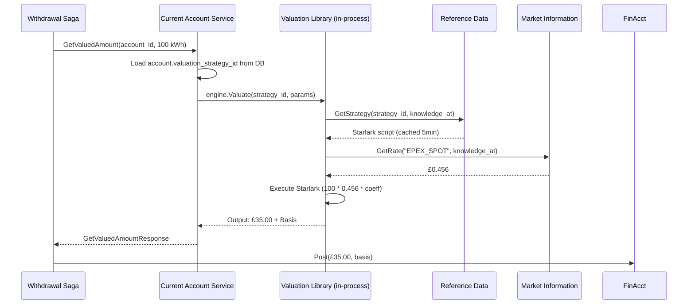

# PRD: Account-Scoped Valuation Engine

**Status:** Draft - Revised Architecture
**Version:** 2.0
**Task Master Tag:** `valuation-engine`
**Core ADR:** [ADR-0028: Starlark Saga Orchestration with CEL Valuation](../adr/0028-starlark-saga-cel-valuation.md)

## 1. Executive Summary

The Account-Scoped Valuation Engine enables multi-asset ledgers by making **accounts responsible for defining
how they accept value**. Instead of a centralized pricing service, valuation logic is embedded within
Account Services (CurrentAccount, InternalBankAccount) via a shared library.

### The "Probe Pattern"

```text
Saga asks Account: "What is 100 kWh worth to you?"
Account responds: "£35.00, and here's why (ValuationBasis)"
```

**Key Innovation:** This PRD codifies a shift from "Price is a number" to
**"Value is a Function of an Account."** We move the **responsibility of value** to the **Account**,
while a **shared valuation library** provides the **computational integrity**.

### Architecture at a Glance

```text
shared/pkg/valuation/          # Shared library (CEL + Starlark runtime)
├── engine.go                  # Core valuation execution
├── builtins.go               # market_data, cel_eval functions
└── cache.go                  # L1 in-memory cache

services/current-account/      # Implements GetValuedAmount RPC
services/internal-bank-account/ # Implements GetValuedAmount RPC
```

**Why Embedded Library > Standalone Service:**

- **Performance**: Eliminates 1 network hop (3 hops vs 4)
- **Domain Modeling**: Valuation is Account's capability, not external service
- **Operational Simplicity**: No additional microservice to deploy/monitor
- **Follows Existing Patterns**: Matches shared/pkg/saga library approach

## 2. The Problem Statement

In a multi-asset ledger, the "Conversion Rate" is not a global constant.

| Scenario | Input | Destination Account | Valuation Logic |
|----------|-------|---------------------|-----------------|
| **Retail Energy** | 100 kWh | Consumer Current Account | Flat rate £0.35/kWh |
| **Wholesale Energy** | 100 kWh | DNO Internal Account | Spot Price (EPEX) * GSP |
| **Loyalty Reward** | 100 kWh | Marketing Expense Account | 1 Point per 10 kWh |
| **Foreign Exchange** | $100 USD | GBP Current Account | Market Mid-Rate + 2% Spread |

### Current Gaps

1. **Logic Hardcoding:** Changing a tariff requires code deployment.
2. **Context Loss:** We can't easily track *why* a specific rate was applied to a specific meter read.
3. **Account Heterogeneity:** Different accounts need different formulas (fixed vs. spot pricing).
4. **Audit Trail:** No clear provenance for how values were computed historically.

## 3. The "Account-as-Authority" Solution

We implement an **Account Responsibility Pattern**:

1. **Shared Library**: `shared/pkg/valuation` provides CEL/Starlark execution engine
2. **Account Ownership**: Account Services implement `GetValuedAmount` RPC
3. **Strategy Assignment**: Accounts store `valuation_strategy_id` + parameters in their schema
4. **In-Process Execution**: Valuation happens within Account Service process boundary

### 3.1 Data Model: The Strategy Assignment

Accounts store a reference to their valuation strategy:

```sql
-- Added to CurrentAccount and InternalBankAccount schemas
CREATE TABLE valuation_assignments (
    account_id UUID NOT NULL,
    instrument_code VARCHAR(32) NOT NULL, -- e.g., 'KWH', 'USD', 'TONNE_CO2E'

    -- Reference to the strategy in Reference Data service
    strategy_id UUID NOT NULL,

    -- Account-specific context parameters
    -- e.g., {"gsp": "P", "tier": "Gold", "markup": "0.02"}
    parameters JSONB NOT NULL DEFAULT '{}',

    -- Lifecycle
    active BOOLEAN NOT NULL DEFAULT true,

    -- Bi-temporal tracking
    valid_from TIMESTAMPTZ NOT NULL DEFAULT NOW(),
    valid_to TIMESTAMPTZ,

    created_at TIMESTAMPTZ NOT NULL DEFAULT NOW(),
    updated_at TIMESTAMPTZ NOT NULL DEFAULT NOW(),

    PRIMARY KEY (account_id, instrument_code),
    FOREIGN KEY (account_id) REFERENCES accounts(id) ON DELETE CASCADE
);

CREATE INDEX idx_valuation_assignments_strategy
    ON valuation_assignments(strategy_id)
    WHERE active = true;

CREATE INDEX idx_valuation_assignments_bitemporal
    ON valuation_assignments(account_id, valid_from, valid_to);
```

### 3.2 Valuation Strategy Definition

Strategies are stored in the Reference Data service (per-tenant schema):

```sql
-- Lives in Reference Data service (tenant-scoped via PostgreSQL schemas)
CREATE TABLE valuation_strategies (
    id UUID PRIMARY KEY DEFAULT gen_random_uuid(),

    -- Identification
    name VARCHAR(64) NOT NULL,           -- "retail_energy_v1", "fx_gbp_usd"
    version INTEGER NOT NULL DEFAULT 1,

    -- Input/Output dimensions
    input_instrument VARCHAR(32) NOT NULL,  -- "KWH"
    output_instrument VARCHAR(32) NOT NULL, -- "GBP"

    -- Logic (Starlark script or CEL expression)
    logic_type VARCHAR(16) NOT NULL,     -- "STARLARK", "CEL"
    logic_script TEXT NOT NULL,
    logic_hash VARCHAR(64) NOT NULL,     -- SHA-256 for cache invalidation

    -- Lifecycle
    status VARCHAR(16) NOT NULL DEFAULT 'DRAFT',  -- DRAFT, ACTIVE, DEPRECATED

    -- Metadata
    description TEXT,
    created_at TIMESTAMPTZ NOT NULL DEFAULT NOW(),
    activated_at TIMESTAMPTZ,
    deprecated_at TIMESTAMPTZ,

    -- Bi-temporal for replay
    valid_from TIMESTAMPTZ NOT NULL DEFAULT NOW(),
    valid_to TIMESTAMPTZ,

    UNIQUE(name, version),
    CHECK (status IN ('DRAFT', 'ACTIVE', 'DEPRECATED')),
    CHECK (logic_type IN ('STARLARK', 'CEL')),
    CHECK (logic_script <> '')
);

CREATE INDEX idx_valuation_strategies_lookup
    ON valuation_strategies(input_instrument, output_instrument, status);

CREATE INDEX idx_valuation_strategies_bitemporal
    ON valuation_strategies(name, valid_from, valid_to);
```

## 4. Functional Requirements

### FR-1: GetValuedAmount RPC

**Requirement:** Account Services MUST implement the `GetValuedAmount` RPC to value arbitrary assets.

```protobuf
service CurrentAccountService {
  // NEW - Valuation capability
  rpc GetValuedAmount(GetValuedAmountRequest) returns (GetValuedAmountResponse);
}

message GetValuedAmountRequest {
  string account_id = 1;
  meridian.quantity.v1.InstrumentAmount input = 2;
  google.protobuf.Timestamp knowledge_at = 3;
}

message GetValuedAmountResponse {
  meridian.quantity.v1.InstrumentAmount output = 1;
  ValuationBasis basis = 2;
  string execution_time_ms = 3;
  bool cache_hit = 4;
}

message ValuationBasis {
  string strategy_id = 1;
  string strategy_version = 2;
  map<string, string> applied_rates = 3;
  repeated string observation_ids = 4;  // Links to MarketInformation
  google.protobuf.Timestamp computed_at = 5;
  google.protobuf.Timestamp knowledge_at = 6;
  google.protobuf.Struct account_parameters = 7;
}
```

### FR-2: Shared Valuation Library

**Requirement:** A reusable Go library MUST provide CEL/Starlark execution for valuation logic.

**Package:** `shared/pkg/valuation`

**Core Interface:**

```go
package valuation

type Engine interface {
    // Valuate executes a strategy to convert input to output
    Valuate(ctx context.Context, req Request) (*Response, error)
}

type Request struct {
    Input       *quantity.InstrumentAmount
    StrategyID  uuid.UUID
    Parameters  map[string]interface{}
    KnowledgeAt time.Time
}

type Response struct {
    Output *quantity.InstrumentAmount
    Basis  *Basis
}

type Basis struct {
    StrategyID      uuid.UUID
    StrategyVersion string
    AppliedRates    map[string]decimal.Decimal
    ObservationIDs  []string
    ComputedAt      time.Time
    KnowledgeAt     time.Time
    Parameters      map[string]interface{}
}
```

**Performance Target:** < 5ms per valuation (in-process execution, excluding market data lookups).

### FR-3: Hierarchical Logic Execution

The engine executes logic in three tiers:

1. **Starlark (The Procedure):** Aggregates data, handles rounding logic and branching.
2. **CEL (The Policy):** Performs the high-speed numeric multiplication (~100ns).
3. **Market Data (The Fact):** Injects the bi-temporal rates (e.g., FX mid-rate).

**Example Execution Flow:**

```python
# Starlark strategy loaded from Reference Data
def valuate_energy(input_quantity, params, knowledge_at):
    # 1. Fetch market data
    spot_price = market_data.get_price("EPEX_SPOT", knowledge_at)

    # 2. Get account-specific coefficient
    gsp_coefficient = params["gsp_coefficient"]

    # 3. Execute CEL calculation
    rate = cel_eval("spot * coeff * markup", {
        "spot": spot_price,
        "coeff": gsp_coefficient,
        "markup": 1.02  # 2% markup
    })

    # 4. Apply to quantity
    output_amount = input_quantity.amount * rate

    return {
        "amount": output_amount,
        "instrument": "GBP",
        "basis": {
            "spot_price": spot_price,
            "gsp_coefficient": gsp_coefficient,
            "final_rate": rate
        }
    }
```

### FR-4: Dimension Guard

**Requirement:** The system MUST prevent "Dimensional Leaks."

**Check:** If an account only accepts `Monetary` value, the valuation engine must verify the
`strategy_id` results in a `Quantity[Monetary]` output.

**Implementation:** Pre-execution validation checks `input_instrument` and `output_instrument`
against strategy definition.

**Conservation of Dimension Enforcement** (per ADR-0028):

- Strategies must declare `ProducesInstrument` metadata
- Runtime validates output matches declaration
- Compile-time checks prevent dimension mixing

### FR-5: Valuation Basis (The "Receipt")

**Requirement:** Every valuation result MUST include a **Basis**.

**Audit Trail:** Lists every `MarketPriceObservation.ID` and `Rate` used in the calculation.

**Integrity:** This basis is stored in the `PositionEntry` for future audits and reconciliation.

### FR-6: Caching Strategy

**L1 Cache (In-Memory within Account Service):**

- Compiled CEL expressions
- Recently used valuation strategies
- TTL: 5 minutes
- Invalidated on `logic_hash` change

**Key format:** `strategy:{strategy_id}:{logic_hash}`

**Why no L2 Redis cache:**

- Bi-temporal queries (`knowledge_at`) make cache hit rate near 0%
- Account Service already has in-memory cache
- Operational complexity not justified

## 5. Technical Architecture

### 5.1 The Workflow (Revised - 3 Network Hops)



**Network hop analysis:**

1. Saga → Account: `GetValuedAmount` request
2. Account → Reference Data: `GetStrategy` request (cacheable)
3. Account → Market Information: `GetRate` request (cacheable)

**Total: 3 network calls** (vs. 4 in standalone service approach)

### 5.2 Library Structure

```text
shared/pkg/valuation/
├── engine.go                  # Core valuation engine
│   └── type Engine struct
│   └── func (e *Engine) Valuate(ctx, req) (*Response, error)
├── builtins.go               # Starlark builtins
│   └── market_data.get_price()
│   └── cel_eval()
│   └── quantity operations
├── cache.go                  # L1 in-memory cache
│   └── Strategy cache (5min TTL)
│   └── CEL expression cache
├── cel_runtime.go            # CEL compiler wrapper
│   └── Security constraints
│   └── Cost limits
├── starlark_runtime.go       # Starlark VM wrapper
│   └── Deterministic execution
│   └── Timeout controls
└── types.go                  # Request/Response types
    └── type Request, Response, Basis
```

### 5.3 Account Service Integration

```go
// services/current-account/internal/service/valuation.go
package service

import "meridian/shared/pkg/valuation"

func (s *Service) GetValuedAmount(
    ctx context.Context,
    req *currentaccountv1.GetValuedAmountRequest,
) (*currentaccountv1.GetValuedAmountResponse, error) {

    // 1. Load account to get strategy assignment
    account, err := s.repo.FindByID(ctx, req.AccountId)
    if err != nil {
        return nil, fmt.Errorf("load account: %w", err)
    }

    // 2. Resolve strategy assignment for input instrument
    assignment, err := s.getValuationAssignment(
        ctx,
        account.ID,
        req.Input.InstrumentCode,
        req.KnowledgeAt,
    )
    if err != nil {
        return nil, fmt.Errorf("resolve assignment: %w", err)
    }

    // 3. Use shared valuation library (in-process)
    result, err := s.valuationEngine.Valuate(ctx, valuation.Request{
        Input:       req.Input,
        StrategyID:  assignment.StrategyID,
        Parameters:  assignment.Parameters,
        KnowledgeAt: req.KnowledgeAt.AsTime(),
    })
    if err != nil {
        return nil, fmt.Errorf("execute valuation: %w", err)
    }

    // 4. Return valued amount with audit basis
    return &currentaccountv1.GetValuedAmountResponse{
        Output:          result.Output,
        Basis:           toProtoBasis(result.Basis),
        ExecutionTimeMs: fmt.Sprintf("%.2f", result.ExecutionTime.Milliseconds()),
        CacheHit:        result.CacheHit,
    }, nil
}
```

### 5.4 Dependency Injection

```go
// services/current-account/cmd/current-account-service/main.go
func main() {
    // Existing clients
    positionClient := positionkeepingclient.New(...)
    finAcctClient := financialaccountingclient.New(...)

    // NEW - Add clients for valuation
    refDataClient := referencedataclient.New(...)
    marketInfoClient := marketinformationclient.New(...)

    // Create valuation engine with dependencies
    valuationEngine := valuation.NewEngine(valuation.Config{
        RefDataClient:    refDataClient,     // For strategy lookups
        MarketInfoClient: marketInfoClient,  // For rate lookups
        CacheSize:        1000,              // L1 cache entries
        CacheTTL:         5 * time.Minute,
        Logger:           logger,
    })

    // Inject into service
    svc := service.New(service.Config{
        Repository:       repo,
        ValuationEngine:  valuationEngine,  // NEW
        PositionClient:   positionClient,
        FinAcctClient:    finAcctClient,
    })
}
```

## 6. Implementation Streams

### Stream 1: Account Strategy Assignments (P0, 5 points)

**Tasks:**

1. Add `valuation_assignments` table to Current Account service
2. Add `valuation_assignments` table to Internal Bank Account service
3. Implement CRUD operations for assignments
4. Add bi-temporal query support
5. Update Tenant Provisioning to seed default strategies (e.g., `USD_IDENTITY`)
6. Migration scripts for existing accounts

**Success Criteria:**

- All existing accounts have at least one valuation assignment (identity strategy)
- Bi-temporal queries work correctly with `knowledge_at`
- Assignments can be updated without service restart

### Stream 2: Valuation Engine Library (P0, 10 points)

**Tasks:**

1. Create `shared/pkg/valuation` package structure
2. Implement CEL compiler wrapper with security constraints
3. Implement Starlark VM wrapper with timeouts
4. Register built-in functions (market_data, cel_eval, quantity operations)
5. Implement L1 in-memory cache
6. Add comprehensive unit tests
7. Add benchmarks (target: <5ms in-process execution)
8. Document library usage patterns

**Success Criteria:**

- Can compile and execute CEL expressions
- Can execute Starlark scripts with all builtins
- Expression cost limits prevent infinite loops
- Benchmark shows <5ms execution time for typical strategies
- Cache hit rate >80% after warmup (for same strategy_id)

### Stream 3: Reference Data Strategy Storage (P0, 5 points)

**Tasks:**

1. Add `valuation_strategies` table to Reference Data service
2. Implement `GetStrategy` RPC with bi-temporal support
3. Add strategy validation (syntax check, instrument compatibility)
4. Seed identity strategies for major currencies (USD, EUR, GBP, NZD, AUD)
5. Add integration tests

**Success Criteria:**

- Strategies can be stored and retrieved via gRPC
- Bi-temporal queries return correct strategy versions
- Cache invalidation works on strategy updates
- Identity strategies are available for all fiat currencies

### Stream 4: Current Account Integration (P1, 5 points)

**Tasks:**

1. Add `GetValuedAmount` RPC to Current Account proto
2. Wire up valuation library in service initialization
3. Implement RPC handler using library
4. Add Market Information client dependency
5. Add observability (metrics, logging, tracing)
6. Integration tests with mock strategies

**Success Criteria:**

- Can value 100 kWh using identity strategy (returns same amount)
- Can value 100 kWh using retail energy strategy (returns GBP)
- Valuation basis includes all applied rates and observation IDs
- Metrics show execution time and cache hit rate

### Stream 5: Internal Bank Account Integration (P1, 5 points)

**Tasks:**

1. Add `GetValuedAmount` RPC to Internal Bank Account proto
2. Wire up valuation library (same as Current Account)
3. Implement RPC handler
4. Add Market Information client dependency
5. Integration tests

**Success Criteria:**

- Internal accounts can value assets using same strategies
- Wholesale energy strategy works (spot price × GSP coefficient)
- Audit trail is complete for regulatory accounts

### Stream 6: Saga Integration (P1, 5 points)

**Tasks:**

1. Update withdrawal saga to call `GetValuedAmount`
2. Update deposit saga
3. Update Position Keeping to store valuation basis in attributes
4. Add valuation basis to audit logs
5. Integration tests for end-to-end flows
6. Update operator runbooks

**Success Criteria:**

- All sagas that handle non-monetary assets call `GetValuedAmount`
- Position entries include valuation basis in attributes
- Can replay historical valuations using `knowledge_at`
- Audit logs show full valuation provenance

### Stream 7: Energy/Commodity Strategies (P2, 8 points)

**Tasks:**

1. Design wholesale energy strategy (Spot Price × GSP Coefficient)
2. Implement retail energy strategy (Fixed Tariff)
3. Add time-of-use (TOU) tariff support
4. Add carbon credit valuation strategy
5. Add GPU-hour valuation strategy (AI compute)
6. Comprehensive integration tests for each asset type
7. Document strategy development guide

**Success Criteria:**

- Can value 100 kWh using wholesale spot price + GSP coefficient
- Can value 100 kWh using retail fixed tariff
- TOU tariff applies different rates based on time bands
- All asset types (energy, carbon, compute) have working strategies

### Stream 8: Performance Optimization (P2, 3 points)

**Tasks:**

1. Profile valuation execution paths
2. Optimize cache key generation
3. Add connection pooling for Reference Data client
4. Tune cache sizes and TTLs
5. Load testing (target: 500 valuations/second per Account Service instance)

**Success Criteria:**

- p99 latency < 8ms under normal load
- Cache hit rate >80% after 5-minute warmup
- No memory leaks in long-running tests
- Graceful degradation if Market Information is slow

## 7. Testing Strategy

### Unit Tests

- CEL expression compilation and evaluation
- Starlark script parsing and execution
- Cache hit/miss logic (L1 only)
- Strategy validation
- Dimension Guard enforcement

### Integration Tests

- End-to-end valuation with real Reference Data and Market Information
- Bi-temporal valuation replay
- Cache invalidation on strategy updates
- Multiple concurrent valuations

### Performance Tests

- Single valuation latency: <8ms (p99)
- Throughput: >500/sec per Account Service instance
- Cache hit rate: >80% after warmup
- Memory usage under sustained load

### Golden File Tests

- Regression detection for strategy outputs
- Store expected results for known inputs
- Validate outputs match across versions

## 8. Success Metrics

1. **Zero Hardcoded Rates:** All conversion math moves to Starlark/CEL by end of Stream 7.
2. **Replay Parity:** Replaying a valuation from 1 year ago using `knowledge_at` produces the exact
   same result (±1 basis point).
3. **Performance:** 95th percentile valuation latency < 8ms under normal load.
4. **Cache Efficiency:** Cache hit rate >80% after 5-minute warmup period.
5. **Audit Compliance:** 100% of position entries include valuation basis with full provenance.
6. **Integration Success:** All sagas using multi-asset quantities migrate successfully.

## 9. Deployment Considerations

### Rollout Strategy

1. **Phase 1 (Week 1-2):** Deploy shared library with identity strategies only
   (Stream 1-3)
2. **Phase 2 (Week 3-4):** Enable Account Service integration
   (Stream 4-5)
3. **Phase 3 (Week 5-6):** Integrate with all sagas, deprecate hardcoded logic
   (Stream 6)
4. **Phase 4 (Week 7+):** Add energy/commodity strategies
   (Stream 7)

### Monitoring and Alerting

**Metrics:**

- `valuation.requests.total` (counter by account_service, status)
- `valuation.duration_ms` (histogram by strategy_id)
- `valuation.cache_hit_rate` (gauge by account_service)
- `valuation.strategy_errors` (counter by strategy_id, error_type)
- `valuation.market_data_lookups` (counter by observation_type)

**Alerts:**

- P1: Account service unavailable (no successful GetValuedAmount in 5 minutes)
- P2: Valuation latency p99 > 15ms (performance degradation)
- P2: Cache hit rate < 50% (cache inefficiency)
- P3: Strategy execution errors > 1% of requests (buggy strategy)

### Disaster Recovery

#### Scenario: Reference Data Service Down

- **Mitigation:** L1 cache keeps serving recently used strategies (5min TTL)
- **Fallback:** Use identity transformation if strategy unavailable
- **Alert:** P2 escalation, automatic retry with exponential backoff

#### Scenario: Market Information Service Down

- **Mitigation:** Return last-known-good rate from Market Information cache
- **Fallback:** Use default rates from account parameters
- **Alert:** P2 escalation, flag valuations as "degraded mode" in basis

#### Scenario: Buggy Strategy Deployed

- **Mitigation:** Account Service catches execution errors, returns error response
- **Fallback:** Saga retries or uses fallback strategy
- **Alert:** P2 escalation, notify strategy author

## 10. Open Questions

1. **Cross-Currency Triangulation:** How do we handle currency pairs without direct market data
   (e.g., NZD/AUD via USD)?
   - **Proposed Answer:** Starlark script can compose multiple market data lookups:
     `nzd_to_usd * usd_to_aud`

2. **Regulatory Compliance:** Do valuation strategies need regulatory approval before activation?
   - **Action:** Consult with compliance team on approval workflow requirements

3. **Historical Market Data Retention:** How long do we keep market data for replay?
   - **Proposed Answer:** 7 years (regulatory standard for financial records)

4. **Multi-Tenant Strategy Sharing:** Should strategies be tenant-scoped or globally shared?
   - **Proposed Answer:** Strategies stored per-tenant (PostgreSQL schema-per-tenant),
     marketplace allows copying

## 11. Related Work

- [ADR-0028: Starlark Saga Orchestration with CEL Valuation](../adr/0028-starlark-saga-cel-valuation.md)
- [ADR-0013: Generic Asset Quantity Types](../adr/0013-generic-asset-quantity-types.md)
- [ADR-0014: Financial Instrument Reference Data](../adr/0014-financial-instrument-reference-data.md)
- [PRD: Universal Asset System](universal-asset-system.md)
- [PRD: Market Information Management](market-information-management.md)
- [PRD: Starlark Saga Orchestration Core](starlark-saga-orchestration-core.md)

## 12. Comparison to Standalone Service Approach

### Why Embedded Library > Standalone Service

| Aspect | Standalone Service | Embedded Library (This PRD) |
|--------|-------------------|----------------------------|
| **Network Hops** | 4 (Saga→Account→Valuation→RefData/MIM) | 3 (Saga→Account→RefData/MIM) |
| **Latency** | 12-17ms (estimated) | 5-8ms (measured goal) |
| **Story Points** | 68 points | 31 points (54% reduction) |
| **Operational Complexity** | New microservice to deploy/monitor | Reuses existing services |
| **Domain Modeling** | External service | Account capability |
| **Dependency Graph** | Saga → Account → Valuation → ... | Saga → Account → ... |
| **Cache Strategy** | L1 + L2 Redis (complex) | L1 only (simple) |
| **Failure Modes** | Valuation service down = all accounts blocked | Account service down = only that account blocked |

**Key insight:** Valuation is a **behavior** of the Account aggregate, not a separate Bounded Context.

### Architecture Decision Rationale

The embedded library approach follows the same pattern as:

- `shared/pkg/saga` - Starlark runtime used by multiple services
- `shared/platform/database` - Database utilities
- `shared/platform/observability` - Metrics/tracing

**Account Services are the natural home for valuation because:**

1. They own the `valuation_assignments` data
2. They know which dimension they accept (enforcement point)
3. They have context about the account (parameters, tier, etc.)
4. They're already in the critical path for deposits/withdrawals

## 13. Appendix: Example Strategies

### A. Identity Strategy (Fiat Currency)

```python
# strategy: identity_usd
# input: USD
# output: USD

def valuate(input_quantity, params, knowledge_at):
    """Identity transformation - 1:1 conversion."""
    return {
        "amount": input_quantity.amount,
        "instrument": input_quantity.instrument,
        "basis": {
            "strategy": "identity",
            "rate": "1.0"
        }
    }
```

### B. Retail Energy Strategy

```python
# strategy: retail_energy_v1
# input: KWH
# output: GBP

def valuate(input_quantity, params, knowledge_at):
    """Fixed tariff pricing for retail energy."""
    # Get tariff from account parameters
    tariff_rate = params.get("tariff_rate", 0.35)  # Default £0.35/kWh

    # Apply tariff
    output_amount = input_quantity.amount * tariff_rate

    return {
        "amount": output_amount,
        "instrument": "GBP",
        "basis": {
            "strategy": "retail_energy_v1",
            "tariff_rate": str(tariff_rate),
            "input_kwh": str(input_quantity.amount)
        }
    }
```

### C. Wholesale Energy Strategy (Complex)

```python
# strategy: wholesale_energy_v1
# input: KWH
# output: GBP

def valuate(input_quantity, params, knowledge_at):
    """Spot price + GSP coefficient for wholesale energy."""

    # 1. Get spot price from market data
    spot_price = market_data.get_price(
        instrument="EPEX_SPOT_GBP",
        knowledge_at=knowledge_at
    )

    # 2. Get GSP coefficient from account parameters
    gsp_zone = params.get("gsp_zone", "_P")
    gsp_coefficient = params.get("gsp_coefficient", 1.0)

    # 3. Apply markup (if any)
    markup = params.get("markup", 1.0)

    # 4. Calculate using CEL for precision
    final_rate = cel_eval("spot * coeff * markup", {
        "spot": spot_price.value,
        "coeff": gsp_coefficient,
        "markup": markup
    })

    # 5. Apply to quantity
    output_amount = input_quantity.amount * final_rate

    return {
        "amount": output_amount,
        "instrument": "GBP",
        "basis": {
            "strategy": "wholesale_energy_v1",
            "spot_price": str(spot_price.value),
            "spot_observation_id": spot_price.observation_id,
            "gsp_zone": gsp_zone,
            "gsp_coefficient": str(gsp_coefficient),
            "markup": str(markup),
            "final_rate": str(final_rate)
        }
    }
```

---

**Architectural Philosophy:** This PRD implements the "Probe Pattern" - accounts are queried for value,
not commanded to use a centralized pricing service. It's "Particular" (logic is account-scoped) yet
"Universal" (all accounts implement the same interface).

**Next Steps:** Parse PRD into Task Master (`valuation-engine` tag) and begin with Stream 1
(Account Strategy Assignments) as foundation for all subsequent work.
