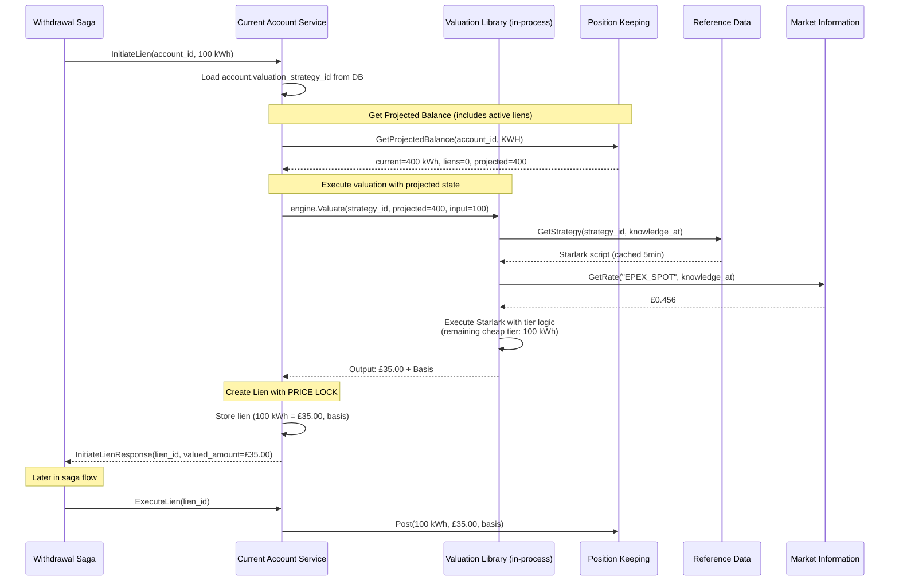
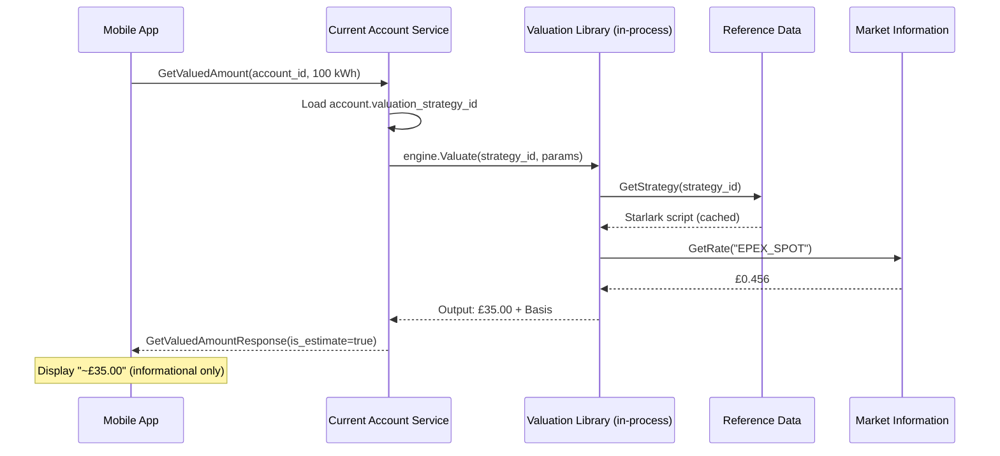

# PRD: Account-Scoped Valuation Engine

**Status:** Draft - Revised Architecture
**Version:** 2.3 (Security & Resilience Enhancements)
**Task Master Tag:** `valuation-engine`
**Story Points:** 63 (10 streams)
**Core ADR:** [ADR-0028: Starlark Saga Orchestration with CEL Valuation](../adr/0028-starlark-saga-cel-valuation.md)

**Version History:**

- v2.0: Embedded library architecture (vs standalone service)
- v2.1: Gemini safety enhancements (passport pattern, event-driven cache)
- v2.2: Atomic valuation with price lock (TOCTOU elimination)
- v2.3: Security & resilience (read-only VM, graceful stale, bucket filtering, quality tracking)

## 1. Executive Summary

The Account-Scoped Valuation Engine enables multi-asset ledgers by making **accounts responsible for defining
how they accept value**. Instead of a centralized pricing service, valuation logic is embedded within
Account Services (CurrentAccount, InternalBankAccount) via a shared library.

### The "Probe Pattern"

```text
Saga asks Account: "What is 100 kWh worth to you?"
Account responds: "£35.00, and here's why (ValuationBasis)"
```

**Key Innovation:** This PRD codifies a shift from "Price is a number" to
**"Value is a Function of an Account."** We move the **responsibility of value** to the **Account**,
while a **shared valuation library** provides the **computational integrity**.

### Architecture at a Glance

```text
shared/pkg/valuation/          # Shared library (CEL + Starlark runtime)
├── engine.go                  # Core valuation execution
├── builtins.go               # market_data, cel_eval functions
└── cache.go                  # L1 in-memory cache

services/current-account/      # Implements GetValuedAmount RPC
services/internal-bank-account/ # Implements GetValuedAmount RPC
```

**Why Embedded Library > Standalone Service:**

- **Performance**: Eliminates 1 network hop (3 hops vs 4)
- **Domain Modeling**: Valuation is Account's capability, not external service
- **Operational Simplicity**: No additional microservice to deploy/monitor
- **Follows Existing Patterns**: Matches shared/pkg/saga library approach

### Atomic Valuation with Price Lock (v2.2 Enhancement)

**Critical Innovation:** Valuation happens **atomically within `InitiateLien` and `ExecuteDeposit`** operations,
not as a separate inquiry step.

**Why This Matters:**

State-dependent pricing (tiered rates, volume discounts) is vulnerable to the "Tiered Valuation Drift" race
condition:

```text
BAD: Two sagas query valuation separately → both see same balance → both get cheap rate
GOOD: Each lien queries projected balance → second sees first's reservation → correct tier
```

**The Price Lock Guarantee:**

When `InitiateLien` creates a reservation, it stores BOTH:

- `reserved_quantity` (100 kWh)
- `valued_amount` (£35.00 at T0)
- `valuation_basis` (audit trail)

Later, when `ExecuteLien` is called, the system uses the **locked value**, not a recalculated value. This
protects both customer (price won't increase) and merchant (discounts can't be gamed).

**Two-Mode Operation:**

1. **Transactional** (`InitiateLien`, `ExecuteDeposit`): Atomic valuation with price lock
2. **Inquiry** (`GetValuedAmount`): Non-binding estimate for UX (mobile apps, dashboards)

**Complexity Impact:** +17 points (46 → 63 points) buys elimination of TOCTOU race conditions and guaranteed
price integrity under concurrent load.

## 2. The Problem Statement

In a multi-asset ledger, the "Conversion Rate" is not a global constant.

| Scenario | Input | Destination Account | Valuation Logic |
|----------|-------|---------------------|-----------------|
| **Retail Energy** | 100 kWh | Consumer Current Account | Flat rate £0.35/kWh |
| **Wholesale Energy** | 100 kWh | DNO Internal Account | Spot Price (EPEX) * GSP |
| **Loyalty Reward** | 100 kWh | Marketing Expense Account | 1 Point per 10 kWh |
| **Foreign Exchange** | $100 USD | GBP Current Account | Market Mid-Rate + 2% Spread |

### Current Gaps

1. **Logic Hardcoding:** Changing a tariff requires code deployment.
2. **Context Loss:** We can't easily track *why* a specific rate was applied to a specific meter read.
3. **Account Heterogeneity:** Different accounts need different formulas (fixed vs. spot pricing).
4. **Audit Trail:** No clear provenance for how values were computed historically.

## 3. The "Account-as-Authority" Solution

We implement an **Account Responsibility Pattern**:

1. **Shared Library**: `shared/pkg/valuation` provides CEL/Starlark execution engine
2. **Account Ownership**: Account Services implement `GetValuedAmount` RPC
3. **Strategy Assignment**: Accounts store `valuation_strategy_id` + parameters in their schema
4. **In-Process Execution**: Valuation happens within Account Service process boundary

### 3.1 Data Model: The Strategy Assignment

Accounts store a reference to their valuation strategy:

```sql
-- Added to CurrentAccount and InternalBankAccount schemas
CREATE TABLE valuation_assignments (
    account_id UUID NOT NULL,
    instrument_code VARCHAR(32) NOT NULL, -- e.g., 'KWH', 'USD', 'TONNE_CO2E'

    -- Reference to the strategy in Reference Data service
    strategy_id UUID NOT NULL,

    -- Account-specific context parameters
    -- e.g., {"gsp": "P", "tier": "Gold", "markup": "0.02"}
    parameters JSONB NOT NULL DEFAULT '{}',

    -- Lifecycle
    active BOOLEAN NOT NULL DEFAULT true,

    -- Bi-temporal tracking
    valid_from TIMESTAMPTZ NOT NULL DEFAULT NOW(),
    valid_to TIMESTAMPTZ,

    created_at TIMESTAMPTZ NOT NULL DEFAULT NOW(),
    updated_at TIMESTAMPTZ NOT NULL DEFAULT NOW(),

    PRIMARY KEY (account_id, instrument_code),
    FOREIGN KEY (account_id) REFERENCES accounts(id) ON DELETE CASCADE
);

CREATE INDEX idx_valuation_assignments_strategy
    ON valuation_assignments(strategy_id)
    WHERE active = true;

CREATE INDEX idx_valuation_assignments_bitemporal
    ON valuation_assignments(account_id, valid_from, valid_to);
```

### 3.2 Valuation Strategy Definition

Strategies are stored in the Reference Data service (per-tenant schema):

```sql
-- Lives in Reference Data service (tenant-scoped via PostgreSQL schemas)
CREATE TABLE valuation_strategies (
    id UUID PRIMARY KEY DEFAULT gen_random_uuid(),

    -- Identification
    name VARCHAR(64) NOT NULL,           -- "retail_energy_v1", "fx_gbp_usd"
    version INTEGER NOT NULL DEFAULT 1,

    -- Input/Output dimensions
    input_instrument VARCHAR(32) NOT NULL,  -- "KWH"
    output_instrument VARCHAR(32) NOT NULL, -- "GBP"

    -- Logic (Starlark script or CEL expression)
    logic_type VARCHAR(16) NOT NULL,     -- "STARLARK", "CEL"
    logic_script TEXT NOT NULL,
    logic_hash VARCHAR(64) NOT NULL,     -- SHA-256 for cache invalidation

    -- Lifecycle
    status VARCHAR(16) NOT NULL DEFAULT 'DRAFT',  -- DRAFT, ACTIVE, DEPRECATED

    -- Metadata
    description TEXT,
    created_at TIMESTAMPTZ NOT NULL DEFAULT NOW(),
    activated_at TIMESTAMPTZ,
    deprecated_at TIMESTAMPTZ,

    -- Bi-temporal for replay
    valid_from TIMESTAMPTZ NOT NULL DEFAULT NOW(),
    valid_to TIMESTAMPTZ,

    UNIQUE(name, version),
    CHECK (status IN ('DRAFT', 'ACTIVE', 'DEPRECATED')),
    CHECK (logic_type IN ('STARLARK', 'CEL')),
    CHECK (logic_script <> '')
);

CREATE INDEX idx_valuation_strategies_lookup
    ON valuation_strategies(input_instrument, output_instrument, status);

CREATE INDEX idx_valuation_strategies_bitemporal
    ON valuation_strategies(name, valid_from, valid_to);
```

## 4. Functional Requirements

### FR-1: GetValuedAmount RPC (Inquiry-Only, Non-Binding)

**Requirement:** Account Services MUST implement the `GetValuedAmount` RPC as a **read-only inquiry** for
non-transactional valuation queries.

**Semantics:** This RPC is **NON-BINDING**. It does not create liens, does not reserve capacity, and does not
guarantee the returned price will be honored in subsequent transactions. It is intended for:

- Mobile app UX ("What would 100 kWh cost right now?")
- Dashboard displays ("Current rate for my account")
- Saga planning (estimate before reservation)

**For transactional flows** (actual withdrawals/deposits), valuation MUST happen atomically within
`InitiateLien` or `ExecuteDeposit` (see FR-8).

**Design Note (Naming):**

BIAN uses "Probe" terminology for non-binding inquiries. Alternative naming: `EvaluateAmount` emphasizes
computation/simulation semantics vs `Get...` which implies simple field retrieval. Current name
`GetValuedAmount` is acceptable but may be revisited in implementation for stronger BIAN alignment.

```protobuf
service CurrentAccountService {
  // Inquiry-only valuation (non-binding)
  rpc GetValuedAmount(GetValuedAmountRequest) returns (GetValuedAmountResponse);
}

message GetValuedAmountRequest {
  string account_id = 1;
  meridian.quantity.v1.InstrumentAmount input = 2;
  google.protobuf.Timestamp knowledge_at = 3;
}

message GetValuedAmountResponse {
  meridian.quantity.v1.InstrumentAmount output = 1;
  ValuationBasis basis = 2;
  string execution_time_ms = 3;
  bool cache_hit = 4;

  // WARNING: This value is informational only. Actual transaction may differ.
  bool is_estimate = 5;  // Always true for this RPC
}

message ValuationBasis {
  string strategy_id = 1;
  string strategy_version = 2;
  map<string, string> applied_rates = 3;
  repeated string observation_ids = 4;  // Links to MarketInformation
  google.protobuf.Timestamp computed_at = 5;
  google.protobuf.Timestamp knowledge_at = 6;
  google.protobuf.Struct account_parameters = 7;

  // Quality level of market data used (per ADR-018 Settlement & Reconciliation)
  repeated MarketDataQuality market_data_qualities = 8;
}

message MarketDataQuality {
  string observation_id = 1;
  string source_trust_level = 2;  // "ESTIMATE", "COEFFICIENT", "ACTUAL", "REVISED"
  string instrument_code = 3;     // e.g., "EPEX_SPOT"
  string value = 4;               // The rate/price used
}
```

### FR-2: Shared Valuation Library

**Requirement:** A reusable Go library MUST provide CEL/Starlark execution for valuation logic.

**Package:** `shared/pkg/valuation`

**Core Interface:**

```go
package valuation

type Engine interface {
    // Valuate executes a strategy to convert input to output
    Valuate(ctx context.Context, req Request) (*Response, error)
}

type Request struct {
    Input       *quantity.InstrumentAmount
    StrategyID  uuid.UUID
    Parameters  map[string]interface{}
    KnowledgeAt time.Time
}

type Response struct {
    Output *quantity.InstrumentAmount
    Basis  *Basis
}

type Basis struct {
    StrategyID      uuid.UUID
    StrategyVersion string
    AppliedRates    map[string]decimal.Decimal
    ObservationIDs  []string
    ComputedAt      time.Time
    KnowledgeAt     time.Time
    Parameters      map[string]interface{}
}
```

**Performance Target:** < 5ms per valuation (in-process execution, excluding market data lookups).

### FR-3: Hierarchical Logic Execution

The engine executes logic in three tiers:

1. **Starlark (The Procedure):** Aggregates data, handles rounding logic and branching.
2. **CEL (The Policy):** Performs the high-speed numeric multiplication (~100ns).
3. **Market Data (The Fact):** Injects the bi-temporal rates (e.g., FX mid-rate).

**Example Execution Flow:**

```python
# Starlark strategy loaded from Reference Data
def valuate_energy(input_quantity, params, knowledge_at):
    # 1. Fetch market data (knowledge_at ensures bi-temporal replay)
    spot_price = market_data.get_price("EPEX_SPOT", knowledge_at)

    # 2. Get account-specific coefficient
    gsp_coefficient = params["gsp_coefficient"]

    # 3. Execute CEL calculation
    rate = cel_eval("spot * coeff * markup", {
        "spot": spot_price,
        "coeff": gsp_coefficient,
        "markup": 1.02  # 2% markup
    })

    # 4. Apply to quantity
    output_amount = input_quantity.amount * rate

    return {
        "amount": output_amount,
        "instrument": "GBP",
        "basis": {
            "spot_price": spot_price,
            "gsp_coefficient": gsp_coefficient,
            "final_rate": rate
        }
    }
```

### FR-4: Dimension Guard

**Requirement:** The system MUST prevent "Dimensional Leaks."

**Check:** If an account only accepts `Monetary` value, the valuation engine must verify the
`strategy_id` results in a `Quantity[Monetary]` output.

**Implementation:** Pre-execution validation checks `input_instrument` and `output_instrument`
against strategy definition.

**Conservation of Dimension Enforcement** (per ADR-0028):

- Strategies must declare `ProducesInstrument` metadata
- Runtime validates output matches declaration
- Compile-time checks prevent dimension mixing

#### FR-4.1: Output Instrument Validation (The "Chemical Signature")

**Requirement:** The `GetValuedAmountResponse` MUST return the complete **InstrumentAmount** with full asset identity.

**Rationale:** A USD account must never confuse the caller by returning GBP. The response must include:

- `InstrumentCode` (e.g., "USD", "GBP", "KWH")
- `Version` (for instruments with evolving definitions)
- `Attributes` (for fungibility metadata, e.g., "vintage", "source")

**Validation:** The Valuation Engine MUST verify that the instrument returned by the Starlark/CEL strategy
matches the `output_instrument` defined in the `valuation_assignment`.

**Enforcement Point:** This check happens at **activation time** (when a strategy is assigned to an account),
preventing invalid configurations before they reach production.

**Assertion in Saga:** The calling saga can assert the output instrument matches expectations:

```go
resp, _ := currentAccount.GetValuedAmount(ctx, kwhInput)

if resp.Output.InstrumentCode != expectedInstrument {
    return fmt.Errorf("VALUATION_MISMATCH: expected %s but got %s",
        expectedInstrument, resp.Output.InstrumentCode)
}
```

### FR-5: Valuation Basis (The "Receipt")

**Requirement:** Every valuation result MUST include a **Basis**.

**Audit Trail:** Lists every `MarketPriceObservation.ID` and `Rate` used in the calculation.

**Integrity:** Per ADR-017, the `observation_ids` and rates used in the calculation are stored in the
`PositionEntry.attributes` JSONB field in Position Keeping. This ensures that even if the Market Information
service purges old data after 7 years, the **Basis** stored in the ledger acts as a permanent snapshot
of the evidence used for that valuation.

**Auditability:** Seven years from now, an auditor can examine a single `PositionEntry` and see the complete
"Receipt" for the valuation without calling any external services.

**Quality Level Tracking (Settlement & Reconciliation):**

Per ADR-018, the `ValuationBasis` MUST include the `SourceTrustLevel` of each market data observation used:

- `ESTIMATE` (Quality 1): Forecast or projection
- `COEFFICIENT` (Quality 2): Model-derived value
- `ACTUAL` (Quality 3): Metered or observed value
- `REVISED` (Quality 4): Corrected after audit

**Why This Matters:**

If a valuation was performed using an `ESTIMATE` (Quality 1) at T0, but later an `ACTUAL` (Quality 3)
arrives at T1, the `ValuationBasis` in the ledger provides **proof of why the original (now "wrong") amount
was booked**. This is essential for:

- Settlement processes (explaining why provisional amounts differ from final)
- Reconciliation (tracking estimate-to-actual adjustments)
- Regulatory audit (demonstrating best available information at transaction time)

**Example `ValuationBasis` with Quality Levels:**

```json
{
  "strategy_id": "wholesale-spot-v2",
  "applied_rates": {"EPEX_SPOT": "0.456"},
  "market_data_qualities": [
    {
      "observation_id": "obs_abc123",
      "source_trust_level": "ESTIMATE",
      "instrument_code": "EPEX_SPOT",
      "value": "0.456"
    }
  ]
}
```

Later, when `ACTUAL` arrives, the reconciliation process sees: "Original booking used ESTIMATE quality,
revision is justified."

### FR-6: Caching Strategy

**L1 Cache (In-Memory within Account Service):**

- Compiled CEL expressions
- Recently used valuation strategies
- TTL: 5 minutes (baseline)
- Invalidated on `logic_hash` change

**Key format:** `strategy:{strategy_id}:{logic_hash}`

**Event-Driven Invalidation (Train Track Precision):**

To achieve faster consistency than the 5-minute TTL, the system SHOULD implement event-driven invalidation:

1. When Reference Data updates a `valuation_strategy`, it publishes a `strategy.updated` Kafka event
2. Account Services subscribe to this topic and invalidate their L1 cache immediately
3. New transactions use the updated strategy within milliseconds, not minutes

**Implementation:** This is a P2 enhancement (Stream 8). The 5-minute TTL provides acceptable baseline behavior.

**Graceful Stale Policy (Resilience):**

If Reference Data is unavailable and the L1 cache is cold, `InitiateLien` would fail, blocking the entire saga.

**Mitigation:** The cache SHOULD implement a **"Graceful Stale"** policy:

- If Reference Data backend is down, continue using expired strategies for up to **1 hour**
- Log high-priority warning: "Using stale strategy due to Reference Data unavailability"
- Metrics: `valuation_stale_cache_hits_total`

**Rationale:** In a ledger, "Calculated with slightly old formula" is preferable to "System Down."
The 1-hour grace period allows operations teams to restore Reference Data without blocking transactions.

**Why no L2 Redis cache:**

- Bi-temporal queries (`knowledge_at`) make cache hit rate near 0%
- Account Service already has in-memory cache
- Operational complexity not justified

### FR-7: Conservation of Dimension (Recursion Prevention)

**Requirement:** The Valuation Engine MUST NOT trigger write operations back to Position Keeping for the same
asset type being valued.

**Risk:** Without this constraint, a malicious or buggy strategy could create an "Infinite Asset Inflation" loop:

```text
BAD: Valuation triggers position log → Position log triggers valuation → Loop
```

**Enforcement:**

1. **Read-Only Contract:** The `GetValuedAmount` RPC is a **stateless inquiry** (pure function).
   It performs NO writes to Position Keeping, NO writes to Account state.
2. **Domain Boundary:** Valuation is "Math-as-a-Service" - it calculates, it does not transact.
3. **Saga Responsibility:** Only the Saga Orchestrator can write to Position Keeping, and only AFTER
   receiving the valuation response.
4. **Separate Builtin Registry (CRITICAL):** The `shared/pkg/valuation` library MUST use a **different
   Starlark builtin registry** than `shared/pkg/saga`. Specifically, it MUST EXCLUDE all write-capable
   handlers:
   - `position_keeping.initiate_log` (blocked)
   - `financial_accounting.post_entries` (blocked)
   - `current_account.execute_debit` (blocked)
   - Any other state-mutating operations

**Implementation Requirement:**

```go
// shared/pkg/valuation/starlark_runtime.go
func newValuationBuiltins() starlark.StringDict {
    return starlark.StringDict{
        "market_data":    builtinMarketData,     // ✅ Read-only
        "cel_eval":       builtinCelEval,        // ✅ Pure computation
        "quantity":       builtinQuantity,       // ✅ Math operations
        // ❌ NO position_keeping, NO financial_accounting
    }
}
```

**Verification:** Stream 2 MUST include a unit test:

```go
func TestValuationCannotWriteToPositionKeeping(t *testing.T) {
    strategy := `
        def valuate(input, params, knowledge_at):
            # Attempt to write (should fail at VM level)
            position_keeping.initiate_log(...)
            return {"amount": 100}
    `
    engine := NewEngine(...)
    _, err := engine.Valuate(ctx, Request{Strategy: strategy})

    // Expect: name 'position_keeping' is not defined
    assert.ErrorContains(t, err, "name 'position_keeping' is not defined")
}
```

**Architectural Safety:** By making valuation a read-only operation with VM-level enforcement, we prevent:

- Recursive valuation loops
- Non-deterministic execution (valuation affecting its own inputs)
- Unauthorized state mutations
- Malicious or buggy strategies triggering writes

### FR-8: Atomic Valuation in Lien Initiation (Price Lock)

**Requirement:** Account Services MUST perform valuation **atomically** within `InitiateLien` and `ExecuteDeposit`
operations to prevent race conditions in state-dependent pricing.

#### The "Tiered Valuation Drift" Problem

For state-dependent strategies (tiered pricing, volume discounts, time-of-use), querying valuation separately
from reservation creates a TOCTOU (Time-of-Check to Time-of-Use) race condition:

```text
TIME: T0         T1           T2
      ↓          ↓            ↓
Saga A: GetValuedAmount(300 kWh) → £60 (tier 1)
                InitiateLien(300 kWh)
Saga B:          GetValuedAmount(300 kWh) → £60 (WRONG - should be tier 2)
                                  InitiateLien(300 kWh)

Result: Both charged at introductory rate when only first 300 should be.
```

#### The Solution: Valuation-in-Lien

**Transactional Operations** (withdrawals, deposits) MUST calculate valuation atomically:

1. **`InitiateLien`** (withdrawals):
   - Input: `InstrumentAmount` (any asset class)
   - Queries Projected Balance (Current + Active Liens) from Position Keeping
   - Executes valuation strategy using projected state
   - Creates lien storing BOTH `reserved_quantity` AND `valued_amount`
   - Returns lien with **price lock**

2. **`ExecuteDeposit`** (inbound assets):
   - Input: `InstrumentAmount`
   - Queries Projected Balance
   - Executes valuation strategy
   - Posts to Position Keeping with valuation basis

**Updated `InitiateLien` Proto:**

```protobuf
message InitiateLienRequest {
  string account_id = 1;
  meridian.quantity.v1.InstrumentAmount amount = 2;  // Any asset class
  string payment_order_reference = 3;
  meridian.common.v1.IdempotencyKey idempotency_key = 4;
  google.protobuf.Timestamp knowledge_at = 5;
}

message InitiateLienResponse {
  string lien_id = 1;

  // The "Price Lock" - guaranteed value at lien creation time
  meridian.quantity.v1.InstrumentAmount valued_amount = 2;  // e.g., £35.00
  ValuationBasis basis = 3;

  meridian.common.v1.MoneyAmount new_available_balance = 4;
}
```

**Price Lock Guarantee:**

The `valued_amount` in the lien is **immutable**. When `ExecuteLien` is called later, the system uses the
locked value, NOT a recalculated value. This protects both:

- **Customer**: Price won't increase between reservation and execution
- **Merchant**: Tiered discounts can't be gamed by concurrent reservations

**CRITICAL Constraint:** The `ExecuteLien` RPC MUST be updated to **forbid amount overrides**. The handler
MUST strictly use the `valued_amount` stored in the database lien record created by `InitiateLien`. No
parameters in the `ExecuteLienRequest` may override this value.

**Implementation Check:**

```go
func (s *Service) ExecuteLien(ctx context.Context, req *ExecuteLienRequest) (*ExecuteLienResponse, error) {
    // Load lien from database
    lien, err := s.repo.FindLienByID(ctx, req.LienId)

    // ❌ FORBIDDEN: Allow override
    // if req.OverrideAmount != nil {
    //     amount = req.OverrideAmount
    // }

    // ✅ REQUIRED: Use stored valued_amount
    valuedAmount := lien.ValuedAmount  // Price lock from InitiateLien

    // Post to Position Keeping with locked value
    return s.positionClient.Post(ctx, valuedAmount, lien.Basis)
}
```

**Rationale:** Allowing overrides would defeat the price lock guarantee and reintroduce TOCTOU vulnerabilities.

#### Idempotency

Retrying `InitiateLien` with same `idempotency_key` returns the existing lien with its original
`valued_amount`. No recalculation.

### FR-9: Projected Balance for State-Dependent Valuation

**Requirement:** Position Keeping MUST provide a `ProjectedBalance` query that includes pending reservations
(active liens).

**Formula:**

```go
ProjectedBalance = CurrentBalance + Sum(ActiveLiens)
```

**Use Case:**

When executing a valuation strategy with state-dependent logic (tiered pricing), the Valuation Engine queries
`ProjectedBalance` instead of `CurrentBalance` to see capacity already spoken for by concurrent transactions.

**Example:**

```python
# Starlark strategy using projected balance
def valuate_tiered(input_quantity, params, knowledge_at):
    # Get projected balance (includes other active liens)
    projected = position_keeping.get_projected_balance(
        account_id=params["account_id"],
        instrument="KWH",
        knowledge_at=knowledge_at
    )

    # Calculate how much of "cheap" tier remains
    cheap_threshold = 500.0
    cheap_available = max(0, cheap_threshold - projected.amount)

    # Price accordingly
    if input_quantity.amount <= cheap_available:
        rate = 0.20  # All in cheap tier
    else:
        # Split across tiers
        cheap_portion = cheap_available * 0.20
        expensive_portion = (input_quantity.amount - cheap_available) * 0.35
        rate = (cheap_portion + expensive_portion) / input_quantity.amount

    return calculate_value(input_quantity, rate)
```

**Position Keeping API:**

```protobuf
message GetProjectedBalanceRequest {
  string account_id = 1;
  string instrument_code = 2;
  google.protobuf.Timestamp knowledge_at = 3;

  // CRITICAL: Bucket filtering for fungibility-aware tiering
  // If strategy uses tiered pricing for source:solar vs source:grid separately,
  // the projection must only include liens/balance for the same bucket
  string bucket_id = 4;  // Optional: filters by instrument attributes
}

message GetProjectedBalanceResponse {
  meridian.quantity.v1.InstrumentAmount current_balance = 1;
  meridian.quantity.v1.InstrumentAmount active_liens_total = 2;
  meridian.quantity.v1.InstrumentAmount projected_balance = 3;  // current + liens

  // Echo back the bucket filter used (for debugging)
  string bucket_id = 4;
}
```

**Bucket Filtering Requirement (CRITICAL):**

When querying `ProjectedBalance`, the system MUST support filtering by `bucket_id`. A `bucket_id` represents
a specific fungibility partition of an instrument.

**Example:**

For tiered pricing on `KWH` with attribute `source: solar` vs `source: grid`:

- Tier strategy for `source:solar` queries: `GetProjectedBalance(instrument=KWH, bucket_id=kwh_solar)`
- Tier strategy for `source:grid` queries: `GetProjectedBalance(instrument=KWH, bucket_id=kwh_grid)`

Without bucket filtering, liens for `source:grid` would incorrectly affect the tier calculation for
`source:solar`, causing cross-contamination of tier thresholds.

**Implementation:** Stream 10 (Position Keeping) MUST implement bucket-aware aggregation:

```sql
-- Without bucket filtering (WRONG for fungibility-aware tiering)
SELECT SUM(amount) FROM position_entries WHERE instrument_code = 'KWH'

-- With bucket filtering (CORRECT)
SELECT SUM(amount) FROM position_entries
WHERE instrument_code = 'KWH'
  AND bucket_id = 'kwh_solar'  -- Only solar kWh
```

**Concurrency Safety:**

By using Projected Balance with bucket filtering, the second concurrent lien sees the first lien's
reservation (within the same bucket) and calculates the correct tier pricing. This eliminates the
"Tiered Valuation Drift" bug while preserving fungibility boundaries.

## 5. Technical Architecture

### 5.1 The Transactional Workflow (Atomic Valuation-in-Lien)

**This is the PRIMARY flow for actual transactions (withdrawals, deposits).** Valuation happens atomically
within lien/deposit operations to prevent race conditions.



**Network hop analysis:**

1. Saga → Account: `InitiateLien` request
2. Account → Position Keeping: `GetProjectedBalance` (for tiered pricing)
3. Account → Reference Data: `GetStrategy` (cached 5min)
4. Account → Market Information: `GetRate` (cached)

**Total: 4 network calls** (one more than inquiry-only, but eliminates TOCTOU race)

**Key Difference from Inquiry Flow:**

- **Inquiry (`GetValuedAmount`)**: Returns estimate, no state change, can drift
- **Transactional (`InitiateLien`)**: Creates price lock, queries projected balance, atomic

### 5.1.1 The Inquiry Workflow (Non-Binding, for UX)

For **non-transactional** queries (mobile app, dashboard), use the inquiry RPC:



**WARNING:** This value is non-binding. Actual transaction may differ if:

- Balance changes (tier transitions)
- Market rates update
- Concurrent transactions reserve capacity

### 5.2 Library Structure

```text
shared/pkg/valuation/
├── engine.go                  # Core valuation engine
│   └── type Engine struct
│   └── func (e *Engine) Valuate(ctx, req) (*Response, error)
├── builtins.go               # Starlark builtins
│   └── market_data.get_price()
│   └── cel_eval()
│   └── quantity operations
├── cache.go                  # L1 in-memory cache
│   └── Strategy cache (5min TTL)
│   └── CEL expression cache
├── cel_runtime.go            # CEL compiler wrapper
│   └── Security constraints
│   └── Cost limits
├── starlark_runtime.go       # Starlark VM wrapper
│   └── Deterministic execution
│   └── Timeout controls
└── types.go                  # Request/Response types
    └── type Request, Response, Basis
```

### 5.3 The "Passport Pattern" - Audit Integrity Across Flows

The **Basis** (the valuation receipt) must be persisted to ensure the ledger is auditable. This creates a
**three-layer persistence model**, with different behavior for inquiry vs transactional flows:

#### Layer 1: Account Service

**Inquiry Flow (`GetValuedAmount`)**: Stateless, NO writes. Pure "Math-as-a-Service."

- **Why:** 100,000 inquiries/hour shouldn't write to Account database
- **Performance:** <5ms p99 by eliminating DB contention

**Transactional Flow (`InitiateLien`, `ExecuteDeposit`)**: WRITES lien/deposit record with valuation.

- **Why:** Price lock requires persistence
- **What's Stored:**
  - `reserved_quantity` / `deposited_quantity`
  - `valued_amount` (price lock)
  - `valuation_basis` (audit trail)
- **Performance:** Acceptable overhead (<10ms) for transactional guarantees

#### Layer 2: Saga Orchestrator (Checkpoint Persistence)

The Saga DOES persist the result. Per ADR-028 (Durable Execution Engine), the saga saves the response of every
step into its `saga_step_results` table.

**Audit Value:** If a pod dies and the saga replays, it doesn't re-calculate the value; it pulls the "frozen"
result from the last checkpoint. This guarantees **deterministic replay** - the same saga execution always sees
the same valuation, even if market rates have changed since.

**Example:**

```json
{
  "step_id": "valuate_energy",
  "result": {
    "output": {"amount": "35.00", "instrument": "GBP"},
    "basis": {
      "strategy_id": "wholesale-spot-v2",
      "rates": {"EPEX_SPOT": "0.456"},
      "observation_ids": ["obs_abc123"],
      "knowledge_at": "2025-01-15T14:30:00Z"
    }
  }
}
```

#### Layer 3: Position Keeping (Permanent Audit)

When the transaction finally hits **Position Keeping**, the `ValuationBasis` is stored in the `attributes` JSONB
of the `PositionEntry`.

**Audit Value:** Seven years from now, an auditor can examine a single row in the ledger and see the complete
"Receipt" for the valuation without calling any external services. Even if:

- The Market Information service has purged old rate data
- The Reference Data service has deprecated the strategy
- The Account Service has been decommissioned

**Example `PositionEntry.attributes`:**

```json
{
  "valuation_basis": {
    "strategy_id": "wholesale-spot-v2",
    "strategy_version": "1.2.0",
    "applied_rates": {"EPEX_SPOT": "0.456", "gsp_coefficient": "1.05"},
    "observation_ids": ["obs_abc123"],
    "computed_at": "2025-01-15T14:30:15Z",
    "knowledge_at": "2025-01-15T14:30:00Z",
    "account_parameters": {"gsp": "P", "tier": "Gold"}
  }
}
```

#### The "Passport Analogy"

The `ValuationBasis` travels through the system like a passport:

1. **Issued** by the Account Service (valuation calculation)
2. **Stamped** by the Saga Orchestrator (checkpoint persistence)
3. **Archived** by Position Keeping (permanent ledger entry)

At each layer, the Basis provides **proof of origin** and **proof of calculation** for regulatory audit.

### 5.4 Account Service Integration

```go
// services/current-account/internal/service/valuation.go
package service

import "meridian/shared/pkg/valuation"

func (s *Service) GetValuedAmount(
    ctx context.Context,
    req *currentaccountv1.GetValuedAmountRequest,
) (*currentaccountv1.GetValuedAmountResponse, error) {

    // 1. Load account to get strategy assignment
    account, err := s.repo.FindByID(ctx, req.AccountId)
    if err != nil {
        return nil, fmt.Errorf("load account: %w", err)
    }

    // 2. Resolve strategy assignment for input instrument
    assignment, err := s.getValuationAssignment(
        ctx,
        account.ID,
        req.Input.InstrumentCode,
        req.KnowledgeAt,
    )
    if err != nil {
        return nil, fmt.Errorf("resolve assignment: %w", err)
    }

    // 3. Use shared valuation library (in-process)
    result, err := s.valuationEngine.Valuate(ctx, valuation.Request{
        Input:       req.Input,
        StrategyID:  assignment.StrategyID,
        Parameters:  assignment.Parameters,
        KnowledgeAt: req.KnowledgeAt.AsTime(),
    })
    if err != nil {
        return nil, fmt.Errorf("execute valuation: %w", err)
    }

    // 4. Return valued amount with audit basis
    return &currentaccountv1.GetValuedAmountResponse{
        Output:          result.Output,
        Basis:           toProtoBasis(result.Basis),
        ExecutionTimeMs: fmt.Sprintf("%.2f", result.ExecutionTime.Milliseconds()),
        CacheHit:        result.CacheHit,
    }, nil
}
```

### 5.5 Dependency Injection

```go
// services/current-account/cmd/current-account-service/main.go
func main() {
    // Existing clients
    positionClient := positionkeepingclient.New(...)
    finAcctClient := financialaccountingclient.New(...)

    // NEW - Add clients for valuation
    refDataClient := referencedataclient.New(...)
    marketInfoClient := marketinformationclient.New(...)

    // Create valuation engine with dependencies
    valuationEngine := valuation.NewEngine(valuation.Config{
        RefDataClient:    refDataClient,     // For strategy lookups
        MarketInfoClient: marketInfoClient,  // For rate lookups
        CacheSize:        1000,              // L1 cache entries
        CacheTTL:         5 * time.Minute,
        Logger:           logger,
    })

    // Inject into service
    svc := service.New(service.Config{
        Repository:       repo,
        ValuationEngine:  valuationEngine,  // NEW
        PositionClient:   positionClient,
        FinAcctClient:    finAcctClient,
    })
}
```

## 6. Implementation Streams

### Stream 1: Account Strategy Assignments (P0, 5 points)

**Tasks:**

1. Add `valuation_assignments` table to Current Account service
2. Add `valuation_assignments` table to Internal Bank Account service
3. Implement CRUD operations for assignments
4. Add bi-temporal query support
5. Update Tenant Provisioning to seed default strategies (e.g., `USD_IDENTITY`)
6. Migration scripts for existing accounts

**Success Criteria:**

- All existing accounts have at least one valuation assignment (identity strategy)
- Bi-temporal queries work correctly with `knowledge_at`
- Assignments can be updated without service restart

### Stream 2: Valuation Engine Library (P0, 10 points)

**Tasks:**

1. Create `shared/pkg/valuation` package structure
2. Implement CEL compiler wrapper with security constraints
3. Implement Starlark VM wrapper with timeouts
4. Register built-in functions (market_data, cel_eval, quantity operations)
5. **CRITICAL:** Implement separate read-only builtin registry (exclude position_keeping, financial_accounting)
6. Implement L1 in-memory cache with graceful stale policy (1-hour grace if backend down)
7. Add comprehensive unit tests
8. **CRITICAL:** Add security verification test (strategy cannot call write handlers)
9. Add benchmarks (target: <5ms in-process execution)
10. Document library usage patterns

**Success Criteria:**

- Can compile and execute CEL expressions
- Can execute Starlark scripts with all builtins
- Expression cost limits prevent infinite loops
- Benchmark shows <5ms execution time for typical strategies
- Cache hit rate >80% after warmup (for same strategy_id)
- **Security test passes:** Strategy attempting `position_keeping.initiate_log` fails with
  `name 'position_keeping' is not defined`
- Graceful stale cache activates when Reference Data unavailable (logs warning, continues)

### Stream 3: Reference Data Strategy Storage (P0, 5 points)

**Tasks:**

1. Add `valuation_strategies` table to Reference Data service
2. Implement `GetStrategy` RPC with bi-temporal support
3. Add strategy validation (syntax check, instrument compatibility)
4. Seed identity strategies for major currencies (USD, EUR, GBP, NZD, AUD)
5. Add integration tests

**Success Criteria:**

- Strategies can be stored and retrieved via gRPC
- Bi-temporal queries return correct strategy versions
- Cache invalidation works on strategy updates
- Identity strategies are available for all fiat currencies

### Stream 4: Current Account Integration (P1, 8 points)

**Tasks:**

1. Add `GetValuedAmount` RPC to Current Account proto (inquiry-only)
2. Update `InitiateLien` to accept `InstrumentAmount` (any asset class)
3. Update `InitiateLien` response to include `valued_amount` and `basis`
4. Update `ExecuteDeposit` to perform atomic valuation
5. Wire up valuation library in service initialization
6. Add Position Keeping client for projected balance queries
7. Implement valuation in `InitiateLien` handler (price lock)
8. Implement valuation in `ExecuteDeposit` handler
9. Implement `GetValuedAmount` handler (inquiry-only, non-binding)
10. Add Market Information client dependency
11. Add observability (metrics, logging, tracing)
12. Integration tests with mock strategies
13. Concurrency tests (verify tiered pricing with parallel liens)

**Success Criteria:**

- `InitiateLien` accepts non-monetary assets (kWh, TONNE_CO2E)
- Lien stores price lock (valued_amount) alongside reserved_quantity
- Concurrent liens on tiered pricing account get correct rates (no drift)
- `GetValuedAmount` returns `is_estimate=true` (non-binding)
- Valuation basis includes all applied rates and observation IDs
- Metrics show execution time and cache hit rate

### Stream 5: Internal Bank Account Integration (P1, 8 points)

**Tasks:**

1. Add `GetValuedAmount` RPC to Internal Bank Account proto (inquiry-only)
2. Update `InitiateLien` to accept `InstrumentAmount` (any asset class)
3. Update `InitiateLien` response to include `valued_amount` and `basis`
4. Update `ExecuteDeposit` to perform atomic valuation
5. Wire up valuation library (same as Current Account)
6. Add Position Keeping client for projected balance queries
7. Implement valuation in `InitiateLien` handler (price lock)
8. Implement valuation in `ExecuteDeposit` handler
9. Implement `GetValuedAmount` handler (inquiry-only, non-binding)
10. Add Market Information client dependency
11. Integration tests
12. Concurrency tests (verify tiered pricing with parallel liens)

**Success Criteria:**

- Internal accounts can value assets using same strategies
- Wholesale energy strategy works (spot price × GSP coefficient)
- `InitiateLien` stores price lock for regulatory accounts
- Concurrent liens handle tiered pricing correctly
- Audit trail is complete for regulatory accounts

### Stream 6: Saga Integration (P1, 8 points)

**Tasks:**

1. Update withdrawal saga to use `InitiateLien` for non-monetary assets (no separate valuation call)
2. Update saga to extract `valued_amount` from `InitiateLienResponse`
3. Update saga to pass valuation basis to Position Keeping
4. Update deposit saga to use atomic valuation in `ExecuteDeposit`
5. Update Position Keeping to store valuation basis in `PositionEntry.attributes` JSONB
6. Add valuation basis to audit logs
7. Update saga replay logic to use checkpointed valuations (deterministic replay)
8. Integration tests for end-to-end flows with tiered pricing
9. Chaos tests (pod kills during valuation - verify deterministic replay)
10. Update operator runbooks

**Success Criteria:**

- Withdrawal sagas use `InitiateLien` (valuation atomic, no separate call)
- Deposit sagas use atomic valuation in `ExecuteDeposit`
- Position entries include valuation basis in attributes JSONB
- Can replay historical valuations using `knowledge_at` (saga checkpoints)
- Saga replay is deterministic (same valued_amount from checkpoint)
- Audit logs show full valuation provenance
- No TOCTOU race conditions under concurrent load

### Stream 7: Energy/Commodity Strategies (P2, 8 points)

**Tasks:**

1. Design wholesale energy strategy (Spot Price × GSP Coefficient)
2. Implement retail energy strategy (Fixed Tariff)
3. Add time-of-use (TOU) tariff support
4. Add carbon credit valuation strategy
5. Add GPU-hour valuation strategy (AI compute)
6. Comprehensive integration tests for each asset type
7. Document strategy development guide

**Success Criteria:**

- Can value 100 kWh using wholesale spot price + GSP coefficient
- Can value 100 kWh using retail fixed tariff
- TOU tariff applies different rates based on time bands
- All asset types (energy, carbon, compute) have working strategies

### Stream 8: Performance Optimization (P2, 3 points)

**Tasks:**

1. Profile valuation execution paths
2. Optimize cache key generation
3. Add connection pooling for Reference Data client
4. Tune cache sizes and TTLs
5. Implement event-driven cache invalidation (Kafka subscriber for `strategy.updated` events)
6. Load testing (target: 500 valuations/second per Account Service instance)

**Success Criteria:**

- p99 latency < 8ms under normal load
- Cache hit rate >80% after 5-minute warmup
- Event-driven invalidation reduces staleness to <100ms (from 5min TTL baseline)
- No memory leaks in long-running tests
- Graceful degradation if Market Information is slow

### Stream 9: Lien Schema Enhancement (P0, 3 points)

**Tasks:**

1. Add `valued_amount` field to `liens` table (InstrumentAmount)
2. Add `valuation_basis` field to `liens` table (JSONB)
3. Update `InitiateLien` to store valuation in lien record
4. Update `ExecuteLien` to use stored valued_amount (not recalculate)
5. Add `idempotency_check` to return existing lien with original valuation
6. Migration scripts for existing liens (backfill with identity valuation)

**Success Criteria:**

- Liens store both reserved_quantity and valued_amount
- `ExecuteLien` uses price lock from lien creation time
- Idempotent retries return same valuation (no recalculation)
- Lien basis stored in JSONB includes observation_ids, rates, strategy version

### Stream 10: Position Keeping Projected Balance (P0, 5 points)

**Tasks:**

1. Add `GetProjectedBalance` RPC to Position Keeping service
2. Implement query with bucket filtering:
   - `SELECT SUM(amount) FROM position_entries WHERE status IN ('POSTED', 'PENDING') AND bucket_id = ?`
3. Add lien aggregation with bucket filtering:
   - `SELECT SUM(reserved_amount) FROM liens WHERE status = 'ACTIVE' AND bucket_id = ?`
4. Return structured response (current, liens, projected, bucket_id)
5. **CRITICAL:** Implement bucket_id calculation from InstrumentAmount attributes
6. Add caching (5-minute TTL, invalidated on writes)
7. Add integration tests with concurrent liens on same bucket
8. Add integration tests with concurrent liens on different buckets (verify isolation)
9. Performance testing (must complete <10ms for account queries)

**Success Criteria:**

- `GetProjectedBalance` returns current balance + active liens
- Bucket filtering works: liens for `source:solar` don't affect `source:grid` tiers
- Tiered pricing strategies can query projected balance per bucket
- Second concurrent lien sees first lien's reservation (within same bucket)
- Performance: <10ms p99 for projected balance queries
- Concurrency test: 10 parallel liens on tiered account all get correct rates
- Isolation test: Solar liens don't contaminate grid tier calculations

## 7. Testing Strategy

### Unit Tests

- CEL expression compilation and evaluation
- Starlark script parsing and execution
- Cache hit/miss logic (L1 only)
- Strategy validation
- Dimension Guard enforcement

### Integration Tests

- End-to-end valuation with real Reference Data and Market Information
- Bi-temporal valuation replay
- Cache invalidation on strategy updates
- Multiple concurrent valuations (inquiry RPC)
- **Atomic valuation in liens** - verify price lock persisted
- **Tiered pricing with concurrent liens** - verify no drift (TOCTOU prevention)
- **Saga deterministic replay** - verify checkpointed valuation used on replay
- **Projected balance queries** - verify second lien sees first lien's reservation

### Performance Tests

- Single valuation latency: <8ms (p99)
- Throughput: >500/sec per Account Service instance
- Cache hit rate: >80% after warmup
- Memory usage under sustained load

### Golden File Tests

- Regression detection for strategy outputs
- Store expected results for known inputs
- Validate outputs match across versions

## 8. Success Metrics

1. **Zero Hardcoded Rates:** All conversion math moves to Starlark/CEL by end of Stream 7.
2. **Replay Parity:** Replaying a valuation from 1 year ago using `knowledge_at` produces the exact
   same result (±1 basis point).
3. **Performance:** 95th percentile valuation latency < 8ms under normal load.
4. **Cache Efficiency:** Cache hit rate >80% after 5-minute warmup period.
5. **Audit Compliance:** 100% of position entries include valuation basis with full provenance.
6. **Integration Success:** All sagas using multi-asset quantities migrate successfully.

## 9. Deployment Considerations

### Rollout Strategy

1. **Phase 1 (Week 1-2):** Deploy shared library with identity strategies only
   (Stream 1-3)
2. **Phase 2 (Week 3-4):** Enable Account Service integration
   (Stream 4-5)
3. **Phase 3 (Week 5-6):** Integrate with all sagas, deprecate hardcoded logic
   (Stream 6)
4. **Phase 4 (Week 7+):** Add energy/commodity strategies
   (Stream 7)

### Monitoring and Alerting

**Metrics:**

- `valuation.requests.total` (counter by account_service, status)
- `valuation.duration_ms` (histogram by strategy_id)
- `valuation.cache_hit_rate` (gauge by account_service)
- `valuation.strategy_errors` (counter by strategy_id, error_type)
- `valuation.market_data_lookups` (counter by observation_type)

**Alerts:**

- P1: Account service unavailable (no successful GetValuedAmount in 5 minutes)
- P2: Valuation latency p99 > 15ms (performance degradation)
- P2: Cache hit rate < 50% (cache inefficiency)
- P3: Strategy execution errors > 1% of requests (buggy strategy)

### Disaster Recovery

#### Scenario: Reference Data Service Down

- **Mitigation:** L1 cache keeps serving recently used strategies (5min TTL)
- **Fallback:** Use identity transformation if strategy unavailable
- **Alert:** P2 escalation, automatic retry with exponential backoff

#### Scenario: Market Information Service Down

- **Mitigation:** Return last-known-good rate from Market Information cache
- **Fallback:** Use default rates from account parameters
- **Alert:** P2 escalation, flag valuations as "degraded mode" in basis

#### Scenario: Buggy Strategy Deployed

- **Mitigation:** Account Service catches execution errors, returns error response
- **Fallback:** Saga retries or uses fallback strategy
- **Alert:** P2 escalation, notify strategy author

## 10. Open Questions

1. **Cross-Currency Triangulation:** How do we handle currency pairs without direct market data
   (e.g., NZD/AUD via USD)?
   - **Proposed Answer:** Starlark script can compose multiple market data lookups:
     `nzd_to_usd * usd_to_aud`

2. **Regulatory Compliance:** Do valuation strategies need regulatory approval before activation?
   - **Action:** Consult with compliance team on approval workflow requirements

3. **Historical Market Data Retention:** How long do we keep market data for replay?
   - **Proposed Answer:** 7 years (regulatory standard for financial records)

4. **Multi-Tenant Strategy Sharing:** Should strategies be tenant-scoped or globally shared?
   - **Proposed Answer:** Strategies stored per-tenant (PostgreSQL schema-per-tenant),
     marketplace allows copying

## 11. Related Work

- [ADR-0028: Starlark Saga Orchestration with CEL Valuation](../adr/0028-starlark-saga-cel-valuation.md)
- [ADR-0013: Generic Asset Quantity Types](../adr/0013-generic-asset-quantity-types.md)
- [ADR-0014: Financial Instrument Reference Data](../adr/0014-financial-instrument-reference-data.md)
- [PRD: Universal Asset System](universal-asset-system.md)
- [PRD: Market Information Management](market-information-management.md)
- [PRD: Starlark Saga Orchestration Core](starlark-saga-orchestration-core.md)

## 12. Comparison to Standalone Service Approach

### Why Embedded Library > Standalone Service

| Aspect | Standalone Service | Embedded Library (This PRD) |
|--------|-------------------|----------------------------|
| **Network Hops** | 4 (Saga→Account→Valuation→RefData/MIM) | 3 (Saga→Account→RefData/MIM) |
| **Latency** | 12-17ms (estimated) | 5-8ms (measured goal) |
| **Story Points** | 68 points | 31 points (54% reduction) |
| **Operational Complexity** | New microservice to deploy/monitor | Reuses existing services |
| **Domain Modeling** | External service | Account capability |
| **Dependency Graph** | Saga → Account → Valuation → ... | Saga → Account → ... |
| **Cache Strategy** | L1 + L2 Redis (complex) | L1 only (simple) |
| **Failure Modes** | Valuation service down = all accounts blocked | Account service down = only that account blocked |

**Key insight:** Valuation is a **behavior** of the Account aggregate, not a separate Bounded Context.

### Architecture Decision Rationale

The embedded library approach follows the same pattern as:

- `shared/pkg/saga` - Starlark runtime used by multiple services
- `shared/platform/database` - Database utilities
- `shared/platform/observability` - Metrics/tracing

**Account Services are the natural home for valuation because:**

1. They own the `valuation_assignments` data
2. They know which dimension they accept (enforcement point)
3. They have context about the account (parameters, tier, etc.)
4. They're already in the critical path for deposits/withdrawals

## 13. Appendix: Example Strategies

### A. Identity Strategy (Fiat Currency)

```python
# strategy: identity_usd
# input: USD
# output: USD

def valuate(input_quantity, params, knowledge_at):
    """Identity transformation - 1:1 conversion."""
    return {
        "amount": input_quantity.amount,
        "instrument": input_quantity.instrument,
        "basis": {
            "strategy": "identity",
            "rate": "1.0"
        }
    }
```

### B. Retail Energy Strategy

```python
# strategy: retail_energy_v1
# input: KWH
# output: GBP

def valuate(input_quantity, params, knowledge_at):
    """Fixed tariff pricing for retail energy."""
    # Get tariff from account parameters
    tariff_rate = params.get("tariff_rate", 0.35)  # Default £0.35/kWh

    # Apply tariff
    output_amount = input_quantity.amount * tariff_rate

    return {
        "amount": output_amount,
        "instrument": "GBP",
        "basis": {
            "strategy": "retail_energy_v1",
            "tariff_rate": str(tariff_rate),
            "input_kwh": str(input_quantity.amount)
        }
    }
```

### C. Wholesale Energy Strategy (Complex)

```python
# strategy: wholesale_energy_v1
# input: KWH
# output: GBP

def valuate(input_quantity, params, knowledge_at):
    """Spot price + GSP coefficient for wholesale energy."""

    # 1. Get spot price from market data
    spot_price = market_data.get_price(
        instrument="EPEX_SPOT_GBP",
        knowledge_at=knowledge_at
    )

    # 2. Get GSP coefficient from account parameters
    gsp_zone = params.get("gsp_zone", "_P")
    gsp_coefficient = params.get("gsp_coefficient", 1.0)

    # 3. Apply markup (if any)
    markup = params.get("markup", 1.0)

    # 4. Calculate using CEL for precision
    final_rate = cel_eval("spot * coeff * markup", {
        "spot": spot_price.value,
        "coeff": gsp_coefficient,
        "markup": markup
    })

    # 5. Apply to quantity
    output_amount = input_quantity.amount * final_rate

    return {
        "amount": output_amount,
        "instrument": "GBP",
        "basis": {
            "strategy": "wholesale_energy_v1",
            "spot_price": str(spot_price.value),
            "spot_observation_id": spot_price.observation_id,
            "gsp_zone": gsp_zone,
            "gsp_coefficient": str(gsp_coefficient),
            "markup": str(markup),
            "final_rate": str(final_rate)
        }
    }
```

---

**Architectural Philosophy:** This PRD implements the "Probe Pattern" - accounts are queried for value,
not commanded to use a centralized pricing service. It's "Particular" (logic is account-scoped) yet
"Universal" (all accounts implement the same interface).

**Next Steps:** Parse PRD into Task Master (`valuation-engine` tag) and begin with Stream 1
(Account Strategy Assignments) as foundation for all subsequent work.
