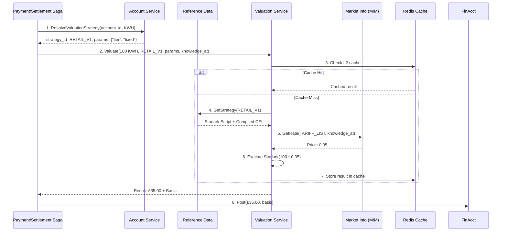

# PRD: Valuation Strategy Orchestrator (Valuation Service)

**Status:** Draft
**Version:** 1.0
**Task Master Tag:** `valuation-engine`
**Core ADR:** [ADR-0028: Starlark Saga Orchestration with CEL Valuation](../adr/0028-starlark-saga-cel-valuation.md)

## 1. Executive Summary

The Valuation Service is the "Calculated Truth" engine of Meridian. It executes transformation logic to
convert an input asset (`Quantity[A]`) into an output asset (`Quantity[B]`)—typically Monetary—based on a
strategy defined by the **destination account**.

Instead of a centralized price list, every account (Current or Internal) acts as a **Smart Contract**
that provides the formula and context for how it accepts value.

**Key Innovation:** This PRD codifies a shift from "Price is a number" to
**"Value is a Function of an Account."** We move the **responsibility of value** to the **Account**,
while the **Valuation Service** provides the **computational integrity**.

## 2. The Problem Statement

In a multi-asset ledger, the "Conversion Rate" is not a global constant.

| Scenario | Input | Destination Account | Valuation Logic |
|----------|-------|---------------------|-----------------|
| **Retail Energy** | 100 kWh | Consumer Current Account | Flat rate £0.35/kWh |
| **Wholesale Energy** | 100 kWh | DNO Internal Account | Spot Price (EPEX) * GSP |
| **Loyalty Reward** | 100 kWh | Marketing Expense Account | 1 Point per 10 kWh |
| **Foreign Exchange** | $100 USD | GBP Current Account | Market Mid-Rate + 2% Spread |

### Current Gaps

1. **Logic Hardcoding:** Changing a tariff requires code deployment.
2. **Context Loss:** We can't easily track *why* a specific rate was applied to a specific meter read.
3. **Scalability:** Centralizing all valuation math in one service creates a bottleneck.
4. **Audit Trail:** No clear provenance for how values were computed historically.

## 3. The "Account-as-a-Contract" Solution

We implement a **Two-Step Resolution Pattern**:

1. **Discovery (Account Service):** The Orchestrator asks the Account:
   *"What is your policy for this asset?"*
2. **Execution (Valuation Service):** The Orchestrator tells the Valuation Service:
   *"Execute this policy using this market data."*

### 3.1 Data Model: The Strategy Assignment

We extend `CurrentAccount` and `InternalBankAccount` to include a **Valuation Assignment**:

```sql
-- Added to Account/InternalAccount schemas
CREATE TABLE valuation_assignments (
    id UUID PRIMARY KEY DEFAULT gen_random_uuid(),
    account_id UUID NOT NULL,
    instrument_code VARCHAR(32) NOT NULL, -- e.g., 'KWH', 'USD', 'TONNE_CO2E'

    -- Reference to the logic in Reference Data service
    strategy_id UUID NOT NULL,            -- Points to a Starlark/CEL definition

    -- Local Context Parameters
    -- e.g., {"gsp": "P", "tier": "Gold", "markup": "0.02"}
    parameters JSONB NOT NULL DEFAULT '{}',

    -- Lifecycle
    active BOOLEAN NOT NULL DEFAULT true,

    -- Bi-temporal tracking
    valid_from TIMESTAMPTZ NOT NULL DEFAULT NOW(),
    valid_to TIMESTAMPTZ,

    created_at TIMESTAMPTZ NOT NULL DEFAULT NOW(),
    updated_at TIMESTAMPTZ NOT NULL DEFAULT NOW(),

    PRIMARY KEY (account_id, instrument_code),
    FOREIGN KEY (account_id) REFERENCES accounts(id) ON DELETE CASCADE
);

CREATE INDEX idx_valuation_assignments_strategy
    ON valuation_assignments(strategy_id)
    WHERE active = true;

CREATE INDEX idx_valuation_assignments_bitemporal
    ON valuation_assignments(account_id, valid_from, valid_to);
```

### 3.2 Valuation Strategy Definition

Strategies are stored in the Reference Data service:

```sql
-- Lives in Reference Data service (per-tenant schema)
CREATE TABLE valuation_strategies (
    id UUID PRIMARY KEY DEFAULT gen_random_uuid(),

    -- Identification
    name VARCHAR(64) NOT NULL,           -- "retail_energy_v1", "fx_gbp_usd"
    version INTEGER NOT NULL DEFAULT 1,

    -- Input/Output dimensions
    input_instrument VARCHAR(32) NOT NULL,  -- "KWH"
    output_instrument VARCHAR(32) NOT NULL, -- "GBP"

    -- Logic (Starlark script or CEL expression)
    logic_type VARCHAR(16) NOT NULL,     -- "STARLARK", "CEL"
    logic_script TEXT NOT NULL,
    logic_hash VARCHAR(64) NOT NULL,     -- SHA-256 for cache invalidation

    -- Lifecycle
    status VARCHAR(16) NOT NULL DEFAULT 'DRAFT',  -- DRAFT, ACTIVE, DEPRECATED

    -- Metadata
    description TEXT,
    created_at TIMESTAMPTZ NOT NULL DEFAULT NOW(),
    activated_at TIMESTAMPTZ,
    deprecated_at TIMESTAMPTZ,

    -- Bi-temporal for replay
    valid_from TIMESTAMPTZ NOT NULL DEFAULT NOW(),
    valid_to TIMESTAMPTZ,

    UNIQUE(name, version),
    CHECK (status IN ('DRAFT', 'ACTIVE', 'DEPRECATED')),
    CHECK (logic_type IN ('STARLARK', 'CEL')),
    CHECK (logic_script <> '')
);

CREATE INDEX idx_valuation_strategies_lookup
    ON valuation_strategies(input_instrument, output_instrument, status);

CREATE INDEX idx_valuation_strategies_bitemporal
    ON valuation_strategies(name, valid_from, valid_to);
```

## 4. Functional Requirements

### FR-1: Strategy Discovery RPC

**Requirement:** Every account-owning service MUST implement `ResolveValuationStrategy(account_id, instrument_code)`.

**Behavior:** Returns the `strategy_id` and the `parameters` JSON.

**Bi-Temporal:** Must respect `knowledge_at` (returns the strategy active at that historical moment).

```protobuf
service CurrentAccountService {
  rpc ResolveValuationStrategy(ResolveValuationStrategyRequest)
      returns (ResolveValuationStrategyResponse);
}

message ResolveValuationStrategyRequest {
  string account_id = 1;
  string instrument_code = 2;
  google.protobuf.Timestamp knowledge_at = 3;
}

message ResolveValuationStrategyResponse {
  string strategy_id = 1;
  google.protobuf.Struct parameters = 2;

  // Audit trail
  google.protobuf.Timestamp valid_from = 3;
  google.protobuf.Timestamp valid_to = 4;
}
```

### FR-2: Stateless Valuation Runtime

**Requirement:** The Valuation Service MUST be a stateless executor of Starlark/CEL.

**Input:** `InstrumentAmount` (Native), `StrategyID`, `Parameters` (from Account), `KnowledgeAt`.

**Output:** `InstrumentAmount` (Valued) + `ValuationBasis` (Audit trail).

**Performance Target:** < 10ms per valuation (including market data lookups).

### FR-3: Hierarchical Logic Execution

The engine executes logic in three tiers:

1. **Starlark (The Procedure):** Aggregates data, handles rounding logic and branching.
2. **CEL (The Policy):** Performs the high-speed numeric multiplication (~100ns).
3. **Market Data (The Fact):** Injects the bi-temporal rates (e.g., FX mid-rate).

**Execution Flow:**

```python
# Starlark wrapper (if logic_type = STARLARK)
def valuate_energy(input_quantity, params, knowledge_at):
    # 1. Fetch market data
    spot_price = market_data.get_price("EPEX_SPOT", knowledge_at)

    # 2. Get account-specific coefficient
    gsp_coefficient = params["gsp_coefficient"]

    # 3. Execute CEL calculation
    rate = cel_eval("spot * coeff * markup", {
        "spot": spot_price,
        "coeff": gsp_coefficient,
        "markup": 1.02  # 2% markup
    })

    # 4. Apply to quantity
    output_amount = input_quantity.amount * rate

    return {
        "amount": output_amount,
        "instrument": "GBP",
        "basis": {
            "spot_price": spot_price,
            "gsp_coefficient": gsp_coefficient,
            "final_rate": rate
        }
    }
```

### FR-4: Dimension Guard

**Requirement:** The system MUST prevent "Dimensional Leaks."

**Check:** If an account only accepts `Monetary` value, the Valuation Service must verify the
`strategy_id` results in a `Quantity[Monetary]` output.

**Implementation:** Pre-execution validation checks `input_instrument` and `output_instrument` against strategy definition.

### FR-5: Valuation Basis (The "Receipt")

**Requirement:** Every valuation result MUST include a **Basis**.

**Audit Trail:** Lists every `MarketPriceObservation.ID` and `Rate` used in the calculation.

**Integrity:** This basis is stored in the `PositionEntry` for future audits and reconciliation.

```protobuf
message ValuationBasis {
  // Strategy metadata
  string strategy_id = 1;
  string strategy_version = 2;

  // Rates applied
  map<string, string> applied_rates = 3;  // e.g. {"spot_price": "0.456", "markup": "1.02"}

  // Market data references
  repeated string observation_ids = 4;    // Link back to MarketInformation service

  // Execution context
  google.protobuf.Timestamp computed_at = 5;
  google.protobuf.Timestamp knowledge_at = 6;

  // Account context
  google.protobuf.Struct account_parameters = 7;
}
```

### FR-6: Caching Strategy

**L1 Cache (In-Memory):**

- Compiled CEL expressions
- Recently used valuation strategies
- TTL: 5 minutes
- Invalidated on `logic_hash` change

**L2 Cache (Redis):**

- Market data snapshots (per `knowledge_at`)
- Valuation results for identical inputs
- TTL: 1 hour
- Key format: `valuation:{strategy_id}:{input_hash}:{knowledge_at}`

### FR-7: Batch Valuation API

For high-throughput scenarios (settlement runs, bulk imports):

```protobuf
service ValuationService {
  rpc ValuateBatch(ValuateBatchRequest) returns (ValuateBatchResponse);
}

message ValuateBatchRequest {
  repeated ValuateRequest requests = 1;

  // Optional: Pre-fetch market data for this batch
  repeated string required_observation_ids = 2;
}

message ValuateBatchResponse {
  repeated ValuateResponse responses = 1;

  // Batch execution metadata
  int32 successful_count = 2;
  int32 failed_count = 3;
  string execution_time_ms = 4;
}
```

## 5. Technical Architecture

### 5.1 The gRPC Contract

```protobuf
syntax = "proto3";

package meridian.valuation.v1;

import "google/protobuf/timestamp.proto";
import "google/protobuf/struct.proto";
import "meridian/quantity/v1/quantity.proto";

service ValuationService {
  // Execute a valuation strategy
  rpc Valuate(ValuateRequest) returns (ValuateResponse);

  // Batch valuation for high-throughput scenarios
  rpc ValuateBatch(ValuateBatchRequest) returns (ValuateBatchResponse);

  // Validate a strategy (dry-run)
  rpc ValidateStrategy(ValidateStrategyRequest) returns (ValidateStrategyResponse);
}

message ValuateRequest {
  // The raw asset to value
  meridian.quantity.v1.InstrumentAmount input = 1;

  // The destination context (obtained from Account Service)
  string strategy_id = 2;
  google.protobuf.Struct parameters = 3;

  // Bi-temporal pinning
  google.protobuf.Timestamp knowledge_at = 4;

  // Optional: Provide cached market data to avoid lookups
  map<string, string> market_data_overrides = 5;
}

message ValuateResponse {
  // The resulting value (typically in settlement currency)
  meridian.quantity.v1.InstrumentAmount output = 1;

  // The "Receipt" for auditors
  ValuationBasis basis = 2;

  // Execution metadata
  string execution_time_ms = 3;
  bool cache_hit = 4;
}

message ValuationBasis {
  string strategy_id = 1;
  string strategy_version = 2;
  map<string, string> applied_rates = 3;
  repeated string observation_ids = 4;
  google.protobuf.Timestamp computed_at = 5;
  google.protobuf.Timestamp knowledge_at = 6;
  google.protobuf.Struct account_parameters = 7;
}

message ValuateBatchRequest {
  repeated ValuateRequest requests = 1;
  repeated string required_observation_ids = 2;
}

message ValuateBatchResponse {
  repeated ValuateResponse responses = 1;
  int32 successful_count = 2;
  int32 failed_count = 3;
  string execution_time_ms = 4;
}

message ValidateStrategyRequest {
  string strategy_id = 1;
  meridian.quantity.v1.InstrumentAmount sample_input = 2;
  google.protobuf.Struct sample_parameters = 3;
}

message ValidateStrategyResponse {
  bool valid = 1;
  repeated string errors = 2;
  repeated string warnings = 3;

  // If valid, show what the output would be
  meridian.quantity.v1.InstrumentAmount sample_output = 4;
}
```

### 5.2 The Workflow (Meridian Golden Path)



### 5.3 Service Structure

```text
services/valuation/
├── cmd/
│   └── valuation-service/
│       └── main.go
├── internal/
│   ├── domain/
│   │   ├── strategy.go          # Strategy domain model
│   │   ├── valuation.go         # Valuation result model
│   │   └── basis.go             # Audit basis model
│   ├── runtime/
│   │   ├── executor.go          # Main execution engine
│   │   ├── starlark_runtime.go  # Starlark VM wrapper
│   │   ├── cel_runtime.go       # CEL evaluator
│   │   └── builtins.go          # Built-in functions for Starlark
│   ├── cache/
│   │   ├── l1_cache.go          # In-memory cache
│   │   └── l2_cache.go          # Redis cache
│   ├── repository/
│   │   └── strategy_repository.go
│   └── service/
│       ├── valuation_service.go
│       └── handlers.go          # gRPC handlers
├── api/
│   └── proto/
│       └── valuation/
│           └── v1/
│               └── valuation.proto
└── tests/
    ├── integration/
    │   ├── valuation_test.go
    │   └── cache_test.go
    └── fixtures/
        └── strategies/
            ├── identity_usd.star
            ├── retail_energy.star
            └── fx_gbp_usd.star
```

### 5.4 Built-in Functions for Starlark

The valuation runtime provides these built-ins to Starlark scripts:

```go
// Runtime provides these functions to Starlark
type RuntimeBuiltins struct {
    // Market data lookups
    "market_data.get_price":     GetPriceBuiltin,
    "market_data.get_fx_rate":   GetFXRateBuiltin,
    "market_data.get_commodity": GetCommodityBuiltin,

    // CEL evaluation
    "cel_eval": CELEvalBuiltin,

    // Quantity operations
    "quantity.new":      NewQuantityBuiltin,
    "quantity.convert":  ConvertQuantityBuiltin,
    "quantity.multiply": MultiplyBuiltin,

    // Logging (for debugging strategies)
    "log.debug": LogDebugBuiltin,
    "log.info":  LogInfoBuiltin,
}
```

## 6. Implementation Streams

### Stream 1: Account Strategy Assignments (P0, 5 points)

**Tasks:**

1. Add `valuation_assignments` table to Current Account service
2. Add `valuation_assignments` table to Internal Bank Account service
3. Implement `ResolveValuationStrategy` gRPC method in Current Account
4. Implement `ResolveValuationStrategy` gRPC method in Internal Bank Account
5. Update Tenant Provisioning to seed default strategies (e.g., `USD_IDENTITY`)
6. Migration scripts for existing accounts

**Success Criteria:**

- All existing accounts have at least one valuation assignment (identity strategy)
- ResolveValuationStrategy returns correct strategy for known instrument codes
- Bi-temporal queries work correctly with `knowledge_at`

### Stream 2: Valuation Service Foundation (P0, 8 points)

**Tasks:**

1. Create service scaffolding (`services/valuation`)
2. Define proto contracts (`valuation/v1/valuation.proto`)
3. Implement basic gRPC server with health checks
4. Set up observability (metrics, logging, tracing)
5. Integrate with Reference Data client for strategy lookups
6. Implement L1 in-memory cache
7. Implement L2 Redis cache
8. Add comprehensive unit tests

**Success Criteria:**

- Service starts and passes health checks
- Can fetch strategies from Reference Data service
- Cache hit/miss metrics are emitted
- All cache operations have tests with >80% coverage

### Stream 3: CEL Runtime (P0, 5 points)

**Tasks:**

1. Implement CEL compiler wrapper with security constraints
2. Add CEL expression validation
3. Implement CEL builtins for financial operations (multiply, divide, round)
4. Add CEL expression cost limits (prevent DoS)
5. Implement result type checking (Dimension Guard)
6. Add CEL-specific tests and benchmarks

**Success Criteria:**

- Can compile and execute CEL expressions
- Expression cost limits prevent infinite loops
- Type mismatches are caught at compile time
- Benchmark shows <100ns execution time for simple expressions

### Stream 4: Starlark Runtime (P1, 8 points)

**Tasks:**

1. Implement Starlark VM wrapper with timeouts
2. Register built-in functions (market_data, cel_eval, quantity operations)
3. Implement deterministic execution (no time.now(), controlled randomness)
4. Add market data integration (Market Information client)
5. Implement valuation basis generation
6. Add Starlark-specific tests with golden files
7. Implement dry-run validation API
8. Add execution time monitoring and alerting

**Success Criteria:**

- Can execute Starlark scripts with all builtins
- Execution times out after 5 seconds
- Market data lookups respect `knowledge_at`
- Valuation basis includes all applied rates and observation IDs

### Stream 5: The "Identity" Strategy (P0, 3 points)

**Tasks:**

1. Implement identity strategy for fiat currencies (USD → USD)
2. Seed identity strategies for all major currencies (USD, EUR, GBP, NZD, AUD)
3. Register identity strategies in Reference Data during tenant provisioning
4. Add integration test proving fiat-to-fiat loop works
5. Document identity strategy pattern

**Success Criteria:**

- A withdrawal in USD generates identical postings as before (regression test)
- Identity strategy has 100% cache hit rate after warmup
- Valuation basis correctly records "identity" transformation

### Stream 6: Energy/Commodity Valuation (P1, 13 points)

**Tasks:**

1. Design wholesale energy strategy (Spot Price × GSP Coefficient)
2. Implement retail energy strategy (Fixed Tariff)
3. Add time-of-use (TOU) tariff support
4. Integrate with Market Information service for spot prices
5. Implement GSP lookup from account parameters
6. Add carbon credit valuation strategy
7. Add GPU-hour valuation strategy (AI compute)
8. Comprehensive integration tests for each asset type
9. Load testing (1000 valuations/second target)
10. Document strategy development guide

**Success Criteria:**

- Can value 100 kWh using wholesale spot price + GSP coefficient
- Can value 100 kWh using retail fixed tariff
- TOU tariff applies different rates based on time bands
- All asset types (energy, carbon, compute) have working strategies
- Performance target: <10ms per valuation, 1000/sec throughput

### Stream 7: Batch Valuation API (P2, 5 points)

**Tasks:**

1. Implement `ValuateBatch` RPC handler
2. Add parallel execution with worker pool
3. Optimize market data pre-fetching
4. Add batch execution metrics
5. Load test batch API (10,000 valuations per batch)
6. Document batch usage patterns

**Success Criteria:**

- Batch of 1000 valuations completes in <1 second
- Market data is pre-fetched once per batch
- Failures in one valuation don't block others
- Batch execution metrics show parallelism efficiency

### Stream 8: Integration with Payment/Settlement Sagas (P1, 8 points)

**Tasks:**

1. Add valuation step to withdrawal saga
2. Add valuation step to deposit saga
3. Add valuation step to settlement saga
4. Update Position Keeping to store valuation basis
5. Add valuation basis to audit logs
6. Implement valuation replay for historical positions
7. Add integration tests for end-to-end flows
8. Update operator runbooks

**Success Criteria:**

- All sagas that handle non-monetary assets call Valuation Service
- Position entries include valuation basis in attributes
- Can replay historical valuations using `knowledge_at`
- Audit logs show full valuation provenance

### Stream 9: Tenant Self-Service (P2, 13 points)

**Tasks:**

1. Design strategy editor UI (Starlark IDE)
2. Implement strategy validation API
3. Add dry-run simulator (test strategies before activation)
4. Implement strategy versioning and rollback
5. Add strategy approval workflow (draft → review → active)
6. Implement strategy impact analysis (show affected accounts)
7. Add strategy performance monitoring dashboard
8. Create strategy marketplace (share strategies between tenants)
9. Add comprehensive documentation for strategy authors
10. Implement governance controls (who can deploy strategies)

**Success Criteria:**

- Tenants can create new valuation strategies without Meridian deployment
- Dry-run API catches errors before activation
- Strategy versions can be rolled back in <5 minutes
- Strategy performance dashboard shows cache hit rates and execution times
- Documentation enables non-engineers to author simple strategies

## 7. Testing Strategy

### Unit Tests

- CEL expression compilation and evaluation
- Starlark script parsing and execution
- Cache hit/miss logic (L1 and L2)
- Strategy repository CRUD operations
- Dimension Guard validation

### Integration Tests

- End-to-end valuation with real Market Information data
- Account strategy resolution across service boundaries
- Bi-temporal valuation replay
- Cache invalidation on strategy updates
- Batch valuation with concurrent requests

### Performance Tests

- Single valuation latency: <10ms (p99)
- Batch valuation throughput: >1000/sec
- Cache hit rate: >95% after warmup
- CEL expression execution: <100ns
- Starlark script execution: <5ms

### Golden File Tests

- Regression detection for strategy outputs
- Store expected results for known inputs
- Validate outputs match across versions

### Chaos Tests

- Market Information service unavailable
- Reference Data service slow response
- Redis cache failure (L2 degradation)
- Concurrent cache updates

## 8. Success Metrics

1. **Zero Hardcoded Rates:** All conversion math moves to Starlark/CEL by end of Stream 6.
2. **Replay Parity:** Replaying a valuation from 1 year ago using `knowledge_at` produces the exact
   same result (±1 basis point).
3. **Tenant Autonomy:** A new tenant can implement a "Carbon Tax" strategy without a Meridian platform
   deployment (Stream 9).
4. **Performance:** 95th percentile valuation latency < 10ms under normal load.
5. **Cache Efficiency:** Cache hit rate >95% after 10-minute warmup period.
6. **Audit Compliance:** 100% of position entries include valuation basis with full provenance.

## 9. Deployment Considerations

### Rollout Strategy

1. **Phase 1 (Week 1-2):** Deploy Valuation Service with identity strategies only
   (Stream 1-3, 5)
2. **Phase 2 (Week 3-4):** Enable energy valuation strategies (Stream 6)
3. **Phase 3 (Week 5-6):** Integrate with all sagas, deprecate hardcoded logic (Stream 8)
4. **Phase 4 (Week 7+):** Enable tenant self-service and strategy marketplace (Stream 9)

### Monitoring and Alerting

**Metrics:**

- `valuation.requests.total` (counter by strategy_id, status)
- `valuation.duration_ms` (histogram by strategy_id)
- `valuation.cache_hit_rate` (gauge by cache_layer)
- `valuation.strategy_errors` (counter by strategy_id, error_type)
- `valuation.market_data_lookups` (counter by observation_type)

**Alerts:**

- P1: Valuation service unavailable (no successful requests in 5 minutes)
- P2: Valuation latency p99 > 50ms (performance degradation)
- P2: Cache hit rate < 70% (cache inefficiency)
- P3: Strategy execution errors > 1% of requests (buggy strategy)

### Disaster Recovery

#### Scenario: Valuation Service Down

- **Mitigation:** Sagas can defer valuation to async worker
- **Fallback:** Use last-known-good valuation from position history
- **Alert:** P1 escalation to on-call engineer

#### Scenario: Market Information Service Down

- **Mitigation:** Use cached market data (stale but better than nothing)
- **Fallback:** Use default rates from strategy parameters
- **Alert:** P2 escalation, automatic retry with exponential backoff

#### Scenario: Buggy Strategy Deployed

- **Mitigation:** Automatic rollback to previous version on error rate >10%
- **Fallback:** Disable strategy, use identity transformation
- **Alert:** P2 escalation, notify strategy author

## 10. Open Questions

1. **Cross-Currency Triangulation:** How do we handle currency pairs without direct market data (e.g., NZD/AUD via USD)?
   - **Proposed Answer:** Starlark script can compose multiple CEL lookups: `nzd_to_usd * usd_to_aud`

2. **Regulatory Compliance:** Do valuation strategies need regulatory approval before activation?
   - **Action:** Consult with compliance team on approval workflow requirements

3. **Strategy Licensing:** Can tenants monetize their strategies in the marketplace?
   - **Action:** Define commercial terms for strategy sharing (free, paid, revenue share)

4. **Multi-Tenant Data Isolation:** Should strategies be tenant-scoped or globally shared?
   - **Proposed Answer:** Strategies stored per-tenant (PostgreSQL schema-per-tenant), but marketplace allows copying

5. **Historical Market Data Retention:** How long do we keep market data for replay?
   - **Proposed Answer:** 7 years (regulatory standard for financial records)

## 11. Related Work

- [ADR-0028: Starlark Saga Orchestration with CEL Valuation](../adr/0028-starlark-saga-cel-valuation.md)
- [ADR-0013: Generic Asset Quantity Types](../adr/0013-generic-asset-quantity-types.md)
- [ADR-0014: Financial Instrument Reference Data](../adr/0014-financial-instrument-reference-data.md)
- [PRD: Universal Asset System](universal-asset-system.md)
- [PRD: Market Information Management](market-information-management.md)
- [PRD: Starlark Saga Orchestration Core](starlark-saga-orchestration-core.md)

## 12. Appendix: Example Strategies

### A. Identity Strategy (Fiat Currency)

```python
# strategy: identity_usd
# input: USD
# output: USD

def valuate(input_quantity, params, knowledge_at):
    """Identity transformation - 1:1 conversion."""
    return {
        "amount": input_quantity.amount,
        "instrument": input_quantity.instrument,
        "basis": {
            "strategy": "identity",
            "rate": "1.0"
        }
    }
```

### B. Retail Energy Strategy

```python
# strategy: retail_energy_v1
# input: KWH
# output: GBP

def valuate(input_quantity, params, knowledge_at):
    """Fixed tariff pricing for retail energy."""
    # Get tariff from account parameters
    tariff_rate = params.get("tariff_rate", 0.35)  # Default £0.35/kWh

    # Apply tariff
    output_amount = input_quantity.amount * tariff_rate

    return {
        "amount": output_amount,
        "instrument": "GBP",
        "basis": {
            "strategy": "retail_energy_v1",
            "tariff_rate": str(tariff_rate),
            "input_kwh": str(input_quantity.amount)
        }
    }
```

### C. Wholesale Energy Strategy (Complex)

```python
# strategy: wholesale_energy_v1
# input: KWH
# output: GBP

def valuate(input_quantity, params, knowledge_at):
    """Spot price + GSP coefficient for wholesale energy."""

    # 1. Get spot price from market data
    spot_price = market_data.get_price(
        instrument="EPEX_SPOT_GBP",
        knowledge_at=knowledge_at
    )

    # 2. Get GSP coefficient from account parameters
    gsp_zone = params.get("gsp_zone", "_P")
    gsp_coefficient = params.get("gsp_coefficient", 1.0)

    # 3. Apply markup (if any)
    markup = params.get("markup", 1.0)

    # 4. Calculate using CEL for precision
    final_rate = cel_eval("spot * coeff * markup", {
        "spot": spot_price.value,
        "coeff": gsp_coefficient,
        "markup": markup
    })

    # 5. Apply to quantity
    output_amount = input_quantity.amount * final_rate

    return {
        "amount": output_amount,
        "instrument": "GBP",
        "basis": {
            "strategy": "wholesale_energy_v1",
            "spot_price": str(spot_price.value),
            "spot_observation_id": spot_price.observation_id,
            "gsp_zone": gsp_zone,
            "gsp_coefficient": str(gsp_coefficient),
            "markup": str(markup),
            "final_rate": str(final_rate)
        }
    }
```

### D. Time-of-Use (TOU) Tariff Strategy

```python
# strategy: tou_energy_v1
# input: KWH
# output: GBP

def valuate(input_quantity, params, knowledge_at):
    """Time-of-use tariff with peak/off-peak rates."""

    # Extract time band from input attributes
    time_band = input_quantity.attributes.get("time_band", "OFFPEAK")

    # Get rates from account parameters
    peak_rate = params.get("peak_rate", 0.45)
    offpeak_rate = params.get("offpeak_rate", 0.25)

    # Select rate based on time band
    if time_band == "PEAK":
        rate = peak_rate
    else:
        rate = offpeak_rate

    # Apply rate
    output_amount = input_quantity.amount * rate

    return {
        "amount": output_amount,
        "instrument": "GBP",
        "basis": {
            "strategy": "tou_energy_v1",
            "time_band": time_band,
            "rate": str(rate),
            "input_kwh": str(input_quantity.amount)
        }
    }
```

---

**Gemini's Gut Check:** This architecture is "Particular" because the math is local to the account,
but "Universal" because the engine is generic. It prevents the system from becoming a bowl of spaghetti
as you add more assets.

**Next Steps:** Ready to move this into Task Master and start implementing Stream 1
(Account Strategy Assignments)?
