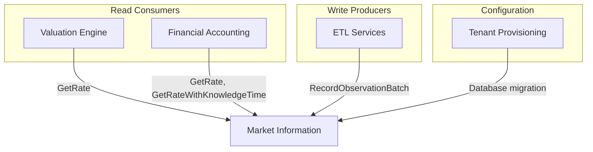

# Market Information Management - Cross-Service Integration Analysis

**Date:** 2026-01-20
**Service Version:** 1.0.0
**Implementation Tag:** market-information-management

## Overview

This document analyzes the integration points between Market Information Management and other
Meridian services, documenting the client library, integration patterns, and recommendations
for consuming services.

---

## Client Library Analysis

### Location

`services/market-information/client/client.go`

### Capabilities

| Feature | Status | Description |
|---------|--------|-------------|
| Point-in-time queries | IMPLEMENTED | `GetRate()` - Single observation lookup |
| Bi-temporal queries | IMPLEMENTED | `GetRateWithKnowledgeTime()` - Audit replay support |
| Single observation ingestion | IMPLEMENTED | `RecordObservation()` - Individual record |
| Batch ingestion | IMPLEMENTED | `RecordObservationBatch()` - Bulk operations |
| Dataset retrieval | IMPLEMENTED | `GetDataSet()` - Configuration lookup |
| List observations | IMPLEMENTED | `ListObservations()` - Paginated queries |
| Kubernetes DNS discovery | IMPLEMENTED | ServiceName-based connection |
| Circuit breaker | IMPLEMENTED | Via `clients.ResilientClient` |
| Retry with backoff | IMPLEMENTED | Configurable via `ResilientClientConfig` |
| Context propagation | IMPLEMENTED | Tenant ID, Correlation ID, Organisation |
| Distributed tracing | IMPLEMENTED | Optional `observability.Tracer` support |

### Usage Examples

#### Production Configuration (Kubernetes)

```go
import (
    "context"
    marketclient "github.com/meridianhub/meridian/services/market-information/client"
    "github.com/meridianhub/meridian/shared/pkg/clients"
)

func setupMarketInformationClient(ctx context.Context) (*marketclient.Client, func() error, error) {
    return marketclient.New(ctx, marketclient.Config{
        ServiceName: "market-information",
        Namespace:   "production",
        Port:        50051,
        Timeout:     30 * time.Second,
        Resilience:  clients.DefaultResilientClientConfig("my-service"),
    })
}
```

#### Development Configuration (Direct Address)

```go
client, cleanup, err := marketclient.New(ctx, marketclient.Config{
    Target:  "localhost:50051",
    Timeout: 5 * time.Second,
})
if err != nil {
    return err
}
defer cleanup()
```

#### Rate Lookup

```go
// Get current FX rate
obs, err := client.GetRate(ctx, "USD_EUR_FX", "spot", time.Now(),
    marketinformationv1.QualityLevel_QUALITY_LEVEL_ACTUAL)
if err != nil {
    if errors.Is(err, marketclient.ErrObservationNotFound) {
        // Handle missing rate
    }
    return err
}
rate := obs.Value // "1.0856"
```

#### Audit Replay (Bi-temporal Query)

```go
// What rate did we know on Dec 1 for trades on Nov 15?
knowledgeTime := time.Date(2024, 12, 1, 0, 0, 0, 0, time.UTC)
asOf := time.Date(2024, 11, 15, 0, 0, 0, 0, time.UTC)

obs, err := client.GetRateWithKnowledgeTime(ctx, "USD_EUR_FX", "spot",
    asOf, knowledgeTime, marketinformationv1.QualityLevel_QUALITY_LEVEL_ACTUAL)
```

#### Batch Ingestion

```go
entries := []*marketinformationv1.BatchObservationEntry{
    {
        DatasetCode:     "ELEC_TARIFF",
        ObservedAt:      timestamppb.Now(),
        ValidFrom:       timestamppb.New(startOfDay),
        Value:           "0.15",
        Quality:         marketinformationv1.QualityLevel_QUALITY_LEVEL_ACTUAL,
        SourceCode:      "GRID_OPERATOR",
        ClientReference: "tariff-001",
    },
    // ... more entries
}

resp, err := client.RecordObservationBatch(ctx, entries)
if err != nil {
    return err
}
fmt.Printf("Recorded %d/%d observations\n", resp.SuccessCount, resp.TotalCount)
```

---

## Integration Patterns by Consuming Service

### 1. Valuation Engine (Future)

**Use Case:** FX rate lookups for multi-currency position valuation

**Integration Pattern:**

```text
Valuation Engine                  Market Information
     |                                    |
     |-- GetRate(USD_EUR_FX) ----------->|
     |<-- Observation (1.0856) ----------|
     |                                    |
     |-- Apply rate to positions --------|
```

**Requirements:**

- Point-in-time queries for end-of-day valuation
- Minimum quality threshold: ACTUAL or VERIFIED
- Fallback strategy for missing rates

**Recommended Implementation:**

```go
func (v *ValuationEngine) getExchangeRate(
    ctx context.Context, base, quote string, asOf time.Time,
) (decimal.Decimal, error) {
    resolutionKey := fmt.Sprintf("%s/%s", base, quote)
    datasetCode := "FX_RATE"

    obs, err := v.marketClient.GetRate(ctx, datasetCode, resolutionKey, asOf,
        marketinformationv1.QualityLevel_QUALITY_LEVEL_ACTUAL)
    if err != nil {
        if errors.Is(err, marketclient.ErrObservationNotFound) {
            // Try inverse pair
            inverseKey := fmt.Sprintf("%s/%s", quote, base)
            obs, err = v.marketClient.GetRate(ctx, datasetCode, inverseKey, asOf,
                marketinformationv1.QualityLevel_QUALITY_LEVEL_ACTUAL)
            if err != nil {
                return decimal.Zero, fmt.Errorf("no FX rate found for %s or inverse", resolutionKey)
            }
            // Return inverse
            rate, _ := decimal.NewFromString(obs.Value)
            return decimal.NewFromInt(1).Div(rate), nil
        }
        return decimal.Zero, err
    }

    rate, err := decimal.NewFromString(obs.Value)
    if err != nil {
        return decimal.Zero, fmt.Errorf("invalid rate value: %w", err)
    }
    return rate, nil
}
```

### 2. Financial Accounting

**Use Case:** FX translation for multi-currency journals

**Integration Pattern:**

```text
Financial Accounting              Market Information
     |                                    |
     |-- Journal entry (USD) ------------>|
     |                                    |
     |-- GetRate(USD_GBP_FX) ----------->|
     |<-- Observation (0.79) ------------|
     |                                    |
     |-- Create GBP translation ---------|
```

**Requirements:**

- Historical rate queries for journal translation
- Consistent rates within an accounting period
- Audit trail for rate selection

**Recommended Implementation:**

```go
func (fa *FinancialAccounting) translateJournal(ctx context.Context, journal Journal) (Journal, error) {
    if journal.Currency == fa.functionalCurrency {
        return journal, nil
    }

    // Use journal date for rate lookup
    rate, err := fa.getRateForDate(ctx, journal.Currency, fa.functionalCurrency, journal.PostingDate)
    if err != nil {
        return Journal{}, fmt.Errorf("FX translation failed: %w", err)
    }

    translated := journal.Clone()
    translated.Amount = journal.Amount.Mul(rate)
    translated.Currency = fa.functionalCurrency
    translated.FXRate = rate
    translated.FXRateDate = journal.PostingDate

    return translated, nil
}
```

### 3. Tenant Provisioning Service

**Use Case:** Seed default market data datasets for new tenants

**Integration Pattern:**

```text
Tenant Provisioning               Market Information
     |                                    |
     |-- Create tenant schema ----------->|
     |                                    |
     |-- Copy shared datasets ----------->|  (via DB migration)
     |                                    |
     |-- Grant data entitlements -------->|
```

**Requirements:**

- Shared datasets available to all tenants (FX_RATE, ENERGY_SPOT)
- Tenant-specific datasets isolated
- Entitlement-based access for RESTRICTED datasets

**Implementation Notes:**

- Dataset copying happens at database level via `is_shared` flag
- Entitlements managed via `tenant_data_entitlements` table
- No direct client library calls needed during provisioning

### 4. ETL/Ingestion Services

**Use Case:** Bulk data loading from external sources

**Integration Pattern:**

```text
ETL Service                       Market Information
     |                                    |
     |-- Fetch external data ------------>|
     |                                    |
     |-- Transform to observations ------>|
     |                                    |
     |-- RecordObservationBatch() ------->|
     |<-- BatchResults (success/fail) ----|
     |                                    |
     |-- Handle failures (retry/DLQ) ---->|
```

**Requirements:**

- High-throughput batch ingestion (target: 1000 obs/sec)
- Idempotent recording (same observation twice is safe)
- Error handling with partial success

**Recommended Implementation:**

```go
func (etl *ETLService) ingestBatch(ctx context.Context, records []ExternalRecord) error {
    // Transform to batch entries
    entries := make([]*marketinformationv1.BatchObservationEntry, 0, len(records))
    for _, r := range records {
        entry := etl.transformToEntry(r)
        if entry != nil {
            entries = append(entries, entry)
        }
    }

    if len(entries) == 0 {
        return nil
    }

    // Batch in chunks of 1000
    const batchSize = 1000
    for i := 0; i < len(entries); i += batchSize {
        end := i + batchSize
        if end > len(entries) {
            end = len(entries)
        }

        chunk := entries[i:end]
        resp, err := etl.marketClient.RecordObservationBatch(ctx, chunk)
        if err != nil {
            return fmt.Errorf("batch ingestion failed at chunk %d: %w", i/batchSize, err)
        }

        if resp.FailureCount > 0 {
            etl.handlePartialFailure(resp.Results)
        }
    }

    return nil
}
```

---

## Dependency Graph



---

## Error Handling Recommendations

### Client Errors

| Error | Cause | Recommended Action |
|-------|-------|-------------------|
| `ErrObservationNotFound` | No matching observation | Fallback to default/alternative |
| `ErrNilRequest` | Nil request object | Fix caller code |
| `ErrEmptyObservations` | Empty batch array | Validate before calling |
| `codes.InvalidArgument` | Validation failure | Log and skip invalid record |
| `codes.Unavailable` | Service unreachable | Retry with backoff |
| `codes.DeadlineExceeded` | Timeout | Retry with longer timeout |

### Resilience Configuration

```go
// Recommended resilience config for market data consumers
cfg := clients.ResilientClientConfig{
    Name:               "market-information",
    MaxRetries:         3,
    InitialInterval:    100 * time.Millisecond,
    MaxInterval:        2 * time.Second,
    Multiplier:         2.0,
    MaxElapsedTime:     30 * time.Second,
    FailureRateToOpen:  0.5,  // Open circuit after 50% failure
    CoolDownPeriod:     10 * time.Second,
    HalfOpenMaxCalls:   3,
}
```

---

## Performance Considerations

### Caching Strategy

For high-frequency rate lookups, implement local caching:

```go
type CachedMarketClient struct {
    client *marketclient.Client
    cache  *lru.Cache[string, cachedObservation]
    ttl    time.Duration
}

func (c *CachedMarketClient) GetRate(
    ctx context.Context, dataset, key string, asOf time.Time, quality marketinformationv1.QualityLevel,
) (*marketinformationv1.MarketPriceObservation, error) {
    cacheKey := fmt.Sprintf("%s:%s:%d:%d", dataset, key, asOf.Unix(), quality)

    if cached, ok := c.cache.Get(cacheKey); ok && time.Since(cached.fetchedAt) < c.ttl {
        return cached.observation, nil
    }

    obs, err := c.client.GetRate(ctx, dataset, key, asOf, quality)
    if err != nil {
        return nil, err
    }

    c.cache.Add(cacheKey, cachedObservation{
        observation: obs,
        fetchedAt:   time.Now(),
    })

    return obs, nil
}
```

### Batch Size Optimisation

| Use Case | Recommended Batch Size | Rationale |
|----------|----------------------|-----------|
| Real-time ingestion | 100-500 | Balance latency and throughput |
| Bulk historical load | 1000 | Maximise throughput |
| ETL pipelines | 500-1000 | Depends on source system |

---

## Security Considerations

### Tenant Isolation

- All queries respect tenant context from `ctx`
- Shared datasets use hierarchical lookup (tenant-first, then master)
- RESTRICTED datasets require explicit entitlements

### Context Propagation

The client automatically propagates:

- `x-tenant-id` - Tenant isolation
- `x-correlation-id` - Distributed tracing
- `x-organization-id` - Organisation context

### mTLS

In production, configure TLS transport credentials:

```go
creds, err := credentials.NewClientTLSFromFile(certFile, serverName)
if err != nil {
    return err
}

client, cleanup, err := marketclient.New(ctx, marketclient.Config{
    ServiceName: "market-information",
    Namespace:   "production",
    DialOptions: []grpc.DialOption{
        grpc.WithTransportCredentials(creds),
    },
})
```

---

## Monitoring Integration Points

### Key Metrics to Monitor

| Metric | Alert Threshold | Impact |
|--------|-----------------|--------|
| `market_information_client_latency_p99` | > 100ms | Valuation delays |
| `market_information_client_error_rate` | > 1% | Rate lookup failures |
| `market_information_circuit_open` | > 0 | Service degradation |
| `market_information_cache_hit_rate` | < 80% | Excessive DB load |

### Distributed Tracing

Enable tracing by passing a configured tracer:

```go
tracer, err := observability.NewTracer(ctx, "my-service", observability.TracerConfig{
    Endpoint: "otel-collector:4317",
})

client, cleanup, err := marketclient.New(ctx, marketclient.Config{
    ServiceName: "market-information",
    Tracer:      tracer,
})
```

---

## Migration Path for New Consumers

### Step 1: Add Dependency

```go
import marketclient "github.com/meridianhub/meridian/services/market-information/client"
```

### Step 2: Initialize Client

```go
func NewService(cfg Config) (*Service, error) {
    marketClient, cleanup, err := marketclient.New(context.Background(), marketclient.Config{
        ServiceName: "market-information",
        Namespace:   cfg.K8sNamespace,
        Resilience:  clients.DefaultResilientClientConfig(cfg.ServiceName),
    })
    if err != nil {
        return nil, fmt.Errorf("market information client: %w", err)
    }

    return &Service{
        marketClient: marketClient,
        cleanup:      cleanup,
    }, nil
}
```

### Step 3: Implement Graceful Shutdown

```go
func (s *Service) Shutdown(ctx context.Context) error {
    if s.cleanup != nil {
        return s.cleanup()
    }
    return nil
}
```

---

Generated as part of Market Information Management Meta-Review (Task 11.3)
