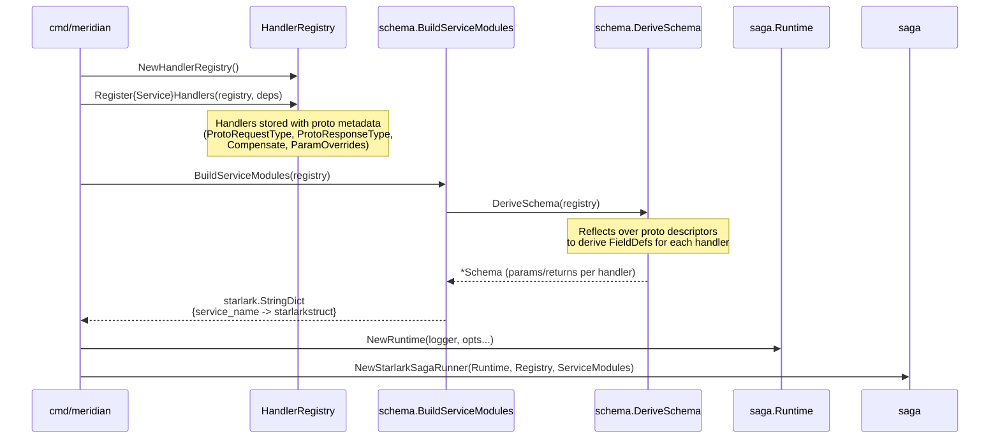
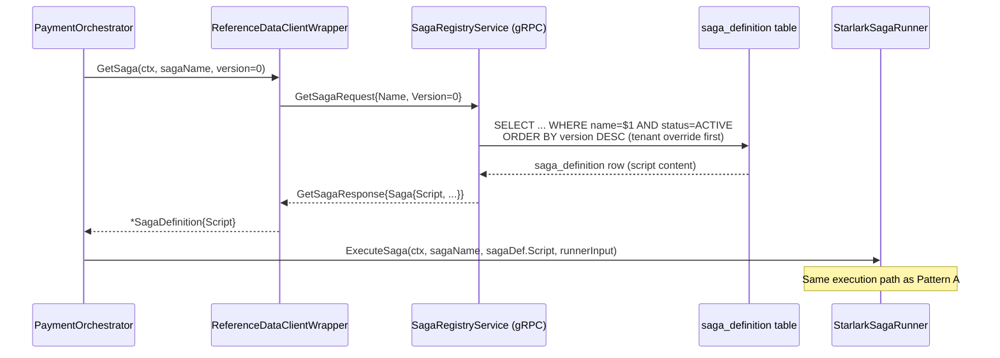
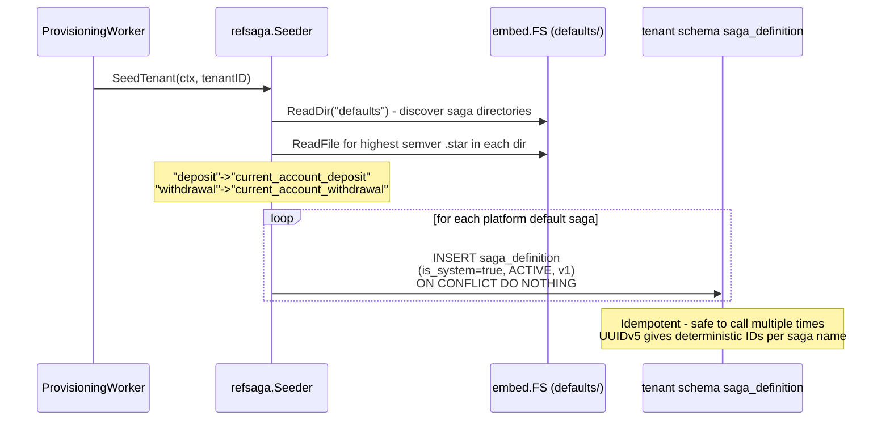
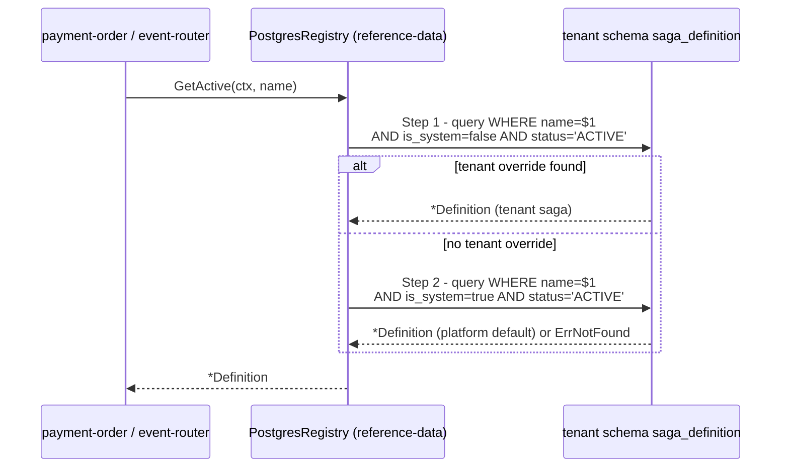

# Saga Handler Loading

## Why this document exists

Starlark saga scripts and their handler bindings are invisible to standard Go import-graph tools. There are
no `import` statements to follow: saga scripts live in the database (per-tenant `saga_definition` table),
handler registries are built at startup by explicit registration calls, and the connection between a script
name and its Go implementation is established through thread-local storage at execution time.

This document maps that loading flow so that contributors can reason about the full chain from a `.star` file
to an executed Go handler.

---

## Loading Flow

The flow has two phases: startup (handler registration + service module construction) and per-request
(saga script retrieval + execution).

### Startup Phase



### Per-Request Execution Phase

Two patterns exist depending on the calling service.

#### Pattern A - current-account (script loaded from filesystem at startup)

```mermaid
sequenceDiagram
    participant Orch as DepositOrchestrator
    participant SR as StarlarkSagaRunner
    participant RT as saga.Runtime
    participant HW as HandlerWrapper (Starlark builtin)
    participant GH as Go Handler

    Orch->>SR: ExecuteSaga(ctx, "current_account_deposit", script, input)
    SR->>SR: buildStarlarkContext(ctx, input)
    SR->>SR: buildPredeclaredModules() - injects serviceModules
    SR->>RT: ExecuteSagaWithInput(ctx, name, script, ExecutionInput)
    Note over RT: Validates script size (<=64 KB)<br/>5s timeout<br/>Predeclared: input_data, builtins, service modules

    RT->>RT: starlark.ExecFile(thread, script, predeclared)
    Note over RT: Script body runs; calls service module methods

    RT->>HW: position_keeping.initiate_log(account_id=..., amount=...)
    HW->>HW: authorizeHandlerInvocation(RBAC check)
    HW->>HW: CoerceParams + ValidateParams (schema check)
    HW->>GH: handler(StarlarkContext, params)
    GH-->>HW: result map[string]any
    HW->>HW: trackStepResult (for compensation)
    HW-->>RT: starlarkstruct.Struct (typed result)

    RT-->>SR: ExecutionResult{Globals}
    SR-->>Orch: *RunnerOutput{Success, Output, StepResults}
```

#### Pattern B - payment-order (script fetched from reference-data gRPC at request time)



---

## Validation Rules

### Compile-time (Starlark parser, applied at `starlark.ExecFile`)

| Rule | Enforced By | Detail |
|------|-------------|--------|
| Starlark syntax | Starlark parser | Standard Starlark grammar; syntax errors produce `ErrSyntax` |
| No `while` loops | Starlark language | Starlark has no `while` statement; only `for` over finite iterables |
| No recursion | Starlark language | Starlark does not permit recursive function calls |
| No `import` | Starlark language | Starlark has no module import mechanism; service modules are pre-injected as predeclared globals |
| Script size | `sandbox.ValidateScript` | Maximum 64 KB; returns `ErrScriptTooLarge` before execution begins |

### Runtime (applied per handler call during script execution)

| Rule | Enforced By | Location |
|------|-------------|----------|
| Execution timeout | `context.WithTimeout` in `Runtime` | 5 s default; `ErrTimeout` on breach |
| Positional args rejected | `wrapHandler` | Handler calls must use keyword arguments only |
| Required params present | `HandlerDef.ValidateParams` | `ErrMissingParam` for absent required fields |
| Type coercion | `schema.CoerceParams` | Converts Starlark strings to `Decimal`, enums validated against schema |
| RBAC authorization | `authorizeHandlerInvocation` | Checks `Claims.HasScope` / `HasRole` for handlers with `resource_type` + `required_permission` declared; system sagas (no Claims on context) bypass this check |
| CEL preconditions | `saga.Definition.PreconditionsExpression` | Evaluated before script execution by callers that set this field on the definition |

### Schema build-time (applied once at startup in `BuildServiceModules`)

| Rule | Enforced By | Detail |
|------|-------------|--------|
| Handler present in registry | `buildServiceStruct` | `ErrHandlerMissingFromRegistry` if schema names a handler not in `HandlerRegistry` |
| No naming conflicts | `handlerTree.validate` | `ErrNamingConflict` if a name is used as both a handler and a namespace |
| Complete RBAC metadata | `BuildServiceModulesFromSchema` | `ErrPartialRBACMetadata` if only one of `resource_type` / `required_permission` is set |

---

## Storage Locations

| Artifact | Location | Loaded By |
|----------|----------|-----------|
| Platform default saga scripts | `services/reference-data/saga/defaults/<name>/v<semver>.star` | `Seeder.SeedTenant` via `embed.FS` at tenant provisioning |
| Tenant saga scripts | `saga_definition` table (per-tenant schema) | `SagaRegistryService.GetSaga` gRPC RPC |
| Handler schemas | `shared/pkg/saga/schema/handlers.yaml` (embedded) | `schema.BuildServiceModules` via `DeriveSchema` (proto reflection) |
| current-account scripts at startup | Filesystem path under `SAGA_ASSET_DIR` or executable dir | `loadSagaAsset` in `services/current-account/service/server.go` |

---

## Bootstrap Flow - Platform Default Sagas

Platform default sagas are seeded into every tenant schema during provisioning, not at binary startup.



The `ProvisioningWorker` registers this as hook `"saga-definitions"` (step 3 of 6 in
`startProvisioningWorker`), running after instrument seeding but before account-type blueprints.

---

## Tenant Override Flow

When a tenant creates a custom saga with the same name as a platform default, the registry applies tenant
resolution at retrieval time.



Tenant sagas have `is_system=false`. System sagas have `is_system=true` and are read-only - the registry
returns `ErrSystemSagaReadOnly` for any mutation attempt on them.

---

## Key Types and Entry Points

| Symbol | File | Role |
|--------|------|------|
| `StarlarkSagaRunner` | `shared/pkg/saga/starlark_runner.go` | Orchestrates execution: builds context, injects modules, runs compensation |
| `Runtime` | `shared/pkg/saga/runtime.go` | Low-level Starlark execution with timeout, size limits, predeclared builtins |
| `HandlerRegistry` | `shared/pkg/saga/handlers.go` | In-memory map of handler name to Go `Handler` func + `HandlerMetadata` |
| `BuildServiceModules` | `shared/pkg/saga/schema/service_modules.go` | Converts registry + proto schema into `starlark.StringDict` of typed service structs |
| `DeriveSchema` | `shared/pkg/saga/schema/derive.go` | Reflects proto descriptors to build `FieldDef` maps for params/returns |
| `Seeder` | `services/reference-data/saga/seeder.go` | Copies embedded `.star` files into tenant `saga_definition` rows at provisioning |
| `Registry` interface | `services/reference-data/saga/registry.go` | Defines `GetActive`, `CreateDraft`, `ActivateSaga`, etc. for the reference-data service |
| `handlers.yaml` | `shared/pkg/saga/schema/handlers.yaml` | Canonical handler schema: descriptions, compensation relationships, proto references |
