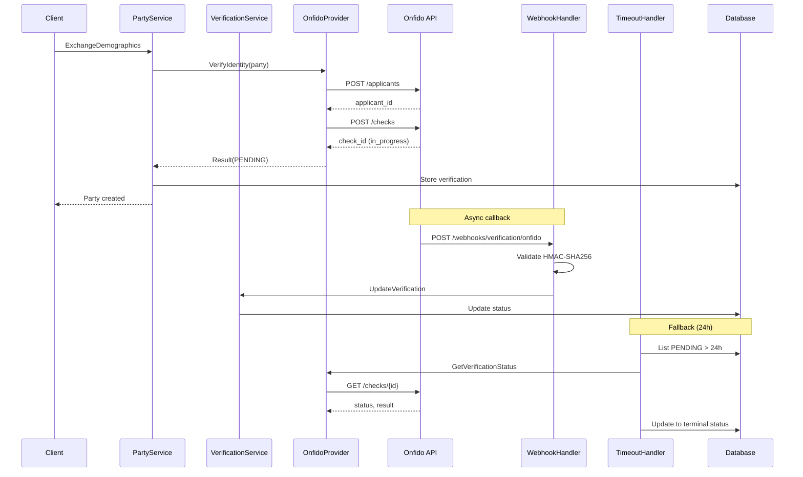

# KYC/AML Verification Developer Guide

This guide covers the architecture, extension points, and testing
approach for the Party service's KYC/AML verification system.

## Architecture Overview

The verification system follows a provider-adapter pattern. The
`Provider` interface abstracts external KYC services, the webhook
handler receives asynchronous results, and the timeout handler
resolves stuck verifications.



### Key Components

| Component | Location |
|-----------|----------|
| `Provider` interface | `verification/provider.go` |
| `OnfidoProvider` | `verification/onfido_provider.go` |
| `MockProvider` | `verification/mock_provider.go` |
| Provider factory | `verification/factory.go` |
| `VerificationConfig` | `config/verification.go` |
| `VerificationService` | `service/verification_service.go` |
| Webhook handler | `adapters/http/verification_webhook.go` |
| `TimeoutHandler` | `verification/timeout_handler.go` |
| Verification repo | `adapters/persistence/verification_repository.go` |
| Main wiring | `cmd/main.go` |

All paths are relative to `services/party/`.

## Adding a New Provider

To add a new verification provider (e.g., Jumio):

### 1. Implement the Provider Interface

Create `services/party/verification/jumio_provider.go`:

```go
package verification

import (
    "context"
    "errors"
    "log/slog"

    "github.com/meridianhub/meridian/services/party/config"
    "github.com/meridianhub/meridian/services/party/domain"
)

type JumioProvider struct {
    apiKey  string
    baseURL string
    // ...
}

// Compile-time interface check
var _ Provider = (*JumioProvider)(nil)

func NewJumioProvider(
    cfg *config.VerificationConfig,
    logger *slog.Logger,
) (*JumioProvider, error) {
    apiKey := cfg.ProviderConfig["api_key"]
    if apiKey == "" {
        return nil, errors.New("jumio: api_key is required")
    }
    // ...
}

func (p *JumioProvider) VerifyIdentity(
    ctx context.Context,
    party *domain.Party,
) (Result, error) {
    // Call Jumio API, return Result with VerificationID
}

func (p *JumioProvider) CheckSanctions(
    ctx context.Context,
    party *domain.Party,
) (SanctionsResult, error) {
    // Call Jumio screening API
}

func (p *JumioProvider) GetVerificationStatus(
    ctx context.Context,
    verificationID string,
) (Result, error) {
    // Poll Jumio for check status
}
```

The three interface methods:

- **`VerifyIdentity`**: Creates an applicant/subject and initiates
  an identity check. Returns a `Result` with a `VerificationID`
  that the provider uses to track the check.
- **`CheckSanctions`**: Initiates a sanctions/watchlist screening.
  Returns a `SanctionsResult` with match details.
- **`GetVerificationStatus`**: Retrieves the current status of a
  previously initiated check (used by the timeout handler).

### 2. Register in the Factory

Update `services/party/verification/factory.go`:

```go
case "jumio":
    return NewJumioProvider(cfg, slog.Default())
```

The factory already has a `"jumio"` stub that returns
`ErrUnsupportedProvider`. Replace it with the actual constructor.

### 3. Update Config Validation

The `SupportedProviders` list in
`services/party/config/verification.go` already includes `"jumio"`.
If adding a different provider, add it to the list:

```go
var SupportedProviders = []string{
    "mock", "jumio", "onfido", "your_provider",
}
```

### 4. Configure Webhook Secret

If the new provider uses a different webhook secret, the
`VerificationWebhookHandler` supports per-provider secrets via the
`HMACSecrets` map:

```go
HMACSecrets: map[string][]byte{
    "onfido": []byte(onfidoSecret),
    "jumio":  []byte(jumioSecret),
},
```

The handler extracts the provider name from the URL path
(`/webhooks/verification/{provider}`) and looks up the
corresponding secret. If not found, it falls back to the
`"default"` key.

## Webhook Signature Validation

The webhook handler uses HMAC-SHA256 to verify incoming requests:

1. The provider sends the request body with an
   `X-Webhook-Signature` header containing a hex-encoded
   HMAC-SHA256 hash
2. The handler computes `HMAC-SHA256(request_body, shared_secret)`
   and hex-encodes the result
3. The two values are compared using `hmac.Equal` (constant-time
   comparison to prevent timing attacks)

### Replay Protection

The handler validates the `timestamp` field in the webhook payload:

- Rejects timestamps older than 5 minutes
  (`DefaultWebhookMaxAge`)
- Rejects timestamps more than 30 seconds in the future
  (`DefaultClockDriftTolerance`)

### Idempotency

If a webhook arrives for a verification already in a terminal state
(`APPROVED`, `REJECTED`, `MANUAL_REVIEW`), the handler returns
HTTP 200 with `"webhook already processed"` without modifying the
record. This handles provider retries gracefully.

## Testing

### Unit Tests

Unit tests use the `MockProvider` which supports two modes:

**Synchronous mode** (default): Returns a final status immediately.

```go
provider := verification.NewMockProvider().
    WithAlwaysApprove(true)
result, err := provider.VerifyIdentity(ctx, party)
// result.Status == APPROVED
```

**Asynchronous mode**: Returns `PENDING` initially, transitions to
final status after the configured delay.

```go
provider := verification.NewMockProvider().
    WithAsyncMode(true).
    WithSimulatedDelay(100 * time.Millisecond)

result, _ := provider.VerifyIdentity(ctx, party)
// result.Status == PENDING

time.Sleep(150 * time.Millisecond)
status, _ := provider.GetVerificationStatus(
    ctx, result.VerificationID,
)
// status.Status == APPROVED
```

### Webhook Handler Tests

Test the webhook handler by constructing signed requests using the
`GenerateWebhookSignature` helper:

```go
body, _ := json.Marshal(
    httpAdapter.VerificationWebhookRequest{
        VerificationID: "test-check-id",
        Status:         "APPROVED",
        RiskScore:      float64Ptr(0.1),
        Timestamp:      time.Now().UTC(),
    },
)

signature := httpAdapter.GenerateWebhookSignature(
    body, []byte("test-secret"),
)

req := httptest.NewRequest(
    http.MethodPost,
    "/webhooks/verification/onfido",
    bytes.NewReader(body),
)
req.Header.Set("X-Webhook-Signature", signature)
req.Header.Set("Content-Type", "application/json")
```

### Integration Tests

Integration tests live in
`services/party/verification/integration_test.go` and use
CockroachDB testcontainers for database operations. They test the
full flow from verification creation through webhook update.

### Manual Testing with Onfido Sandbox

Onfido provides a sandbox environment for testing without real
identity documents:

1. Set `VERIFICATION_BASE_URL` to the Onfido sandbox URL (or omit
   to use the default, which works with sandbox API tokens)
2. Use sandbox API tokens from the Onfido dashboard
3. Create applicants with Onfido's test names to trigger specific
   outcomes:
   - Standard names return `clear` results
   - Specific test names trigger `consider` or rejection results
     (refer to Onfido sandbox documentation)

### Running Tests

```bash
# Unit tests for verification package
cd services/party
go test ./verification/... -v

# Unit tests for webhook handler
go test ./adapters/http/... -v

# Unit tests for verification service
go test ./service/... -v -run TestVerification

# Integration tests (requires Docker for testcontainers)
go test ./verification/... -v -run Integration
```

## Common Pitfalls

**Onfido requires a last name**: The `splitName` function in
`onfido_provider.go` handles single-word names by using `"-"` as
the last name, since Onfido's API requires both fields.

**Webhook body modification**: If a reverse proxy or middleware
modifies the request body (e.g., re-encoding JSON), the HMAC
signature will not match. Ensure the raw body reaches the handler
unchanged.

**Optimistic locking on updates**: The verification repository uses
a `version` column for optimistic locking.
`UpdateVerificationStatus` requires the current version and
increments it. Concurrent updates to the same verification will
fail with a conflict, which is the intended behaviour to prevent
race conditions between webhook delivery and timeout handler.

**Webhook max body size**: The handler limits request body reads to
1 MB (`1 << 20` bytes). Onfido payloads are well within this
limit, but custom providers with large metadata payloads may need
adjustment.

**Event publisher is optional**: The `VerificationService` accepts
a nil `eventPublisher`. When nil, no events are emitted on status
transitions. This is the current state -- event publishing will be
wired when the outbox pattern integration is complete.

**Mock provider in production**: The config validator rejects
`VERIFICATION_PROVIDER=mock` when `ENVIRONMENT` is `production` or
`prod`. This prevents accidental deployment with the test provider.
