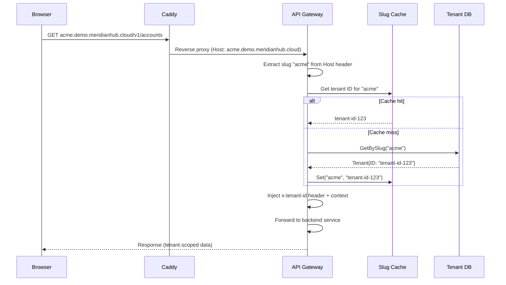
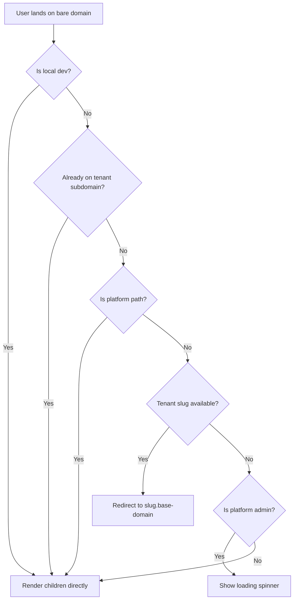

# Tenant Subdomain Routing

## Overview

Meridian uses subdomain-based routing to isolate tenant contexts in
production. Each tenant is assigned a unique slug (e.g., `acme`) that
becomes a subdomain of the base domain
(e.g., `acme.demo.meridianhub.cloud`). This provides:

- **Security isolation**: The API gateway resolves the tenant from the
  hostname before any application code runs, preventing cross-tenant
  access at the HTTP layer.
- **Backend routing**: The gateway middleware extracts the slug from
  the subdomain, resolves it to a tenant ID via cache or database,
  and injects the tenant ID into the request context.
- **Tenant context propagation**: The frontend reads the subdomain to
  determine which tenant's data to display, and constructs API URLs
  accordingly.

In local development, subdomains are not available. The frontend falls
back to an `X-Tenant-Slug` header, and the gateway accepts this header
when `LOCAL_DEV_MODE=true`.

## Architecture



### Component Responsibilities

<!-- markdownlint-disable MD013 -->

| Component | File | Role |
|-----------|------|------|
| Caddy | `deploy/demo/Caddyfile` | Terminates TLS for `*.demo.meridianhub.cloud`, routes API paths to gateway |
| TenantResolverMiddleware | `shared/platform/gateway/tenant_resolver.go` | Extracts slug from `Host` header, resolves to tenant ID |
| TenantSubdomainEnforcer | `frontend/src/components/routing.tsx` | Redirects browser to tenant subdomain when tenant is selected |
| TenantContext | `frontend/src/contexts/tenant-context.tsx` | Provides `tenantSlug` to React tree |
| API config | `frontend/src/api/config.ts` | Detects tenant subdomain; builds tenant-scoped URLs |
| Transport | `frontend/src/api/transport.ts` | Creates ConnectRPC transport with correct base URL |
| Tenant interceptor | `frontend/src/api/interceptors/tenant-interceptor.ts` | Attaches `X-Tenant-Slug` header to requests |

<!-- markdownlint-enable MD013 -->

## Post-Login Redirect Flow

After OIDC login, the user lands on the bare domain
(`demo.meridianhub.cloud`). The `TenantSubdomainEnforcer` component
handles the redirect:



Platform paths exempt from redirect: `/login`, `/tenants`,
`/platform`, `/users`.

### Where the tenant slug comes from

| User type | Source | Details |
|-----------|--------|---------|
| Tenant user | JWT claims (`tenantId`) | Fixed at login |
| Platform admin | Manual selection | Via `TenantContext.switchTenant()` |

### Redirect mechanics

The redirect is performed in `TenantSubdomainEnforcer`
(`routing.tsx:84-136`):

1. Compute the target hostname: `{tenantSlug}.{baseDomain}`
   (e.g., `acme.demo.meridianhub.cloud`)
2. Preserve the current pathname, search params, and hash
3. Trigger `window.location.assign(targetUrl)` via a `useEffect`

## API URL Construction

Once the browser is on a tenant subdomain, API calls are routed to the
same origin. The transport layer (`frontend/src/api/transport.ts`)
determines the base URL:

<!-- markdownlint-disable MD013 -->

| Condition | Base URL | Tenant identification |
|-----------|----------|----------------------|
| On tenant subdomain | `window.location.origin` | Subdomain (gateway extracts slug from Host) |
| Local dev / demo mode | `VITE_API_BASE_URL` | `X-Tenant-Slug` header |
| Production, no subdomain | `{slug}.{baseDomain}` | Subdomain |

<!-- markdownlint-enable MD013 -->

### Subdomain detection

`isOnTenantSubdomain()` in `frontend/src/api/config.ts` compares
hostname segment counts:

```text
Base URL hostname:    demo.meridianhub.cloud      (3 segments)
Browser hostname:     acme.demo.meridianhub.cloud  (4 segments)
                      ^^^^
                      Extra segment = on tenant subdomain
```

### Header fallback

The `tenant-interceptor.ts` always attaches the `X-Tenant-Slug`
header to requests. In production the gateway ignores this header
(subdomain takes precedence). In local dev mode
(`LOCAL_DEV_MODE=true`), the gateway reads the header instead of
requiring a subdomain.

## Backend Resolution

The `TenantResolverMiddleware`
(`shared/platform/gateway/tenant_resolver.go`) runs on every request:

1. **Skip platform paths**: Requests to `/v1/tenants` or
   `/meridian.tenant.v1.TenantService/` bypass resolution.
2. **Local dev mode**: If `LOCAL_DEV_MODE=true` and the
   `X-Tenant-Slug` header is present, use the header value.
3. **Extract subdomain**: Strip the port from the `Host` header,
   verify it ends with `.{baseDomain}`, extract the prefix.
4. **Validate slug**: Must match `^[a-z0-9]+([-.][a-z0-9]+)*$`
   to prevent injection attacks.
5. **Resolve tenant ID**: Check cache first. On miss, query the
   tenant database by slug and populate the cache.
6. **Inject context**: Set the `x-tenant-id` header and add the
   tenant ID to the Go request context via `tenant.WithTenant()`.

## Environment Configuration

<!-- markdownlint-disable MD013 -->

| Variable | Required | Default | Description |
|----------|----------|---------|-------------|
| `BASE_DOMAIN` | Yes | - | Base domain for subdomain extraction (e.g., `demo.meridianhub.cloud`) |
| `LOCAL_DEV_MODE` | No | `false` | Accept `X-Tenant-Slug` header for tenant identification |
| `VITE_API_BASE_URL` | No | `http://localhost:8090` | Frontend API base URL (subdomain detection and URL construction) |

<!-- markdownlint-enable MD013 -->

## Troubleshooting

### 400/404 errors on API calls without a subdomain

**Symptom**: API calls return 400 "Invalid subdomain" or 404
"Tenant not found" in production.

**Cause**: The browser is on the bare domain without a tenant
subdomain. The gateway cannot extract a slug from the Host header.

**Fix**: Ensure the `TenantSubdomainEnforcer` is mounted in the
React component tree and that the user has a tenant slug (either
from JWT or tenant selection). Check that the route is not
mistakenly listed in `PLATFORM_PATHS`.

### Redirect loops

**Symptom**: The browser repeatedly redirects between the bare
domain and the tenant subdomain.

**Cause**: The `isOnTenantSubdomain()` check fails to detect the
subdomain, so `TenantSubdomainEnforcer` keeps redirecting.

**Fix**: Verify that `VITE_API_BASE_URL` matches the actual base
domain. The subdomain detection compares hostname segment counts
against this URL. If `VITE_API_BASE_URL` is set to
`http://localhost:8090` in production, the segment count comparison
will be wrong.

### Tenant context missing in local development

**Symptom**: API calls return 400/404 even though a tenant is
selected in the UI.

**Cause**: The gateway is not running in `LOCAL_DEV_MODE`, so it
ignores the `X-Tenant-Slug` header and tries to extract a subdomain
from `localhost`.

**Fix**: Set `LOCAL_DEV_MODE=true` in the gateway's environment.
The frontend automatically uses header-based routing on localhost.

### Platform admin sees loading spinner indefinitely

**Symptom**: After login, a platform admin on the bare domain sees
"Loading tenant context..." forever.

**Cause**: The `TenantSubdomainEnforcer` shows a spinner when a
platform admin is on the bare domain viewing a tenant-scoped route
without a selected tenant. If the tenant selector fails to fire,
the spinner persists.

**Fix**: Navigate to a platform path (`/tenants`) to select a
tenant, or check that the auto-selector component is mounted and
the tenant list API is returning data.
