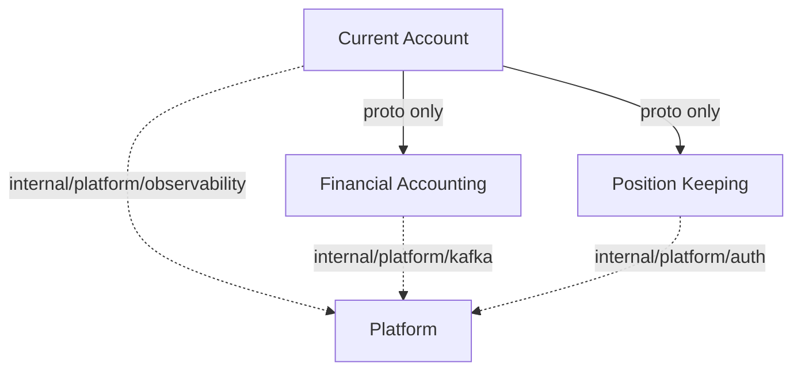

# Meridian Scripts

Utility and automation scripts for developing, operating, and testing the Meridian platform.
Scripts are run from the repository root unless noted otherwise.

## Contents

- [Development Environment](#development-environment)
- [Demo and Seed Data](#demo-and-seed-data)
- [Service Coupling Analysis](#service-coupling-analysis)
- [Kafka Testing](#kafka-testing)

---

## Development Environment

### `doctor.sh`

Validates the local development environment. Checks required tools and their minimum versions,
then reports missing or outdated dependencies. Optionally fixes issues automatically.

**Usage:**

```bash
# Check environment (report only)
./scripts/doctor.sh

# Check and automatically fix issues
./scripts/doctor.sh --fix

# Verbose output
./scripts/doctor.sh -v
```

**Checks performed:**

- Core tools: `go` (1.23+), `git`, `make`, `docker`, `kubectl`, `helm`
- Local dev: `kind`, `ctlptl`, `tilt` (0.30+)
- Proto toolchain: `buf` (1.x+), `protoc`, `grpcurl`
- Database: `cockroach` (23.x+)
- Code quality: `golangci-lint` (2.x+)
- Frontend: `node` (20+), `npm` (10+) + frontend npm dependencies

**Exit codes:**

- `0` - All checks passed
- `1` - One or more checks failed

---

## Demo and Seed Data

### `demo.sh`

End-to-end platform demo that exercises the core saga patterns: multi-service transactions,
load balancing, distributed tracing, health checks, and idempotency.

**Usage:**

```bash
# Run the full demo (starts Tilt, seeds data, executes sagas)
./scripts/demo.sh

# Override tenant
DEMO_TENANT=my-tenant ./scripts/demo.sh
```

**What it demonstrates:**

- Saga pattern with multi-step distributed transactions
- Load-balanced gRPC calls across services
- Distributed tracing via the observability stack
- Idempotency key handling (replay safety)

**Prerequisites:** Tilt stack running (`tilt up`) or the script will start it.

### Related demo scripts

| Script | Purpose |
|--------|---------|
| `demo-cross-org-settlement.sh` | Cross-organisation settlement saga |
| `demo-provision-organizations.sh` | Provision demo tenant organisations |
| `demo-seed-data.sh` | Seed reference and transaction data for demos |
| `demo-validation.sh` | Validate demo environment is correctly configured |
| `reset-demo.sh` | Reset demo tenant to a clean state |
| `seed-dev-tenant.sh` | Seed the local dev tenant with reference data |

---

## Service Coupling Analysis

This section covers automated tools for analyzing and visualizing service coupling in the Meridian microservices architecture.

### Coupling scripts

#### `analyze-coupling.sh`

Analyzes the codebase for service coupling violations and generates a structured JSON report.

**Usage:**

```bash
./scripts/analyze-coupling.sh > coupling-report.json
```

**Output:** JSON report containing:

- Cross-service internal imports (violations)
- Internal/platform usage patterns (warnings)
- Proto message dependencies (safe)
- gRPC client instantiation
- Database schema ownership
- Kafka event patterns

**Exit codes:**

- `0` - Analysis completed successfully
- `1` - Error (invalid repository structure or analysis failure)

#### `generate-coupling-mermaid.sh`

Generates Mermaid diagram syntax from the coupling analysis JSON.

**Usage:**

```bash
# Piped input
./scripts/analyze-coupling.sh | ./scripts/generate-coupling-mermaid.sh

# File input
./scripts/analyze-coupling.sh > report.json
./scripts/generate-coupling-mermaid.sh report.json

# Stdin redirect
./scripts/generate-coupling-mermaid.sh < report.json
```

**Output:** Mermaid flowchart syntax with:

- Service nodes (abbreviated: CA, FA, PK)
- Proto dependencies (solid arrows, green)
- Platform coupling (dashed arrows, yellow)
- Cross-service violations (thick arrows, red)
- Color-coded service nodes by violation severity
- HTML comment with analysis summary

**Exit codes:**

- `0` - Success
- `1` - Error (invalid JSON or missing jq)

#### `test-mermaid-generation.sh`

Validates that the Mermaid generation script produces correct output.

**Usage:**

```bash
./scripts/test-mermaid-generation.sh
```

**Tests:**

- Piped input functionality
- Mermaid syntax validity
- Service node presence
- Edge generation
- Summary comment

## Complete Workflow

```bash
# 1. Run coupling analysis
./scripts/analyze-coupling.sh > coupling-report.json

# 2. Generate Mermaid diagram
./scripts/generate-coupling-mermaid.sh coupling-report.json > coupling-diagram.md

# 3. View in markdown
# Copy the contents of coupling-diagram.md into a markdown viewer
# or GitHub/GitLab to see the rendered diagram
```

## One-line Examples

```bash
# Quick visualization
./scripts/analyze-coupling.sh 2>/dev/null | ./scripts/generate-coupling-mermaid.sh

# Save both JSON and diagram
./scripts/analyze-coupling.sh | tee coupling-report.json \
  | ./scripts/generate-coupling-mermaid.sh > coupling-diagram.md

# Check for violations only
./scripts/analyze-coupling.sh 2>/dev/null \
  | jq '.violations[] | select(.type == "cross-service-internal-import")'

# Count platform imports by service
./scripts/analyze-coupling.sh 2>/dev/null \
  | jq -r '.violations[] | select(.type == "internal-platform-import") | .from' \
  | sort | uniq -c
```

## Mermaid Diagram Legend

**Node Colors:**

- 🟢 **Green** (Safe) - Services with only proto dependencies
- 🟡 **Yellow** (Warning) - Services using internal/platform packages
- 🔴 **Red** (Violation) - Services with cross-service internal imports
- 🔵 **Blue** (Platform) - Internal platform packages

**Edge Styles:**

- `-->` Solid arrow - Proto-only dependencies (safe, expected)
- `-.->` Dashed arrow - Internal/platform usage (warning, should migrate to pkg/platform)
- `==>` Thick arrow - Cross-service internal imports (violation, must fix)

**Edge Labels:**

- `proto only` - Using gRPC/proto interfaces (correct pattern)
- `internal/platform/[component]` - Platform coupling (review needed)
- `VIOLATION: [details]` - Direct internal imports (must refactor)

## Understanding the Analysis

### Safe Patterns (Green)

Services depend on each other via proto definitions and gRPC. This is the correct microservices pattern.

```text
CA -->|proto only| FA
```

### Warning Patterns (Yellow)

Services import from `internal/platform` instead of `pkg/platform`. These should be migrated to public APIs.

```text
CA -.->|internal/platform/observability| PLAT
```

### Violation Patterns (Red)

Services directly import each other's internal packages. These break service boundaries and must be refactored.

```text
CA ==>|VIOLATION: internal/financial-accounting/adapters| FA
```

## Dependencies

- **bash** 3.2+ (macOS default)
- **jq** - JSON processor (`brew install jq`)
- **ripgrep** (rg) - Fast text search (`brew install ripgrep`)

## Troubleshooting

### "jq: command not found"

```bash
brew install jq
```

### "declare: -A: invalid option"

This error indicates an older bash version. The script has been updated to be compatible with bash 3.2+ (macOS default).

### Analysis takes too long

The analysis scans the entire codebase. On large repositories, this may take 30-60 seconds. Use
`2>/dev/null` to suppress progress messages:

```bash
./scripts/analyze-coupling.sh 2>/dev/null
```

### Invalid JSON output

Ensure you're running from the repository root or a worktree. The script validates that you're in a
Meridian repository.

## CI/CD Integration

Add to your CI pipeline to track coupling over time:

```yaml
- name: Analyze Service Coupling
  run: |
    ./scripts/analyze-coupling.sh > coupling-report.json
    ./scripts/generate-coupling-mermaid.sh coupling-report.json > coupling-diagram.md

- name: Check for Critical Violations
  run: |
    violations=$(./scripts/analyze-coupling.sh \
      | jq '.violations[] | select(.type == "cross-service-internal-import") | .type' \
      | wc -l)
    if [ "$violations" -gt 0 ]; then
      echo "Found $violations cross-service violations!"
      exit 1
    fi
```

## Example Output

See the current state of the system:

```bash
./scripts/analyze-coupling.sh 2>/dev/null | ./scripts/generate-coupling-mermaid.sh
```

This generates a diagram like:



## Related Documentation

- [ADR-002: Microservices per BIAN Domain](../docs/adr/0002-microservices-per-bian-domain.md)
- [ADR-005: Adapter Pattern Layer Translation](../docs/adr/0005-adapter-pattern-layer-translation.md)

---

## Kafka Testing

Automated Kafka cluster health and failover tests. See [kafka-tests/README.md](kafka-tests/README.md) for full details.

| Script | Purpose |
|--------|---------|
| `kafka-tests/cluster-health.sh` | Fast health check: 3-broker KRaft quorum, topic create/delete |
| `kafka-tests/failover-test.sh` | Failover test: kill a broker, verify message persistence and leader re-election |

Both scripts integrate with Tilt (`tilt trigger kafka-health` / `tilt trigger kafka-failover`)
and run in GitHub Actions CI on changes to Kafka config.
