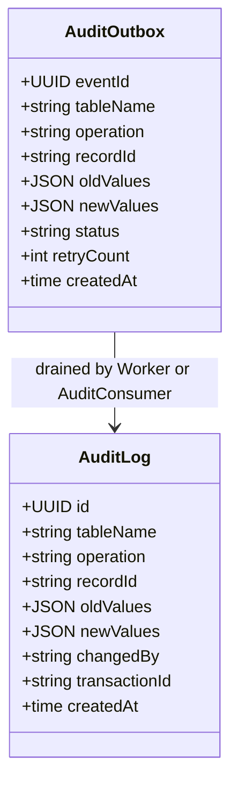
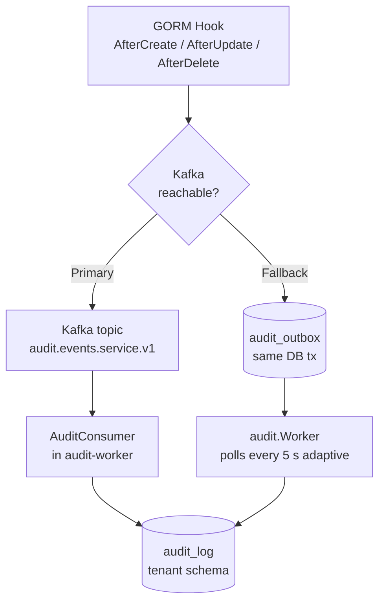

# audit-worker

Kafka consumer and fallback outbox poller for the Meridian audit trail. Part of the
[Observability and Routing layer](../../docs/architecture-layers.md#8-observability-and-routing).

## Overview

| Attribute | Value |
|-----------|-------|
| **BIAN Domain** | Infrastructure (non-BIAN) |
| **Layer** | Observability and Routing |
| **Port** | 8080 (HTTP, health checks and metrics); AuditService gRPC served through the unified Meridian binary (no dedicated standalone gRPC port) |
| **Database** | All tenant schemas - reads `audit_outbox`, writes `audit_log` |
| **Standalone** | No (requires CockroachDB and Kafka) |

## API Surface

### gRPC (served via unified binary)

| Service | RPC | Purpose |
|---------|-----|---------|
| `AuditService` | `ListAuditEntries` | Paginated cursor query of the tenant-scoped `audit_log` |

Proto: [`api/proto/meridian/audit/v1/audit_service.proto`](../../api/proto/meridian/audit/v1/audit_service.proto).

### HTTP

| Method | Path | Purpose |
|--------|------|---------|
| `GET` | `/health/live` | Kubernetes liveness probe |
| `GET` | `/health/ready` | Kubernetes readiness probe |
| `GET` | `/health/startup` | Kubernetes startup probe |
| `GET` | `/metrics` | Prometheus metrics endpoint |

## Domain Model

audit-worker is a pipeline service; it does not own domain entities. It reads from
`audit_outbox` rows written by domain services and writes `audit_log` rows. The
`AuditLogEntry` returned by `ListAuditEntries` is the read projection of `audit_log`:

`audit_outbox.status` lifecycle: `pending` -> `processing` -> `completed` (or `failed`
after `maxRetries`). `ResetStuckEntries` reclaims rows stuck in `processing` longer than
the configured threshold.

## Dependencies

| Service | Protocol | Purpose |
|---------|----------|---------|
| CockroachDB (all tenant schemas) | SQL | Reads `audit_outbox`; writes `audit_log` |
| Kafka (`audit.events.<service>.v1` topics) | Kafka consumer | Primary delivery path for audit events from domain services |

## Dependents

| Service | Entry Point | Purpose |
|---------|-------------|---------|
| `api-gateway` | `services/api-gateway/` (proxies `AuditService` gRPC) | Exposes `ListAuditEntries` to external callers |
| `mcp-server` | `services/mcp-server/internal/tools/audit.go` | Surfaces audit history as an MCP tool for LLM clients |

## Load-Bearing Files

Paths are relative to `services/audit-worker/`.

| File | Why It Matters |
|------|----------------|
| `cmd/main.go` | Entry point for the standalone binary; wires the outbox `audit.Worker` and HTTP server |
| `app/container.go` | Dependency injection for the Kafka consumer path; wires `AuditConsumer` and health checker |
| `app/config.go` | All configuration fields with defaults; the only source of env var names for the Kafka consumer path |
| `adapters/kafka/consumer.go` | `AuditConsumer.handleAuditEvent` - writes `audit_log` from Kafka events; idempotency gate |
| `adapters/persistence/tenant_audit_writer.go` | `TenantAuditWriter` - tenant-scoped `audit_log` insert with `ON CONFLICT DO NOTHING` |
| `service/server.go` | `AuditService.ListAuditEntries` gRPC implementation; cursor-paginated read of `audit_log` |

## Configuration

### Standalone binary (`cmd/main.go`)

| Variable | Required | Default | Purpose |
|----------|----------|---------|---------|
| `DATABASE_URL` | Yes | - | CockroachDB connection string |
| `AUDIT_SCHEMA` | Yes | - | Tenant schema to poll (e.g., `org_<tenant_id>`) |
| `PORT` | No | `8080` | HTTP listen port (health and metrics) |
| `GRACEFUL_SHUTDOWN_TIMEOUT` | No | `30s` | Maximum wait on shutdown |

### Kafka consumer path (`app/container.go`)

| Variable | Required | Default | Purpose |
|----------|----------|---------|---------|
| `DATABASE_URL` | Yes | - | CockroachDB connection string |
| `KAFKA_BOOTSTRAP_SERVERS` | Yes | - | Comma-separated broker addresses |
| `AUDIT_TOPIC` | Yes | - | Kafka topic to consume (e.g., `audit.events.current-account.v1`) |
| `SERVICE_NAME` | Yes | - | Identifies which service's events this instance processes |
| `KAFKA_GROUP_ID` | No | `audit-consumer-group` | Consumer group ID |
| `KAFKA_CLIENT_ID` | No | `audit-consumer` | Client identifier for logs and metrics |
| `KAFKA_HANDLER_TIMEOUT` | No | `30s` | Maximum duration per message |
| `KAFKA_MAX_RETRIES` | No | `3` | Maximum retries before DLQ |
| `PORT` | No | `8080` | HTTP listen port |
| `DB_MAX_OPEN_CONNS` | No | `25` | Database connection pool maximum |
| `DB_MAX_IDLE_CONNS` | No | `5` | Database idle connection pool size |
| `DB_CONN_MAX_LIFETIME` | No | `5m` | Maximum connection reuse duration |
| `DB_CONN_MAX_IDLE_TIME` | No | `10m` | Maximum idle connection duration |

## Architecture

The audit pipeline has two independent delivery paths from domain mutation to `audit_log`.
See [`docs/data-flows.md`](../../docs/data-flows.md#2-audit-pipeline) for the full sequence
diagram and invariant analysis.

**Key invariants:**

- The `audit_outbox` write shares the business transaction - if the business write rolls back, no audit row is produced.
- `event_id` uniqueness prevents duplicate delivery between the two paths.
- The alert threshold `meridian_audit_worker_outbox_depth > 1000` indicates either a Kafka outage or worker
  lag requiring operator attention.

## References

- ADR-0009: Application-Level Audit Logging - [`docs/adr/0009-application-level-audit-logging.md`](../../docs/adr/0009-application-level-audit-logging.md)
- ADR-0020: Per-Service Audit Workers - [`docs/adr/0020-per-service-audit-workers.md`](../../docs/adr/0020-per-service-audit-workers.md)
- Audit pattern canonical location: [`shared/platform/audit/README.md`](../../shared/platform/audit/README.md)
- Outbox pattern: [`docs/patterns.md`](../../docs/patterns.md#1-outbox-pattern)
- Audit pipeline data flow: [`docs/data-flows.md`](../../docs/data-flows.md#2-audit-pipeline)
