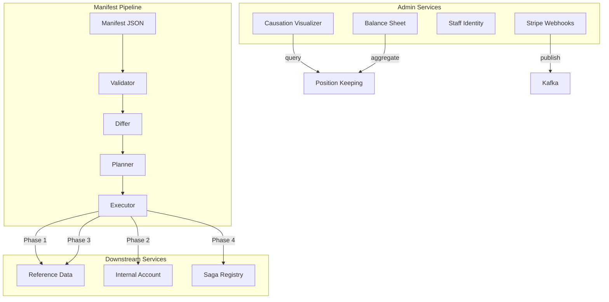
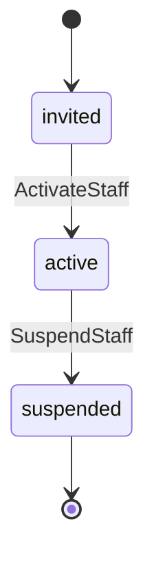
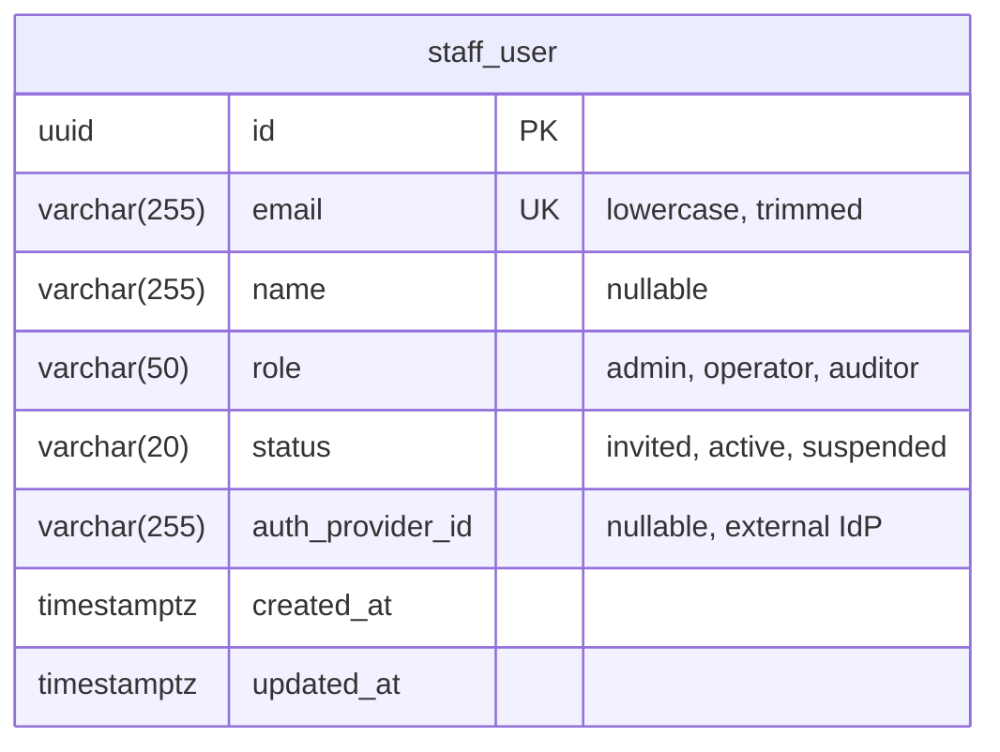
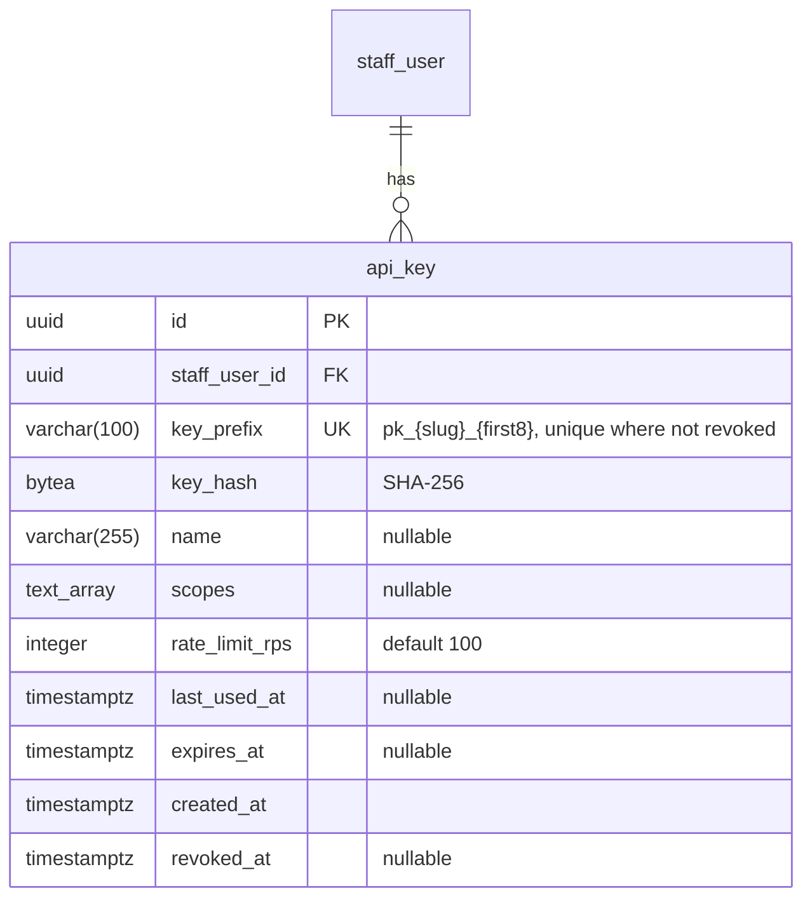
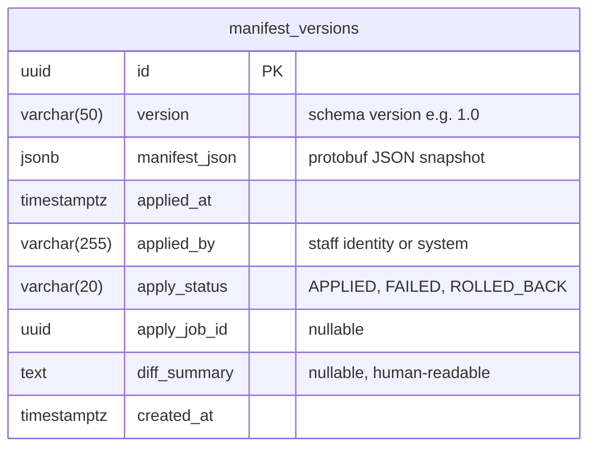
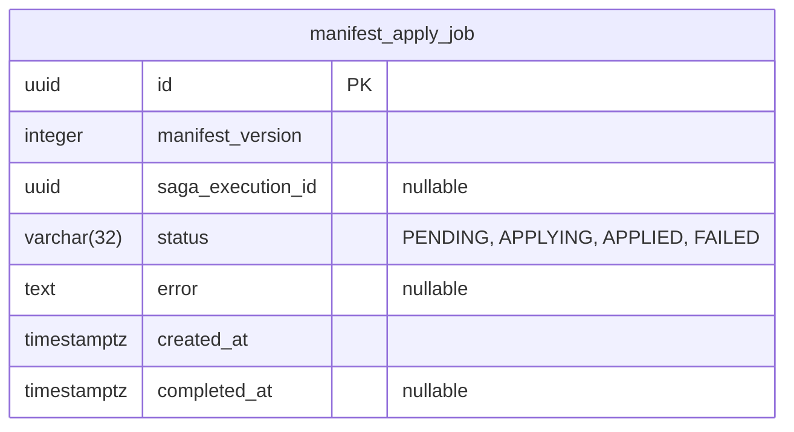

# Control Plane Service

Tenant configuration management service with manifest-driven provisioning, causation tree
visualization, balance sheet aggregation, and staff identity management.

## Overview

| Attribute | Value |
|-----------|-------|
| **Type** | Infrastructure (not BIAN) |
| **Language** | Go |
| **Database** | PostgreSQL/CockroachDB |
| **Standalone** | No (requires Position Keeping, Reference Data, Internal Account) |

## Architecture

The control plane provides four distinct capabilities:

1. **Manifest Management** -- Validate, diff, plan, and apply tenant configuration manifests
2. **Causation Visualization** -- Trace positions, transactions, and events to originating sagas
3. **Balance Sheet** -- Aggregate positions into classified financial statements with drill-down
4. **Staff Identity** -- Manage staff users and API keys per tenant schema



## gRPC Services

### CausationVisualizerService

Traces financial entities back to their originating saga, enabling the "Glass Box" audit pattern.

| Method | HTTP | Purpose |
|--------|------|---------|
| `GetCausationTreeForPosition` | `GET /admin/causation-tree/position/{position_id}` | Trace position to saga tree |
| `GetCausationTreeForTransaction` | `GET /admin/causation-tree/transaction/{transaction_id}` | Trace transaction to saga tree |
| `GetCausationTreeForEvent` | `GET /admin/causation-tree/event/{event_id}` | Trace event to saga tree |

### BalanceSheetService

Aggregates positions into classified balance sheets with drill-down to individual positions.

| Method | HTTP | Purpose |
|--------|------|---------|
| `GetBalanceSheet` | `GET /admin/balance-sheet/{tenant_id}` | Multi-asset balance sheet |
| `GetPositionDetails` | `GET /admin/balance-sheet/{tenant_id}/details/{account_type}/{instrument}` | Drill into positions |
| `ExportBalanceSheetCSV` | `GET /admin/balance-sheet/{tenant_id}/export` | CSV export with metadata |

### ManifestHistoryService

Version history and rollback for tenant manifests with forward-only audit trail.

| Method | Purpose |
|--------|---------|
| `GetCurrentManifest` | Latest applied manifest |
| `GetManifestVersion` | Specific version by version string |
| `ListManifestVersions` | Paginated version history |

### AuthService

API key validation for the Gateway service.

| Method | Purpose |
|--------|---------|
| `ValidateAPIKey` | Verify API key prefix and hash against tenant schema |

## Manifest Pipeline

### Manifest Structure

A manifest declares the complete business model for a tenant:

```json
{
  "version": "1.0",
  "metadata": { "name": "Acme Energy", "industry": "energy" },
  "instruments": [
    {
      "code": "GBP", "name": "British Pound",
      "type": "INSTRUMENT_TYPE_FIAT",
      "dimensions": { "unit": "GBP", "precision": 2 }
    },
    {
      "code": "KWH", "name": "Kilowatt Hour",
      "type": "INSTRUMENT_TYPE_COMMODITY",
      "dimensions": { "unit": "kWh", "precision": 3 }
    }
  ],
  "account_types": [
    {
      "code": "CURRENT", "name": "Current Account",
      "normal_balance": "NORMAL_BALANCE_DEBIT",
      "allowed_instruments": ["GBP"]
    }
  ],
  "valuation_rules": [
    {
      "from_instrument": "KWH", "to_instrument": "GBP",
      "method": "VALUATION_METHOD_SPOT_RATE",
      "source": "nordpool_spot"
    }
  ],
  "sagas": [
    { "name": "process_deposit", "trigger": "api:/v1/deposits", "script": "..." }
  ],
  "payment_rails": [
    { "provider": "stripe_connect", "mode": "CONNECT_MODE_STANDARD", "account_id": "acct_..." }
  ]
}
```

### Validation

The manifest validator performs seven checks:

| Check | Error Code | Description |
|-------|-----------|-------------|
| Structural | `PROTO_VALIDATION` | Protobuf field constraints (min/max length, patterns, required fields) |
| Duplicates | `DUPLICATE_CODE` | No duplicate instrument codes, account type codes, or saga names |
| CEL expressions | `CEL_COMPILATION_ERROR` | Type-check account type policy and bucketing expressions |
| Starlark scripts | `STARLARK_COMPILATION_ERROR` | Compile saga scripts with service binding stubs |
| Cross-references | `UNDEFINED_INSTRUMENT_REFERENCE` | All instrument references resolve within the manifest |
| Payment rails | `INVALID_PAYMENT_PROVIDER` | Provider, account ID format, and method validation |
| Immutability | `IMMUTABLE_FIELD_CHANGED` | Instrument and account type codes cannot change between versions |

Errors include structured location paths, "Did you mean?" suggestions via Levenshtein distance,
and available field lists for AI-friendly feedback loops.

### Diff Engine

Compares last-applied manifest against new manifest following Kubernetes apply semantics:

- Resources present in new but not last-applied: **CREATE**
- Resources present in both with field changes: **UPDATE**
- Resources present in last-applied but not in new: **DELETE** (with safety checks)
- Identical resources: **NO_CHANGE**

Safety checks query downstream services before allowing deletions (e.g., non-zero balances
block account type deletion, running sagas block saga deletion).

### Execution Planner

Maps diff actions to dependency-ordered gRPC calls in five phases:

| Phase | Resources | Target Service |
|-------|-----------|---------------|
| 1 | Instruments | Reference Data |
| 2 | Account Types | Internal Account |
| 3 | Valuation Rules | Reference Data |
| 4 | Saga Definitions | Saga Registry |
| 5 | Seed Data | Various |

Phases execute sequentially; calls within a phase may execute in parallel.
Each call includes a deterministic SHA-256 idempotency key for safe retry.

### Manifest Executor

Orchestrates the apply as a Starlark saga with automatic compensation:

1. Creates tracking job (PENDING)
2. Resolves apply_manifest saga script from platform defaults (ADR-0028)
3. Executes saga via StarlarkSagaRunner
4. Marks job APPLIED or FAILED

The apply_manifest saga definition is embedded in the binary and bootstrapped to
`public.platform_saga_definition` on startup.

## Causation Tree Visualization

Enables the "Glass Box" pattern: click a balance sheet line item, see every saga step
that produced it.

**Tracing paths:**

- Position: `position_log` -> `transaction_log_entry` -> `idempotency_key` -> `saga_instance`
- Transaction: `transaction_id` -> `saga_step_results` (correlation_id) -> `saga_instance`
- Event: `event_id` -> `event_outbox` (causation_id) -> `saga_step_results` -> `saga_instance`

All paths walk up the `parent_saga_id` chain to find the root saga, then retrieve
the full causation tree via `CausationTreeRepository`.

**Export formats:** JSON (preserves tree structure) and CSV (flattened for spreadsheet audit).

## Balance Sheet

Aggregates positions from Position Keeping into a classified balance sheet:

| Section | Normal Balance | Account Type Examples |
|---------|---------------|---------------------|
| ASSETS | Debit | STRIPE_NOSTRO, ENERGY_INVENTORY |
| LIABILITIES | Credit | CUSTOMER_DEPOSIT, PAYABLE |
| EQUITY | Credit | RETAINED_EARNINGS, OWNER_EQUITY |

Features:

- Multi-instrument support (each section has totals per instrument)
- Point-in-time queries via `as_of` parameter
- Drill-down to individual positions with causation tree links
- CSV export with metadata headers and injection protection

## Staff Identity

Tenant-scoped staff user management for the Admin Console, stored in `org_{tenant_id}` schemas.

### Staff User Lifecycle



**Roles:**

| Role | Description |
|------|-------------|
| `admin` | Full access to all operations |
| `operator` | Operational access |
| `auditor` | Read-only access |

### API Key Management

- Key format: `pk_{tenant_slug}_{entropy}` (prefix enables O(1) tenant routing)
- Storage: SHA-256 hash (high-entropy keys do not need argon2id)
- Validation: Constant-time hash comparison, expiry check, staff status check
- Scoping: Per-key permission scopes and rate limits (default 100 RPS)

## Stripe Webhook Integration

Receives Stripe webhook events via HTTP, verifies signatures, and publishes payment events
to Kafka for downstream saga processing.

**Handled event types:**

| Stripe Event | Action |
|-------------|--------|
| `payment_intent.succeeded` | Extract metadata, publish payment event to Kafka |
| `payment_intent.payment_failed` | Log failure (no saga triggered) |
| `charge.refunded` | Extract metadata, publish refund event to Kafka |

**Required metadata** on PaymentIntent: `tenant_id`, `party_id`

Idempotency keys are deterministic SHA-256 hashes of `event_id + event_type`.
Unknown event types are acknowledged (HTTP 200) to prevent Stripe retries.

## CLI Tools

### Manifest Validator

```bash
# Validate manifest files against schema
go run ./services/control-plane/cmd/validate -manifest='examples/manifests/*.json'

# JSON output for CI pipelines
go run ./services/control-plane/cmd/validate -manifest='manifests/*.json' -json
```

## Database Schema

Tables are created in tenant schemas (`org_{tenant_id}`) using the schema-per-tenant pattern.

### staff_user



### api_key



### manifest_versions



### manifest_apply_job



## Service Dependencies

| Service | Purpose |
|---------|---------|
| Position Keeping | Balance sheet aggregation, causation tree tracing |
| Reference Data | Instrument, account type, valuation rule, and saga registration |
| Internal Account | Account provisioning during manifest apply |
| Kafka | Stripe payment event publishing |

## Configuration

| Variable | Default | Purpose |
|----------|---------|---------|
| `DATABASE_URL` | - | PostgreSQL/CockroachDB connection string |
| `STRIPE_WEBHOOK_SECRET` | - | Stripe webhook signing secret (whsec_...) |
| `DB_MAX_OPEN_CONNS` | 25 | Connection pool size |

## Key Patterns

### Manifest Version History

All manifest changes are stored as immutable snapshots. Rollbacks create new version records
with the target version's content, maintaining a forward-only audit trail. Diff summaries
are auto-generated by comparing against the previous applied version.

### Platform Default Saga Bootstrap

On startup, the control plane upserts the embedded `apply_manifest` Starlark saga into
`public.platform_saga_definition`. This ensures the saga is available for all tenants
via ADR-0028 platform default fallback resolution. The bootstrap is idempotent and handles
concurrent startup race conditions.

### Tenant Schema Isolation

Staff users, API keys, manifest versions, and apply jobs are stored in tenant schemas
(`org_{tenant_id}`). The service uses `search_path` or GORM tenant transactions to route
queries to the correct schema based on tenant context from request metadata.

## References

- [Service Architecture](../README.md)
- [Proto Definitions](../../api/proto/meridian/control_plane/v1/)
- [Example Manifests](../../api/proto/meridian/control_plane/v1/examples/)
