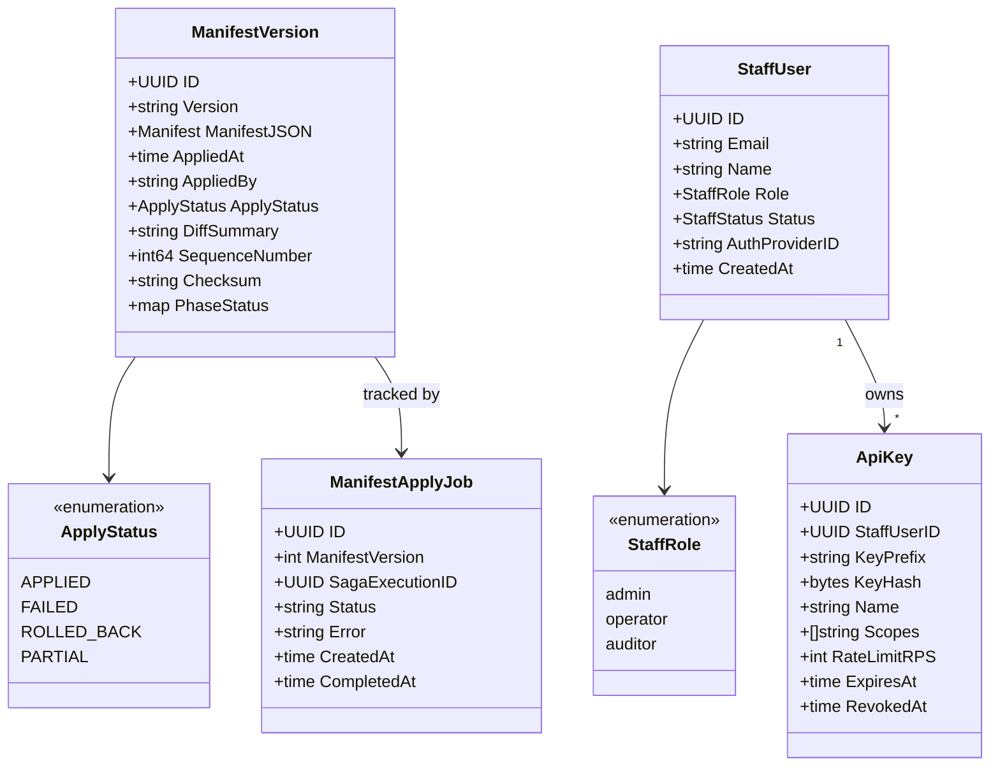

# control-plane

Manifest-driven tenant configuration engine with Glass Box causation tracing, balance
sheet aggregation, staff identity management, and AI-assisted economy generation.

## Overview

| Attribute | Value |
|-----------|-------|
| **BIAN Domain** | Infrastructure (non-BIAN) |
| **Layer** | Lifecycle Orchestration |
| **Port** | 50062 (gRPC) |
| **Database** | CockroachDB platform schema; per-tenant `org_{tenant_id}` for staff users, API keys, manifest versions |
| **Standalone** | No - requires `reference-data`, `internal-account`, `operational-gateway`, `party`, `market-information`, and `position-keeping` at runtime |

## API Surface

### gRPC

| Service | RPC | Purpose |
|---------|-----|---------|
| `ApplyManifestService` | `ApplyManifest` | Validate, diff, plan, and apply a full tenant manifest |
| `ApplyManifestService` | `ApplyResource` | Apply a single-resource mutation against the live manifest |
| `ManifestHistoryService` | `GetCurrentManifest` | Retrieve the most recently applied manifest version |
| `ManifestHistoryService` | `GetManifestVersion` | Retrieve a specific manifest version by version string |
| `ManifestHistoryService` | `ListManifestVersions` | Paginated manifest version history (most recent first) |
| `ManifestHistoryService` | `DiffManifestVersions` | Compare two manifest versions by sequence number |
| `ManifestHistoryService` | `ExportManifest` | Reconstruct a manifest from live service state |
| `ManifestHistoryService` | `ReconcileManifest` | Detect drift between stored manifest and live state |
| `ManifestHistoryService` | `RollbackManifest` | Revert to a previous version (creates a new forward-only record) |
| `SagaExecutionService` | `ExecuteSaga` | Trigger a named saga instance with idempotency key |
| `CausationVisualizerService` | `GetCausationTreeForPosition` | Trace a position log to its originating saga (Glass Box) |
| `CausationVisualizerService` | `GetCausationTreeForTransaction` | Trace a transaction to its originating saga |
| `CausationVisualizerService` | `GetCausationTreeForEvent` | Trace an event via causation_id to its originating saga |
| `BalanceSheetService` | `GetBalanceSheet` | Multi-asset balance sheet grouped by ASSETS/LIABILITIES/EQUITY |
| `BalanceSheetService` | `GetPositionDetails` | Drill into individual positions for an account type and instrument |
| `BalanceSheetService` | `ExportBalanceSheetCSV` | CSV export with metadata headers |
| `AuthService` | `ValidateAPIKey` | Verify API key prefix and hash against tenant schema (called by api-gateway) |
| `EconomyGeneratorService` | `GenerateManifest` | Generate a tenant manifest from a natural language description |
| `EconomyGeneratorService` | `GetGenerationContext` | Return pattern-matching context for a description without generating |

Proto files: `api/proto/meridian/control_plane/v1/` (relative to repo root).

### HTTP endpoints

control-plane serves gRPC only. The Stripe webhook handler in
`internal/stripe/webhook.go` (HMAC-SHA256 signature verification, 5-minute replay
guard, Kafka payment-event publishing) is implemented but is not currently
registered to an HTTP route in this service. Live Stripe webhook ingestion runs in
`financial-gateway` (`POST /webhooks/stripe/{tenantID}`).

## Domain Model

Apply pipeline state: `PENDING -> APPLYING -> APPLIED | FAILED | PARTIAL`.
Rollback creates a new `ManifestVersion` record with the target version's content
(forward-only audit trail; rollback does not overwrite existing records).

`ManifestVersion.SequenceNumber` is an optimistic lock. Callers must echo it back as
`expected_sequence_number` in subsequent applies to prevent concurrent overwrites.

## Dependencies

| Service | Protocol | Purpose |
|---------|----------|---------|
| `reference-data` | gRPC | Instrument, valuation rule, and saga definition registration during manifest apply phases 1, 3, 4 |
| `internal-account` | gRPC | Internal account type provisioning during manifest apply phase 2 |
| `operational-gateway` | gRPC | Provider connection and instruction route registration during manifest apply |
| `party` | gRPC | Party type definition registration during manifest apply |
| `market-information` | gRPC | Market data source and set registration during manifest apply |
| `position-keeping` | gRPC | Balance aggregation for `BalanceSheetService`; causation chain traversal for Glass Box |

## Dependents

| Service | Entry Point | Purpose |
|---------|-------------|---------|
| `api-gateway` | `services/api-gateway/auth/rpc_apikey_validator.go` | `ValidateAPIKey` on every authenticated request |
| `event-router` | `services/event-router/adapters/grpc/saga_trigger_client.go` | `ExecuteSaga` on domain events from Kafka |
| `mcp-server` | `services/mcp-server/internal/clients/clients.go` | Manifest apply, history, and economy generation from LLM clients |
| `financial-gateway` | `services/financial-gateway/cmd/main.go` | Manifest tenant config lookup for Stripe rail connection details |
| `payment-order` | `services/payment-order/adapters/gateway/stripe/manifest_tenant_config.go` | Manifest tenant config lookup for Stripe payment gateway |

## Load-Bearing Files

Paths are relative to `services/control-plane/`.

| File | Why It Matters |
|------|----------------|
| `cmd/main.go` | Wires gRPC server with auth and RBAC interceptors; controls startup order and shutdown |
| `service/apply_manifest.go` | Entry point for validate/diff/plan/execute pipeline; `RegisterApplyManifestService` |
| `internal/applier/apply_job.go` | Apply job lifecycle tracking (`PENDING -> APPLIED/FAILED`); idempotency boundary |
| `internal/applier/executor.go` | Starlark saga runner for manifest apply; calls `StarlarkSagaRunner` with `apply_manifest` |
| `internal/validator/manifest_validator.go` | Seven-stage validation pipeline; changes here affect every manifest operation |
| `internal/differ/manifest_differ.go` | Kubernetes-style diff engine (`CREATE/UPDATE/DELETE/NO_CHANGE`); safety-checks deletions |
| `internal/planner/manifest_planner.go` | Maps diff actions to dependency-ordered phased gRPC calls with idempotency keys |
| `internal/admin/handler.go` | `CausationVisualizerService` and `BalanceSheetService` gRPC implementations |
| `internal/stripe/webhook.go` | HMAC-SHA256 signature verification and Kafka payment event publishing; 5-minute replay guard (handler implemented but not currently wired to an HTTP route in this service) |
| `rbac/method_permissions.go` | RBAC method-to-permission mapping; all RPC authorization rules live here |

## Configuration

| Variable | Required | Default | Purpose |
|----------|----------|---------|---------|
| `DATABASE_URL` | Yes | - | CockroachDB connection string |
| `GRPC_PORT` | No | `50062` | gRPC listen port |
| `LOG_LEVEL` | No | `info` | Log verbosity: `debug`, `info`, `warn`, `error` |

## References

- [`docs/architecture-layers.md`](../../docs/architecture-layers.md) - Lifecycle Orchestration layer (section 5)
- [`docs/architecture/starlark-saga-architecture.md`](../../docs/architecture/starlark-saga-architecture.md) - Saga execution
- [`api/proto/meridian/control_plane/v1/`](../../api/proto/meridian/control_plane/v1/) - Proto definitions
- [`api/proto/meridian/control_plane/v1/examples/`](../../api/proto/meridian/control_plane/v1/examples/) - Example manifests
