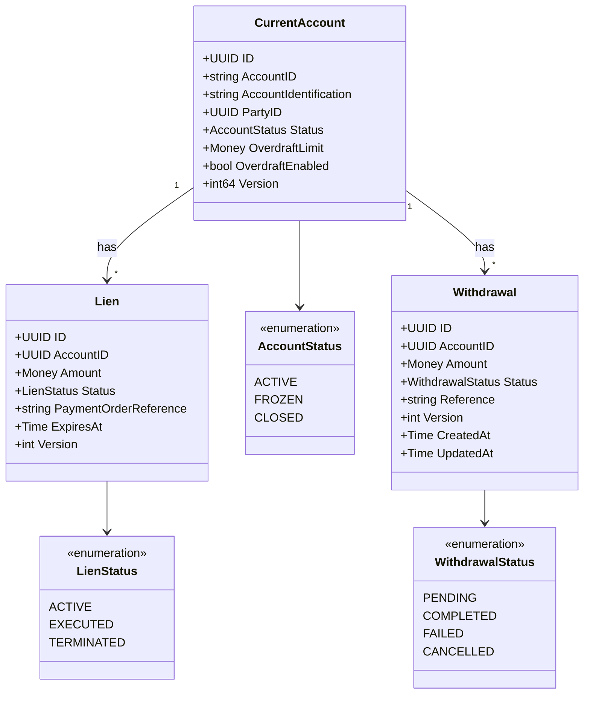
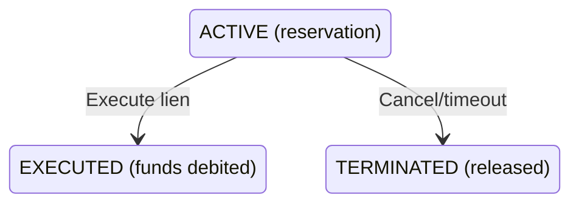
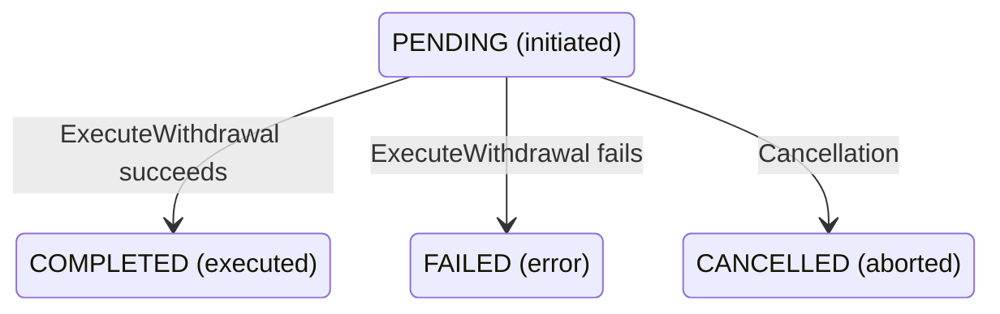
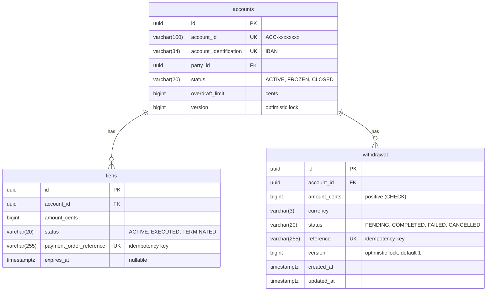
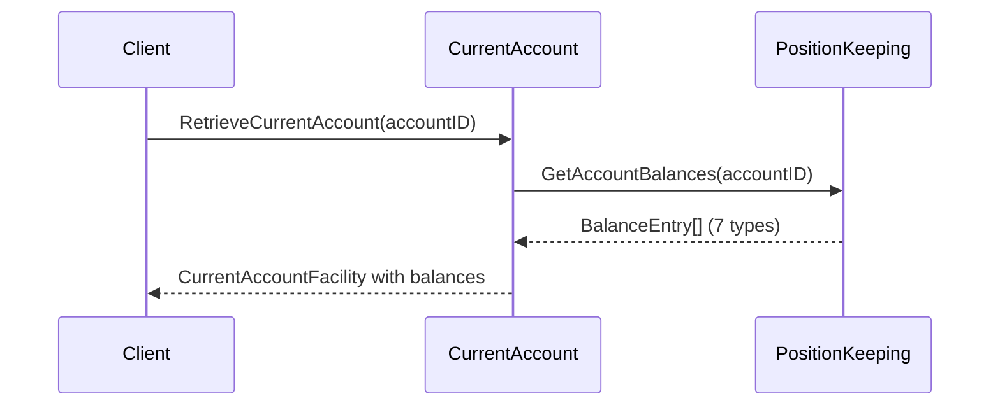

# CurrentAccount Service

BIAN-compliant current account facility microservice with lien-based payment reservations.

## Overview

| Attribute | Value |
|-----------|-------|
| **BIAN Domain** | Current Account |
| **Port** | 50057 (gRPC) |
| **Language** | Go |
| **Database** | PostgreSQL/CockroachDB |
| **Standalone** | No (requires Party, PositionKeeping, FinancialAccounting) |

## gRPC Methods

### Account Operations

| Method | HTTP | Purpose |
|--------|------|---------|
| `InitiateCurrentAccount` | `POST /v1/current-accounts` | Create new account |
| `ExecuteDeposit` | `POST /v1/current-accounts/{id}/deposits` | Deposit funds |
| `RetrieveCurrentAccount` | `GET /v1/current-accounts/{id}` | Get account details |

### Withdrawal Operations

| Method | HTTP | Purpose |
|--------|------|---------|
| `InitiateWithdrawal` | `POST /v1/current-accounts/{id}/withdrawals:initiate` | Validate and create pending withdrawal |
| `ExecuteWithdrawal` | `POST /v1/current-accounts/{id}/withdrawals:execute` | Execute pending or direct withdrawal |
| `UpdateWithdrawal` | `PATCH /v1/withdrawals/{id}` | Retrieve and validate pending withdrawal |
| `RetrieveWithdrawal` | `GET /v1/withdrawals/{id}` or `GET /v1/current-accounts/{id}/withdrawals` | Get withdrawal or list by account |

### Lien Operations (Fund Reservation)

| Method | HTTP | Purpose |
|--------|------|---------|
| `InitiateLien` | `POST /v1/current-accounts/{id}/liens` | Reserve funds |
| `ExecuteLien` | `POST /v1/current-account-liens/{id}/execute` | Debit reserved funds |
| `TerminateLien` | `POST /v1/current-account-liens/{id}/terminate` | Release reservation |
| `RetrieveLien` | `GET /v1/current-account-liens/{id}` | Get lien details |

## Saga Definitions

Deposit and withdrawal sagas are **NOT** stored locally. They are fetched at runtime from the
reference-data service via `GetSaga()` RPC.

**Canonical source:** `services/reference-data/saga/defaults/`

- deposit: `defaults/deposit/v1.0.0.star`
- withdrawal: `defaults/withdrawal/v1.0.0.star`

To modify these sagas, update the files in reference-data service and run
`PlatformSync.SyncPlatformDefaults()`.

## Domain Model



**Field Notes:**

- `AccountID`: Business ID format `ACC-{uuid[:8]}`
- `AccountIdentification`: IBAN format
- `PaymentOrderReference`: Idempotency key for payment orders
- **Balance fields removed**: Balance is computed by Position Keeping service (see
  [Balance Query Delegation](#balance-query-delegation))

## Lien Lifecycle



- **ACTIVE**: Funds reserved, reduces AvailableBalance
- **EXECUTED**: Terminal state, funds withdrawn from Balance
- **TERMINATED**: Terminal state, AvailableBalance restored

## Withdrawal Operations

The service supports a two-phase withdrawal pattern as well as direct withdrawals.

### InitiateWithdrawal

Creates a pending withdrawal in PENDING status. Validates the account is active, currency
matches, and amount is positive. Warns (but does not reject) if the requested amount exceeds
the current available balance, since balance may change before execution.

A `reference` can be provided for idempotency. If omitted, one is auto-generated in the
format `WTH-{uuid[:8]}`.

### ExecuteWithdrawal

Supports two modes:

**1. Execute pending withdrawal** -- provide `withdrawal_id`:

Looks up a previously initiated withdrawal, verifies it is in PENDING status, and executes
the withdrawal saga. On success, the withdrawal transitions to COMPLETED via the transactional
outbox pattern (atomically updating status and publishing a `WithdrawalStatusUpdated` event).

**2. Direct withdrawal** -- provide `account_id` and `amount`:

Executes a withdrawal immediately without prior initiation. Requires both fields.

Both modes:

- Validate the account is ACTIVE (rejects FROZEN or CLOSED)
- Validate currency matches the account currency
- Check sufficient funds via `PrepareForDebit` (considers overdraft if enabled)
- Execute the withdrawal saga (Position Keeping DEBIT, Financial Accounting double-entry,
  account metadata save)
- Support Redis-based idempotency via `idempotency_key`

### UpdateWithdrawal

Retrieves a pending withdrawal and performs validation. Field updates (amount, description,
reference) are not yet supported -- the domain model treats these as immutable after creation.
If update fields are provided, the response includes warning messages indicating the fields
were not modified.

Only withdrawals in PENDING status can be queried via this method. Attempting to update
a non-pending withdrawal returns `FailedPrecondition`.

### RetrieveWithdrawal

Supports two query modes:

**1. Single lookup** -- provide `withdrawal_id`:

Returns the withdrawal matching the given ID. Internally, `withdrawal_id` maps to the
withdrawal's `reference` field for lookup.

**2. List by account** -- provide `account_id`:

Returns a paginated list of withdrawals for the account (default page size: 50). Uses
offset-based pagination via `page_token` (the token is the numeric offset). Results are
ordered by `created_at DESC`.

At least one of `withdrawal_id` or `account_id` is required.

### Withdrawal Lifecycle



- **PENDING**: Withdrawal initiated, awaiting execution
- **COMPLETED**: Terminal state, funds withdrawn via saga
- **FAILED**: Terminal state, saga or validation failure
- **CANCELLED**: Terminal state, withdrawal aborted before execution

All terminal transitions are idempotent (calling `Complete()` on an already-completed
withdrawal is a no-op).

### Withdrawal Saga

The withdrawal saga executes three steps sequentially via Starlark:

1. **log_position**: DEBIT entry in Position Keeping (source of truth for balance)
2. **post_ledger**: Booking log and dual ledger postings in Financial Accounting
   (customer account DEBIT, clearing account CREDIT)
3. **save_account**: Persist account metadata (status, version)

Compensation runs in LIFO order on failure. The saga definition is fetched at runtime from
the reference-data service (`defaults/withdrawal/v1.0.0.star`).

### Withdrawal Events

When a pending withdrawal is executed successfully, a `WithdrawalStatusUpdated` event is
published via the transactional outbox pattern:

| Event | Kafka Topic | Trigger |
|-------|-------------|---------|
| WithdrawalStatusUpdated | `current-account.withdrawal.status` | Pending withdrawal executed |

The outbox write happens atomically with the withdrawal status update in a single database
transaction, providing at-least-once delivery guarantees. If the outbox write fails, the
service falls back to a direct status update without event publication.

## Service Dependencies

| Service | Port | Purpose |
|---------|------|---------|
| Party | 50055 | Validate party exists and is active |
| PositionKeeping | 50053 | Transaction audit trail logging |
| FinancialAccounting | 50052 | Double-entry ledger posting |

All clients use circuit breaker with exponential backoff retry (3 retries).

## Database Schema

**Schema**: `current_account`



> **Note:** Balance columns (`balance`, `available_balance`, `balance_updated_at`) were removed
> in migration `20260108000001_remove_balance_columns.sql`. Balance is now computed by Position
> Keeping service.

The `withdrawal` table was added in migration `20251231000002_create_withdrawal_table.sql`.
Key design decisions:

- **Optimistic locking**: `version` column incremented on each update, prevents concurrent
  modification
- **Idempotency**: `reference` column has a unique index, preventing duplicate withdrawals
  with the same reference
- **Tenant isolation**: Uses schema-per-tenant pattern (table exists within the tenant's
  database schema)
- **Indexes**: Composite `(account_id, status)` for filtered queries, `created_at DESC` for
  time-ordered listing, unique `reference` for idempotency lookups

## Configuration

| Variable | Default | Purpose |
|----------|---------|---------|
| `GRPC_PORT` | 50057 | gRPC server port |
| `DATABASE_URL` | - | PostgreSQL connection string |
| `K8S_NAMESPACE` | default | Kubernetes namespace for service discovery |
| `DB_MAX_OPEN_CONNS` | 25 | Connection pool size |

## Key Patterns

### Retry Idempotency

**Safe to Retry (Idempotent):**

| Method | Idempotency Key | Behavior |
|--------|-----------------|----------|
| `InitiateLien` | `PaymentOrderReference` | Returns existing lien if key matches |
| `ExecuteLien` | Lien ID (path param) | No-op if already EXECUTED |
| `TerminateLien` | Lien ID (path param) | No-op if already TERMINATED |
| `ExecuteDeposit` | `IdempotencyKey` header | Returns existing result if key matches |
| `InitiateWithdrawal` | `reference` field | Returns existing withdrawal if reference matches |
| `ExecuteWithdrawal` | `idempotency_key` field | Returns cached result from Redis if key matches |

**Retry Guidance:**

- Always include `idempotency_key` for `ExecuteDeposit` to prevent duplicate credits
- Always include `idempotency_key` for `ExecuteWithdrawal` to prevent duplicate debits
- `InitiateWithdrawal` uses `reference` as natural idempotency key (unique constraint in DB)
- `InitiateLien` uses `PaymentOrderReference` as natural idempotency key (unique per payment)
- Terminal state transitions (EXECUTED, TERMINATED) are no-ops on retry
- Use exponential backoff: 100ms → 200ms → 400ms (max 3 retries)

**Non-Idempotent Operations:**

- `InitiateCurrentAccount`: Creating duplicate accounts requires unique party/IBAN

### Balance Query Delegation

Balance is computed by Position Keeping service, not stored locally. Current Account queries
Position Keeping for all balance operations.

**Balance Types (BIAN-compliant):**

| Type | Description |
|------|-------------|
| `OPENING` | Balance at start of accounting period |
| `CLOSING` | Balance at end of accounting period |
| `CURRENT` | Real-time balance including all posted transactions |
| `AVAILABLE` | Balance available for withdrawal (considers holds/liens) |
| `LEDGER` | Balance on the books (may differ from current due to holds) |
| `RESERVE` | Amount held in reserve (not available for use) |
| `FREE` | Unencumbered balance (current minus holds and reserves) |

**Query Pattern:**

```go
import pk "meridian/position_keeping/v1"

// Query single balance type
resp, err := pkClient.GetAccountBalance(ctx, &pk.GetAccountBalanceRequest{
    AccountId:   accountID,
    BalanceType: pk.BALANCE_TYPE_AVAILABLE,
})

// Query all balance types
resp, err := pkClient.GetAccountBalances(ctx, &pk.GetAccountBalancesRequest{
    AccountId: accountID,
})
for _, balance := range resp.Balances {
    log.Printf("%s: %v", balance.BalanceType, balance.Amount)
}
```

**Sequence Diagram:**



### Overdraft Facility

Overdraft configuration is stored in Current Account. When calculating available balance,
Position Keeping considers the overdraft limit.

```text
AvailableBalance = CurrentBalance + (OverdraftEnabled ? OverdraftLimit : 0) - ActiveLiens
```

Allows withdrawals beyond zero balance up to the configured limit.

### Payment Order Saga Integration

1. `InitiateLien` - Reserve funds (updates AvailableBalance)
2. External payment processing
3. `ExecuteLien` (success) or `TerminateLien` (failure/cancellation)

### Optimistic Locking

All mutations check `WHERE version = expected_version`. Returns conflict error on mismatch.

## Account Lifecycle Events

The service publishes events to Kafka for account lifecycle state transitions.
Events use fire-and-forget semantics - publishing failures are logged but do not fail
the business operation.

### Event Topics

| Event | Kafka Topic | Trigger |
|-------|-------------|---------|
| AccountFrozen | `current-account.account-frozen.v1` | Account transitions to FROZEN status |
| AccountUnfrozen | `current-account.account-unfrozen.v1` | Account transitions from FROZEN to ACTIVE |
| AccountClosed | `current-account.account-closed.v1` | Account transitions to CLOSED status |

### Event Schemas

Events are serialized as Protocol Buffers.
See `api/proto/meridian/events/v1/current_account_events.proto` for full schema definitions.

**AccountFrozenEvent:**

```json
{
  "event_id": "uuid",
  "account_id": "ACC-xxxxxxxx",
  "reason": "Suspicious activity detected",
  "frozen_at": "2024-01-15T10:30:00Z",
  "frozen_by": "compliance-officer",
  "correlation_id": "uuid",
  "causation_id": "uuid",
  "timestamp": "2024-01-15T10:30:00Z",
  "version": 5,
  "metadata": {}
}
```

**AccountUnfrozenEvent:**

```json
{
  "event_id": "uuid",
  "account_id": "ACC-xxxxxxxx",
  "unfrozen_at": "2024-01-16T14:00:00Z",
  "unfrozen_by": "compliance-officer",
  "correlation_id": "uuid",
  "causation_id": "uuid",
  "timestamp": "2024-01-16T14:00:00Z",
  "version": 6,
  "metadata": {}
}
```

**AccountClosedEvent:**

```json
{
  "event_id": "uuid",
  "account_id": "ACC-xxxxxxxx",
  "closing_balance": {"units": 0, "nanos": 0, "currency_code": "GBP"},
  "closure_reason": "Customer requested closure",
  "closed_by": "customer-service",
  "closure_date": "2024-01-20T09:00:00Z",
  "correlation_id": "uuid",
  "causation_id": "uuid",
  "timestamp": "2024-01-20T09:00:00Z",
  "version": 7,
  "metadata": {}
}
```

### Event Publishing Guarantees

- **Fire-and-forget**: Event publishing errors do not fail the business operation
- **At-most-once delivery**: Events may be lost if Kafka is unavailable
- **Idempotent consumers**: Consumers should handle duplicate events gracefully using `event_id`
- **Ordering**: Events are keyed by `account_id` for partition-level ordering

## Webhook Notifications

For regulatory compliance, account freeze and closure events trigger webhook notifications to tenant-configured HTTP endpoints.

### Supported Events

| Event Type | Trigger | Use Case |
|------------|---------|----------|
| `account.frozen` | Account frozen | Compliance reporting, customer notification |
| `account.closed` | Account closed | Regulatory reporting, audit trail |

### Webhook Configuration

Webhooks are configured per-tenant in the Tenant service. The webhook URL is retrieved via gRPC call to the Tenant service.

| Environment Variable | Default | Description |
|---------------------|---------|-------------|
| `WEBHOOK_REQUEST_TIMEOUT` | `5s` | HTTP request timeout per attempt |
| `WEBHOOK_MAX_RETRIES` | `3` | Maximum retry attempts |

### Retry Policy

Webhooks use exponential backoff with the following default delays:

| Attempt | Delay |
|---------|-------|
| 1st retry | 1 second |
| 2nd retry | 2 seconds |
| 3rd retry | 4 seconds |

After all retries are exhausted, the delivery is marked as failed in the audit table.

### Webhook Payload Format

```json
{
  "event_id": "550e8400-e29b-41d4-a716-446655440000",
  "event_type": "account.frozen",
  "timestamp": "2024-01-15T10:30:00Z",
  "account_id": "ACC-12345678",
  "tenant_id": "tenant-001",
  "reason": "Suspicious activity detected",
  "final_balance": {
    "amount": 150000,
    "currency_code": "GBP"
  }
}
```

**Field Notes:**

- `final_balance` is only included for `account.closed` events
- `amount` is in minor units (e.g., pence for GBP, cents for USD)
- `reason` is optional and included when provided in the control action request

### Webhook Delivery Audit

All webhook delivery attempts are recorded in the `webhook_deliveries` table for audit trail:

| Column | Type | Description |
|--------|------|-------------|
| `id` | UUID | Delivery record ID |
| `event_id` | VARCHAR | Event ID that triggered delivery |
| `event_type` | VARCHAR | Event type (account.frozen, account.closed) |
| `tenant_id` | VARCHAR | Tenant that owns the account |
| `account_id` | VARCHAR | Affected account ID |
| `webhook_url` | VARCHAR | Target webhook URL |
| `status` | VARCHAR | pending, success, or failed |
| `attempts` | INT | Number of delivery attempts |
| `last_attempt_at` | BIGINT | Unix timestamp of last attempt |
| `last_error` | VARCHAR | Error message from last failure |
| `response_code` | INT | HTTP status code from last attempt |
| `created_at` | BIGINT | Unix timestamp when queued |
| `completed_at` | BIGINT | Unix timestamp when completed/failed |

### Webhook Security

- Webhooks are sent via HTTPS (HTTP URLs in configuration are rejected)
- `User-Agent: Meridian-Webhook/1.0` header is included
- `Content-Type: application/json` header is set
- Tenants should validate the `tenant_id` matches their expected value

## References

- [BIAN Current Account Specification](https://github.com/bian-official/public/blob/main/release13.0.0/semantic-apis/oas3/yamls/CurrentAccount.yaml)
- [Service Architecture](../README.md)
- [Proto Definitions](../../api/proto/meridian/current_account/v1/)
- [Event Proto Definitions](../../api/proto/meridian/events/v1/current_account_events.proto)
