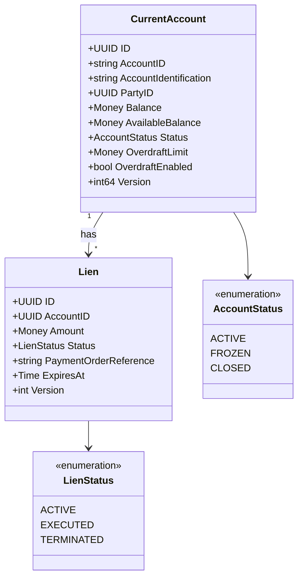
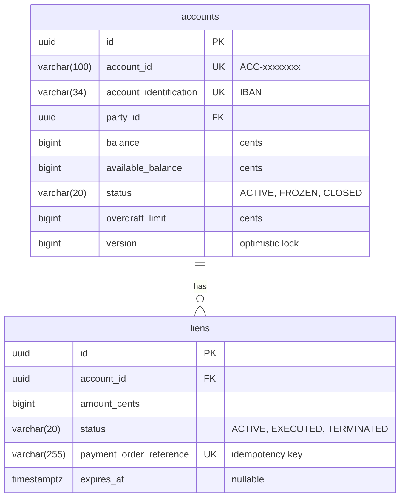

# CurrentAccount Service

BIAN-compliant current account facility microservice with lien-based payment reservations.

## Overview

| Attribute | Value |
|-----------|-------|
| **BIAN Domain** | Current Account |
| **Port** | 50057 (gRPC) |
| **Language** | Go |
| **Database** | PostgreSQL/CockroachDB |
| **Standalone** | No (requires Party, PositionKeeping, FinancialAccounting) |

## gRPC Methods

### Account Operations

| Method | HTTP | Purpose |
|--------|------|---------|
| `InitiateCurrentAccount` | `POST /v1/current-accounts` | Create new account |
| `ExecuteDeposit` | `POST /v1/current-accounts/{id}/deposits` | Deposit funds |
| `RetrieveCurrentAccount` | `GET /v1/current-accounts/{id}` | Get account details |

### Lien Operations (Fund Reservation)

| Method | HTTP | Purpose |
|--------|------|---------|
| `InitiateLien` | `POST /v1/current-accounts/{id}/liens` | Reserve funds |
| `ExecuteLien` | `POST /v1/liens/{id}/execute` | Debit reserved funds |
| `TerminateLien` | `POST /v1/liens/{id}/terminate` | Release reservation |
| `RetrieveLien` | `GET /v1/liens/{id}` | Get lien details |

## Domain Model



**Field Notes:**

- `AccountID`: Business ID format `ACC-{uuid[:8]}`
- `AccountIdentification`: IBAN format
- `PaymentOrderReference`: Idempotency key for payment orders

## Lien Lifecycle

```text
ACTIVE (reservation)
   │
   ├──→ EXECUTED (funds debited, payment committed)
   │
   └──→ TERMINATED (reservation released, payment cancelled)
```

- **ACTIVE**: Funds reserved, reduces AvailableBalance
- **EXECUTED**: Terminal state, funds withdrawn from Balance
- **TERMINATED**: Terminal state, AvailableBalance restored

## Service Dependencies

| Service | Port | Purpose |
|---------|------|---------|
| Party | 50055 | Validate party exists and is active |
| PositionKeeping | 50053 | Transaction audit trail logging |
| FinancialAccounting | 50052 | Double-entry ledger posting |

All clients use circuit breaker with exponential backoff retry (3 retries).

## Database Schema

**Schema**: `current_account`



## Configuration

| Variable | Default | Purpose |
|----------|---------|---------|
| `GRPC_PORT` | 50057 | gRPC server port |
| `DATABASE_URL` | - | PostgreSQL connection string |
| `K8S_NAMESPACE` | default | Kubernetes namespace for service discovery |
| `DB_MAX_OPEN_CONNS` | 25 | Connection pool size |

## Key Patterns

### Overdraft Facility

```text
AvailableBalance = Balance + (OverdraftEnabled ? OverdraftLimit : 0)
```

Allows withdrawals beyond zero balance up to the configured limit.

### Payment Order Saga Integration

1. `InitiateLien` - Reserve funds (updates AvailableBalance)
2. External payment processing
3. `ExecuteLien` (success) or `TerminateLien` (failure/cancellation)

### Optimistic Locking

All mutations check `WHERE version = expected_version`. Returns conflict error on mismatch.

## References

- [BIAN Current Account Specification](https://github.com/bian-official/public/blob/main/release13.0.0/semantic-apis/oas3/yamls/CurrentAccount.yaml)
- [Service Architecture](../README.md)
- [Proto Definitions](../../api/proto/meridian/current_account/v1/)
