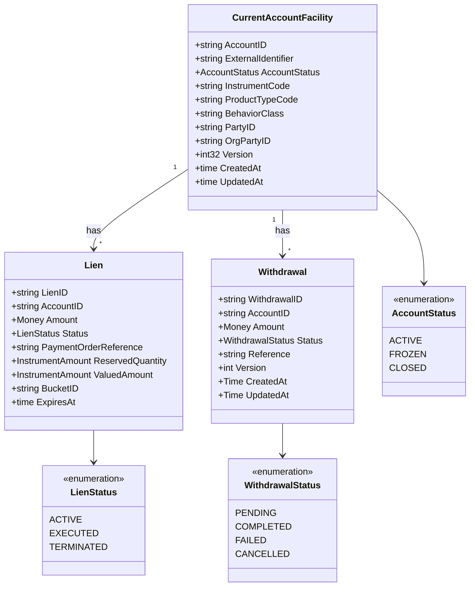

# current-account

BIAN Current Account service - customer-facing account facility in the Core Ledger
layer. Part of the [Core Ledger layer](../../docs/architecture-layers.md#4-core-ledger).

## Overview

| Attribute | Value |
|-----------|-------|
| **BIAN Domain** | Current Account |
| **Layer** | Core Ledger |
| **Port** | 50051 (gRPC) |
| **Database** | CockroachDB (`current_account` schema) |
| **Standalone** | No (requires party, position-keeping, financial-accounting, internal-account via saga layer) |

## API Surface

| Service | RPC | Purpose |
|---------|-----|---------|
| `CurrentAccountService` | `InitiateCurrentAccount` | Create a new customer account facility |
| `CurrentAccountService` | `ListCurrentAccounts` | Paginated list with status, IBAN, and party filters |
| `CurrentAccountService` | `RetrieveCurrentAccount` | Get account details including delegated balance |
| `CurrentAccountService` | `UpdateCurrentAccount` | Update overdraft settings or account configuration |
| `CurrentAccountService` | `ControlCurrentAccount` | FREEZE / UNFREEZE / CLOSE lifecycle action (BIAN CoCR) |
| `CurrentAccountService` | `ExecuteDeposit` | Execute a deposit saga (position-keeping + financial-accounting) |
| `CurrentAccountService` | `InitiateWithdrawal` | Create a pending withdrawal for later execution |
| `CurrentAccountService` | `ExecuteWithdrawal` | Commit a pending or direct withdrawal via saga |
| `CurrentAccountService` | `UpdateWithdrawal` | Modify a pending withdrawal before execution |
| `CurrentAccountService` | `RetrieveWithdrawal` | Get withdrawal by ID or list withdrawals by account |
| `CurrentAccountService` | `InitiateLien` | Reserve funds for a payment order |
| `CurrentAccountService` | `ExecuteLien` | Convert reservation to actual debit (terminal) |
| `CurrentAccountService` | `TerminateLien` | Release reservation without execution (terminal) |
| `CurrentAccountService` | `RetrieveLien` | Get lien details by ID |
| `CurrentAccountService` | `GetActiveAmountBlocks` | Active liens for position-keeping balance computation |
| `CurrentAccountService` | `CreateValuationFeature` | Add a valuation method mapping for multi-asset accounts |
| `CurrentAccountService` | `UpdateValuationFeature` | Lifecycle transitions on a valuation feature |
| `CurrentAccountService` | `GetValuationFeature` | Retrieve valuation feature by ID or bi-temporal query |
| `CurrentAccountService` | `ListValuationFeatures` | List valuation features for an account |
| `CurrentAccountService` | `EvaluateAssetValuation` | Non-binding valuation inquiry (same logic as InitiateLien) |

Proto: [`api/proto/meridian/current_account/v1/current_account.proto`](../../api/proto/meridian/current_account/v1/current_account.proto)

## Domain Model

Balance is not stored on `CurrentAccountFacility`; it is computed by `position-keeping`
per ADR-0023. `GetActiveAmountBlocks` exposes active liens so `position-keeping` can
subtract in-flight reservations from the available balance. Lien lifecycle is
ACTIVE -> EXECUTED (funds debited) or TERMINATED (reservation released); both are
terminal. Withdrawal lifecycle is PENDING -> COMPLETED / FAILED / CANCELLED.

## Dependencies

| Service | Protocol | Purpose |
|---------|----------|---------|
| `reference-data` | gRPC | Instrument lookup at account creation; saga definition retrieval (deposit/withdrawal Starlark scripts) |
| `position-keeping` | gRPC | Balance computation delegation per ADR-0023 (saga layer) |
| `financial-accounting` | gRPC | Double-entry ledger posting for deposits and withdrawals (saga layer) |
| `internal-account` | gRPC | Internal account resolution for payment routing (saga layer) |
| `party` | gRPC | Party validation at account creation (saga layer) |
| Redis | TCP | Idempotency store for deposit and withdrawal operations (required in production) |
| Kafka | TCP | Account lifecycle event publishing via transactional outbox (optional; enables outbox worker when set) |

## Dependents

| Service | Entry Point | Purpose |
|---------|-------------|---------|
| `payment-order` | `service/payment_orchestrator_lien.go`, `service/saga_handler_lien.go` | Lien initiation, execution, and termination during payment settlement |
| `position-keeping` | `service/account_validator.go`, `app/container.go` | Account validation for balance queries; active amount block (lien) reads |
| `reconciliation` | `app/container.go`, `service/account_party_resolver.go` | Account and party resolution for reconciliation workflows |

## Load-Bearing Files

| File | Why It Matters |
|------|----------------|
| `cmd/main.go` | Process wiring; initialises container, gRPC server, and outbox worker |
| `app/container.go` | Dependency injection; wires DB, Redis, Kafka; cross-service clients explicitly delegated to saga layer |
| `service/grpc_account_endpoints.go` | Account CRUD and lifecycle RPC handlers; account status state machine |
| `service/grpc_control_endpoints.go` | ControlCurrentAccount (FREEZE / UNFREEZE / CLOSE) with outbox-backed event publishing |
| `service/lien_lifecycle.go` | Lien state machine; ACTIVE -> EXECUTED / TERMINATED transitions with optimistic locking |
| `service/lien_service.go` | Lien reservation service; idempotency via PaymentOrderReference unique constraint |
| `service/grpc_withdrawal_execute.go` | ExecuteWithdrawal RPC handler; two-phase and direct withdrawal modes |
| `service/grpc_withdrawal_manage.go` | InitiateWithdrawal / UpdateWithdrawal / RetrieveWithdrawal RPC handlers |
| `service/saga_handler_financial_accounting.go` | Deposit and withdrawal saga; Starlark execution with LIFO compensation |
| `domain/account.go` | CurrentAccountFacility entity; overdraft rules and account status invariants |
| `domain/lien.go` | Lien entity; immutability rules after terminal transition |
| `domain/withdrawal.go` | Withdrawal entity; PENDING -> COMPLETED / FAILED / CANCELLED state machine |
| `config/accounts.go` | Clearing account configuration; enables double-entry when DEPOSIT_CLEARING_ACCOUNT_ID is set |

## Configuration

### Core

| Variable | Required | Default | Purpose |
|----------|----------|---------|---------|
| `DATABASE_URL` | Yes | - | CockroachDB connection string |
| `GRPC_PORT` | No | `50051` | gRPC listen port |
| `LOG_LEVEL` | No | `info` | Structured log level (`debug`, `info`, `warn`, `error`) |
| `ENVIRONMENT` | No | - | Deployment environment; `production` makes Redis required |
| `K8S_NAMESPACE` | No | `default` | Kubernetes namespace for saga-layer service DNS discovery |

### Authentication

| Variable | Required | Default | Purpose |
|----------|----------|---------|---------|
| `AUTH_ENABLED` | No | `true` | Enable JWT bearer authentication on all gRPC calls |
| `AUTH_JWKS_URL` | No | - | JWKS endpoint URL; required when `AUTH_ENABLED=true` |

### Messaging

| Variable | Required | Default | Purpose |
|----------|----------|---------|---------|
| `KAFKA_BOOTSTRAP_SERVERS` | No | - | Kafka broker list; enables outbox worker and account lifecycle events when set |

### Idempotency Store (Redis)

| Variable | Required | Default | Purpose |
|----------|----------|---------|---------|
| `REDIS_URL` | No* | `redis://localhost:6379` | Redis connection URL; *required in production (`ENVIRONMENT=production`) |
| `REDIS_PASSWORD` | No | - | Redis authentication password |
| `REDIS_DB` | No | `0` | Redis database index |

### Clearing Accounts

| Variable | Required | Default | Purpose |
|----------|----------|---------|---------|
| `DEPOSIT_CLEARING_ACCOUNT_ID` | No | - | Clearing account for deposit double-entry; omit to operate in single-entry mode |
| `WITHDRAWAL_CLEARING_ACCOUNT_ID` | No | - | Clearing account for withdrawal double-entry |
| `NOSTRO_ACCOUNT_ID` | No | - | Nostro account for cross-currency settlement |

## References

- [ADR-0023: Balance Delegation to Position Keeping](../../docs/adr/0023-balance-delegation-to-position-keeping.md)
- [ADR-0035: Multi-Asset Purity](../../docs/adr/0035-multi-asset-purity.md)
- [Architecture Layers - Core Ledger](../../docs/architecture-layers.md#4-core-ledger)
- [Service Coupling Analysis](../../docs/architecture/service-coupling-analysis.md)
- [BIAN Current Account specification](https://github.com/bian-official/public/blob/main/release14.0.0/semantic-apis/oas3%20/yamls/CurrentAccount.yaml)
