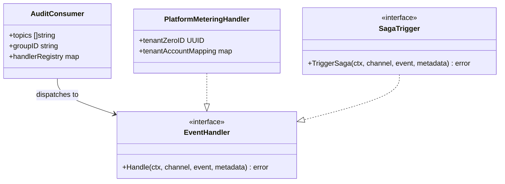
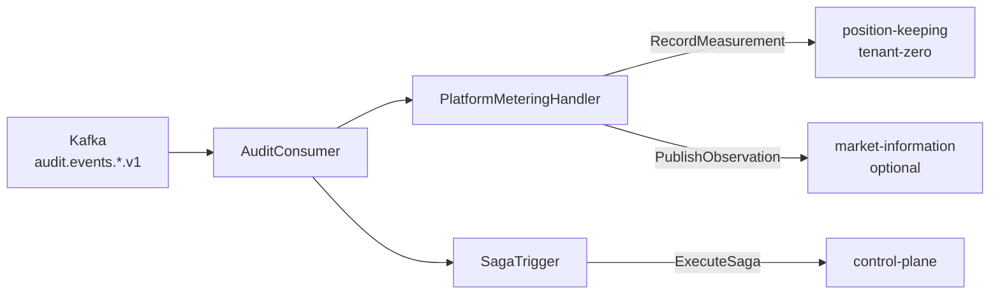

# event-router

Kafka consumer that routes domain events to saga triggers and platform billing measurements.
Part of the [Observability and Routing layer](../../docs/architecture-layers.md#8-observability-and-routing).

## Overview

| Attribute | Value |
|-----------|-------|
| **BIAN Domain** | Infrastructure (non-BIAN) |
| **Layer** | Observability and Routing |
| **Port** | 8080 (HTTP, health checks and metrics only; no gRPC port) |
| **Database** | None (stateless consumer) |
| **Standalone** | No (requires Kafka, `position-keeping`, and `control-plane`) |

## API Surface

event-router exposes no gRPC port and no business API endpoints. It is a pure consumer.
HTTP endpoints below are for operational use only (health probes and metrics).

### HTTP

| Method | Path | Purpose |
|--------|------|---------|
| `GET` | `/healthz` | Kubernetes liveness probe |
| `GET` | `/ready` | Readiness probe (checks consumer initialization) |
| `GET` | `/metrics` | Prometheus metrics endpoint |

## Domain Model

event-router is a stateless routing adapter. It does not own persistent domain
entities. The key interfaces are:

Events consumed: protobuf `AuditEvent` messages from `audit.events.<service>.v1` topics.
Measurements produced: gRPC `RecordMeasurement` calls to `position-keeping` on tenant-zero.

## Dependencies

| Service | Protocol | Purpose |
|---------|----------|---------|
| Kafka (`audit.events.*.v1` topics) | Kafka consumer | Source of all audit domain events |
| `position-keeping` | gRPC | `RecordMeasurement` for platform billing (tenant-zero) |
| `control-plane` | gRPC | `ExecuteSaga` for event-triggered saga workflows |
| `market-information` | gRPC (optional) | MDS observation publishing when `ENABLE_MDS_OUTPUT=true` |

## Dependents

event-router has no callers. It is an event consumer; all data flows outbound.

## Load-Bearing Files

Paths are relative to `services/event-router/`.

| File | Why It Matters |
|------|----------------|
| `cmd/main.go` | Entry point; wires the consumer pipeline, HTTP server, and shutdown |
| `app/config.go` | All configuration fields and defaults; the only source of required env var names |
| `adapters/messaging/audit_consumer.go` | Multi-topic Kafka consumer; dispatches each event to the handler registry |
| `adapters/messaging/platform_metering_handler.go` | Transforms audit events to utilization measurements; calls `RecordMeasurement` on tenant-zero |
| `adapters/grpc/position_keeping_client.go` | gRPC client for `position-keeping` `RecordMeasurement` |
| `domain/handler.go` | `EventHandler` interface contract; all new handlers must implement this |
| `domain/tenant_mapping.go` | Tenant-to-account mapping used to resolve billing accounts from tenant IDs |

## Configuration

| Variable | Required | Default | Purpose |
|----------|----------|---------|---------|
| `KAFKA_BOOTSTRAP_SERVERS` | Yes | - | Comma-separated Kafka broker addresses |
| `POSITION_KEEPING_ENDPOINT` | Yes | - | gRPC address of `position-keeping` (e.g., `position-keeping:50053`) |
| `TENANT_ZERO_ID` | Yes | - | UUID of the platform billing tenant for utilization metering |
| `CONSUMER_GROUP_ID` | No | `event-router` | Kafka consumer group ID |
| `TENANT_ACCOUNT_MAPPING` | No | - | JSON mapping of tenant UUIDs to billing account UUIDs |
| `HTTP_PORT` | No | `8080` | HTTP listen port (health and metrics) |
| `ENABLE_MDS_OUTPUT` | No | `true` | Enable MDS observation publishing to `market-information` |
| `MDS_SERVICE_ADDR` | No | - | gRPC address of `market-information` (required when `ENABLE_MDS_OUTPUT=true`) |
| `MDS_AGGREGATION_WINDOW` | No | `1h` | Measurement aggregation window before flush |
| `MDS_FLUSH_INTERVAL` | No | `5m` | How often to flush buffered MDS observations |

The six default audit topics are hard-coded in `app/config.go`:
`audit.events.current-account.v1`, `audit.events.financial-accounting.v1`,
`audit.events.position-keeping.v1`, `audit.events.party.v1`,
`audit.events.payment-order.v1`, `audit.events.tenant.v1`.

## Architecture

**Key properties:**

- At-least-once semantics: Kafka offsets commit only after successful handler dispatch.
- Idempotent saga triggering: idempotency key derived from event ID prevents duplicate saga starts on
  redelivery.
- Scale via HPA on Kafka consumer lag. A single consumer group (`event-router`) ensures each event is
  processed once per partition.

## References

- Architecture layers: [`docs/architecture-layers.md`](../../docs/architecture-layers.md#8-observability-and-routing)
- Event-driven architecture: [`docs/architecture/event-driven-architecture.md`](../../docs/architecture/event-driven-architecture.md)
- Kubernetes manifests: [`k8s/README.md`](k8s/README.md) - deployment, config, and network policy for this service
