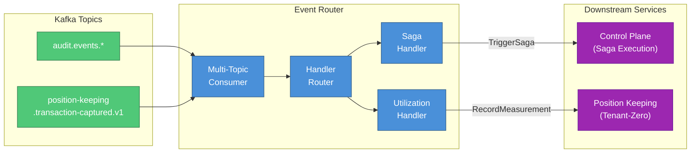

# Event Router

CEL-filtered saga dispatcher that routes domain events from Kafka to saga workflows and platform billing handlers.

## Overview

| Attribute | Value |
|-----------|-------|
| **Domain** | Infrastructure (Event Routing) |
| **Port** | 8080 (HTTP) |
| **Language** | Go |
| **Database** | None (stateless consumer) |
| **Standalone** | No (requires Kafka, Control Plane, Position Keeping) |

## Purpose

The Event Router provides event-driven workflow orchestration by:

- Consuming domain events from Kafka topics (audit events, transaction events)
- Routing events to registered handlers via the `EventHandler` interface
- Triggering saga workflows through the control-plane's `SagaExecutionService`
- Transforming audit events into utilization measurements for platform billing (tenant-zero)

## HTTP Endpoints

| Endpoint | Method | Purpose |
|----------|--------|---------|
| `/healthz` | GET | Liveness probe |
| `/ready` | GET | Readiness probe (checks consumer initialization) |
| `/metrics` | GET | Prometheus metrics endpoint |

## Architecture

### Handler Registry

The Event Router uses a pluggable handler model:

- **`EventHandler`** interface: `Handle(ctx, channel, event, metadata) error`
- **`SagaTrigger`** interface: Triggers sagas via control-plane gRPC with idempotency keys
- **`UtilizationPublisher`**: Transforms audit events into billing measurements



### Event Processing Pipeline

1. **Consume**: Read event from Kafka topic
2. **Deserialize**: Parse Protobuf event
3. **Route**: Dispatch to registered handler(s) based on channel
4. **Handle**: Handler processes event (trigger saga or record measurement)
5. **Commit**: Commit Kafka offset (at-least-once semantics)

## Service Dependencies

| Service | Port | Purpose |
|---------|------|---------|
| Kafka | 9092 | Domain event streaming |
| Control Plane | gRPC | Saga workflow triggering |
| Position Keeping | 50053 | Utilization measurements (tenant-zero billing) |

## Configuration

| Variable | Required | Default | Purpose |
|----------|----------|---------|---------|
| `KAFKA_BOOTSTRAP_SERVERS` | Yes | `kafka:9092` | Kafka broker addresses |
| `CONSUMER_GROUP_ID` | Yes | `event-router` | Consumer group identifier |
| `AUDIT_TOPICS` | Yes | - | Comma-separated list of topics to consume |
| `POSITION_KEEPING_ENDPOINT` | Yes | `position-keeping:50053` | Position Keeping gRPC endpoint |
| `TENANT_ZERO_ID` | Yes | - | UUID of platform billing tenant |
| `TENANT_ACCOUNT_MAPPING` | No | `{}` | JSON mapping of tenant IDs to billing accounts |
| `HTTP_PORT` | No | `8080` | HTTP server port for health/metrics |
| `CONTROL_PLANE_ENDPOINT` | Yes | - | Control Plane gRPC endpoint for saga triggering |
| `MARKET_DATA_ENDPOINT` | No | - | Market Information gRPC endpoint |

## Key Patterns

### Idempotent Saga Triggering

Saga triggers include an idempotency key derived from the source event. Duplicate triggers
(e.g., Kafka redelivery) return the existing saga ID without re-executing.

### Stateless Consumer

No local database. All state resides in downstream services (Control Plane for sagas,
Position Keeping for billing). This enables horizontal scaling without data partitioning.

### At-Least-Once Semantics

Manual Kafka offset commits after successful processing. Duplicate events are handled
by downstream idempotency.

## Directory Structure

```text
services/event-router/
├── cmd/                    # Entry point (main.go, Dockerfile)
├── domain/                 # Domain models
│   ├── handler.go          # EventHandler interface
│   ├── saga_trigger.go     # SagaTrigger interface
│   ├── measurement.go      # UtilizationMeasurement type
│   ├── instruments.go      # Instrument code mapping
│   ├── metrics.go          # Prometheus metrics
│   └── tenant_mapping.go   # Tenant-to-account mapping
├── adapters/               # External adapters
│   ├── grpc/               # Control Plane saga trigger client
│   ├── mds/                # Market Data Service client
│   └── messaging/          # Kafka consumer
├── app/                    # Application configuration
│   └── config.go           # Config loading and validation
├── internal/               # Internal implementation
├── k8s/                    # Kubernetes manifests
└── tests/                  # Integration tests
```

## References

- [Service Architecture](../README.md)
- [Kubernetes Deployment Guide](k8s/README.md)
- [Position Keeping Service](../position-keeping/README.md)
- [Control Plane Service](../control-plane/README.md)
