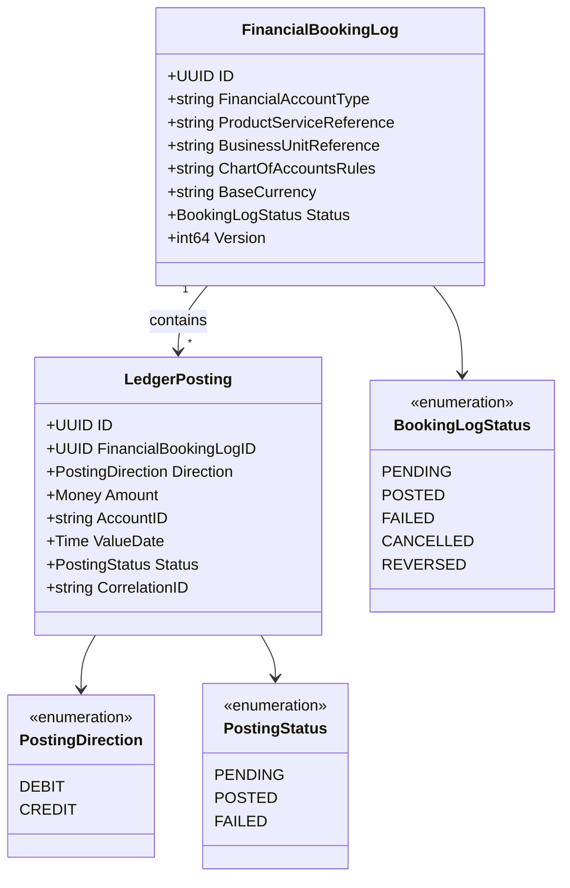
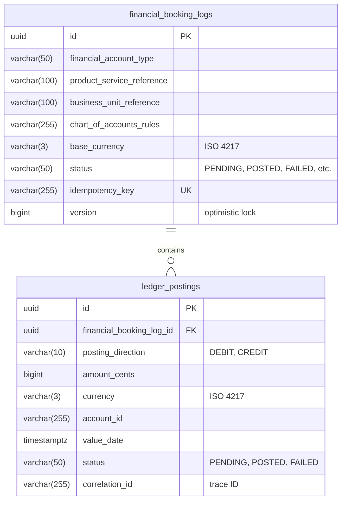

# FinancialAccounting Service

BIAN-compliant financial accounting microservice for double-entry bookkeeping.

## Overview

| Attribute | Value |
|-----------|-------|
| **BIAN Domain** | Financial Standard Management |
| **Port** | 50052 (gRPC), 8082 (metrics) |
| **Language** | Go |
| **Database** | PostgreSQL/CockroachDB |
| **Standalone** | Yes |

## gRPC Methods

### Booking Log Operations

| Method | HTTP | Purpose |
|--------|------|---------|
| `InitiateFinancialBookingLog` | `POST /v1/booking-logs` | Create booking log |
| `UpdateFinancialBookingLog` | `PUT /v1/booking-logs/{id}` | Update status/rules |
| `RetrieveFinancialBookingLog` | `GET /v1/booking-logs/{id}` | Get with postings |
| `ListFinancialBookingLogs` | `GET /v1/booking-logs` | List with filters |

### Ledger Posting Operations

| Method | HTTP | Purpose |
|--------|------|---------|
| `CaptureLedgerPosting` | `POST /v1/booking-logs/{id}/postings` | Create posting |
| `UpdateLedgerPosting` | `PUT /v1/postings/{id}` | Update status |
| `RetrieveLedgerPosting` | `GET /v1/postings/{id}` | Get posting |
| `ListLedgerPostings` | `GET /v1/postings` | List with filters |

## Domain Model



**Field Notes:**

- `BaseCurrency`: ISO 4217 currency code (GBP, USD, EUR, etc.)
- `CorrelationID`: Trace ID for distributed tracing

## Double-Entry Bookkeeping

Every financial transaction creates balanced postings:

```text
Deposit £500.00 (from bank's general ledger perspective):
  DEBIT   Cash/Reserves (bank's asset ↑)          = £500.00
  CREDIT  Customer Deposit Account (liability ↑)  = £500.00
  ──────────────────────────────────────────────────────────
  Balance Check: Debits (£500.00) = Credits (£500.00) ✓
```

**Note:** Customer deposits are liabilities on the bank's balance sheet
(money owed back to customers). The debit increases the bank's cash assets,
while the credit increases the liability to the customer.

**Validation Rules:**

- Amounts must be positive (reversals use opposite direction)
- Debits must equal credits within a booking log
- Terminal states (POSTED, FAILED) prevent further transitions

## Kafka Integration

**Consumer**: DepositEvent

Consumes deposit events and creates balanced debit/credit postings automatically.

**Idempotency Handling:**

| Source Field | Maps To | Purpose |
|--------------|---------|---------|
| `event_id` | `idempotency_key` | Dedupe on consumer restart/redelivery |
| `correlation_id` | `correlation_id` | Distributed tracing |

- Duplicate events (same `event_id`) are skipped with logged warning
- Partial failures: If booking log exists but posting missing, retry completes the posting
- Consumer commits offset after successful DB transaction (at-least-once delivery)

**Supported Currencies**: GBP, USD, EUR, JPY, CHF, CAD, AUD

## Database Schema

**Schema**: `financial_accounting`



## Configuration

| Variable | Default | Purpose |
|----------|---------|---------|
| `GRPC_PORT` | 50052 | gRPC server port |
| `METRICS_PORT` | 8082 | Prometheus metrics |
| `DATABASE_URL` | - | PostgreSQL connection string |
| `BANK_CASH_ACCOUNT_ID` | - | Well-known bank account |

## Prometheus Metrics

| Metric | Type | Purpose |
|--------|------|---------|
| `financial_accounting_operation_duration_seconds` | Histogram | Operation latency |
| `financial_accounting_postings_total` | Counter | Postings by direction/currency |
| `financial_accounting_double_entry_validations_total` | Counter | Balance checks |
| `financial_accounting_errors_total` | Counter | Errors by category |

## References

- [BIAN Financial Accounting Specification](https://github.com/bian-official/public/blob/main/release14.0.0/semantic-apis/oas3%20/yamls/FinancialAccounting.yaml)
- [Service Architecture](../README.md)
- [Proto Definitions](../../api/proto/meridian/financial_accounting/v1/)
