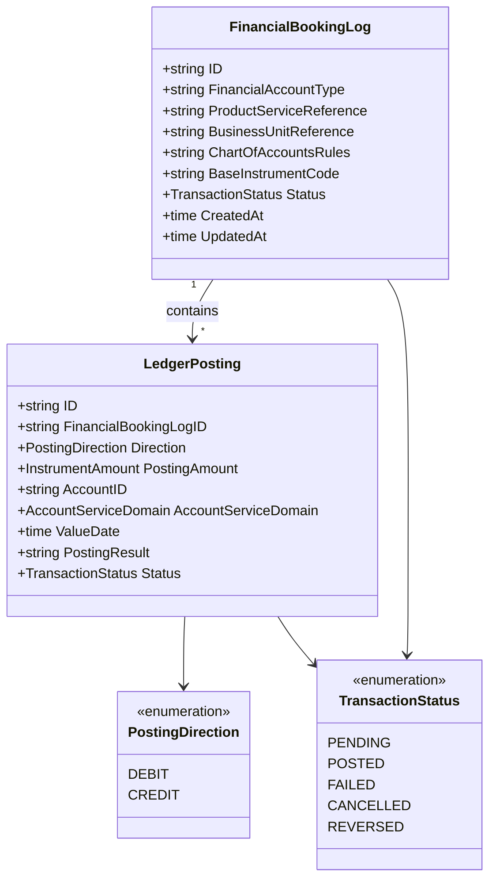

# financial-accounting

BIAN Financial Accounting service - the general ledger nucleus of the Core Ledger
layer. Part of the [Core Ledger layer](../../docs/architecture-layers.md#4-core-ledger).

## Overview

| Attribute | Value |
|-----------|-------|
| **BIAN Domain** | Financial Accounting |
| **Layer** | Core Ledger |
| **Port** | 50052 (gRPC), 8082 (metrics) |
| **Database** | CockroachDB (`financial_accounting` schema) |
| **Standalone** | Yes (no required Meridian service dependencies at startup) |

## API Surface

| Service | RPC | Purpose |
|---------|-----|---------|
| `FinancialAccountingService` | `InitiateFinancialBookingLog` | Create a new booking log (BIAN control record) |
| `FinancialAccountingService` | `UpdateFinancialBookingLog` | Update booking log status or chart-of-accounts rules |
| `FinancialAccountingService` | `RetrieveFinancialBookingLog` | Get booking log with all associated postings |
| `FinancialAccountingService` | `ListFinancialBookingLogs` | Paginated list with status and business-unit filters |
| `FinancialAccountingService` | `CaptureLedgerPosting` | Create a single debit or credit posting |
| `FinancialAccountingService` | `UpdateLedgerPosting` | Update posting status or result field |
| `FinancialAccountingService` | `RetrieveLedgerPosting` | Get a posting by ID |
| `FinancialAccountingService` | `ListLedgerPostings` | Paginated list with account, direction, date, and instrument filters |
| `FinancialAccountingService` | `ControlFinancialBookingLog` | SUSPEND / RESUME / TERMINATE lifecycle action (BIAN CoCR) |

Proto: [`api/proto/meridian/financial_accounting/v1/financial_accounting.proto`](../../api/proto/meridian/financial_accounting/v1/financial_accounting.proto)

## Domain Model

Every financial transaction creates at least one debit and one credit posting.
The booking log transitions to `POSTED` only when the sum of all `DEBIT` postings
equals the sum of all `CREDIT` postings (double-entry invariant enforced at service layer).
`PostingAmount` uses `InstrumentAmount` for multi-asset support: currencies, energy (kWh),
carbon credits, and compute hours are all valid posting units.

`POSTED`, `CANCELLED`, and `REVERSED` are behaviorally terminal: control actions block
further transitions on them. `FAILED` is the suspended state produced by the `SUSPEND` control
action and is resumable via `RESUME` (FAILED -> PENDING); it is not a true terminal from a
user-workflow perspective. Note: `TransactionStatus.IsFinal()` returns true for FAILED as well
(to prevent double-SUSPEND), while `FinancialBookingLog.IsTerminal()` returns true for
POSTED/FAILED/CANCELLED - the distinction is a code-level guard, not a state-machine
boundary. `REVERSED` is reserved for future offsetting-entry support and is not yet
produceable via `ControlFinancialBookingLog`.

## Dependencies

| Service | Protocol | Purpose |
|---------|----------|---------|
| `reference-data` | gRPC | Instrument validation for multi-asset postings (optional; enabled when `REFERENCE_DATA_SERVICE_URL` is set) |
| `internal-account` | gRPC | Account metadata resolution for posting routing (optional; account resolver) |
| Redis | TCP | Idempotency store for exactly-once posting guarantees |

## Dependents

| Service | Entry Point | Purpose |
|---------|-------------|---------|
| `current-account` | `service/saga_handler_financial_accounting.go` | Deposit and withdrawal saga - posts double-entry to the ledger |
| `payment-order` | `service/payment_orchestrator_ledger.go` | Settlement ledger posting after external payment confirms |
| `mcp-server` | `internal/clients/clients.go` | Read-side inspection of booking logs and postings |

## Load-Bearing Files

| File | Why It Matters |
|------|----------------|
| `cmd/main.go` | Process wiring; initialises container, gRPC server, and metrics server |
| `app/container.go` | Dependency injection; wires database, Redis, Kafka, and optional service clients |
| `service/server.go` | gRPC service registration; changes here affect the public contract |
| `service/posting_service.go` | Core double-entry validation; enforces debits-equal-credits invariant |
| `service/grpc_booking_endpoints.go` | Booking log RPC handlers; booking log lifecycle state machine |
| `service/grpc_ledger_endpoints.go` | Ledger posting RPC handlers; idempotency enforcement per posting |
| `domain/financial_booking_log.go` | FinancialBookingLog entity; status transition rules and aggregate invariants |
| `domain/ledger_posting.go` | LedgerPosting entity; direction semantics and immutability rules after capture |
| `config/config.go` | Idempotency cleanup worker configuration; Redis key TTL and batch parameters |

## Configuration

### Core

| Variable | Required | Default | Purpose |
|----------|----------|---------|---------|
| `DATABASE_URL` | Yes | - | CockroachDB connection string |
| `BANK_CASH_ACCOUNT_ID` | Yes | - | Bank cash account ID for the clearing side of double-entry; service fails to start without it |
| `GRPC_PORT` | No | `50052` | gRPC listen port |
| `METRICS_PORT` | No | `8082` | Prometheus metrics listen port |
| `LOG_LEVEL` | No | `info` | Structured log level (`debug`, `info`, `warn`, `error`) |
| `ENVIRONMENT` | No | - | Deployment environment; `production` makes Kafka and Redis required |
| `REFERENCE_DATA_SERVICE_URL` | No | - | reference-data gRPC address; enables instrument validation when set |

### Authentication

| Variable | Required | Default | Purpose |
|----------|----------|---------|---------|
| `AUTH_ENABLED` | No | `true` | Enable JWT bearer authentication on all gRPC calls |
| `AUTH_JWKS_URL` | No | - | JWKS endpoint URL; required when `AUTH_ENABLED=true` |

### Messaging

| Variable | Required | Default | Purpose |
|----------|----------|---------|---------|
| `KAFKA_BOOTSTRAP_SERVERS` | No | - | Kafka broker list; enables audit event publishing when set |
| `KAFKA_AUDIT_TOPIC` | No | `audit.events.*` | Audit event topic name override |

### Idempotency Store (Redis)

| Variable | Required | Default | Purpose |
|----------|----------|---------|---------|
| `REDIS_URL` | No* | `redis://localhost:6379` | Redis connection URL for idempotency store; *required in production (`ENVIRONMENT=production`) |
| `REDIS_PASSWORD` | No | - | Redis authentication password |
| `REDIS_DB` | No | `0` | Redis database index |
| `IDEMPOTENCY_CLEANUP_ENABLED` | No | `true` | Enable background cleanup of stale idempotency keys |
| `IDEMPOTENCY_CLEANUP_STALE_THRESHOLD` | No | `15m` | Duration before a `PENDING` key is considered stale |
| `IDEMPOTENCY_CLEANUP_RUN_INTERVAL` | No | `5m` | How often the cleanup worker polls for stale keys |
| `IDEMPOTENCY_CLEANUP_BATCH_SIZE` | No | `100` | Maximum stale keys processed per cleanup iteration |

## References

- [ADR-0023: Balance Delegation to Position Keeping](../../docs/adr/0023-balance-delegation-to-position-keeping.md)
- [ADR-0035: Multi-Asset Purity](../../docs/adr/0035-multi-asset-purity.md)
- [Architecture Layers - Core Ledger](../../docs/architecture-layers.md#4-core-ledger)
- [Service Coupling Analysis](../../docs/architecture/service-coupling-analysis.md)
- [BIAN Financial Accounting specification](https://github.com/bian-official/public/blob/main/release14.0.0/semantic-apis/oas3%20/yamls/FinancialAccounting.yaml)
