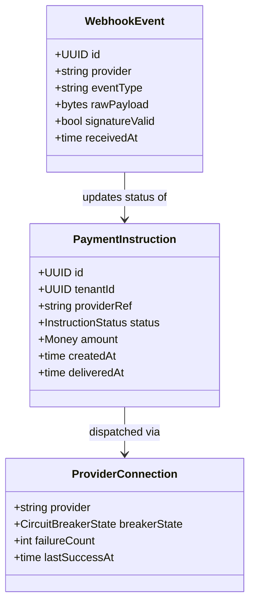

# Financial Gateway

External payment provider integration gateway for dispatching and reconciling financial
instructions. Sits on the [Financial Gateway layer](../../docs/architecture-layers.md#2-financial-gateway)
of the Meridian architecture.

## Overview

| Attribute | Value |
|-----------|-------|
| **BIAN Domain** | Payment Execution / Payment Gateway Management |
| **Layer** | Financial Gateway |
| **Port** | 50064 (gRPC), 8095 (HTTP webhook) |
| **Database** | CockroachDB (tenant-scoped, per-service schemas) |
| **Standalone** | No (requires CockroachDB, `control-plane` for tenant Stripe config, and an external provider such as Stripe) |

## API Surface

### gRPC

| Service | RPC | Purpose |
|---------|-----|---------|
| `FinancialGatewayService` | `DispatchPayment` | Send a payment instruction to the configured external provider |
| `FinancialGatewayService` | `DispatchRefund` | Issue a refund against a prior dispatched payment |
| `FinancialGatewayService` | `CancelPayment` | Cancel a dispatched but not-yet-settled payment |
| `FinancialGatewayService` | `GetProviderHealth` | Return health and circuit-breaker state for a provider connection |

Proto: [`api/proto/meridian/financial_gateway/v1/financial_gateway.proto`](../../api/proto/meridian/financial_gateway/v1/financial_gateway.proto).

### HTTP

| Method | Path | Purpose |
|--------|------|---------|
| `POST` | `/webhooks/stripe` | Inbound webhook receiver for Stripe events (HMAC-verified) |
| `GET` | `/health` | Liveness probe |
| `GET` | `/ready` | Readiness probe |

## Domain Model



`InstructionStatus` is `PENDING -> DISPATCHING -> DELIVERED -> ACKNOWLEDGED`, with
`FAILED` and `RETRYING` as terminal-or-recoverable branches. The circuit breaker is
implemented with `github.com/sony/gobreaker/v2`.

## Dependencies

| Service | Protocol | Purpose |
|---------|----------|---------|
| `control-plane` | gRPC | Fetch per-tenant Stripe configuration from the active manifest |
| External: Stripe API | HTTPS | Outbound payment dispatch |
| External: Kafka | TCP | Emit `financial_gateway_events.*` (settlement, failure) via the outbox publisher |
| External: CockroachDB | SQL | Persist `payment_instruction`, `event_outbox`, and connection state |

## Dependents

| Service | Entry Point | Purpose |
|---------|-------------|---------|
| `payment-order` | [`services/payment-order/adapters/gateway/financial_gateway_client.go`](../payment-order/adapters/gateway/financial_gateway_client.go) | Invokes `DispatchPayment` during the payment saga; consumes settlement events from `financial_gateway_events.*` |
| `payment-order` (Starlark) | `services/payment-order/app/container.go` (via `financialgatewayclient.RegisterStarlarkHandlers`) | Exposes the gateway client to tenant-defined Starlark sagas |
| `control-plane` (validator) | [`services/control-plane/cmd/validate/main.go`](../control-plane/cmd/validate/main.go) | Registers the Starlark handler set for manifest validation |

Nothing else calls Financial Gateway directly. Webhook traffic from Stripe is
inbound HTTP, not a Meridian service dependency.

## Load-Bearing Files

| File | Why It Matters |
|------|----------------|
| `cmd/main.go` | Wires the gRPC server, HTTP webhook receiver, Stripe adapter, outbox publisher, and platform bootstrap. Startup order matters - circuit breakers must initialise before the gRPC server starts accepting traffic |
| `service/server.go` | Implements `FinancialGatewayServiceServer`. Signature changes break `payment-order` callers and all downstream Starlark sagas |
| `config/config.go` | Single source of truth for environment variables and circuit-breaker defaults |
| `adapters/stripe/payment_intent_adapter.go` | Stripe-specific dispatch logic; the contract every future provider must mirror |
| `adapters/stripe/webhook_adapter.go` | HMAC verification and event-to-instruction reconciliation. Subtle invariants around idempotency and signature replay |
| `adapters/stripe/circuit_breaker.go` | Circuit-breaker wiring for outbound Stripe calls. Changes affect resiliency under provider degradation |
| `adapters/stripe/tenant_config.go` | Resolves per-tenant Stripe configuration from the control-plane manifest |
| `adapters/http/webhook_handler.go` | HTTP receiver that validates signatures before any side-effect runs |

Paths are relative to `services/financial-gateway/`.

## Configuration

### Core

| Variable | Required | Default | Purpose |
|----------|----------|---------|---------|
| `DATABASE_URL` | Yes | - | CockroachDB connection string |
| `GRPC_PORT` | No | `50064` | gRPC listen port (`ports.FinancialGateway`) |
| `HTTP_PORT` | No | `8095` | HTTP webhook listen port (`ports.FinancialGatewayHTTP`) |
| `LOG_LEVEL` | No | `info` | Log verbosity: `debug`, `info`, `warn`, `error` |

### Provider

| Variable | Required | Default | Purpose |
|----------|----------|---------|---------|
| `STRIPE_SECRET_KEY` | Yes (when Stripe is used) | - | Stripe API secret key for outbound dispatch |
| `CONTROL_PLANE_ADDR` | Yes | - | gRPC address of `control-plane` for per-tenant Stripe config |

### Resilience

| Variable | Required | Default | Purpose |
|----------|----------|---------|---------|
| `CIRCUIT_BREAKER_TIMEOUT` | No | `30s` | Time the circuit stays open before half-open |
| `CIRCUIT_BREAKER_FAILURES` | No | `5` | Consecutive failures before tripping the circuit |
| `RATE_LIMIT_RPS` | No | `100` | Sustained inbound request rate per second |
| `RATE_LIMIT_BURST` | No | `10` | Maximum burst above the sustained rate |

## Local Development

The financial-gateway is included in the Tilt local development stack:

```bash
cd ~/dev/github.com/meridianhub/meridian/meridian-main
tilt up
```

Run tests:

```bash
go test ./services/financial-gateway/...
```

End-to-end tests under `services/financial-gateway/e2e/` use CockroachDB
testcontainers and a Stripe mock; they take longer than unit tests and are gated
behind the standard `go test` invocation.

## References

- [Architecture Layers](../../docs/architecture-layers.md#2-financial-gateway)
- [Cross-Service Patterns](../../docs/patterns.md)
- [Data Flows: Payment Lifecycle](../../docs/data-flows.md#1-payment-lifecycle)
- [Service README Template](../../docs/service-readme-template.md)
- [Services Architecture](../README.md)
