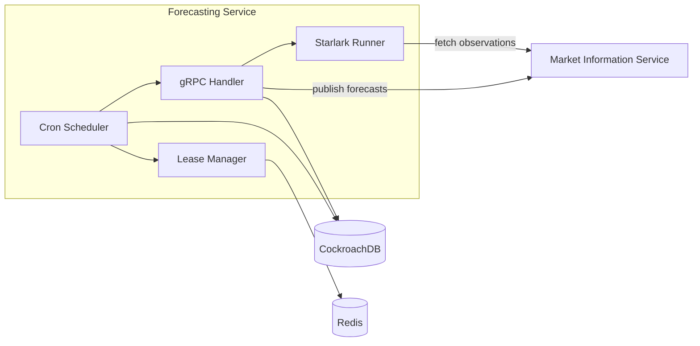
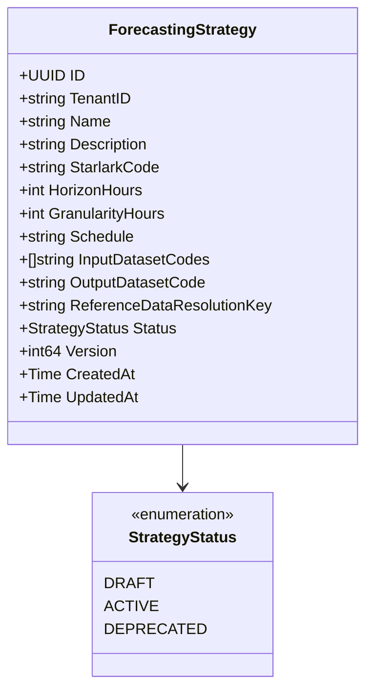
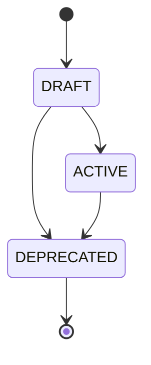
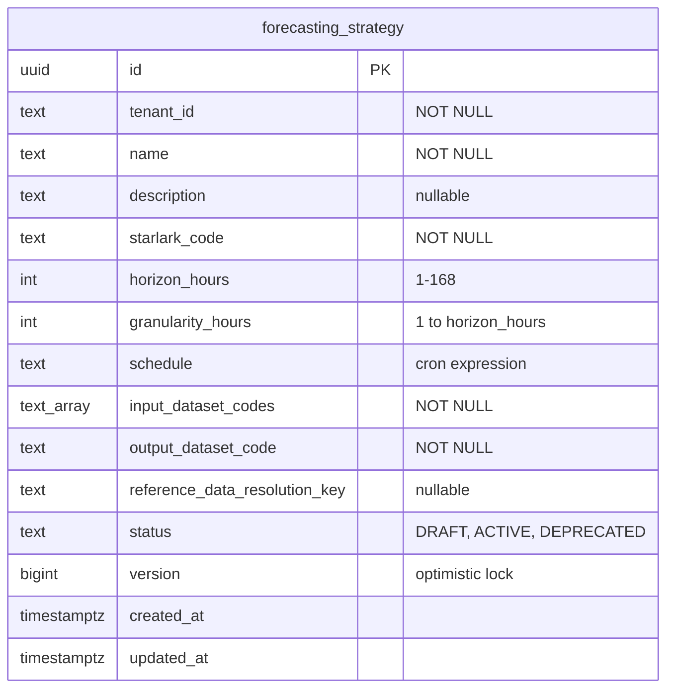

# Forecasting Service

Forward curve generation engine that executes tenant-defined Starlark strategies against Market Data Service observations.

## Overview

| Attribute | Value |
|-----------|-------|
| **Type** | Domain Service |
| **Port** | 50061 (gRPC), 8082 (HTTP/metrics) |
| **Language** | Go |
| **Database** | CockroachDB (`meridian_forecasting`) |
| **Standalone** | No (depends on Market Information Service) |

The Forecasting service allows tenants to define Starlark scripts that read historical market data observations,
compute forward curve predictions, and publish the results back to the Market Data Service as ESTIMATE quality
observations. Strategies are executed on cron schedules with distributed locking to prevent duplicate execution
across replicas.

## Architecture

**Execution flow:**

1. Cron scheduler fires for an active strategy
2. Lease manager acquires a Redis lock (prevents duplicate execution across pods)
3. Handler fetches the strategy from the database
4. Starlark runner fetches historical observations from MDS
5. Starlark runner resolves reference data (if configured)
6. Starlark script executes in a sandboxed environment (30s timeout)
7. Output forecast points are validated (horizon, monotonicity, granularity alignment)
8. Forecast points are published to MDS as ESTIMATE quality observations in batches of 1000

## gRPC Methods

| Method | Purpose |
|--------|---------|
| `ComputeForwardCurve` | Execute a forecasting strategy and publish results to MDS |

The service currently exposes a single RPC. Strategy CRUD operations are planned but not yet implemented.

## Starlark Sandbox

Strategies are written in [Starlark](https://github.com/bazelbuild/starlark), a Python-like language that
guarantees termination (no `while` loops, no recursion). Each script must define a `compute_forecast(ctx)` function.

**Context fields available to scripts:**

| Field | Type | Description |
|-------|------|-------------|
| `observations` | `dict[string, list[dict]]` | Historical observations keyed by dataset code |
| `reference_data` | `dict` or `None` | Resolved reference data node attributes |
| `horizon_seconds` | `int` | Total forecast window in seconds |
| `granularity_seconds` | `int` | Spacing between forecast points in seconds |
| `now` | `string` | Execution timestamp (RFC3339) |

**Builtin functions:**

| Category | Functions |
|----------|-----------|
| Statistical | `avg`, `sum`, `percentile` |
| Observation | `filter_by_hour`, `group_by_hour` |
| Time | `duration`, `add_seconds` |
| Arithmetic | `Decimal` (arbitrary-precision) |
| Stdlib (safe subset) | `len`, `str`, `int`, `float`, `bool`, `list`, `dict`, `tuple`, `range`, `enumerate`, `zip`, `sorted`, `reversed`, `min`, `max`, `abs`, `any`, `all`, `hasattr`, `getattr`, `dir`, `type`, `repr`, `hash`, `print` |

**Forbidden operations:** `import`, `load` -- all required functionality is provided via builtins.

**Script return format:** List of dicts with `timestamp` (RFC3339 string or unix int),
`value` (Decimal, string, float, or int), and optional `metadata` (dict).

### Built-in Templates

| Template | Description |
|----------|-------------|
| `moving_average.star` | Simple/exponential moving average projection |
| `seasonal_decomposition.star` | Hour-of-day seasonal pattern decomposition |
| `capacity_pricing.star` | Capacity-based pricing with reference data attributes |
| `external_blend.star` | Weighted blend of multiple input datasets |

## Domain Model

**Field Notes:**

- `HorizonHours`: 1-168 (max 7 days)
- `GranularityHours`: 1 to HorizonHours
- `Schedule`: Standard cron expression (e.g., `0 16 * * *`)
- `InputDatasetCodes`: At least one MDS dataset code required
- `ReferenceDataResolutionKey`: Optional hierarchy node context for the forecast

### Strategy Status

| Status | Description |
|--------|-------------|
| `DRAFT` | Strategy is being configured, not yet scheduled |
| `ACTIVE` | Strategy is scheduled for cron execution |
| `DEPRECATED` | Terminal state, strategy is retired |

**Status Transitions:**

- Only ACTIVE strategies can be executed via `ComputeForwardCurve`
- DEPRECATED is terminal (cannot be reactivated)
- Starlark code, description, and schedule can be updated while in DRAFT or ACTIVE

## Cron Scheduler

The scheduler polls the database every 60 seconds for active strategies and registers cron jobs for each.

| Setting | Value |
|---------|-------|
| Poll interval | 60 seconds |
| Shutdown timeout | 5 minutes |
| Lease TTL | 5 minutes (Redis) |
| Lease renewal | Every 30 seconds |
| Execution timezone | UTC |

**Distributed locking:** The `LeaseManager` uses Redis-based distributed locks to prevent multiple pods from
executing the same strategy simultaneously. Locks are automatically renewed during execution and released
on completion or during graceful shutdown.

## Database Schema

**Database**: `meridian_forecasting`

**Indexes:**

- `idx_forecasting_strategy_unique_active`: Partial unique on (tenant_id, name) WHERE status = 'ACTIVE'
- `idx_forecasting_strategy_tenant_status`: Covering index for tenant listing queries
- `idx_forecasting_strategy_active`: Partial index for scheduler lookups WHERE status = 'ACTIVE'

**Constraints:**

- `chk_forecasting_strategy_status`: status IN ('DRAFT', 'ACTIVE', 'DEPRECATED')
- `horizon_hours > 0 AND horizon_hours <= 168`
- `granularity_hours > 0 AND granularity_hours <= horizon_hours`

## Configuration

| Variable | Default | Purpose |
|----------|---------|---------|
| `GRPC_PORT` | 50061 | gRPC server port |
| `METRICS_PORT` | 8082 | HTTP metrics and health endpoint |
| `DATABASE_URL` | - | CockroachDB connection string |
| `DB_MAX_OPEN_CONNS` | 25 | Connection pool size |
| `DB_MAX_IDLE_CONNS` | 5 | Idle connections |
| `DB_CONN_MAX_LIFETIME` | 5m | Connection max age |
| `DB_CONN_MAX_IDLE_TIME` | 10m | Idle connection max age |
| `MDS_TARGET` | `market-information:50051` | Market Information Service gRPC target |
| `LOG_LEVEL` | info | Log level (debug, info, warn, error) |
| `LOG_FORMAT` | json | Log format |
| `AUTH_ENABLED` | false | Enable gRPC auth interceptor |
| `OTEL_SERVICE_NAME` | forecasting-service | OpenTelemetry service name |
| `OTEL_SAMPLING_RATE` | 0.1 | Trace sampling rate |
| `GRPC_MAX_CONCURRENT_STREAMS` | 100 | Max concurrent gRPC streams |

## Observability

### Metrics Endpoint

The service exposes Prometheus metrics on port 8082:

- **Endpoint**: `http://localhost:8082/metrics`
- **Health Check**: `http://localhost:8082/health`
- **Readiness Check**: `http://localhost:8082/ready`

### Prometheus Metrics

| Metric | Type | Labels | Description |
|--------|------|--------|-------------|
| `meridian_forecasting_scheduled_executions_total` | Counter | tenant_id, strategy_id, status | Total scheduled forecast executions |
| `meridian_forecasting_execution_duration_seconds` | Histogram | tenant_id, strategy_id | Duration of forecast execution |
| `meridian_forecasting_lease_acquisition_failures_total` | Counter | reason | Lease acquisition failures |
| `meridian_forecasting_active_strategies` | Gauge | - | Currently registered active strategies |
| `meridian_forecasting_scheduler_reloads_total` | Counter | outcome | Strategy reload cycles |
| `meridian_forecasting_scheduler_errors_total` | Counter | error_type | Scheduler errors |

**Note**: `tenant_id` and `strategy_id` labels on execution metrics can produce high cardinality. Monitor in production.

## Dependencies

| Service | Purpose |
|---------|---------|
| Market Information Service (50051) | Fetch historical observations; publish forecast points |
| CockroachDB | Strategy persistence |
| Redis | Distributed lease management for cron scheduler |

## Key Patterns

### Starlark Script Validation

The `validation` package performs static analysis before execution:

1. Checks Starlark syntax
2. Verifies `compute_forecast(ctx)` function exists with correct signature
3. Rejects forbidden operations (`import`, `load`)
4. Optionally performs dry-run execution with stub builtins

Validation results include AI-friendly suggestions for fixing issues (line, column, message, suggestion).

### Forecast Point Validation

After Starlark execution, returned points are validated:

- Timestamps must be within `[now, now + horizon]`
- Timestamps must be monotonically increasing
- Timestamps must be aligned to the granularity interval

### MDS Publishing

Forecast points are published to MDS as ESTIMATE quality observations in batches of 1000. Each observation
includes a client reference in the format `forecast:{strategy_id}:v{version}:{timestamp}` for idempotency.

### Optimistic Locking

Updates check `WHERE version = expected_version`. Returns conflict error on mismatch.

## Kubernetes Deployment

| Setting | Value |
|---------|-------|
| Replicas | 2 |
| CPU | 50m-200m |
| Memory | 64Mi-256Mi |
| User | 65532 (non-root) |
| Filesystem | Read-only |
| Service Type | Headless (ClusterIP: None) |
| Grace Period | 30 seconds |

## References

- [Service Architecture](../README.md)
- [Proto Definitions](../../api/proto/meridian/forecasting/v1/)
- [Port Assignments](../../shared/platform/ports/ports.go)
