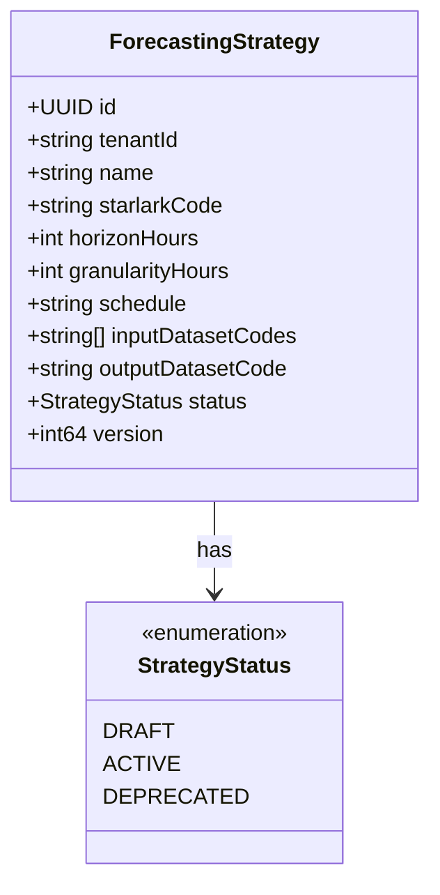
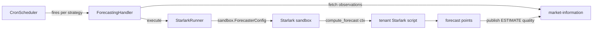

# forecasting

Forward curve generation engine that executes tenant-defined Starlark strategies against
Market Information Service observations on a cron schedule. Part of the
[Observability and Routing layer](../../docs/architecture-layers.md#8-observability-and-routing).

## Overview

| Attribute | Value |
|-----------|-------|
| **BIAN Domain** | Market Information Management |
| **Layer** | Observability and Routing |
| **Port** | 50061 (gRPC), 8082 (HTTP metrics and health) |
| **Database** | CockroachDB (tenant-scoped schemas) |
| **Standalone** | No (requires `market-information` gRPC; Redis for scheduler lease management, defaults to `localhost:6379`) |

## API Surface

### gRPC

| Service | RPC | Purpose |
|---------|-----|---------|
| `ForecastingService` | `ComputeForwardCurve` | Execute a forecasting strategy and publish output points to `market-information` as ESTIMATE quality |

Proto: [`api/proto/meridian/forecasting/v1/forecasting.proto`](../../api/proto/meridian/forecasting/v1/forecasting.proto).

### HTTP

| Method | Path | Purpose |
|--------|------|---------|
| `GET` | `/health` | Kubernetes liveness probe |
| `GET` | `/ready` | Kubernetes readiness probe |
| `GET` | `/metrics` | Prometheus metrics endpoint |

## Domain Model

`ForecastingStrategy.status` lifecycle: `DRAFT` -> `ACTIVE` -> `DEPRECATED`.
`DEPRECATED` is terminal - a deprecated strategy cannot be reactivated.
Optimistic locking is enforced via the `version` field; updates must supply the current version.

## Dependencies

| Service | Protocol | Purpose |
|---------|----------|---------|
| `market-information` | gRPC | Fetch historical observations as input; publish forward curve points as ESTIMATE quality |
| CockroachDB | SQL | Persists forecasting strategies and scheduler execution records |
| Redis | TCP | Distributed lease management per strategy to prevent duplicate cron execution |

## Dependents

No Meridian services call `forecasting` directly. The service publishes its output to
`market-information` as new ESTIMATE quality observations which other services may
then query via `market-information`.

## Load-Bearing Files

Paths are relative to `services/forecasting/`.

| File | Why It Matters |
|------|----------------|
| `cmd/main.go` | Entry point; wires database pool, MDS client, Starlark runner, handler, scheduler, and both servers |
| `config/config.go` | Configuration loading; the only source of env var names |
| `handler/forecasting_handler.go` | gRPC handler and internal execution entry point; orchestrates the full compute-and-publish flow |
| `starlark/runner.go` | `ForecastRunner` - applies sandbox, executes Starlark script, validates output, publishes to MDS |
| `domain/forecasting_strategy.go` | Aggregate root; enforces status transitions and immutability invariants |
| `scheduler/scheduler_adapters.go` | `ForecastScheduleProvider` and `ForecastScheduleExecutor` - plugs strategies into the shared cron scheduler |
| `templates/templates.go` | Built-in Starlark strategy templates (moving_average, seasonal_decomposition, capacity_pricing, external_blend) |

## Configuration

| Variable | Required | Default | Purpose |
|----------|----------|---------|---------|
| `DATABASE_URL` | Yes | - | CockroachDB connection string |
| `MDS_TARGET` | No | `market-information:50051` | gRPC address of `market-information` |
| `REDIS_ADDR` | No | `localhost:6379` | Redis address for distributed scheduler lease management |
| `GRPC_PORT` | No | `50061` | gRPC listen port |
| `METRICS_PORT` | No | `8082` | HTTP metrics and health listen port |
| `SCHEDULER_REFRESH_INTERVAL` | No | `60s` | How often the cron scheduler reloads active strategies |
| `LOG_LEVEL` | No | `info` | Log verbosity (`debug`, `info`, `warn`, `error`) |

## Architecture

**Starlark sandbox:** Uses `sandbox.ForecasterConfig` from `shared/platform/sandbox` - 10 s
wall-clock timeout, 1,000,000 max execution steps, 64 KB script size cap. Because Starlark
forbids `while` loops and recursion, every script is guaranteed to terminate. See
[`docs/patterns.md`](../../docs/patterns.md#6-starlark-sandbox) for the full sandbox
pattern reference.

**Distributed execution safety:** The scheduler holds a per-strategy Redis lease (TTL 5 min)
before executing. If a pod dies mid-execution, the lease expires and another pod picks up the
next scheduled run. The lease renews every 30 seconds during execution.

## References

- Starlark sandbox pattern: [`docs/patterns.md`](../../docs/patterns.md#6-starlark-sandbox)
- Architecture layers: [`docs/architecture-layers.md`](../../docs/architecture-layers.md#8-observability-and-routing)
- Sandbox presets: [`shared/platform/sandbox/config.go`](../../shared/platform/sandbox/config.go)
