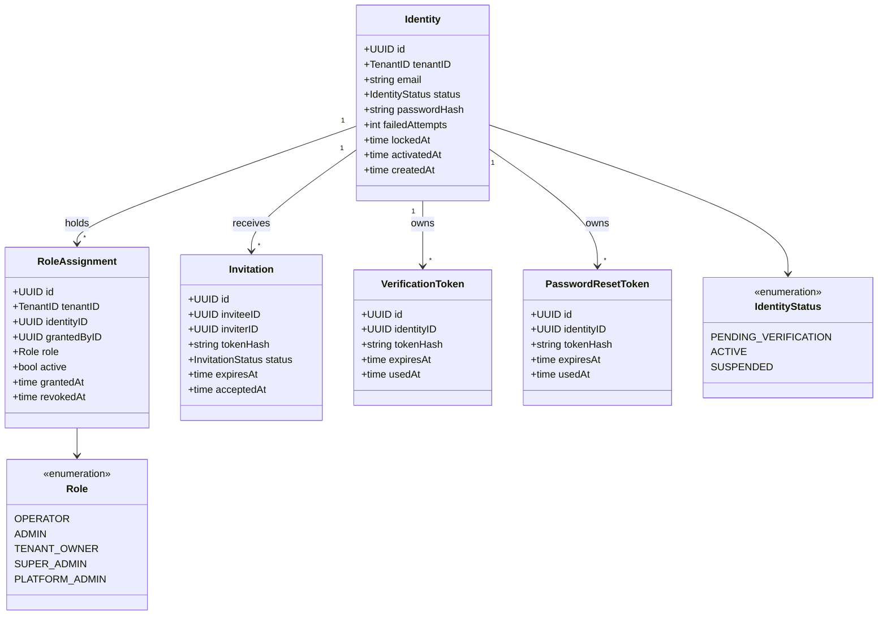
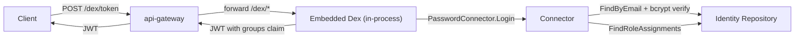

# identity

Platform identity and access management. Manages per-tenant user credentials, role
assignments, invitation flows, email verification, and password reset. Hosts an
embedded Dex OIDC server that issues JWTs consumed by the api-gateway.

Sits on the [Identity layer](../../docs/architecture-layers.md#7-identity)
of the Meridian architecture.

## Overview

| Attribute | Value |
|-----------|-------|
| **BIAN Domain** | Infrastructure (non-BIAN) |
| **Layer** | Identity |
| **Port** | Shared gRPC port of the unified binary (default `50051`); Dex OIDC served at `/dex/*` via `api-gateway` HTTP port |
| **Database** | CockroachDB (per-tenant `org_<id>` schemas; platform admin in `org_meridian_master`) |
| **Standalone** | No (embedded in `cmd/meridian`; requires `api-gateway` to expose OIDC endpoints) |

## API Surface

### gRPC

| Service | RPC | Purpose |
|---------|-----|---------|
| `IdentityService` | `CreateIdentity` | Create a new user account in a tenant |
| `IdentityService` | `RetrieveIdentity` | Fetch user by ID |
| `IdentityService` | `UpdateIdentity` | Update display name or profile fields |
| `IdentityService` | `ListIdentities` | List users within the caller's tenant |
| `IdentityService` | `Authenticate` | Validate email and password; returns identity and roles |
| `IdentityService` | `SetPassword` | Set password (admin operation, no current-password check) |
| `IdentityService` | `ChangePassword` | Change password with current-password verification |
| `IdentityService` | `RequestPasswordReset` | Issue a time-limited reset token and queue email |
| `IdentityService` | `CompletePasswordReset` | Redeem reset token and set new password |
| `IdentityService` | `GrantRole` | Assign a role to an identity (caller must outrank target) |
| `IdentityService` | `RevokeRole` | Remove a role assignment |
| `IdentityService` | `ListRoleAssignments` | List all active role assignments for an identity |
| `IdentityService` | `InviteUser` | Create a pending identity and send invitation email |
| `IdentityService` | `AcceptInvitation` | Redeem invitation token and activate account |
| `IdentityService` | `SuspendIdentity` | Move identity to SUSPENDED status |
| `IdentityService` | `ReactivateIdentity` | Restore SUSPENDED identity to ACTIVE |

Proto: [`api/proto/meridian/identity/v1/identity.proto`](../../api/proto/meridian/identity/v1/identity.proto).

### OIDC (HTTP via api-gateway)

Dex endpoints are mounted by the api-gateway at `/dex/*` without authentication middleware.
All standard OIDC paths are served by the embedded Dex instance.

| Path | Purpose |
|------|---------|
| `/dex/.well-known/openid-configuration` | OIDC discovery document |
| `/dex/keys` | JWKS endpoint (public key rotation every 6 hours) |
| `/dex/token` | Token endpoint (password grant, authorization code exchange) |
| `/dex/auth` | Authorization endpoint |

The connector ID is `meridian`. Token signing uses a local signer with 6-hour key
rotation backed by Dex in-memory storage.

## Domain Model

Roles form a hierarchy: `PLATFORM_ADMIN > SUPER_ADMIN > TENANT_OWNER > ADMIN > OPERATOR`.
`GrantRole` enforces that the caller's highest active role strictly outranks the role being
granted. This hierarchy is implemented in `domain/identity.go:CanGrant`.

### Dex Integration

The `connector` package implements `dex/dexserver.PasswordConnector`. It calls the
identity repository directly (no gRPC hop) and maps role assignments to JWT `groups` claims.

## Dependencies

| Service | Protocol | Purpose |
|---------|----------|---------|
| CockroachDB | SQL | User credentials, role assignments, invitations, verification tokens |
| Email outbox (PostgreSQL) | SQL | Queue invitation, verification, and password-reset emails via `shared/pkg/email` |

## Dependents

Grepped from the codebase for `identityconnector` and `IdentityService` callers.

| Service | Entry Point | Purpose |
|---------|-------------|---------|
| `api-gateway` | `services/api-gateway/cmd/main.go` | Wires `identityconnector` for SSO; mounts `/dex/*` handler and validates JWTs via Dex JWKS |

## Load-Bearing Files

Paths are relative to `services/identity/`.

| File | Why It Matters |
|------|----------------|
| `service/server.go` | gRPC service root; wires repository, email outbox, and base URL |
| `service/grpc_identity_endpoints.go` | Identity CRUD and authentication RPCs including lockout enforcement |
| `service/grpc_role_endpoints.go` | Role grant/revoke RPCs; enforces caller-outranks-target invariant |
| `service/grpc_invitation_endpoints.go` | Invitation and acceptance flow; token generation and email queuing |
| `dex/server.go` | Embedded Dex lifecycle; `StartServer` must be called before serving OIDC requests |
| `dex/connector_adapter.go` | Bridges Dex `PasswordConnector` to Meridian identity domain |
| `connector/connector.go` | Core authentication logic: `FindByEmail`, bcrypt verify, lockout check, role claims |
| `domain/identity.go` | Identity aggregate: status machine, password hashing, lockout logic |
| `domain/role_assignment.go` | RoleAssignment aggregate and `CanGrant` privilege hierarchy |
| `bootstrap/bootstrap.go` | Platform admin bootstrap and demo user seeding on first boot |
| `migrations/` | Atlas-managed schema; never edit applied files |

## Configuration

Identity is embedded in the unified binary. Configuration is consumed at the
`cmd/meridian` level and passed to the identity service during wiring.

| Variable | Required | Default | Purpose |
|----------|----------|---------|---------|
| `DATABASE_URL` | Yes | `postgres://root@localhost:26257/defaultdb?sslmode=disable` | CockroachDB base DSN |
| `BASE_DOMAIN` | No | `app.meridianhub.cloud` | Base domain used to construct invitation accept links |
| `PLATFORM_ADMIN_EMAIL` | No | - | Email for the bootstrapped platform admin (first-boot only) |
| `PLATFORM_ADMIN_PASSWORD` | No | - | Password for the bootstrapped platform admin |
| `DEMO_OPERATOR_EMAIL` | No | - | Email for demo operator users to seed at startup |
| `DEMO_OPERATOR_PASSWORD` | No | - | Password for demo operator users |
| `DEMO_OPERATOR_TENANT` | No | `volterra` | Comma-separated tenant IDs to seed the demo operator into |
| `DEX_CONNECTORS` | No | - | JSON array of external OIDC connector definitions (Google, Azure AD) |
| `DEX_REDIRECT_URIS` | No | - | Additional OAuth redirect URIs added to the Dex client at startup |

## Security Considerations

RBAC method permissions are declared in `rbac/method_permissions.go`. The
`Authenticate` RPC enforces account lockout after 5 consecutive failed attempts.
Invitation tokens, verification tokens, and password reset tokens are stored as
bcrypt hashes - the plaintext is only returned at issuance. Dex key rotation
occurs every 6 hours; the JWKS endpoint at `/dex/keys` always reflects the
current keyset.

## References

- [`docs/architecture-layers.md`](../../docs/architecture-layers.md) - Identity layer description
- [`api/proto/meridian/identity/v1/`](../../api/proto/meridian/identity/v1/) - Proto definitions
- [`cmd/meridian/wire_identity.go`](../../cmd/meridian/wire_identity.go) - Unified binary wiring
- ADR-0002: Microservices per BIAN Domain
