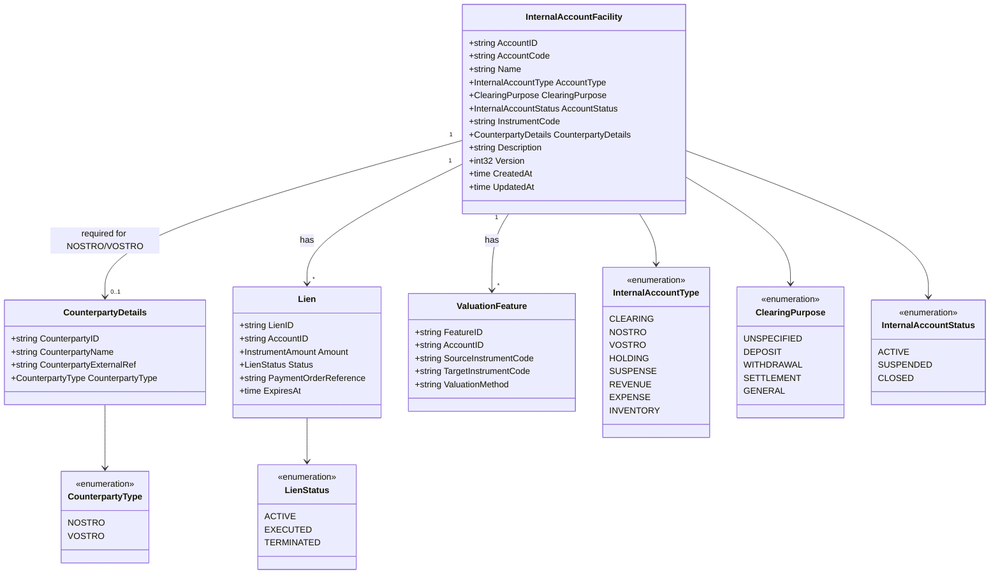

# internal-account

BIAN Internal Account service - counterparty and operational account registry in the Core Ledger
layer. Part of the [Core Ledger layer](../../docs/architecture-layers.md#4-core-ledger).

## Overview

| Attribute | Value |
|-----------|-------|
| **BIAN Domain** | Internal Account |
| **Layer** | Core Ledger |
| **Port** | 50057 (gRPC), 8082 (metrics) |
| **Database** | CockroachDB (`internal_account` schema) |
| **Standalone** | Yes (no required Meridian service dependencies at startup) |

## API Surface

| Service | RPC | Purpose |
|---------|-----|---------|
| `InternalAccountService` | `InitiateInternalAccount` | Create a new internal account facility |
| `InternalAccountService` | `UpdateInternalAccount` | Update account name, description, or counterparty details |
| `InternalAccountService` | `ControlInternalAccount` | SUSPEND / ACTIVATE / CLOSE lifecycle action (BIAN CoCR) |
| `InternalAccountService` | `RetrieveInternalAccount` | Get account details by ID or account code |
| `InternalAccountService` | `ListInternalAccounts` | Paginated list with type, status, and clearing-purpose filters |
| `InternalAccountService` | `GetBalance` | Query current balance (proxied to position-keeping) |
| `InternalAccountService` | `CreateValuationFeature` | Add a valuation method mapping for multi-asset accounts |
| `InternalAccountService` | `UpdateValuationFeature` | Lifecycle transitions on a valuation feature |
| `InternalAccountService` | `GetValuationFeature` | Retrieve valuation feature by ID or bi-temporal query |
| `InternalAccountService` | `ListValuationFeatures` | List valuation features for an account |
| `InternalAccountService` | `EvaluateAssetValuation` | Non-binding valuation inquiry |
| `InternalAccountService` | `InitiateLien` | Reserve funds on an internal account |
| `InternalAccountService` | `ExecuteLien` | Convert reservation to actual debit (terminal) |
| `InternalAccountService` | `TerminateLien` | Release reservation without execution (terminal) |
| `InternalAccountService` | `RetrieveLien` | Get lien details by ID |

Proto: [`api/proto/meridian/internal_account/v1/internal_account.proto`](../../api/proto/meridian/internal_account/v1/internal_account.proto)

## Domain Model

Balance is not stored on `InternalAccountFacility`; it is computed by `position-keeping`
per ADR-0023. `NOSTRO` and `VOSTRO` accounts require `CounterpartyDetails`; all other
account types must omit it. `CLEARING` accounts carry a `ClearingPurpose` to allow
downstream callers to distinguish deposit, withdrawal, and settlement clearing lanes.
Lien lifecycle mirrors `current-account`: ACTIVE -> EXECUTED (terminal) or TERMINATED (terminal).

## Dependencies

| Service | Protocol | Purpose |
|---------|----------|---------|
| `position-keeping` | gRPC | Balance computation for `GetBalance` (client not yet wired at startup; `GetBalance` returns `Unimplemented` until connected) |
| Kafka | TCP | Account lifecycle event publishing via transactional outbox (optional; enables outbox worker when `KAFKA_BOOTSTRAP_SERVERS` is set) |

## Dependents

| Service | Entry Point | Purpose |
|---------|-------------|---------|
| `payment-order` | `service/account_resolver.go` | Internal account resolution for payment routing |
| `control-plane` | `internal/applier/internal_account_client.go`, `internal/applier/handlers.go` | Account provisioning from tenant manifest (declarative account creation) |
| `position-keeping` | `service/account_validator.go`, `app/container.go` | Account validation for position and balance operations |
| `financial-accounting` | `service/account_resolver.go`, `service/client_interfaces.go` | Internal account resolution for double-entry routing |
| `current-account` | `service/account_resolver.go`, `service/client_interfaces.go` | Internal account resolution in deposit and withdrawal sagas |

## Load-Bearing Files

| File | Why It Matters |
|------|----------------|
| `cmd/main.go` | Process wiring; initialises container, gRPC server, outbox worker, and metrics server |
| `app/container.go` | Dependency injection; wires DB and Kafka; position-keeping and reference-data explicitly not yet wired |
| `service/server.go` | gRPC service registration; changes here affect the public contract |
| `service/grpc_account_endpoints.go` | Account CRUD RPC handlers; account status state machine and counterparty-details validation |
| `service/grpc_balance_endpoints.go` | `GetBalance` RPC; delegates to position-keeping with 5-second timeout |
| `service/lien_service.go` | Lien reservation service; ACTIVE->EXECUTED/TERMINATED state machine |
| `service/valuation_feature_service.go` | Valuation feature CRUD and lifecycle transitions |
| `service/valuation_engine.go` | `EvaluateAssetValuation` computation logic |
| `domain/internal_account.go` | InternalAccountFacility entity; account type invariants and status transition rules |
| `domain/lien.go` | Lien entity; immutability rules after terminal transition |
| `domain/valuation_feature.go` | ValuationFeature entity; instrument dimension mapping rules |
| `domain/account_type.go` | AccountType enum and counterparty-details requirement enforcement |
| `domain/clearing_purpose.go` | ClearingPurpose enum; valid purpose-to-type combinations |

## Configuration

### Core

| Variable | Required | Default | Purpose |
|----------|----------|---------|---------|
| `DATABASE_URL` | Yes | - | CockroachDB connection string |
| `GRPC_PORT` | No | `50057` | gRPC listen port |
| `METRICS_PORT` | No | `8082` | Prometheus metrics listen port |
| `LOG_LEVEL` | No | `info` | Structured log level (`debug`, `info`, `warn`, `error`) |

### Authentication

| Variable | Required | Default | Purpose |
|----------|----------|---------|---------|
| `AUTH_ENABLED` | No | `true` | Enable JWT bearer authentication on all gRPC calls |
| `AUTH_JWKS_URL` | No | - | JWKS endpoint URL; required when `AUTH_ENABLED=true` |

### Messaging

| Variable | Required | Default | Purpose |
|----------|----------|---------|---------|
| `KAFKA_BOOTSTRAP_SERVERS` | No | - | Kafka broker list; enables outbox worker and account lifecycle events when set |

## References

- [ADR-0023: Balance Delegation to Position Keeping](../../docs/adr/0023-balance-delegation-to-position-keeping.md)
- [ADR-0035: Multi-Asset Purity](../../docs/adr/0035-multi-asset-purity.md)
- [Architecture Layers - Core Ledger](../../docs/architecture-layers.md#4-core-ledger)
- [Service Coupling Analysis](../../docs/architecture/service-coupling-analysis.md)
- [BIAN Internal Account specification](https://github.com/bian-official/public/blob/main/release14.0.0/semantic-apis/oas3%20/yamls/InternalAccount.yaml)
- [Benchmarks](benchmarks/README.md) - performance benchmarks for this service
- [Examples](examples/README.md) - runnable usage examples
