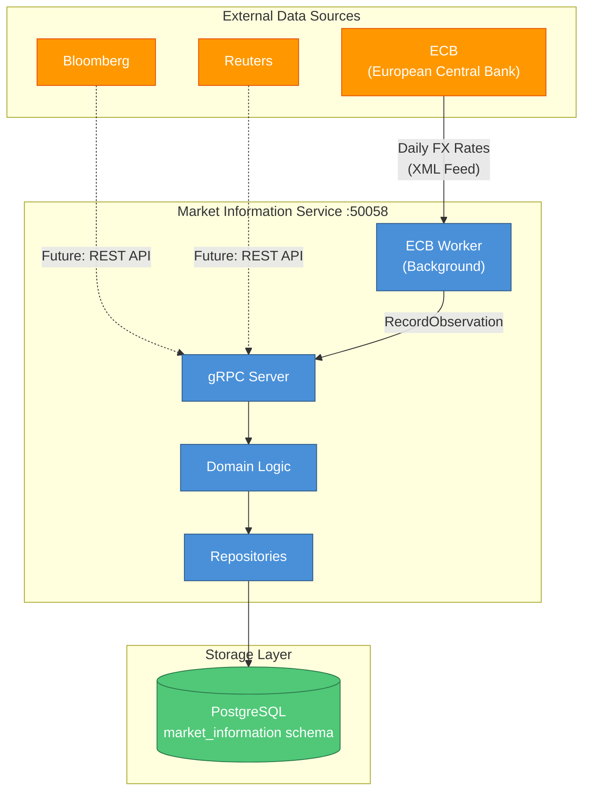
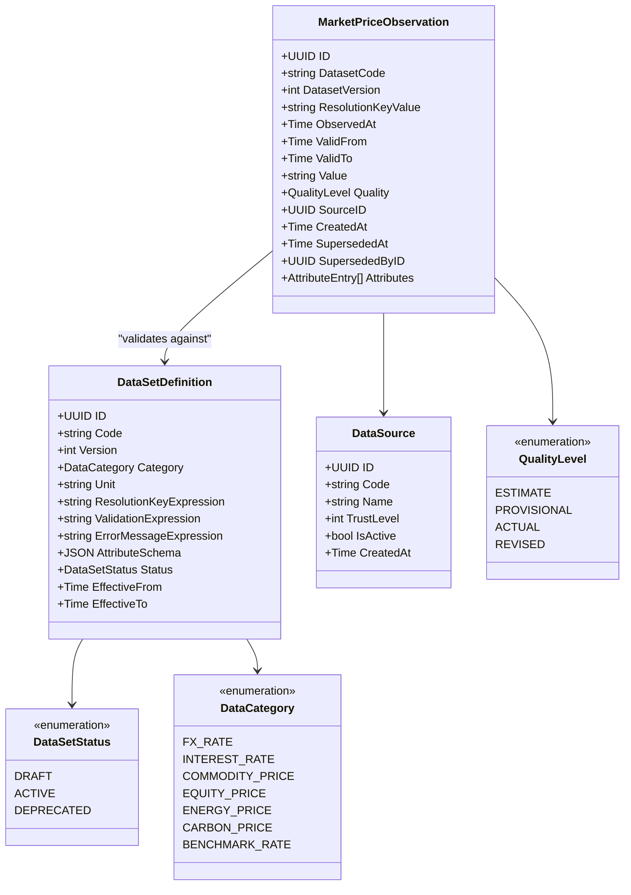
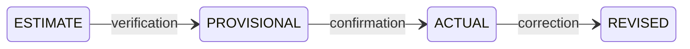
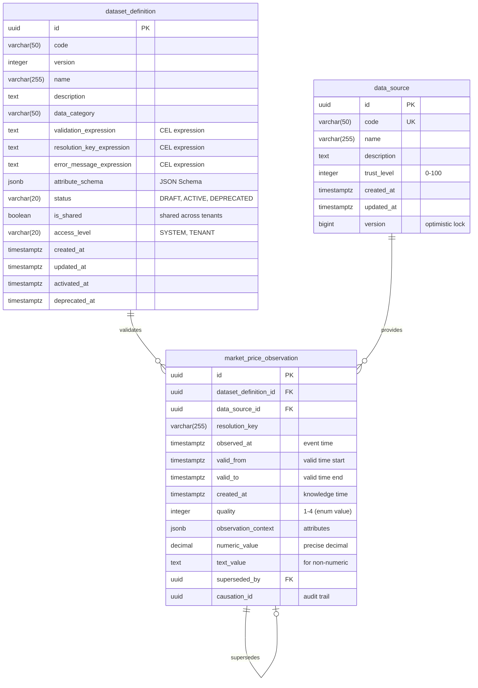

# Market Information Service

BIAN-compliant market information management service for market data sets, price
observations, and data sources with bi-temporal support.

## Overview

| Attribute | Value |
|-----------|-------|
| **BIAN Domain** | Market Information Management |
| **Port** | 50058 (gRPC) |
| **Language** | Go |
| **Database** | PostgreSQL/CockroachDB |
| **Standalone** | Yes |

## gRPC Methods

### Data Set Operations

| Method | HTTP | Purpose |
|--------|------|---------|
| `RegisterDataSet` | `POST /v1/market-information/datasets` | Create new data set definition |
| `UpdateDataSet` | `PATCH /v1/market-information/datasets/{code}` | Modify DRAFT data set |
| `ActivateDataSet` | `POST /v1/market-information/datasets/{code}/activate` | Transition to ACTIVE |
| `DeprecateDataSet` | `POST /v1/market-information/datasets/{code}/deprecate` | Transition to DEPRECATED |
| `RetrieveDataSet` | `GET /v1/market-information/datasets/{code}` | Get data set by code |
| `ListDataSets` | `GET /v1/market-information/datasets` | List with filters |

### Data Source Operations

| Method | HTTP | Purpose |
|--------|------|---------|
| `RegisterDataSource` | `POST /v1/market-information/sources` | Create new data source |
| `UpdateDataSource` | `PATCH /v1/market-information/sources/{code}` | Modify data source |
| `DeactivateDataSource` | `POST /v1/market-information/sources/{code}/deactivate` | Mark as inactive |
| `ListDataSources` | `GET /v1/market-information/sources` | List with filters |

### Observation Operations

| Method | HTTP | Purpose |
|--------|------|---------|
| `RecordObservation` | `POST /v1/market-information/observations` | Record single observation |
| `RecordObservationBatch` | `POST /v1/market-information/observations/batch` | Record batch (1-1000) |
| `RetrieveObservation` | `GET /v1/market-information/observations/{observation_id}` | Get observation by ID |
| `ListObservations` | `GET /v1/market-information/datasets/{dataset_code}/observations` | List with filters |

## BIAN Alignment

This service implements the **Market Information Management** service domain from BIAN v14.0, which provides:

- Market data feed management and aggregation
- Price observation capture with multiple data sources
- Bi-temporal query support (knowledge time vs event time)
- Quality ladder for data confidence levels
- Data set versioning and lifecycle management

**Market Information vs Reference Data:**

| Responsibility | Service |
|----------------|---------|
| **Market data observations** (prices, rates) | Market Information |
| **Instrument definitions** (currencies, assets) | Reference Data |
| **Time-series data** (historical prices) | Market Information |
| **Asset metadata** (decimal places, codes) | Reference Data |
| **Quality levels** (ESTIMATE, ACTUAL) | Market Information |
| **CEL validation rules** | Both (different contexts) |

## Architecture



**Flow:**

1. External data sources push/pull market data to service
2. ECB Worker polls ECB daily for EUR FX rates (background job)
3. gRPC API receives observations from clients or internal workers
4. Domain layer validates against data set CEL expressions
5. Repositories persist to PostgreSQL with bi-temporal tracking

## Data Model



**Field Notes:**

- `ResolutionKeyExpression`: CEL expression to generate unique observation keys
  - Example: `'spot'` for simple spot prices
  - Example: `tenor + ':' + settlement_type` for rate curves
- `ValidationExpression`: CEL expression to validate observation values
  - Example: `value > 0 && value < 10000` for price bounds
- `AttributeSchema`: JSON Schema defining valid attributes for observations

## Component Responsibilities

### Market Information Service

**Owns:**

- Market price observations (time-series data)
- Data set definitions (what can be observed)
- Data sources (who provides data)
- Quality levels (confidence in observations)
- Bi-temporal tracking (when observed, when known)

**Examples:**

- EUR/USD exchange rate at 1.0850 observed at 2026-01-20T10:00:00Z
- LIBOR 3-month rate at 5.25% with quality ACTUAL
- Brent crude oil price at $85.50/barrel from Reuters (trust level 90)

### Reference Data Service

**Owns:**

- Instrument definitions (currencies, commodities, assets)
- Validation rules for quantities
- Fungibility rules for position aggregation
- Asset metadata (decimal places, ISO codes)

**Examples:**

- EUR currency definition (ISO 4217, 2 decimal places)
- GBP_PER_MWH energy unit definition
- BRENT_CRUDE commodity instrument definition

**Why the separation?**

- **Market Information**: Dynamic time-series data that changes frequently
- **Reference Data**: Static metadata that changes infrequently
- **Market Information**: Multiple observations per second (high-frequency)
- **Reference Data**: Version-controlled definitions (low-frequency)

## Quality Ladder

Market Information uses a **Time-Bound Quality Ladder** to handle evolving data quality:



| Quality Level | Value | Description | Supersedes |
|--------------|-------|-------------|------------|
| `ESTIMATE` | 1 | Preliminary estimate, subject to revision | None |
| `PROVISIONAL` | 2 | Provisional value, pending final verification | ESTIMATE |
| `ACTUAL` | 3 | Verified, final value | PROVISIONAL |
| `REVISED` | 4 | Corrected value replacing previous observation | ACTUAL |

**Ordering:** `ESTIMATE < PROVISIONAL < ACTUAL < REVISED`

**Supersession Rules:**

- Higher quality observations can supersede lower quality
- `superseded_by_id` links to the newer observation
- `superseded_at` records when supersession occurred
- Original observations remain queryable (bi-temporal support)

**Example Flow:**

```text
10:00 AM - ESTIMATE:  1.0800 (quick estimate)
10:15 AM - PROVISIONAL: 1.0850 (supersedes ESTIMATE)
11:00 AM - ACTUAL:     1.0855 (supersedes PROVISIONAL)
12:00 PM - REVISED:    1.0860 (correction, supersedes ACTUAL)
```

## Bi-Temporal Support

Market Information supports **bi-temporal queries** with two time dimensions:

| Time Dimension | Field | Meaning |
|----------------|-------|---------|
| **Event Time** | `observed_at` | When the observation occurred in the real world |
| **Knowledge Time** | `created_at` | When the system learned about the observation |
| **Valid Time** | `valid_from`, `valid_to` | When the observation value is valid (for forward curves) |

**Use Cases:**

- **Historical Analysis:** "What was the EUR/USD rate at 10:00 AM on Jan 20?"
  - Query: `observed_at = 2026-01-20T10:00:00Z`

- **Regulatory Audit:** "What did we know about EUR/USD at 10:00 AM on Jan 20?"
  - Query: `created_at <= 2026-01-20T10:00:00Z`

- **Forward Curves:** "What is the 3-month LIBOR rate valid from March 1?"
  - Query: `valid_from = 2026-03-01`

**Supersession Tracking:**

```text
Event Time    Knowledge Time   Quality      Value    Superseded?
2026-01-20    2026-01-20       ESTIMATE     1.0800   Yes (by observation 2)
  10:00         10:05
2026-01-20    2026-01-20       PROVISIONAL  1.0850   No
  10:00         10:15
```

Query at `knowledge_base_time = 2026-01-20T10:10:00Z` returns ESTIMATE (1.0800).
Query at `knowledge_base_time = 2026-01-20T10:20:00Z` returns PROVISIONAL (1.0850).

## Database Schema

**Schema**: `market_information`



**Constraints:**

- `dataset_definition`:
  - Unique: `(code, version)`
  - Check: `status IN ('DRAFT', 'ACTIVE', 'DEPRECATED')`
  - Check: Expression lengths <= 4096 chars
  - Trigger: `enforce_dataset_lifecycle` (immutability rules)

- `data_source`:
  - Unique: `code`
  - Check: `trust_level >= 0 AND trust_level <= 100`

- `market_price_observation`:
  - Index: `(dataset_definition_id, observed_at)` for time-series queries
  - Index: `(dataset_definition_id, resolution_key, observed_at)`
  - Check: `quality >= 1 AND quality <= 4`

**Lifecycle Enforcement:**

The `enforce_dataset_lifecycle` trigger ensures:

1. **DRAFT → ACTIVE**: Sets `activated_at`, freezes validation rules
2. **ACTIVE → DEPRECATED**: Sets `deprecated_at`, allows metadata updates
3. **Immutability**: Cannot modify validation rules after activation

## Usage Examples

### Register Data Set

```bash
grpcurl -d '{
  "code": "EUR_USD_FX",
  "category": "DATA_CATEGORY_FX_RATE",
  "unit": "EUR/USD",
  "resolution_key_expression": "\"spot\"",
  "validation_expression": "value > 0 && value < 10",
  "error_message_expression": "\"Invalid FX rate: \" + string(value)",
  "effective_from": "2026-01-01T00:00:00Z",
  "display_name": "EUR/USD Spot Rate",
  "description": "Euro to US Dollar exchange rate"
}' \
  -plaintext localhost:50058 \
  meridian.market_information.v1.MarketInformationService/RegisterDataSet
```

### Record Observation

```bash
grpcurl -d '{
  "dataset_code": "EUR_USD_FX",
  "observed_at": "2026-01-20T10:00:00Z",
  "valid_from": "2026-01-20T10:00:00Z",
  "value": "1.0850",
  "quality": "QUALITY_LEVEL_ACTUAL",
  "source_code": "ECB"
}' \
  -plaintext localhost:50058 \
  meridian.market_information.v1.MarketInformationService/RecordObservation
```

### Record Batch Observations

```bash
grpcurl -d '{
  "observations": [
    {
      "dataset_code": "EUR_USD_FX",
      "observed_at": "2026-01-20T10:00:00Z",
      "valid_from": "2026-01-20T10:00:00Z",
      "value": "1.0850",
      "quality": "QUALITY_LEVEL_ACTUAL",
      "source_code": "ECB",
      "client_reference": "ref-001"
    },
    {
      "dataset_code": "EUR_GBP_FX",
      "observed_at": "2026-01-20T10:00:00Z",
      "valid_from": "2026-01-20T10:00:00Z",
      "value": "0.8520",
      "quality": "QUALITY_LEVEL_ACTUAL",
      "source_code": "ECB",
      "client_reference": "ref-002"
    }
  ]
}' \
  -plaintext localhost:50058 \
  meridian.market_information.v1.MarketInformationService/RecordObservationBatch
```

### List Observations with Filters

```bash
grpcurl -d '{
  "dataset_code": "EUR_USD_FX",
  "observed_from": "2026-01-20T00:00:00Z",
  "observed_to": "2026-01-20T23:59:59Z",
  "quality_filter": "QUALITY_LEVEL_ACTUAL",
  "page_size": 100
}' \
  -plaintext localhost:50058 \
  meridian.market_information.v1.MarketInformationService/ListObservations
```

### Retrieve Observation (Bi-Temporal)

```bash
# Current knowledge
grpcurl -d '{
  "observation_id": "123e4567-e89b-12d3-a456-426614174000"
}' \
  -plaintext localhost:50058 \
  meridian.market_information.v1.MarketInformationService/RetrieveObservation

# Historical knowledge (as-known-at 10:15 AM)
grpcurl -d '{
  "observation_id": "123e4567-e89b-12d3-a456-426614174000",
  "knowledge_base_time": "2026-01-20T10:15:00Z"
}' \
  -plaintext localhost:50058 \
  meridian.market_information.v1.MarketInformationService/RetrieveObservation
```

## Configuration

| Variable | Default | Purpose |
|----------|---------|---------|
| `GRPC_PORT` | 50058 | gRPC server port |
| `METRICS_PORT` | 8082 | Prometheus metrics endpoint port |
| `DATABASE_URL` | - | PostgreSQL connection string |
| `DB_MAX_OPEN_CONNS` | 25 | Connection pool size |
| `DB_MAX_IDLE_CONNS` | 5 | Idle connections |
| `DB_CONN_MAX_LIFETIME` | 5m | Connection max age |
| `LOG_LEVEL` | info | Logging level (debug, info, warn, error) |

### ECB Adapter Configuration

| Variable | Default | Purpose |
|----------|---------|---------|
| `ECB_ENABLED` | false | Enable ECB FX rate fetching |
| `ECB_ENDPOINT` | `https://www.ecb.europa.eu/stats/eurofxref/eurofxref-daily.xml` | ECB XML feed URL |
| `ECB_INTERVAL` | 24h | Fetch interval |
| `ECB_TIMEOUT` | 30s | HTTP request timeout |
| `ECB_MAX_RETRIES` | 3 | Retry attempts on failure |
| `ECB_DATASET_CODE` | `ECB_EUR_FX` | Data set code for ECB rates |
| `ECB_SOURCE_CODE` | `ECB` | Data source code |

**ECB Worker:**

- Background worker polls ECB daily for EUR FX rates
- Parses XML feed and records observations with quality ACTUAL
- Automatically creates data source on first run
- Logs errors and retries on transient failures

## Observability

### Metrics Endpoint

The service exposes Prometheus metrics on port 8082:

- **Endpoint**: `http://localhost:8082/metrics`
- **Health Check**: `http://localhost:8082/health`
- **Readiness Check**: `http://localhost:8082/ready`

**Key Metrics:**

| Metric | Type | Labels | Description |
|--------|------|--------|-------------|
| `grpc_server_handled_total` | Counter | method, code | Total gRPC requests by method and status |
| `grpc_server_handling_seconds` | Histogram | method | Request duration by method |
| `market_information_observations_recorded_total` | Counter | dataset_code, quality | Total observations recorded |
| `market_information_observations_superseded_total` | Counter | dataset_code | Total observations superseded |
| `market_information_validation_errors_total` | Counter | dataset_code, error_type | CEL validation failures |

### Distributed Tracing

OpenTelemetry OTLP export to tracing backends:

- Automatic trace context propagation via gRPC interceptors
- Span annotations for CEL validation execution
- Database query tracing with connection pool metrics

## Testing

### Running Tests

```bash
# Run all tests
go test ./...

# Run with coverage
go test -cover ./...

# Run specific test
go test -run TestDataSetRepository_Create ./adapters/persistence
```

### Integration Tests

Integration tests use Testcontainers for PostgreSQL:

```bash
# Requires Docker
go test -tags=integration ./adapters/persistence/...
```

**Test Coverage:**

- Unit tests: Domain logic, validation, mappers
- Integration tests: Repository operations, database constraints
- End-to-end tests: Full gRPC service workflows

## References

- [BIAN Market Information Management Specification](https://github.com/bian-official/public/blob/main/release14.0.0/semantic-apis/oas3%20/yamls/MarketInformationManagement.yaml)
- [Service Architecture](../README.md)
- [Proto Definitions](../../api/proto/meridian/market_information/v1/)
- [ADR-0002: Microservices per BIAN Domain](../../docs/adr/0002-microservices-per-bian-domain.md)
- [ADR-0020: Per-Service Audit Workers](../../docs/adr/0020-per-service-audit-workers.md)
- [CEL Language Specification](https://github.com/google/cel-spec)
