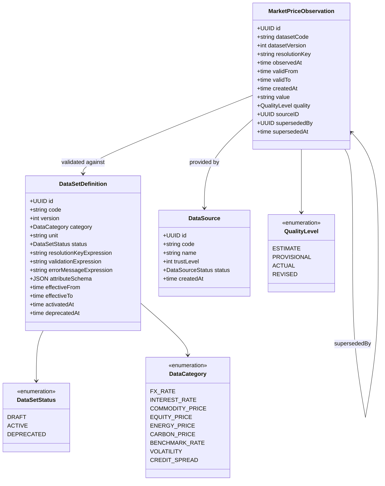

# market-information

BIAN Market Information Management service. Stores bi-temporal price observations
across data categories: FX rates, interest rates, energy prices, carbon prices,
commodity prices, equity prices, and utilization benchmarks.

Sits on the [Reference and Registry layer](../../docs/architecture-layers.md#6-reference-and-registry)
of the Meridian architecture.

## Overview

| Attribute | Value |
|-----------|-------|
| **BIAN Domain** | Market Information Management |
| **Layer** | Reference and Registry |
| **Port** | 50058 (gRPC), 8082 (HTTP health/metrics) |
| **Database** | CockroachDB (per-tenant schema) |
| **Standalone** | No (requires CockroachDB) |

## API Surface

### gRPC

| Service | RPC | Purpose |
|---------|-----|---------|
| `MarketInformationService` | `RegisterDataSet` | Create a data set definition (DRAFT) |
| `MarketInformationService` | `UpdateDataSet` | Modify a DRAFT data set |
| `MarketInformationService` | `ActivateDataSet` | Transition DRAFT to ACTIVE |
| `MarketInformationService` | `DeprecateDataSet` | Transition ACTIVE to DEPRECATED |
| `MarketInformationService` | `RetrieveDataSet` | Fetch one data set by code |
| `MarketInformationService` | `ListDataSets` | Paginated list with category and status filters |
| `MarketInformationService` | `RegisterDataSource` | Register a data provider (ECB, Bloomberg, etc.) |
| `MarketInformationService` | `UpdateDataSource` | Modify a data source |
| `MarketInformationService` | `DeactivateDataSource` | Mark a source inactive |
| `MarketInformationService` | `DeprecateDataSource` | Mark a source deprecated |
| `MarketInformationService` | `ListDataSources` | List registered data sources |
| `MarketInformationService` | `RecordObservation` | Record a single price observation |
| `MarketInformationService` | `RecordObservationBatch` | Record up to 1000 observations atomically |
| `MarketInformationService` | `RetrieveObservation` | Fetch an observation by ID; supports `knowledge_base_time` for bi-temporal lookup |
| `MarketInformationService` | `ListObservations` | Time-range and quality-filtered observation queries |

Proto: [`api/proto/meridian/market_information/v1/market_information.proto`](../../api/proto/meridian/market_information/v1/market_information.proto).

## Domain Model



### Bi-Temporal Model

Every observation carries two time dimensions:

| Dimension | Field | Meaning |
|-----------|-------|---------|
| Event time | `observed_at` | When the price occurred in the real world |
| Knowledge time | `created_at` | When the system recorded the observation |
| Valid time | `valid_from`, `valid_to` | When the value is valid (forward curves) |

`RetrieveObservation` accepts an optional `knowledge_base_time` to answer "what did the
system know as of time T?" - the regulatory audit use case.

### Quality Ladder

Higher-quality observations supersede lower-quality ones for the same dataset and
`resolution_key`. Supersession is non-destructive: older observations remain queryable.

```text
ESTIMATE(1) -> PROVISIONAL(2) -> ACTUAL(3) -> REVISED(4)
```

## Dependencies

| Service | Protocol | Purpose |
|---------|----------|---------|
| CockroachDB | SQL | All observation and definition persistence |
| ECB SDMX API | HTTP (background) | Daily EUR FX rate ingestion via ECB worker (when `ECB_ENABLED=true`) |

Market Information has no outbound gRPC dependencies. It is a leaf service.

## Dependents

Grepped from `rg "market_information" services/` across the codebase.

| Service | Entry Point | Purpose |
|---------|-------------|---------|
| `forecasting` | `services/forecasting/adapters/mds/mds_adapter.go` | Fetch historical price observations for forward curve generation |
| `event-router` | `services/event-router/adapters/mds/market_data_publisher.go` | Publish platform utilization measurements as observations |
| `control-plane` | `services/control-plane/internal/applier/market_information_client.go` | Apply data set definitions from tenant manifests |
| `api-gateway` | `services/api-gateway/cache/mds_source.go` | Cache market data for direct read endpoints |
| `mcp-server` | `services/mcp-server/internal/clients/clients.go` | Expose market data query tools to LLM clients |

## Load-Bearing Files

Paths are relative to `services/market-information/`.

| File | Why It Matters |
|------|----------------|
| `cmd/main.go` | Wires gRPC server, ECB worker, and HTTP server; ECB worker lifecycle is managed here |
| `service/server.go` | gRPC service implementation; all five operation groups are delegated from here |
| `service/observation_service.go` | Observation recording with supersession logic and CEL validation |
| `service/cel_validator.go` | CEL expression evaluation for dataset validation rules; compile-cache lives here |
| `service/observation_query.go` | Bi-temporal query builder; `knowledge_base_time` filtering is implemented here |
| `config/config.go` | All configuration loaded from environment variables (relative to `services/market-information/`) |
| `migrations/` | Atlas-managed schema; never edit applied files |

## Configuration

### Core

| Variable | Required | Default | Purpose |
|----------|----------|---------|---------|
| `DATABASE_URL` | Yes | - | CockroachDB connection string (relative to service startup directory) |
| `GRPC_PORT` | No | `50058` | gRPC listen port |
| `METRICS_PORT` | No | `8082` | HTTP port for `/metrics`, `/health`, `/ready` endpoints |
| `LOG_LEVEL` | No | `info` | Structured log level (`debug`, `info`, `warn`, `error`) |

### ECB Adapter

| Variable | Required | Default | Purpose |
|----------|----------|---------|---------|
| `ECB_ENABLED` | No | `false` | Enable background ECB FX rate worker |
| `ECB_ENDPOINT` | No | ECB client default | ECB SDMX Web Service URL |
| `ECB_SOURCE_CODE` | No | `ECB` | Data source code registered in Market Information |
| `ECB_DATASET_CODE` | No | `ECB_FX` | Dataset code prefix for ECB FX rates |
| `ECB_INTERVAL` | No | `24h` | Polling interval |
| `ECB_TIMEOUT` | No | `30s` | HTTP request timeout |
| `ECB_MAX_RETRIES` | No | `3` | Retry attempts on transient failure |

## References

- [`docs/architecture-layers.md`](../../docs/architecture-layers.md) - Reference and Registry layer description
- [`api/proto/meridian/market_information/v1/`](../../api/proto/meridian/market_information/v1/) - Proto definitions
- ADR-0002: Microservices per BIAN Domain
