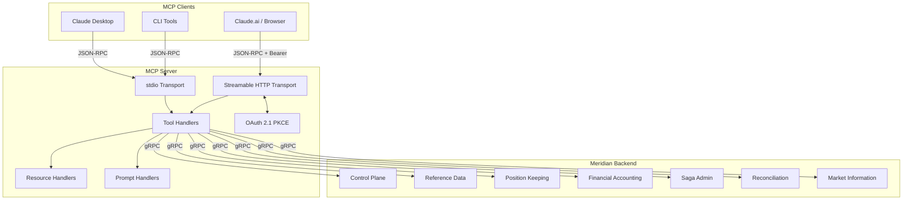

# MCP Server

Thin JSON-RPC adapter that exposes Meridian's backend services to LLM clients via the
[Model Context Protocol](https://spec.modelcontextprotocol.io/) (MCP 2025-03-26).

## Overview

| Attribute | Value |
|-----------|-------|
| **Type** | Infrastructure (API Gateway) |
| **Language** | Go |
| **Protocol** | MCP 2025-03-26 |
| **Transports** | stdio, streamable HTTP |
| **Auth** | OAuth 2.1 with PKCE (optional, HTTP transport) |
| **Standalone** | No (requires Meridian backend services via `MERIDIAN_API_URL`) |

## Architecture

The MCP server is a stateless adapter. It translates MCP JSON-RPC calls into gRPC requests
against Meridian's backend services and returns structured results suitable for LLM consumption.



## Transport Modes

### stdio (default)

Used by Claude Desktop and CLI tools. The server reads JSON-RPC requests from stdin and writes
responses to stdout. Logs are written to stderr to avoid corrupting the protocol channel.

```bash
MCP_TRANSPORT=stdio ./mcp-server
```

### Streamable HTTP (for network deployments)

The streamable HTTP transport (MCP spec 2025-03-26) uses a single `/mcp` endpoint for all
communication. Clients POST JSON-RPC requests and receive synchronous JSON responses. Session
management is handled via the `Mcp-Session-Id` header.

| Endpoint | Method | Purpose |
|----------|--------|---------|
| `/mcp` | `POST` | Send JSON-RPC requests (initialize, tools/list, tools/call, etc.) |
| `/mcp` | `DELETE` | Terminate a session |

```bash
MCP_TRANSPORT=http MCP_PORT=8090 ./mcp-server
```

## Environment Variables

| Variable | Default | Purpose |
|----------|---------|---------|
| `MCP_TRANSPORT` | `stdio` | Transport mode: `stdio` or `http` |
| `MCP_PORT` | `8090` | HTTP port when using streamable HTTP transport |
| `MCP_SERVER_NAME` | `meridian-mcp` | Server name reported in MCP initialize response |
| `MCP_BASE_URL` | `http://localhost:8090` | Base URL for OAuth redirect URIs (HTTP mode) |
| `MCP_OAUTH_ENABLED` | `false` | Enable OAuth 2.1 PKCE flow for HTTP transport |
| `MCP_OAUTH_CLIENT_ID` | `meridian-mcp` | OAuth client ID advertised to clients |
| `MCP_OAUTH_REDIRECT_URI` | `{MCP_BASE_URL}/oauth/callback` | OAuth redirect URI |
| `MERIDIAN_API_URL` | - | gRPC address of the Meridian gateway (e.g., `localhost:9090`) |
| `MERIDIAN_API_KEY` | - | Bearer token sent in the `Authorization` header on all outgoing gRPC calls |
| `LOG_LEVEL` | `info` | Log verbosity: `debug`, `info`, `warn`, `error` |

## OAuth 2.1 Configuration

OAuth 2.1 with PKCE is optional and applies to the streamable HTTP transport. When enabled, the
server exposes authorization and token endpoints and requires clients to present a bearer token
on the `/mcp` endpoint.

Example configuration for a production deployment:

```bash
MCP_TRANSPORT=http
MCP_PORT=8090
MCP_BASE_URL=https://mcp.example.com
MCP_OAUTH_ENABLED=true
MCP_OAUTH_CLIENT_ID=my-mcp-client
MCP_OAUTH_REDIRECT_URI=https://mcp.example.com/oauth/callback
```

OAuth endpoints exposed when `MCP_OAUTH_ENABLED=true`:

| Endpoint | Purpose |
|----------|---------|
| `GET /oauth/authorize` | Authorization endpoint (PKCE challenge) |
| `POST /oauth/token` | Token endpoint (code exchange) |

The current implementation ships a passthrough token issuer and validator suitable for development.
For production, configure a real JWT signer and validator.

## Client Configuration

### Streamable HTTP (for network deployments)

For Claude Desktop, Claude Code, or any MCP client connecting to a remote Meridian instance:

```json
{
  "mcpServers": {
    "meridian": {
      "type": "streamable-http",
      "url": "https://your-domain/mcp"
    }
  }
}
```

### stdio mode (for local development)

Add the following to your Claude Desktop configuration file
(`~/Library/Application Support/Claude/claude_desktop_config.json` on macOS):

```json
{
  "mcpServers": {
    "meridian": {
      "command": "/path/to/mcp-server",
      "env": {
        "MCP_TRANSPORT": "stdio",
        "MERIDIAN_API_URL": "localhost:9090",
        "MERIDIAN_API_KEY": "pk_your_tenant_api_key",
        "LOG_LEVEL": "info"
      }
    }
  }
}
```

## Available Tools

Tools are grouped into three categories:

- **Read** -- Query state without side effects
- **Simulate** -- Compute or preview without persisting changes
- **Write** -- Mutate state (requires explicit confirmation in most clients)

### Read Tools

| Tool | Description |
|------|-------------|
| `meridian_economy_structure` | Returns a hierarchical summary of the tenant's economy: instruments, account types, valuation rules, sagas, and payment rails |
| `meridian_instruments_list` | Lists instrument definitions with optional status filter (ACTIVE, DRAFT, DEPRECATED) |
| `meridian_instrument_describe` | Returns full details for a specific instrument by code, including CEL validation expressions |
| `meridian_sagas_list` | Lists saga workflow definitions with optional status filter and system saga exclusion |
| `meridian_saga_describe` | Returns full details for a saga including its Starlark script; lookup by UUID or name |
| `meridian_handlers_describe` | Returns saga triggers and account type CEL policies from the current manifest |
| `meridian_market_data_query` | Lists market data sets or queries observations for a specific dataset code |
| `meridian_manifest_history` | Paginated manifest version history with apply status and timestamps |
| `meridian_causation_tree` | Fetches the full parent→child saga causation tree for a root saga ID |
| `meridian_positions_query` | Queries financial position logs with optional account filtering |
| `meridian_postings_query` | Queries ledger postings with optional date range and account filtering |
| `meridian_saga_executions` | Queries saga definitions and execution status filtered by state |
| `meridian_reconciliation_status` | Queries reconciliation cycle status and variance mismatches |

### Simulate Tools

| Tool | Description |
|------|-------------|
| `meridian_manifest_validate` | Validates a manifest JSON without applying it; returns errors with paths and suggestions |
| `meridian_manifest_diff` | Compares two manifests and returns a structured change summary by section |
| `meridian_cel_evaluate` | Evaluates a CEL expression against a named environment without persisting state |
| `meridian_valuation_simulate` | Dry-runs a valuation to convert an input quantity to a valued amount; returns full calculation path |
| `meridian_saga_simulate` | Dry-runs a Starlark saga script with all service calls stubbed; returns step-by-step execution trace |

### Write Tools

| Tool | Description |
|------|-------------|
| `meridian_manifest_plan` | Dry-runs a manifest apply, stores the result, and returns a `plan_hash` for use with apply |
| `meridian_manifest_apply` | Applies a manifest that has been previously planned; requires the `plan_hash` from plan |

The plan-before-apply workflow enforces a safety gate: `meridian_manifest_apply` rejects any
manifest that was not first processed by `meridian_manifest_plan` in the same session.

## Resources

Resources provide context that the LLM can load on demand. Access them via `resources/read` with
the resource URI.

| URI | Name | Description |
|-----|------|-------------|
| `meridian://manifest/current` | Current Economy Manifest | The active economy manifest for the current tenant in YAML format |
| `meridian://docs/starlark-guide` | Starlark Saga Development Guide | Reference guide for writing Starlark saga scripts, including service modules, CEL patterns, and compensation patterns |
| `meridian://docs/cel-reference` | CEL Expression Reference | Reference guide for Common Expression Language used in validation rules, bucketing expressions, and precondition checks |

The `meridian://manifest/current` resource requires `MERIDIAN_API_URL` to be configured. If the
client is not configured, a placeholder message is returned.

The Starlark and CEL documentation are embedded at compile time and available without a backend
connection.

## Prompts

Prompts are guided workflow starters that prime the LLM for a specific task. Use `prompts/get`
with the prompt name and any required arguments.

| Prompt | Arguments | Description |
|--------|-----------|-------------|
| `design-economy` | — | Guided manifest creation workflow. Asks clarifying questions about instruments, account types, sagas, and valuation rules, then generates a complete manifest |
| `audit-transaction` | `transaction_id` (required) | Investigates a transaction's causation tree: originating saga, position movements, journal entries, and compensation actions |
| `simulate-change` | `change_description` (required) | Tests a proposed manifest change before applying; analyses impact on sagas, instruments, and account types |
| `debug-saga` | `saga_id` (required) | Diagnoses a failed or stuck saga: execution log, failing step, compensation status, and remediation suggestions |

## Local Development

The MCP server is included in the Tilt local development stack.

### Prerequisites

- A running Meridian local cluster (see root `Tiltfile`)
- Go 1.26+ for building locally outside of Tilt

### Running with Tilt

Start the full Meridian stack:

```bash
cd ~/dev/github.com/meridianhub/meridian/meridian-main
tilt up
```

The MCP server starts alongside the other services and connects to the local Meridian gateway.

### Running standalone (stdio mode)

Build and run directly against a running local cluster:

```bash
# From repo root
go build -o /tmp/meridian-mcp ./services/mcp-server/cmd

# Run in stdio mode
MERIDIAN_API_URL=localhost:9090 \
  MERIDIAN_API_KEY=pk_your_tenant_api_key \
  LOG_LEVEL=debug \
  /tmp/meridian-mcp
```

### Running standalone (HTTP mode)

```bash
MCP_TRANSPORT=http \
  MCP_PORT=8090 \
  MERIDIAN_API_URL=localhost:9090 \
  MERIDIAN_API_KEY=pk_your_tenant_api_key \
  LOG_LEVEL=debug \
  /tmp/meridian-mcp
```

Test with curl:

```bash
# Initialize a session
curl -X POST http://localhost:8090/mcp \
  -H 'Content-Type: application/json' \
  -d '{"jsonrpc":"2.0","id":1,"method":"initialize","params":{"protocolVersion":"2025-03-26","capabilities":{},"clientInfo":{"name":"curl","version":"1.0"}}}'

# Use the Mcp-Session-Id from the response header for subsequent requests
curl -X POST http://localhost:8090/mcp \
  -H 'Content-Type: application/json' \
  -H 'Mcp-Session-Id: <session-id-from-above>' \
  -d '{"jsonrpc":"2.0","id":2,"method":"tools/list","params":{}}'
```

## References

- [Services Architecture](../README.md)
- [Control Plane Service](../control-plane/README.md)
- [MCP Protocol Specification](https://spec.modelcontextprotocol.io/)
