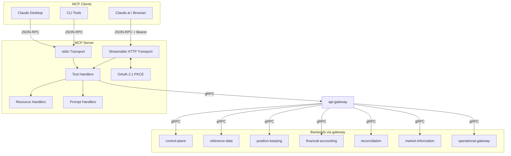

# MCP Server

Thin JSON-RPC adapter that exposes Meridian's backend services to LLM clients via the
[Model Context Protocol](https://spec.modelcontextprotocol.io/) (MCP 2025-03-26).
Sits on the [Edge Layer](../../docs/architecture-layers.md#1-edge-layer) of the
architecture, alongside `api-gateway`.

## Overview

| Attribute | Value |
|-----------|-------|
| **BIAN Domain** | Infrastructure (non-BIAN) |
| **Layer** | Edge Layer |
| **Port** | 8090 (HTTP, streamable transport); none in stdio mode |
| **Database** | N/A (stateless adapter) |
| **Standalone** | No (requires Meridian backend services via `MERIDIAN_API_URL`) |

## API Surface

The MCP server exposes the MCP 2025-03-26 protocol over two transports:

### Endpoints

| Transport | Method | Path | Purpose |
|-----------|--------|------|---------|
| Streamable HTTP | `POST` | `/mcp` | Send JSON-RPC requests (initialize, tools/list, tools/call, etc.) |
| Streamable HTTP | `DELETE` | `/mcp` | Terminate a session |
| Streamable HTTP | `GET` | `/oauth/authorize` | OAuth 2.1 authorization endpoint (PKCE challenge) when `MCP_OAUTH_ENABLED=true` |
| Streamable HTTP | `POST` | `/oauth/token` | OAuth 2.1 token endpoint (code exchange) when `MCP_OAUTH_ENABLED=true` |
| stdio | - | - | JSON-RPC over stdin / stdout; logs to stderr |

Tools are grouped into three categories. The full per-tool catalogue follows the
load-bearing files listing below.

### Read Tools

| Tool | Description |
|------|-------------|
| `meridian_economy_structure` | Hierarchical summary of the tenant's economy: instruments, account types, valuation rules, sagas, payment rails |
| `meridian_economy_graph` | Queries the relationship graph between manifest resources for impact analysis |
| `meridian_economy_generate_context` | Retrieves the context that would be used to generate a manifest from a natural language description |
| `meridian_instruments_list` | Lists instrument definitions with optional status filter (ACTIVE, DRAFT, DEPRECATED) |
| `meridian_instrument_describe` | Full details for a specific instrument by code, including CEL validation expressions |
| `meridian_sagas_list` | Lists saga workflow definitions with optional status filter and system saga exclusion |
| `meridian_saga_describe` | Full details for a saga including its Starlark script; lookup by UUID or name |
| `meridian_handlers_describe` | Saga triggers and account type CEL policies from the current manifest |
| `meridian_market_data_query` | Lists market data sets or queries observations for a specific dataset code |
| `meridian_manifest_history` | Paginated manifest version history with apply status and timestamps |
| `meridian_manifest_schema` | Manifest schema metadata: instrument types, normal balance values, valuation methods, trigger patterns, and field constraints |
| `meridian_causation_tree` | Full parent->child saga causation tree for a root saga ID |
| `meridian_positions_query` | Queries financial position logs with optional account filtering |
| `meridian_postings_query` | Queries ledger postings with optional date range and account filtering |
| `meridian_saga_executions` | Queries saga definitions and execution status filtered by state |
| `meridian_reconciliation_status` | Queries reconciliation cycle status and variance mismatches |
| `meridian_cookbook_list` | Lists available Meridian Cookbook entries |
| `meridian_cookbook_describe` | Returns full details for a specific Meridian Cookbook entry |
| `meridian_cookbook_discover` | Inspects a tenant manifest and returns compatible cookbook patterns with HATEOAS navigation links |
| `meridian_topics_list` | Returns all registered event topics in the platform, with optional service filter |
| `meridian_starlark_reference` | Returns the available Starlark service module bindings and built-in functions for writing saga scripts |
| `meridian_gateway_dispatch_status` | Lists instructions filtered by status, connection, or time range |
| `meridian_gateway_connection_health` | Shows provider connection health status and configuration |
| `meridian_gateway_instruction_detail` | Gets detailed instruction information including the full attempt history |
| `meridian_gateway_guide` | Returns guidance on choosing between the financial gateway and the operational gateway, including a decision tree |

### Simulate Tools

| Tool | Description |
|------|-------------|
| `meridian_manifest_validate` | Validates a manifest JSON without applying it; returns errors with paths and suggestions |
| `meridian_manifest_diff` | Compares two manifests and returns a structured change summary by section |
| `meridian_manifest_fix` | Auto-converts deprecated handler calls in a manifest's saga scripts |
| `meridian_economy_generate` | Generates a tenant manifest from a natural language description using AI assistance |
| `meridian_cel_evaluate` | Evaluates a CEL expression against a named environment without persisting state |
| `meridian_cel_validate` | Compiles and validates a CEL expression; returns result, return type, and cost estimate |
| `meridian_starlark_validate` | Validates a Starlark saga script for syntax errors |
| `meridian_valuation_simulate` | Dry-runs a valuation conversion; returns full calculation path |
| `meridian_saga_simulate` | Dry-runs a Starlark saga script with all service calls stubbed; returns step-by-step execution trace |

### Write Tools

| Tool | Description |
|------|-------------|
| `meridian_manifest_plan` | Dry-runs a manifest apply, stores the result, and returns a `plan_hash` for use with apply |
| `meridian_manifest_apply` | Applies a manifest that has been previously planned; requires the `plan_hash` from plan |
| `meridian_manifest_rollback` | Rolls back the tenant's manifest to a previous version by sequence number |
| `meridian_gateway_cancel_instruction` | Cancels a pending instruction before it is dispatched |

The plan-before-apply workflow enforces a safety gate: `meridian_manifest_apply`
rejects any manifest that was not first processed by `meridian_manifest_plan` in
the same session.

### Resources

| URI | Description |
|-----|-------------|
| `meridian://manifest/current` | Active economy manifest for the current tenant (YAML) |
| `meridian://docs/starlark-guide` | Reference guide for writing Starlark saga scripts |
| `meridian://docs/cel-reference` | Reference guide for CEL expressions |

### Prompts

| Prompt | Arguments | Description |
|--------|-----------|-------------|
| `design-economy` | - | Guided manifest creation workflow |
| `audit-transaction` | `transaction_id` (required) | Investigates a transaction's causation tree |
| `simulate-change` | `change_description` (required) | Tests a proposed manifest change before applying |
| `debug-saga` | `saga_id` (required) | Diagnoses a failed or stuck saga |

## Domain Model

The MCP server is a stateless JSON-RPC adapter. It owns no domain entities. All
authoritative state lives in the backend services it proxies to. Session state for
the streamable HTTP transport (`Mcp-Session-Id`) is held in-process and may be
lost on restart - clients reconnect and re-initialise.

## Dependencies

| Service | Protocol | Purpose |
|---------|----------|---------|
| `api-gateway` | gRPC | Single dial target via `MERIDIAN_API_URL`. The gateway forwards to backends |
| `control-plane` | gRPC (via gateway) | Manifest plan, apply, history; saga registry; economy generator |
| `reference-data` | gRPC (via gateway) | Instrument and reference-node metadata |
| `position-keeping` | gRPC (via gateway) | Position log queries |
| `financial-accounting` | gRPC (via gateway) | Postings queries |
| `reconciliation` | gRPC (via gateway) | Reconciliation status |
| `market-information` | gRPC (via gateway) | Market data reads |
| `operational-gateway` | gRPC (via gateway) | Instruction status and provider connection state |
| `identity` | gRPC (via gateway) | JWKS validation for OAuth 2.1 PKCE flow |

The MCP server opens a single gRPC connection to `MERIDIAN_API_URL` (the
`api-gateway`) and multiplexes all client stubs over it. See
[`internal/clients/clients.go`](internal/clients/clients.go).

## Dependents

| Service | Entry Point | Purpose |
|---------|-------------|---------|
| External: Claude Desktop | stdio transport | Local LLM developer workflows |
| External: Claude Code, Claude.ai | streamable HTTP transport | Network-attached LLM clients |
| External: MCP-compatible CLI tooling | stdio transport | Headless and CI-style automation |
| `api-gateway` | [`services/api-gateway/mcp_consent_handler.go`](../api-gateway/mcp_consent_handler.go) | Reads MCP server's OIDC state store shape for consent code exchange (no direct import) |

No Meridian backend service calls into the MCP server. The dependency direction
is one-way: clients call MCP server, MCP server calls api-gateway, gateway calls
backends.

## Load-Bearing Files

| File | Why It Matters |
|------|----------------|
| `cmd/main.go` | Process entry point. Selects transport (`MCP_TRANSPORT`), bootstraps observability, dials the gateway |
| `cmd/wire.go` | Wires every tool, resource, and prompt against the gateway clients. Adding or removing a tool starts here |
| `internal/clients/clients.go` | Holds typed gRPC stubs for every backend. The single dial target and auth interceptor wiring |
| `internal/auth/auth.go` | `MERIDIAN_API_URL` and `MERIDIAN_API_KEY` parsing and the gRPC unary interceptor that carries the bearer token |
| `internal/auth/oauth.go`, `oidc.go` | OAuth 2.1 PKCE flow for the streamable HTTP transport |
| `internal/auth/jwks_validator.go` | JWKS validation for OAuth bearer tokens when `MCP_OAUTH_ENABLED=true` |
| `internal/auth/oidc_consent.go` | Mirrors the api-gateway's consent code store shape; changes must coordinate with `services/api-gateway/mcp_consent_handler.go` |
| `internal/tools/economy.go`, `economy_generator.go`, `economy_manifest.go`, `economy_graph.go` | Economy structure, graph, manifest, and AI-generation tools |
| `internal/tools/manifest_fix.go`, `validation.go` | Plan / apply / validate / fix flow; the plan-before-apply safety gate lives here |
| `internal/tools/cookbook.go`, `cookbook_discover.go` | Cookbook discovery surface used by LLMs to find example flows |
| `internal/tools/reference.go` | Schema and reference tools: `meridian_manifest_schema`, `meridian_starlark_reference`, `meridian_topics_list`, `meridian_gateway_guide` |
| `internal/tools/gateway.go` | Operational gateway tooling - dispatch status, connection health, instruction detail, and cancel |
| `internal/tools/audit_reconciliation.go` | Reconciliation status tooling |
| `internal/session/` | Session management for the streamable HTTP transport (`Mcp-Session-Id`) |
| `internal/errors/formatter.go` | Translates backend gRPC errors into MCP-friendly responses |
| `internal/resources/`, `internal/prompts/` | Static resources (Starlark / CEL guides) and prompt templates |

Paths are relative to `services/mcp-server/`.

## Configuration

### Core

| Variable | Required | Default | Purpose |
|----------|----------|---------|---------|
| `MERIDIAN_API_URL` | Yes | - | gRPC address of `api-gateway` (e.g., `localhost:9090`) |
| `MERIDIAN_API_KEY` | Yes | - | Bearer token sent in the `Authorization` header on outgoing gRPC calls |
| `LOG_LEVEL` | No | `info` | Log verbosity: `debug`, `info`, `warn`, `error` |
| `MCP_TRANSPORT` | No | `stdio` | Transport mode: `stdio` or `http` |
| `MCP_PORT` | No | `8090` | HTTP port when using streamable HTTP transport |
| `MCP_SERVER_NAME` | No | `meridian-mcp` | Server name reported in MCP `initialize` response |
| `MCP_BASE_URL` | No | `http://localhost:8090` | Base URL for OAuth redirect URIs (HTTP mode) |

### OAuth (HTTP transport only)

| Variable | Required | Default | Purpose |
|----------|----------|---------|---------|
| `MCP_OAUTH_ENABLED` | No | `false` | Enable OAuth 2.1 PKCE flow for HTTP transport |
| `MCP_OAUTH_CLIENT_ID` | No | `meridian-mcp` | OAuth client ID advertised to clients |
| `MCP_OAUTH_REDIRECT_URI` | No | `{MCP_BASE_URL}/oauth/callback` | OAuth redirect URI |

## Architecture



## Transport Modes

### stdio (default)

Used by Claude Desktop and CLI tools. The server reads JSON-RPC requests from
stdin and writes responses to stdout. Logs are written to stderr to avoid
corrupting the protocol channel.

```bash
MCP_TRANSPORT=stdio ./mcp-server
```

### Streamable HTTP (network deployments)

The streamable HTTP transport (MCP spec 2025-03-26) uses a single `/mcp` endpoint
for all communication. Clients POST JSON-RPC requests and receive synchronous
JSON responses. Session management is handled via the `Mcp-Session-Id` header.

```bash
MCP_TRANSPORT=http MCP_PORT=8090 ./mcp-server
```

## Client Configuration

### Streamable HTTP (network deployments)

For Claude Desktop, Claude Code, or any MCP client connecting to a remote
Meridian instance:

```json
{
  "mcpServers": {
    "meridian": {
      "type": "streamable-http",
      "url": "https://your-domain/mcp"
    }
  }
}
```

### stdio (local development)

Add the following to your Claude Desktop configuration file
(`~/Library/Application Support/Claude/claude_desktop_config.json` on macOS):

```json
{
  "mcpServers": {
    "meridian": {
      "command": "/path/to/mcp-server",
      "env": {
        "MCP_TRANSPORT": "stdio",
        "MERIDIAN_API_URL": "localhost:9090",
        "MERIDIAN_API_KEY": "pk_your_tenant_api_key",
        "LOG_LEVEL": "info"
      }
    }
  }
}
```

## OAuth 2.1 Configuration

OAuth 2.1 with PKCE is optional and applies to the streamable HTTP transport.
When enabled, the server exposes authorization and token endpoints and requires
clients to present a bearer token on the `/mcp` endpoint.

```bash
MCP_TRANSPORT=http
MCP_PORT=8090
MCP_BASE_URL=https://mcp.example.com
MCP_OAUTH_ENABLED=true
MCP_OAUTH_CLIENT_ID=my-mcp-client
MCP_OAUTH_REDIRECT_URI=https://mcp.example.com/oauth/callback
```

The current implementation ships a passthrough token issuer and validator
suitable for development. For production, configure a real JWT signer and
validator.

## Security Considerations

### Tenant isolation

The MCP server is a single-tenant process. `MERIDIAN_API_KEY` is forwarded as a
Bearer token on every outgoing gRPC call. The `api-gateway` uses this key to
resolve the tenant and enforce boundaries — no tool call can reach a different
tenant's data.

### Plan-hash binding

`meridian_manifest_plan` stores the result in an in-process session cache
(`internal/session`) and returns a `plan_hash`. `meridian_manifest_apply` looks
up that hash in the same cache; it rejects hashes from other sessions and
expires entries after a short TTL. This prevents cross-session plan replay.

### HTTP transport (when `MCP_OAUTH_ENABLED=true`)

The `/mcp` endpoint requires a bearer token validated against the JWKS endpoint
of the identity service. Clients must complete the OAuth 2.1 PKCE flow at
`/oauth/authorize` and `/oauth/token` before calling tools. The token scope
governs which tools are accessible.

### stdio transport

Process-level isolation. No network port is opened. The JSON-RPC channel (stdin/
stdout) is accessible only to the parent process. Tool calls inherit the ambient
`MERIDIAN_API_KEY` from the process environment.

## Local Development

The MCP server is included in the Tilt local development stack.

### Prerequisites

- A running Meridian local cluster (see root `Tiltfile`)
- Go 1.26+ for building locally outside of Tilt

### Running with Tilt

```bash
cd ~/dev/github.com/meridianhub/meridian/meridian-main
tilt up
```

### Running standalone (stdio)

```bash
go build -o /tmp/meridian-mcp ./services/mcp-server/cmd

MERIDIAN_API_URL=localhost:9090 \
  MERIDIAN_API_KEY=pk_your_tenant_api_key \
  LOG_LEVEL=debug \
  /tmp/meridian-mcp
```

### Running standalone (HTTP)

```bash
MCP_TRANSPORT=http \
  MCP_PORT=8090 \
  MERIDIAN_API_URL=localhost:9090 \
  MERIDIAN_API_KEY=pk_your_tenant_api_key \
  LOG_LEVEL=debug \
  /tmp/meridian-mcp
```

Test with curl:

```bash
curl -X POST http://localhost:8090/mcp \
  -H 'Content-Type: application/json' \
  -d '{"jsonrpc":"2.0","id":1,"method":"initialize","params":{"protocolVersion":"2025-03-26","capabilities":{},"clientInfo":{"name":"curl","version":"1.0"}}}'

# Use the Mcp-Session-Id from the response header for subsequent requests
curl -X POST http://localhost:8090/mcp \
  -H 'Content-Type: application/json' \
  -H 'Mcp-Session-Id: <session-id-from-above>' \
  -d '{"jsonrpc":"2.0","id":2,"method":"tools/list","params":{}}'
```

## References

- [Architecture Layers](../../docs/architecture-layers.md#1-edge-layer)
- [Cross-Service Patterns](../../docs/patterns.md)
- [Service README Template](../../docs/service-readme-template.md)
- [Control Plane Service](../control-plane/README.md)
- [MCP Protocol Specification](https://spec.modelcontextprotocol.io/)
- [Services Architecture](../README.md)
- [Starlark Guide](internal/resources/docs/starlark-guide.md)
- [CEL Reference](internal/resources/docs/cel-reference.md)
