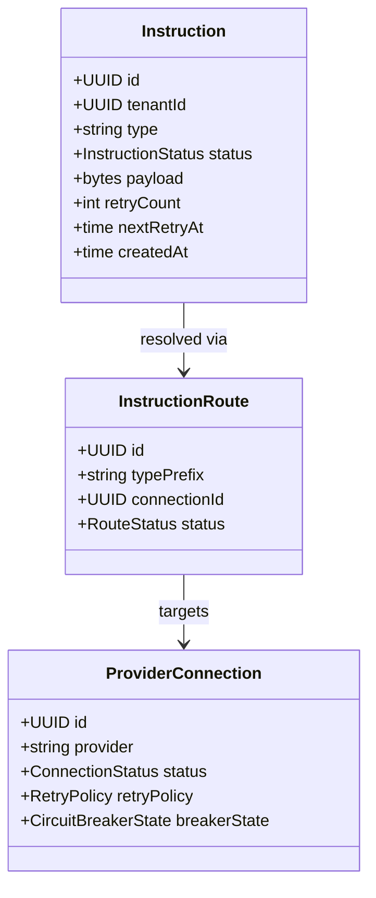

# Operational Gateway

External provider integration gateway for non-financial operational instructions.
Mirror image of Financial Gateway for instructions that do not require double-entry
ledger integration. Sits on the
[Operational Gateway layer](../../docs/architecture-layers.md#3-operational-gateway).

## Overview

| Attribute | Value |
|-----------|-------|
| **BIAN Domain** | Infrastructure (non-BIAN) |
| **Layer** | Operational Gateway |
| **Port** | 50063 (gRPC) |
| **Database** | CockroachDB (`operational_gateway` schema) |
| **Standalone** | No (requires CockroachDB and at least one configured provider connection) |

## API Surface

### gRPC

| Service | RPC | Purpose |
|---------|-----|---------|
| `OperationalGatewayService` | `DispatchInstruction` | Persist and dispatch a non-financial instruction |
| `OperationalGatewayService` | `CancelInstruction` | Cancel a pending or dispatching instruction |
| `OperationalGatewayService` | `GetInstruction` | Retrieve an instruction by ID |
| `OperationalGatewayService` | `ListInstructions` | Paginated listing with filters |
| `OperationalGatewayService` | `ProcessCallback` | Process an inbound provider callback for status updates |
| `ProviderConnectionService` | `UpsertConnection` | Create or update a provider connection |
| `ProviderConnectionService` | `GetConnection` | Retrieve a connection by ID |
| `ProviderConnectionService` | `ListConnections` | List configured connections |
| `ProviderConnectionService` | `DeprecateConnection` | Move a connection to deprecated state (existing instructions complete; no new dispatch) |
| `ProviderConnectionService` | `TestConnection` | Probe an outbound connection without persisting an instruction |
| `InstructionRouteService` | `UpsertRoute` | Create or update a routing rule that maps instruction types to connections |
| `InstructionRouteService` | `GetRoute` | Retrieve a route by ID |
| `InstructionRouteService` | `ListRoutes` | List configured routes |
| `InstructionRouteService` | `DeprecateRoute` | Deprecate a routing rule |

Proto: [`api/proto/meridian/operational_gateway/v1/operational_gateway.proto`](../../api/proto/meridian/operational_gateway/v1/operational_gateway.proto).

### Supported Instruction Types

| Prefix | Examples | Description |
|--------|----------|-------------|
| `kyc.*` | `kyc.verify`, `kyc.refresh` | Identity and KYC provider calls |
| `device.*` | `device.ping`, `device.register` | IoT and device management |
| `settlement.*` | `settlement.initiate`, `settlement.notify` | Settlement notifications |
| `partner.*` | `partner.file.upload`, `partner.notify` | Partner integrations |

`payment.*` instructions are rejected. They must go through `financial-gateway`,
which provides the double-entry ledger integration, lien management, and audit
trail required for financial transactions. The rejection text is:

```text
InvalidArgument: payment instructions must use financial-gateway, not operational-gateway
```

## Domain Model



`InstructionStatus` lifecycle: `PENDING -> DISPATCHING -> DELIVERED ->
ACKNOWLEDGED`, with `FAILED`, `RETRYING`, and `EXPIRED` branches. The dispatch
worker claims rows in `PENDING` or `RETRYING` whose `next_retry_at` has elapsed.

## Dependencies

| Service | Protocol | Purpose |
|---------|----------|---------|
| External: HTTP providers | HTTPS | Outbound dispatch via the HTTP adapter |
| External: SFTP partners | SFTP | Outbound file transfers (partner.file.*) |
| External: CockroachDB | SQL | Persist instructions, routes, and connections |
| External: Kafka | TCP | Emit dispatch and lifecycle events via the outbox publisher |

Operational Gateway has no synchronous Meridian service dependencies. Provider
secrets are resolved via the `secrets` adapter at dispatch time.

## Dependents

| Service | Entry Point | Purpose |
|---------|-------------|---------|
| `control-plane` | [`services/control-plane/internal/applier/operational_gateway_client.go`](../control-plane/internal/applier/operational_gateway_client.go) | Applies provider connections and routes during manifest apply |
| `control-plane` (Starlark) | [`services/control-plane/cmd/validate/main.go`](../control-plane/cmd/validate/main.go) (via `operationalgatewayclient.RegisterStarlarkHandlers`) | Exposes the gateway client to tenant-defined Starlark sagas |
| `control-plane` (live state) | [`services/control-plane/internal/differ/grpc_live_state_adapters.go`](../control-plane/internal/differ/grpc_live_state_adapters.go) | Reads live connection and route state when diffing manifests against the running platform |
| `mcp-server` | [`services/mcp-server/internal/clients/clients.go`](../mcp-server/internal/clients/clients.go) | Surfaces instruction status to LLM clients for inspection and audit |
| `mcp-server` | [`services/mcp-server/cmd/wire.go`](../mcp-server/cmd/wire.go) | Wires the operational-gateway client into the MCP gateway tools |

## Load-Bearing Files

| File | Why It Matters |
|------|----------------|
| `cmd/main.go` | Wires gRPC services, dispatch and expiry workers, repositories, outbox publisher, and platform bootstrap. Worker startup order affects at-least-once delivery guarantees |
| `service/server.go` | Top-level gRPC server. Aggregates `OperationalGatewayService`, `ProviderConnectionService`, and `InstructionRouteService` |
| `service/route_server.go` | `InstructionRouteService` handlers. Route configuration is the contract sagas rely on |
| `service/grpc_route_service_test.go` | The behavioural contract for route resolution under `payment.*` rejection |
| `domain/instruction.go` | Instruction lifecycle invariants and state-transition rules |
| `domain/instruction_route.go` | Route resolution semantics including the `payment.*` rejection |
| `domain/provider_connection.go` | Connection status machine and retry policy |
| `ports/dispatcher.go` | Outbound dispatcher interface; the contract every adapter must satisfy |
| `ports/repositories.go` | Persistence contracts for instructions, routes, connections |
| `adapters/persistence/instruction_repository.go` | `SELECT ... FOR UPDATE SKIP LOCKED` claim logic. Subtle invariants around the dispatch worker's concurrency model |
| `adapters/persistence/route_resolver.go` | Resolves type prefix to connection at dispatch time |
| `adapters/httpadapter/http_dispatcher.go` | The current production dispatcher. Future providers add adapters alongside this one |
| `worker/dispatch_worker.go` | Polling-based dispatch loop. Changes affect throughput, latency, and replica safety |
| `worker/expiry_worker.go` | Reclaims long-stuck instructions; controls when a `DISPATCHING` row becomes eligible for retry |

Paths are relative to `services/operational-gateway/`.

## Configuration

### Core

| Variable | Required | Default | Purpose |
|----------|----------|---------|---------|
| `DATABASE_URL` | Yes | - | CockroachDB connection string |
| `GRPC_PORT` | No | `50063` | gRPC listen port (`ports.OperationalGateway`) |
| `LOG_LEVEL` | No | `info` | Log verbosity: `debug`, `info`, `warn`, `error` |

### Dispatch Worker

| Variable | Required | Default | Purpose |
|----------|----------|---------|---------|
| `DISPATCH_WORKER_BATCH_SIZE` | No | `50` | Maximum instructions claimed per poll cycle |
| `DISPATCH_WORKER_POLL_INTERVAL` | No | `1s` | Time between successive poll cycles |

### Expiry Worker

| Variable | Required | Default | Purpose |
|----------|----------|---------|---------|
| `EXPIRY_WORKER_SCAN_INTERVAL` | No | `30s` | Time between expiry scans |
| `EXPIRY_WORKER_BATCH_SIZE` | No | `100` | Maximum expired instructions processed per scan |

## Architecture

The operational-gateway follows a ports-and-adapters (hexagonal) architecture:

- `domain/` - instruction, route, and connection models with lifecycle invariants
- `ports/` - interface definitions (`Dispatcher`, repositories, `RouteResolver`, `PayloadTransformer`, `SecretStore`)
- `adapters/persistence/` - CockroachDB-backed repositories and route resolver
- `adapters/httpadapter/` - outbound HTTP dispatcher (the production adapter today)
- `adapters/mapping/` - payload mapping transformer
- `adapters/passthrough/` - no-op transformer for already-shaped payloads
- `adapters/messaging/` - Kafka outbox publisher
- `adapters/secrets/` - secret resolution at dispatch time
- `service/` - gRPC service implementations
- `worker/` - dispatch and expiry background workers

## Key Invariants

- Instructions are persisted before dispatch (write-ahead, at-least-once delivery)
- The dispatch worker uses `SELECT FOR UPDATE SKIP LOCKED` for concurrent-safe batching
- Retry logic uses exponential backoff per the connection `RetryPolicy`
- Circuit breaker state is tracked per provider connection
- `payment.*` instructions are rejected at route resolution to preserve the
  ledger and audit trail invariants required for financial transactions

## Local Development

Operational-gateway is included in the Tilt local development stack:

```bash
cd ~/dev/github.com/meridianhub/meridian/meridian-main
tilt up
```

Run tests:

```bash
go test ./services/operational-gateway/...
```

End-to-end tests under `services/operational-gateway/e2e/` use CockroachDB
testcontainers and a stub HTTP provider.

## References

- [Architecture Layers](../../docs/architecture-layers.md#3-operational-gateway)
- [Cross-Service Patterns](../../docs/patterns.md)
- [Service README Template](../../docs/service-readme-template.md)
- [Services Architecture](../README.md)
