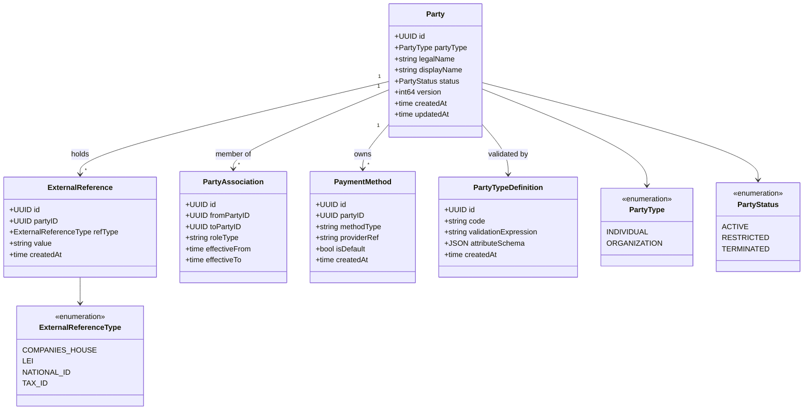
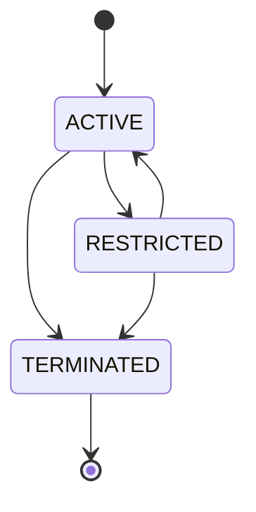

# party

BIAN Party Reference Data Directory. Stores and manages the legal identities of
customers and counterparties: individuals and organizations. Supports KYC verification
via pluggable providers (Onfido, Stripe), party associations, demographics, bank
relations, and payment methods.

Sits on the [Identity layer](../../docs/architecture-layers.md#7-identity)
of the Meridian architecture.

## Overview

| Attribute | Value |
|-----------|-------|
| **BIAN Domain** | Party Reference Data Directory |
| **Layer** | Identity |
| **Port** | 50055 (gRPC), 8081 (HTTP webhooks, when `VERIFICATION_PROVIDER` is configured) |
| **Database** | CockroachDB (per-tenant schema) |
| **Standalone** | No (requires CockroachDB; optional: Kafka for events, Onfido/Stripe for KYC) |

## API Surface

### gRPC

| Service | RPC | Purpose |
|---------|-----|---------|
| `PartyService` | `RegisterParty` | Create a new party (INDIVIDUAL or ORGANIZATION) |
| `PartyService` | `ListParties` | Paginated list with type and status filters |
| `PartyService` | `RetrieveParty` | Fetch a party by ID |
| `PartyService` | `UpdateParty` | Update mutable party fields (display name, attributes) |
| `PartyService` | `ControlParty` | Transition party status (ACTIVE/RESTRICTED/TERMINATED) |
| `PartyService` | `UpdateReference` | Set write-once external reference (Companies House, LEI, etc.) |
| `PartyService` | `RetrieveReference` | Fetch external references for a party |
| `PartyService` | `RegisterAssociations` | Create party-to-party associations (e.g., director/company) |
| `PartyService` | `UpdateAssociations` | Modify existing associations |
| `PartyService` | `RetrieveAssociations` | Fetch associations for a party |
| `PartyService` | `ExchangeDemographics` | Upsert demographic records (address, contact details) |
| `PartyService` | `UpdateDemographics` | Modify existing demographic records |
| `PartyService` | `RetrieveDemographics` | Fetch demographics for a party |
| `PartyService` | `UpdateBankRelations` | Upsert bank account relationships for a party |
| `PartyService` | `RetrieveBankRelations` | Fetch bank relations |
| `PartyService` | `ListParticipants` | List parties by association role |
| `PartyService` | `GetStructuringData` | Return aggregated structuring data for a party |
| `PartyService` | `AddPaymentMethod` | Add a payment method (card, bank account) to a party |
| `PartyService` | `RemovePaymentMethod` | Remove a payment method |
| `PartyService` | `SetDefaultPaymentMethod` | Set the default payment method |
| `PartyService` | `ListPaymentMethods` | List all payment methods for a party |
| `PartyService` | `GetDefaultPaymentMethod` | Fetch the default payment method |
| `PartyService` | `RegisterPartyType` | Register a custom party type definition |
| `PartyService` | `GetPartyType` | Fetch a party type by code |
| `PartyService` | `ListPartyTypes` | List all party type definitions |
| `PartyService` | `UpdatePartyType` | Modify a party type definition |

Proto: [`api/proto/meridian/party/v1/party.proto`](../../api/proto/meridian/party/v1/party.proto).

### HTTP

Available only when `VERIFICATION_PROVIDER` is configured.

| Method | Path | Purpose |
|--------|------|---------|
| `POST` | `/webhooks/verification/` | Inbound KYC webhook receiver (HMAC-verified) |
| `POST` | `/webhooks/verification/stripe` | Stripe-specific KYC webhook with Stripe signature verification |
| `GET` | `/health` | Liveness probe with verification provider status |

## Domain Model

### Status Machine

`TERMINATED` is terminal. External references are write-once: once set, the value
and type cannot be changed. Format validation is regex-only (no registry lookup):

| Type | Pattern |
|------|---------|
| `COMPANIES_HOUSE` | `^[A-Z]{0,2}\d{6,8}$` |
| `LEI` | `^[A-Z0-9]{20}$` |
| `NATIONAL_ID` | `^[A-Z0-9]{5,20}$` |
| `TAX_ID` | `^[A-Z0-9]{5,20}$` |

## Dependencies

| Service | Protocol | Purpose |
|---------|----------|---------|
| CockroachDB | SQL | All party, association, demographic, and payment method persistence |
| Kafka (optional) | TCP | Outbox worker publishes party domain events when `KAFKA_BOOTSTRAP_SERVERS` is set |
| Onfido / Stripe (optional) | HTTP | KYC verification provider when `VERIFICATION_PROVIDER` is configured |

## Dependents

Grepped from `rg "party" services/` across the codebase.

| Service | Entry Point | Purpose |
|---------|-------------|---------|
| `current-account` | `services/current-account/service/client_interfaces.go` | Validate party status before account operations |
| `tenant` | `services/tenant/service/party_client_adapter.go` | Register organization party for the tenant on provisioning |
| `payment-order` | `services/payment-order/service/payment_orchestrator.go` | Party lookup for billing and invoice generation |
| `control-plane` | `services/control-plane/service/apply_manifest.go` | Party registration in manifest apply |
| `internal-account` | `services/internal-account/client/starlark.go` | Starlark client exposes party lookup to saga scripts |

## Load-Bearing Files

Paths are relative to `services/party/`.

| File | Why It Matters |
|------|----------------|
| `cmd/main.go` | Wires gRPC server, optional HTTP server, Kafka outbox worker, and verification provider |
| `service/server.go` | gRPC service root; all handler groups are registered here |
| `service/party_handlers.go` | Core party CRUD and status transitions |
| `service/reference_handlers.go` | Write-once external reference enforcement |
| `service/association_handlers.go` | Party association lifecycle |
| `service/attribute_validator.go` | CEL-based attribute validation driven by PartyTypeDefinition |
| `domain/party.go` | Party aggregate; status machine and optimistic locking invariants |
| `verification/` | KYC provider abstraction (Onfido, Stripe); factory, provider interface, timeout handler |
| `config/verification.go` | Verification provider configuration loaded from environment variables (relative to `services/party/`) |
| `migrations/` | Atlas-managed schema; never edit applied files |

## Configuration

### Core

| Variable | Required | Default | Purpose |
|----------|----------|---------|---------|
| `DATABASE_URL` | Yes | - | CockroachDB connection string (relative to service startup directory) |
| `GRPC_PORT` | No | `50055` | gRPC listen port |
| `LOG_LEVEL` | No | `info` | Structured log level (`debug`, `info`, `warn`, `error`) |
| `ENVIRONMENT` | No | `development` | Runtime environment (`development`, `production`); affects verification config strictness |
| `KAFKA_BOOTSTRAP_SERVERS` | No | - | Kafka broker addresses; outbox worker disabled if not set |

### Verification (KYC)

Required only when `VERIFICATION_PROVIDER` is set. If absent in non-production environments,
verification is disabled gracefully; in `ENVIRONMENT=production` the service refuses to start.

| Variable | Required | Default | Purpose |
|----------|----------|---------|---------|
| `VERIFICATION_PROVIDER` | No | - | KYC provider: `onfido` or `stripe` |
| `VERIFICATION_API_KEY` | Conditional | - | Provider API key |
| `VERIFICATION_API_SECRET` | Conditional | - | Provider API secret |
| `VERIFICATION_BASE_URL` | No | - | Override provider API base URL |
| `VERIFICATION_WEBHOOK_SECRET` | Conditional | - | HMAC secret for verifying inbound webhooks |
| `VERIFICATION_WEBHOOK_URL` | No | - | Public URL for the webhook receiver (reported to provider) |
| `STRIPE_WEBHOOK_SECRET` | Conditional | - | Stripe-specific webhook signing secret |
| `HTTP_PORT` | No | `8081` | HTTP port for verification webhooks (only started when provider is configured) |

## Security Considerations

RBAC method permissions are declared in `rbac/method_permissions.go`. Inbound
verification webhooks are HMAC-verified before processing - requests with invalid
signatures return `401 Unauthorized` and are never processed. Stripe webhooks use
Stripe's own signature scheme in addition to the inner HMAC check.

## References

- [`docs/architecture-layers.md`](../../docs/architecture-layers.md) - Identity layer description
- [`api/proto/meridian/party/v1/`](../../api/proto/meridian/party/v1/) - Proto definitions
- ADR-0002: Microservices per BIAN Domain
