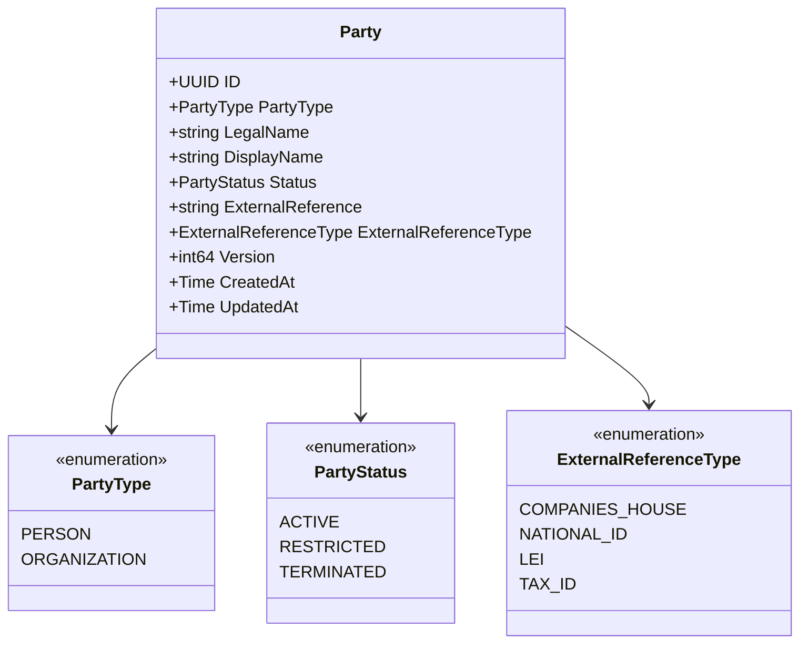
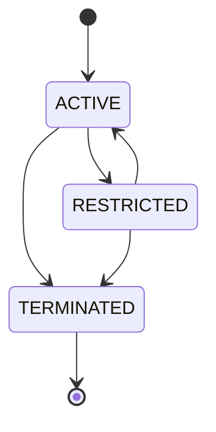
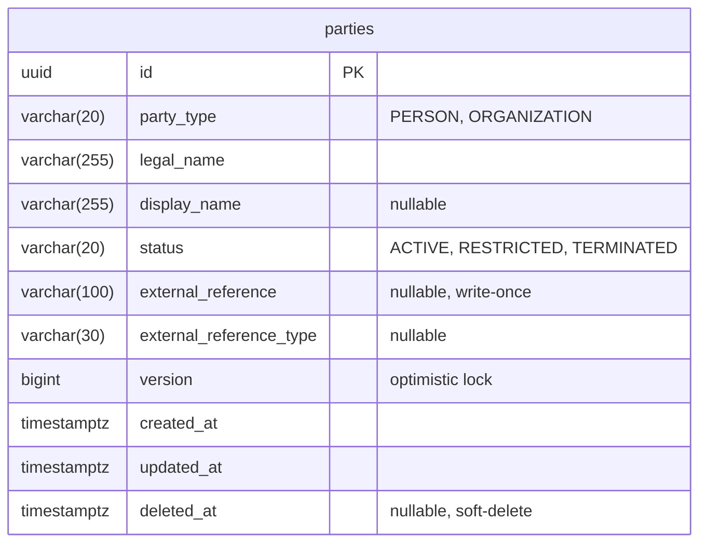

# Party Service

BIAN-compliant party reference data directory for managing customer and counterparty identities.

## Overview

| Attribute | Value |
|-----------|-------|
| **BIAN Domain** | Party Reference Data Directory |
| **Port** | 50055 (gRPC) |
| **Language** | Go |
| **Database** | PostgreSQL/CockroachDB |
| **Standalone** | Yes |

## gRPC Methods

| Method | HTTP | Purpose |
|--------|------|---------|
| `RegisterParty` | `POST /v1/parties` | Create new party |
| `RetrieveParty` | `GET /v1/parties/{party_id}` | Get party details |

## Domain Model

**Party Types:**

| Type | Description |
|------|-------------|
| `PERSON` | Natural person (individual) |
| `ORGANIZATION` | Legal entity (company, partnership) |

**Party Status:**

| Status | Description |
|--------|-------------|
| `ACTIVE` | Can participate in banking operations |
| `RESTRICTED` | Limited access (e.g., pending KYC) |
| `TERMINATED` | Relationship ended (terminal) |

**Status Transitions:**

- TERMINATED is terminal (cannot be reactivated)
- RESTRICTED can return to ACTIVE

## External Reference Validation

External references are write-once and unique per type:

| Type | Pattern | Example |
|------|---------|---------|
| `COMPANIES_HOUSE` | `^[A-Z]{0,2}\d{6,8}$` | `12345678`, `GB12345678` |
| `LEI` | `^[A-Z0-9]{20}$` | `5493001KJTIIGC8K1K12` |
| `NATIONAL_ID` | `^[A-Z0-9]{5,20}$` | `AB12345` |
| `TAX_ID` | `^[A-Z0-9]{5,20}$` | `TB123456789` |

**Note:** Validation is format-only (regex pattern matching). LEI checksum (ISO 17442 MOD 97-10)
and Companies House registry lookups are not performed. External validation should be done
upstream before registration if required.

## Database Schema

**Schema**: `party`

**Indexes:**

- `idx_parties_party_type`: Query by type
- `idx_parties_status`: Query by status
- `idx_party_external_ref`: Unique on (reference, type) where `deleted_at IS NULL`
- `idx_party_parties_deleted_at`: Query active (non-deleted) records

## Configuration

| Variable | Default | Purpose |
|----------|---------|---------|
| `GRPC_PORT` | 50055 | gRPC server port |
| `DATABASE_URL` | - | PostgreSQL connection string |
| `DB_MAX_OPEN_CONNS` | 25 | Connection pool size |

## Key Patterns

### Registration Flow

1. Validate party_type (PERSON or ORGANIZATION)
2. Create Party aggregate with ACTIVE status
3. If external_reference provided:
   - Check uniqueness
   - Validate format against type-specific regex
   - Set reference (write-once)
4. Persist with version = 1

### Optimistic Locking

Updates check `WHERE version = expected_version`. Returns conflict error on mismatch.

## References

- [BIAN Party Reference Data Directory Specification](https://github.com/bian-official/public/blob/main/release14.0.0/semantic-apis/oas3%20/yamls/PartyReferenceDataDirectory.yaml)
- [Service Architecture](../README.md)
- [Proto Definitions](../../api/proto/meridian/party/v1/)
