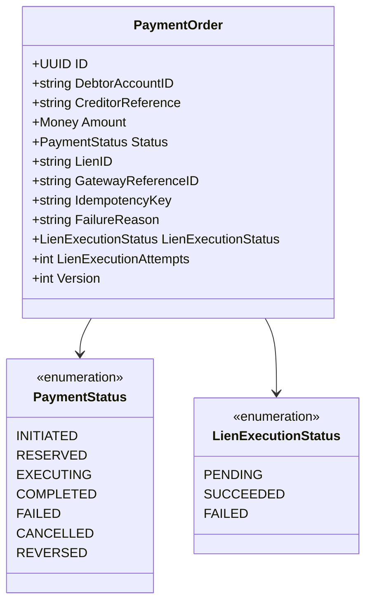
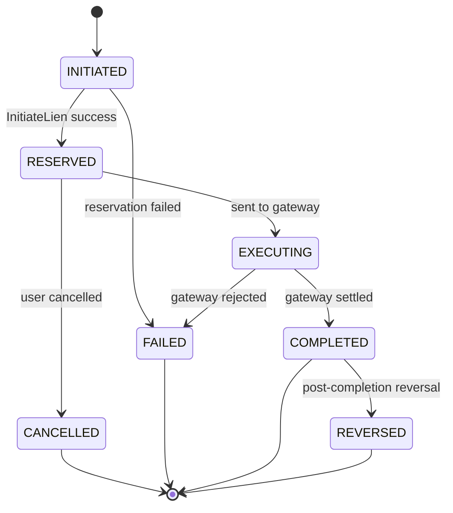
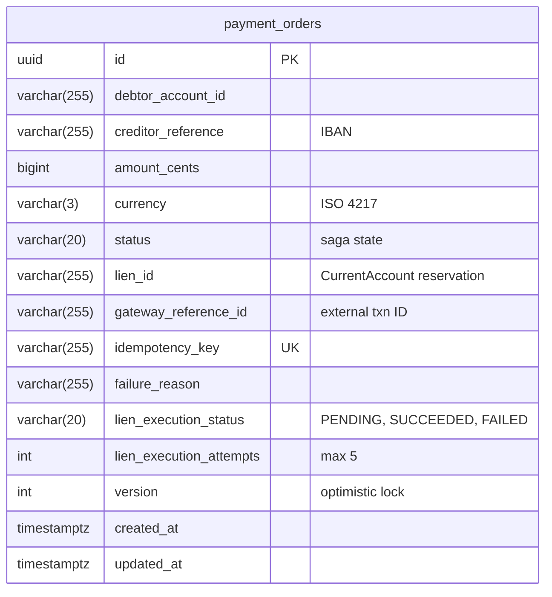

# PaymentOrder Service

BIAN-compliant payment order service with saga orchestration for distributed transactions.

## Overview

| Attribute | Value |
|-----------|-------|
| **BIAN Domain** | Payment Order |
| **Port** | 50054 (gRPC), 8080 (HTTP) |
| **Language** | Go |
| **Database** | PostgreSQL/CockroachDB |
| **Standalone** | No (requires CurrentAccount) |

## gRPC Methods

| Method | HTTP | Purpose |
|--------|------|---------|
| `InitiatePaymentOrder` | `POST /v1/payment-orders` | Create payment |
| `RetrievePaymentOrder` | `GET /v1/payment-orders/{id}` | Get order details |
| `UpdatePaymentOrder` | `PATCH /v1/payment-orders/{id}` | Handle webhook callback |
| `CancelPaymentOrder` | `POST /v1/payment-orders/{id}/cancel` | Cancel before execution |
| `ReversePaymentOrder` | `POST /v1/payment-orders/{id}/reverse` | Reverse completed payment |
| `ListPaymentOrders` | `GET /v1/payment-orders` | List with filters |

## HTTP Endpoints

| Endpoint | Method | Purpose |
|----------|--------|---------|
| `/webhook/payment-gateway` | POST | External gateway callbacks |
| `/health` | GET | Health check |

## Saga Definitions

Payment execution saga is **NOT** stored locally. It is fetched at runtime from the
reference-data service via `GetSaga()` RPC.

**Canonical source:** `services/reference-data/saga/defaults/payment_execution/v1.0.0.star`

To modify this saga, update the file in reference-data service and run
`PlatformSync.SyncPlatformDefaults()`.

## Currency-Only Constraint

Payment Order is **intentionally restricted to CURRENCY dimension instruments**. This is a permanent business rule:

- Payment orders model fiat money movements (bank transfers, direct debits, SEPA/SWIFT settlements)
- These real-world payment rails only carry ISO 4217 currencies
- The database stores currency as `VARCHAR(3)` for ISO 4217 codes
- Non-currency assets (energy kWh, compute GPU_HOUR, carbon credits) belong in
  the **position-keeping** service

The `ValidateCurrencyDimension()` helper in `domain/quantity.go` enforces this
at the service boundary by rejecting instruments outside the CURRENCY dimension.

## Domain Model



**Field Notes:**

- `CreditorReference`: IBAN format
- `LienExecutionAttempts`: max 5 retries

## Payment Saga State Machine



## Saga Orchestration Flow

### Happy Path

1. **Initiation**: `InitiatePaymentOrder` creates order in INITIATED status
2. **Reservation**: Async worker calls `CurrentAccount.InitiateLien` → RESERVED
3. **Execution**: Async worker sends to payment gateway → EXECUTING
4. **Settlement**: Gateway webhook confirms → COMPLETED
5. **Lien Execution**: Async `ExecuteLien` converts reservation to debit (retries up to 5x)

### Compensation

- **Gateway Rejection**: Automatically releases lien via `TerminateLien`
- **Cancellation**: User cancels before EXECUTING, lien released
- **Reversal**: Manual reversal of COMPLETED orders creates compensating entries

## Webhook Security

| Feature | Implementation |
|---------|----------------|
| Authentication | HMAC-SHA256 signature |
| Header | `X-Webhook-Signature` |
| Timestamp | Max 5 minutes age |
| Rate Limiting | 100 req/sec per IP |

**Idempotency Handling:**

Webhooks are deduplicated using a deterministic idempotency key:

```text
idempotency_key = hash(gateway_reference_id + status + gateway_event_ts)
```

- `gateway_event_ts`: Timestamp from webhook payload (not receipt time)
- Prefer gateway's `event_id` if provided (more reliable than timestamp)
- Duplicate webhooks (same key) return 200 OK without re-processing

**Rate Limiting with Reverse Proxy:**

When behind a reverse proxy (nginx, AWS ALB, etc.), configure `X-Forwarded-For` handling:

```text
# Ensure the proxy sets X-Forwarded-For
# PaymentOrder service uses client IP from:
# 1. X-Forwarded-For header (first IP in chain)
# 2. Direct connection IP if header absent

# Trust only your proxy's IP to prevent spoofing
TRUSTED_PROXIES=10.0.0.0/8,172.16.0.0/12
```

Without proper proxy configuration, all requests may share the gateway's IP,
causing legitimate traffic to be rate-limited.

## Service Dependencies

| Service | Port | Purpose |
|---------|------|---------|
| CurrentAccount | 50057 | Lien operations (reserve, execute, terminate) |

## Database Schema

**Schema**: `payment_order`



## Kafka Events

| Topic | Purpose |
|-------|---------|
| `payment-order.initiated.v1` | Order created |
| `payment-order.reserved.v1` | Funds reserved |
| `payment-order.executing.v1` | Sent to gateway |
| `payment-order.completed.v1` | Settlement confirmed |
| `payment-order.failed.v1` | Processing failed |
| `payment-order.cancelled.v1` | User cancelled |
| `payment-order.reversed.v1` | Post-completion reversal |

## Configuration

| Variable | Default | Purpose |
|----------|---------|---------|
| `GRPC_PORT` | 50054 | gRPC server port |
| `HTTP_PORT` | 8080 | Webhook server port |
| `WEBHOOK_HMAC_SECRET` | (required) | Signature validation secret |
| `HTTP_RATE_LIMIT_PER_SECOND` | 100 | Rate limit |
| `HTTP_RATE_LIMIT_BURST` | 200 | Burst allowance |

**HMAC Secret Configuration:**

- **Required:** Service will not start without a valid secret
- **Minimum length:** 32 bytes recommended for security
- **Generate:** `openssl rand -base64 32`
- **Kubernetes:** Store in Secret, reference via `secretKeyRef`

```bash
# Generate secure secret
openssl rand -base64 32

# Example Kubernetes secret
kubectl create secret generic payment-order-webhook \
  --from-literal=hmac-secret="$(openssl rand -base64 32)"
```

## References

- [BIAN Payment Order Specification](https://github.com/bian-official/public/blob/main/release14.0.0/semantic-apis/oas3%20/yamls/PaymentOrder.yaml)
- [Service Architecture](../README.md)
- [Proto Definitions](../../api/proto/meridian/payment_order/v1/)
