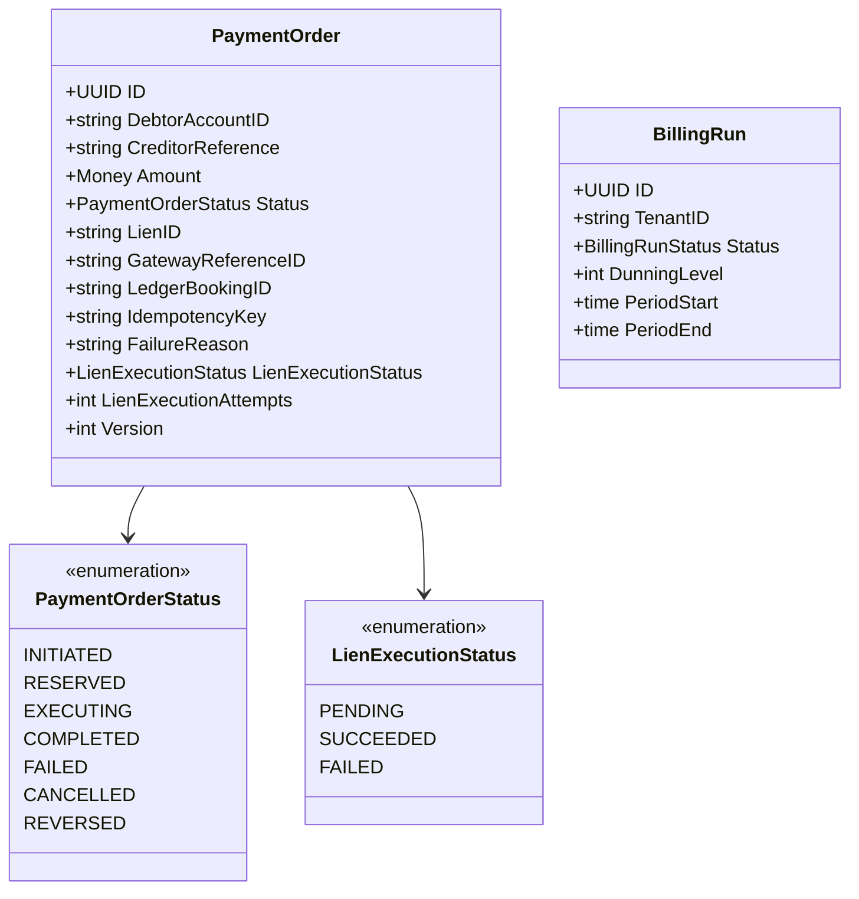

# payment-order

BIAN Payment Order saga orchestrator for fund reservation, external gateway dispatch,
and ledger settlement.

## Overview

| Attribute | Value |
|-----------|-------|
| **BIAN Domain** | Payment Order |
| **Layer** | Lifecycle Orchestration |
| **Port** | 50054 (gRPC), 8080 (HTTP webhooks) |
| **Database** | CockroachDB tenant schema (`org_{tenant_id}`) |
| **Standalone** | No - requires `current-account`, `financial-accounting`, and a payment gateway at runtime |

## API Surface

### gRPC

| Service | RPC | Purpose |
|---------|-----|---------|
| `PaymentOrderService` | `InitiatePaymentOrder` | Create a payment order and begin the saga |
| `PaymentOrderService` | `RetrievePaymentOrder` | Get order details by ID |
| `PaymentOrderService` | `UpdatePaymentOrder` | Handle async gateway callback (status update) |
| `PaymentOrderService` | `CancelPaymentOrder` | Cancel before EXECUTING; releases lien if RESERVED |
| `PaymentOrderService` | `ListPaymentOrders` | Paginated list with status and date filters |
| `PaymentOrderService` | `ReversePaymentOrder` | Post-completion compensation (COMPLETED -> REVERSED) |
| `BillingService` | `ListBillingRuns` | List billing run history (available when `BILLING_ENABLED=true`) |

Proto: `api/proto/meridian/payment_order/v1/payment_order.proto` (relative to repo root).

### HTTP endpoints

| Method | Path | Purpose |
|--------|------|---------|
| `POST` | `/webhook/payment-gateway` | External gateway callback, HMAC-SHA256 verified |
| `GET` | `/health` | Health check |

## Domain Model

State machine: `INITIATED -> RESERVED -> EXECUTING -> COMPLETED` (happy path).
Failed steps trigger LIFO compensation - lien release via
`current-account.TerminateLien` and reversal posting via `financial-accounting`.
Cancellation is allowed from INITIATED or RESERVED. Post-completion reversal
transitions COMPLETED to REVERSED.

`CreditorReference` must be IBAN format. `LienExecutionAttempts` is capped at 5.

## Dependencies

| Service | Protocol | Purpose |
|---------|----------|---------|
| `current-account` | gRPC | `InitiateLien`, `ExecuteLien`, `TerminateLien` for fund reservation |
| `financial-accounting` | gRPC | Ledger posting on settlement via `InitiateFinancialBookingLog` and `CaptureLedgerPosting` |
| `financial-gateway` | gRPC | External payment dispatch (Starlark handler registration) |
| `position-keeping` | gRPC | Balance prefetch and position log updates (Starlark handler registration) |
| `reference-data` | gRPC | Saga definition lookup when `USE_SAGA_ORCHESTRATION=true` |
| `party` | gRPC | Starlark handler registration |

## Dependents

| Service | Entry Point | Purpose |
|---------|-------------|---------|
| `api-gateway` | `services/api-gateway/cmd/main.go` | Proxies payment order RPCs from external clients via Vanguard transcoder |
| `financial-gateway` | `services/financial-gateway/service/server.go` | Publishes `payment-captured` and `payment-failed` Kafka events consumed by payment-order |

## Load-Bearing Files

Paths are relative to `services/payment-order/`.

| File | Why It Matters |
|------|----------------|
| `cmd/main.go` | Wires every component; controls startup order and server lifecycle |
| `service/server.go` | Registers gRPC service implementations; changes here break callers |
| `domain/payment_order.go` | State machine and transition invariants; all status changes flow through here |
| `service/payment_orchestrator.go` | Go-native saga orchestration (lien, gateway dispatch, ledger posting) |
| `service/payment_orchestrator_lien.go` | Lien reservation and release logic; idempotency boundary for fund reservation |
| `adapters/persistence/payment_order_entity.go` | GORM entity with audit hooks; `AuditID()` required by the audit pipeline |
| `adapters/http/webhook_handler.go` | HMAC-SHA256 verification and webhook routing; rejects replays older than 5 minutes |
| `config/service_config.go` | All env var defaults; authoritative source for service configuration |

## Configuration

| Variable | Required | Default | Purpose |
|----------|----------|---------|---------|
| `DATABASE_URL` | Yes | - | CockroachDB connection string |
| `GRPC_PORT` | No | `50054` | gRPC listen port |
| `HTTP_PORT` | No | `8080` | Webhook HTTP listen port |
| `WEBHOOK_HMAC_SECRET` | Yes | - | HMAC-SHA256 secret for webhook signature verification |
| `PAYMENT_GATEWAY_PROVIDER` | No | `mock` | Gateway mode: `stripe`, `financial-gateway`, or `mock` |
| `STRIPE_API_KEY` | Conditional | - | Required when `PAYMENT_GATEWAY_PROVIDER=stripe` |
| `STRIPE_WEBHOOK_SECRET` | Conditional | - | Required when `PAYMENT_GATEWAY_PROVIDER=stripe` |
| `FINANCIAL_GATEWAY_ADDR` | Conditional | - | gRPC address, required when `PAYMENT_GATEWAY_PROVIDER=financial-gateway` |
| `USE_SAGA_ORCHESTRATION` | No | `false` | Enable Starlark saga path (fetches saga script from `reference-data`) |
| `BILLING_ENABLED` | No | `false` | Start billing cron scheduler and dunning worker |
| `BILLING_CRON_SCHEDULE` | No | `0 0 * * *` | Cron expression for billing runs |
| `BILLING_SHADOW_MODE` | No | `false` | Run billing as a dry run without posting charges |
| `KAFKA_BOOTSTRAP_SERVERS` | No | - | Kafka bootstrap servers for event publishing and the payment event consumer |

## References

- [`docs/data-flows.md`](../../docs/data-flows.md) - Payment lifecycle sequence diagram (section 1)
- [`docs/patterns.md`](../../docs/patterns.md) - Saga, idempotency, and outbox patterns
- [`api/proto/meridian/payment_order/v1/payment_order.proto`](../../api/proto/meridian/payment_order/v1/payment_order.proto)
