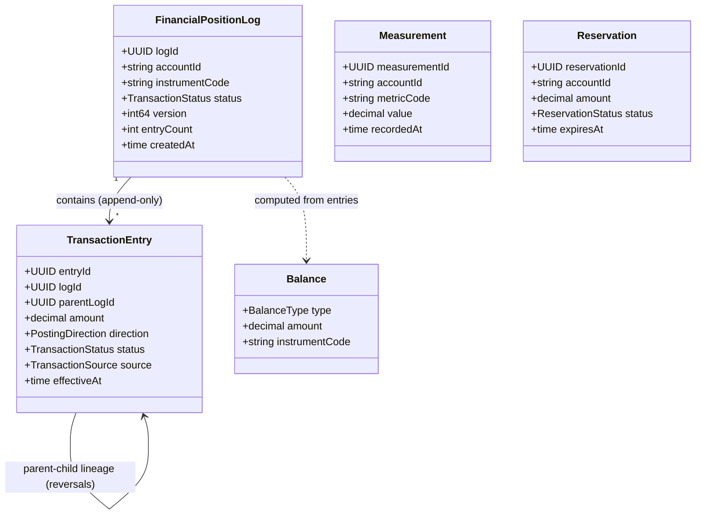

# position-keeping

BIAN Transaction Log service. Authoritative source for balance computation and immutable
transaction history across all asset classes. Part of the
[Observability and Routing layer](../../docs/architecture-layers.md#8-observability-and-routing).

## Overview

| Attribute | Value |
|-----------|-------|
| **BIAN Domain** | Position Keeping |
| **Layer** | Observability and Routing |
| **Port** | 50053 (gRPC), 9090 (HTTP metrics) |
| **Database** | CockroachDB (tenant-scoped schemas) |
| **Standalone** | No (requires `reference-data` for instrument resolution; optionally `current-account` and `internal-account` for account validation) |

## API Surface

### gRPC

| Service | RPC | Purpose |
|---------|-----|---------|
| `PositionKeepingService` | `InitiateFinancialPositionLog` | Create a new position log with an initial transaction entry |
| `PositionKeepingService` | `InitiateFinancialPositionLogBatch` | Bulk create position log entries |
| `PositionKeepingService` | `InitiateWithOpeningBalance` | Create a position log pre-loaded with an opening balance entry |
| `PositionKeepingService` | `UpdateFinancialPositionLog` | Append a transaction entry and drive status transitions |
| `PositionKeepingService` | `RetrieveFinancialPositionLog` | Fetch a position log by ID |
| `PositionKeepingService` | `ListFinancialPositionLogs` | List position logs with filters |
| `PositionKeepingService` | `BulkImportTransactions` | Batch import historical transactions |
| `PositionKeepingService` | `GetAccountBalance` | Query a single BIAN balance type for an account |
| `PositionKeepingService` | `GetAccountBalances` | Query all 7 BIAN balance types for an account |
| `PositionKeepingService` | `RecordMeasurement` | Record a utilization or billing measurement (used by event-router for platform billing) |
| `PositionKeepingService` | `UpdatePosition` | Update a position record (UNIMPLEMENTED stub) |
| `PositionKeepingService` | `MergePositions` | Merge two position records - compaction support (UNIMPLEMENTED stub) |
| `PositionKeepingService` | `RecordReservation` | Record a fund reservation against an account |
| `PositionKeepingService` | `ReleaseReservation` | Release a previously recorded reservation |
| `PositionKeepingService` | `GetProjectedBalance` | Compute projected balance including open reservations |

Proto: [`api/proto/meridian/position_keeping/v1/position_keeping.proto`](../../api/proto/meridian/position_keeping/v1/position_keeping.proto).

## Domain Model

`TransactionEntry.status`: `PENDING` -> `RECONCILED` -> `POSTED` -> `REVERSED`.
`POSTED` entries are immutable; reversals create a new child entry referencing the parent.
Hard limit: 10,000 entries per `FinancialPositionLog`.

**7 BIAN Balance Types:**

| Type | Meaning |
|------|---------|
| `OPENING` | Balance at the start of the current period |
| `CLOSING` | Balance at the end of the current period |
| `CURRENT` | Real-time balance including all transactions |
| `AVAILABLE` | Funds available for immediate use (CURRENT minus active reservations) |
| `LEDGER` | Balance of posted transactions only |
| `RESERVE` | Funds held or reserved |
| `FREE` | Unencumbered funds with no restrictions |

## Dependencies

| Service | Protocol | Purpose |
|---------|----------|---------|
| `reference-data` | gRPC | Instrument definition lookup for position log creation |
| `current-account` | gRPC (optional) | Account existence validation before creating a position log |
| `internal-account` | gRPC (optional) | Internal account existence validation |
| CockroachDB | SQL | Persists position logs, entries, measurements, and reservations |
| Kafka | Producer | Publishes `position-keeping-events` topic for downstream consumers |
| Redis (optional) | TCP | Idempotency key caching when `REDIS_ENABLED=true` |

## Dependents

| Service | Entry Point | Purpose |
|---------|-------------|---------|
| `current-account` | `services/current-account/service/client_interfaces.go` | Balance queries for lien checks and account balance reads |
| `internal-account` | `services/internal-account/adapters/grpc/position_keeping_client.go` | Balance queries for internal account reads |
| `reconciliation` | `services/reconciliation/service/grpc_pk_client.go` | Snapshot capture and balance assertions |
| `event-router` | `services/event-router/adapters/grpc/position_keeping_client.go` | `RecordMeasurement` for platform billing (tenant-zero) |
| `control-plane` | `services/control-plane/internal/admin/balance_sheet_handler.go` | Balance sheet queries across accounts |
| `mcp-server` | `services/mcp-server/internal/clients/clients.go` | Balance and transaction history MCP tools |
| `api-gateway` | `services/api-gateway/eventstream/` | Event stream subscriptions on position events |

## Load-Bearing Files

Paths are relative to `services/position-keeping/`.

| File | Why It Matters |
|------|----------------|
| `app/config.go` | All configuration fields and defaults; the only source of env var names |
| `service/server.go` | gRPC server construction; wires all handlers and interceptors |
| `service/initiate.go` | `InitiateFinancialPositionLog` - creates the aggregate root and enforces capacity limits |
| `service/balance.go` | `GetAccountBalance` / `GetAccountBalances` - balance computation from entries |
| `domain/financial_position_log.go` | Aggregate root; enforces the 10,000 entry cap and append-only invariant |
| `domain/balance_computer.go` | Computes all 7 BIAN balance types from position entries |
| `domain/transaction_lineage.go` | Parent-child lineage for reversals and amendments |
| `service/record_measurement.go` | `RecordMeasurement` - records billing measurements for tenant-zero |
| `service/reservation.go` | `RecordReservation` / `ReleaseReservation` - fund reservation lifecycle |

## Configuration

| Variable | Required | Default | Purpose |
|----------|----------|---------|---------|
| `DATABASE_URL` | Yes | - | CockroachDB connection string |
| `GRPC_PORT` | No | `50053` | gRPC listen port |
| `METRICS_PORT` | No | `9090` | HTTP metrics endpoint port |
| `KAFKA_BROKERS` | No | `kafka:9092` | Kafka broker addresses |
| `KAFKA_TOPIC` | No | `position-keeping-events` | Kafka topic for position events |
| `KAFKA_ENABLED` | No | `true` | Enable Kafka event publishing |
| `REDIS_ENABLED` | No | `false` | Enable Redis-backed idempotency cache |
| `REDIS_ADDRESS` | No | `redis:6379` | Redis address |
| `REFERENCE_DATA_SERVICE_URL` | No | - | gRPC address of `reference-data` |
| `CURRENT_ACCOUNT_SERVICE_URL` | No | - | gRPC address of `current-account` (for account validation) |
| `INTERNAL_ACCOUNT_SERVICE_URL` | No | - | gRPC address of `internal-account` (for account validation) |
| `ACCOUNT_VALIDATION_ENABLED` | No | `true` | Validate account existence before creating position logs |
| `ACCOUNT_VALIDATION_CACHE_TTL` | No | `1m` | How long to cache account validation results |
| `COMPACTION_ENABLED` | No | `true` | Enable background compaction worker |
| `COMPACTION_RUN_INTERVAL` | No | `5m` | How often to run compaction |
| `COMPACTION_FRAGMENT_THRESHOLD` | No | `100` | Minimum fragments in a bucket before compaction runs |
| `COMPACTION_BATCH_SIZE` | No | `50` | Maximum buckets compacted per run |
| `AUTH_ENABLED` | No | `true` | Enable JWT authentication interceptor |
| `JWKS_URL` | No | - | JWKS endpoint URL for JWT validation |
| `LOG_LEVEL` | No | `info` | Log verbosity |
| `DB_MAX_OPEN_CONNS` | No | `25` | Database connection pool maximum |
| `DB_MAX_IDLE_CONNS` | No | `5` | Database idle connection pool size |

## References

- ADR-0023: Balance Delegation to Position Keeping -
  [`docs/adr/0023-balance-delegation-to-position-keeping.md`](../../docs/adr/0023-balance-delegation-to-position-keeping.md)
- BIAN Position Keeping domain: [`docs/architecture/bian-service-boundaries.md`](../../docs/architecture/bian-service-boundaries.md)
- Architecture layers: [`docs/architecture-layers.md`](../../docs/architecture-layers.md#8-observability-and-routing)
- Service coupling analysis: [`docs/architecture/service-coupling-analysis.md`](../../docs/architecture/service-coupling-analysis.md)
