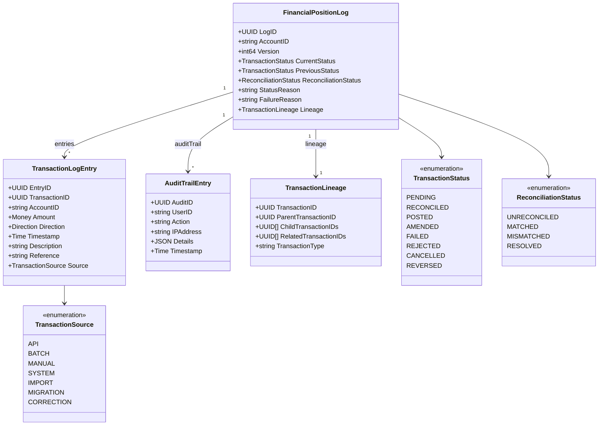
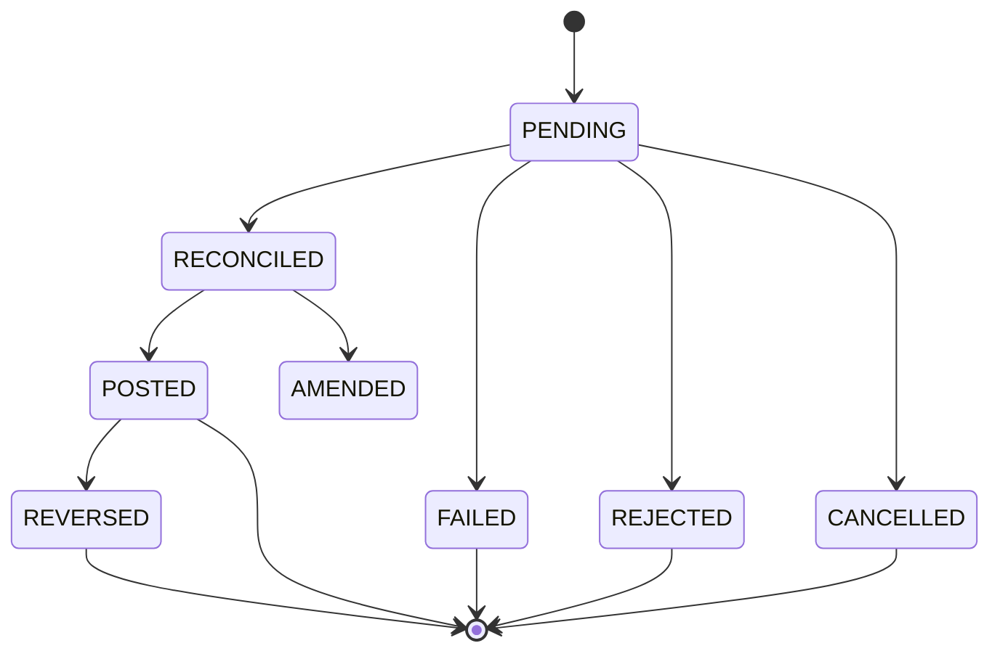
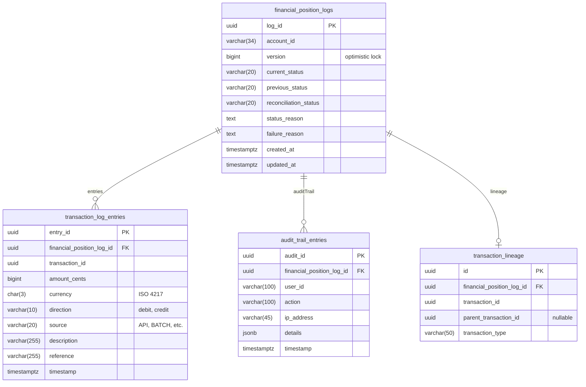
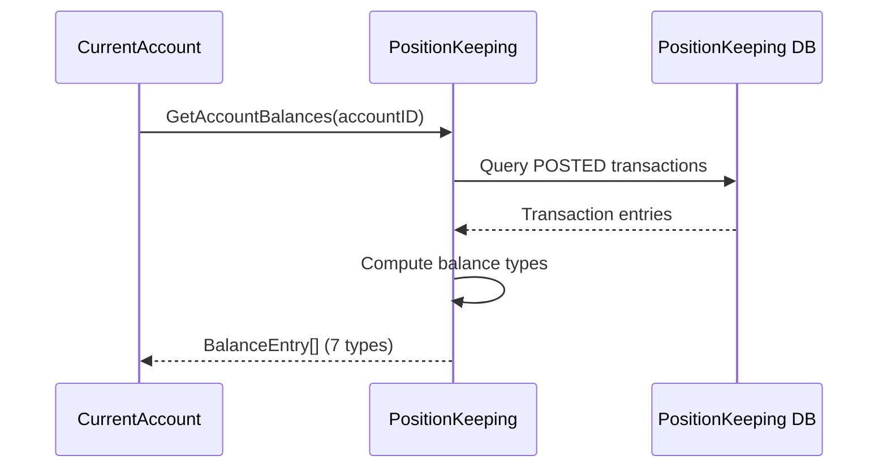

# PositionKeeping Service

BIAN-compliant position keeping service for immutable financial transaction history and audit trails.

## Overview

| Attribute | Value |
|-----------|-------|
| **BIAN Domain** | Position Keeping |
| **Port** | 50053 (gRPC) |
| **Language** | Go |
| **Database** | PostgreSQL/CockroachDB |
| **Standalone** | Yes |

## gRPC Methods

### Position Log Operations

| Method | HTTP | Purpose |
|--------|------|---------|
| `InitiateFinancialPositionLog` | `POST /v1/position-logs` | Create log with initial transaction |
| `RetrieveFinancialPositionLog` | `GET /v1/position-logs/{id}` | Get log details |
| `ListFinancialPositionLogs` | `GET /v1/position-logs` | List with filters |
| `UpdateFinancialPositionLog` | `PATCH /v1/position-logs/{id}` | State transitions |
| `BulkImportTransactions` | `POST /v1/position-logs/bulk` | Batch import |

### Balance Query Operations

| Method | HTTP | Purpose |
|--------|------|---------|
| `GetAccountBalance` | `GET /v1/accounts/{account_id}/balance/{balance_type}` | Query single balance type |
| `GetAccountBalances` | `GET /v1/accounts/{account_id}/balances` | Query all balance types |

## Domain Model



**Capacity Limits:**

- `Entries`: max 10,000 per log
- `AuditTrail`: max 10,000 per log

## Transaction Status State Machine



### Reconciliation Status

| Status | Description |
|--------|-------------|
| `UNRECONCILED` | Not yet matched |
| `MATCHED` | Matched with external data |
| `MISMATCHED` | Discrepancy found |
| `RESOLVED` | Discrepancy resolved |

## Kafka Event Publishing

**Topics:**

| Topic | Event |
|-------|-------|
| `position-keeping.transaction-captured.v1` | New transaction |
| `position-keeping.transaction-amended.v1` | Post-capture modification |
| `position-keeping.transaction-reconciled.v1` | External matching |
| `position-keeping.transaction-posted.v1` | Final committed |
| `position-keeping.transaction-rejected.v1` | Rejected |
| `position-keeping.transaction-failed.v1` | Processing failed |
| `position-keeping.transaction-cancelled.v1` | Cancelled |
| `position-keeping.bulk-transaction-captured.v1` | Batch import |

**Publishing Pattern:**

- Fire-and-forget (doesn't block main operation)
- Partition key = LogID (ensures ordering per aggregate)
- Protobuf serialization

**Fire-and-Forget Semantics:**

Events are published asynchronously after the database transaction commits:

- **Best-effort delivery**: Publish failures are logged but don't fail the request
- **No transactional outbox**: Events may be lost if the service crashes after DB commit but before publish
- **Trade-off**: Lower latency vs potential event loss during failures

For use cases requiring guaranteed event delivery (e.g., regulatory audit),
consider the [Audit Outbox Pattern](../README.md#audit-outbox-pattern) or
implement a transactional outbox with a separate publisher worker.

## Database Schema

**Schema**: `position_keeping`



## Capacity Limits

| Limit | Value | Error |
|-------|-------|-------|
| Max Transaction Entries | 10,000 | `ErrTooManyEntries` |
| Max Audit Entries | 10,000 | `ErrTooManyEntries` |

## Instrument Resolution

Position-keeping supports all instrument dimensions (CURRENCY, ENERGY, CARBON, COMPUTE, etc.).
Instrument properties are resolved via `InstrumentResolver` from Reference Data.

**Resolution flow:**

1. Transaction recording receives `instrument_code` and resolves properties via `InstrumentResolver`
2. Balance computation uses the resolved precision for decimal arithmetic
3. If instrument resolution is unavailable, the service uses `quantity.NewInstrument()` with
   caller-provided properties from the transaction record

**Supported dimensions:**

| Dimension | Examples | Precision |
|-----------|----------|-----------|
| CURRENCY | GBP, USD, EUR, JPY | 0-2 (from Reference Data) |
| ENERGY | KWH, MWH | 3-6 |
| CARBON | CARBON_CREDIT | 0 |
| COMPUTE | GPU_HOUR | 4 |
| Any valid | Per Reference Data | Per Reference Data |

See [ADR-0035: Multi-Asset Purity](../../docs/adr/0035-multi-asset-purity.md) for the architectural decision.

## Configuration

| Variable | Default | Purpose |
|----------|---------|---------|
| `GRPC_PORT` | 50053 | gRPC server port |
| `DATABASE_URL` | - | PostgreSQL connection string |
| `KAFKA_BROKERS` | kafka:9092 | Kafka broker addresses |
| `REDIS_ENABLED` | false | Enable idempotency cache |
| `REDIS_ADDRESS` | redis:6379 | Redis address |

## Key Patterns

### Idempotency

- Redis-backed distributed locking (when enabled)
- Idempotency keys for effectively-once processing (retries produce same result)
- 5-minute TTL for pending operation locks
- Fallback to in-memory cache when Redis unavailable

### Optimistic Locking

Version field required for all updates. Returns conflict error on mismatch.

### Immutability

POSTED logs cannot be modified. Returns `ErrAlreadyPosted`.

## Balance Calculation Responsibility

Position Keeping is the authoritative source for account balance computation. This design
follows BIAN service domain principles where Position Keeping owns the transaction log and
therefore has the data required to compute accurate balances.

### Balance Types (BIAN-Compliant)

Position Keeping computes 7 balance types per account:

| Balance Type | Proto Enum | Computation |
|--------------|------------|-------------|
| **Opening** | `BALANCE_TYPE_OPENING` | Balance at start of accounting period |
| **Closing** | `BALANCE_TYPE_CLOSING` | Balance at end of accounting period |
| **Current** | `BALANCE_TYPE_CURRENT` | Sum of all POSTED transactions (real-time) |
| **Available** | `BALANCE_TYPE_AVAILABLE` | Current minus holds, liens, and reserves |
| **Ledger** | `BALANCE_TYPE_LEDGER` | Book balance (may differ from current due to holds) |
| **Reserve** | `BALANCE_TYPE_RESERVE` | Amount held in reserve (not available for use) |
| **Free** | `BALANCE_TYPE_FREE` | Unencumbered balance (current minus all encumbrances) |

### Balance Calculation Formulas

```text
CURRENT   = Σ(POSTED transactions: credits - debits)
AVAILABLE = CURRENT - RESERVE - ACTIVE_LIENS
LEDGER    = CURRENT (excluding pending transactions)
FREE      = CURRENT - RESERVE - HOLDS
```

### Balance Query APIs

**GetAccountBalance** - Query a single balance type:

```go
// Request
req := &pk.GetAccountBalanceRequest{
    AccountId:   "ACC-12345678",
    BalanceType: pk.BALANCE_TYPE_AVAILABLE,
    Currency:    "GBP",  // Optional: filter by currency
}

// Response
resp := &pk.GetAccountBalanceResponse{
    AccountId:   "ACC-12345678",
    BalanceType: pk.BALANCE_TYPE_AVAILABLE,
    Amount:      &common.MoneyAmount{Units: 1500, Nanos: 0, CurrencyCode: "GBP"},
    AsOf:        timestamppb.Now(),
}
```

**GetAccountBalances** - Query all balance types:

```go
// Request
req := &pk.GetAccountBalancesRequest{
    AccountId: "ACC-12345678",
    Currency:  "GBP",  // Optional
}

// Response contains all 7 balance types
resp := &pk.GetAccountBalancesResponse{
    AccountId: "ACC-12345678",
    Balances: []*pk.BalanceEntry{
        {BalanceType: pk.BALANCE_TYPE_OPENING, Amount: ...},
        {BalanceType: pk.BALANCE_TYPE_CLOSING, Amount: ...},
        {BalanceType: pk.BALANCE_TYPE_CURRENT, Amount: ...},
        {BalanceType: pk.BALANCE_TYPE_AVAILABLE, Amount: ...},
        {BalanceType: pk.BALANCE_TYPE_LEDGER, Amount: ...},
        {BalanceType: pk.BALANCE_TYPE_RESERVE, Amount: ...},
        {BalanceType: pk.BALANCE_TYPE_FREE, Amount: ...},
    },
    AsOf: timestamppb.Now(),
}
```

### Balance Query Sequence



### Performance Characteristics

| Operation | Complexity | Notes |
|-----------|------------|-------|
| `GetAccountBalance` | O(n) | Aggregates over POSTED transactions |
| `GetAccountBalances` | O(n) | Single pass computes all types |

**Optimization:** Balance snapshots may be cached or materialized for high-traffic accounts.

### Opening Balance Support

For account migration scenarios, Position Keeping supports initializing accounts with an
opening balance:

```go
// InitiateWithOpeningBalance creates a position log with a synthetic
// opening balance transaction for migration purposes
req := &pk.InitiateFinancialPositionLogRequest{
    AccountId: "ACC-12345678",
    OpeningBalance: &common.MoneyAmount{
        Units:        10000,
        CurrencyCode: "GBP",
    },
}
```

This creates an initial transaction entry that establishes the account's starting position.

## References

- [BIAN Position Keeping Specification](https://github.com/bian-official/public/blob/main/release14.0.0/semantic-apis/oas3%20/yamls/PositionKeeping.yaml)
- [Service Architecture](../README.md)
- [Proto Definitions](../../api/proto/meridian/position_keeping/v1/)
- [ADR-0023: Balance Delegation to Position Keeping](../../docs/adr/0023-balance-delegation-to-position-keeping.md)
