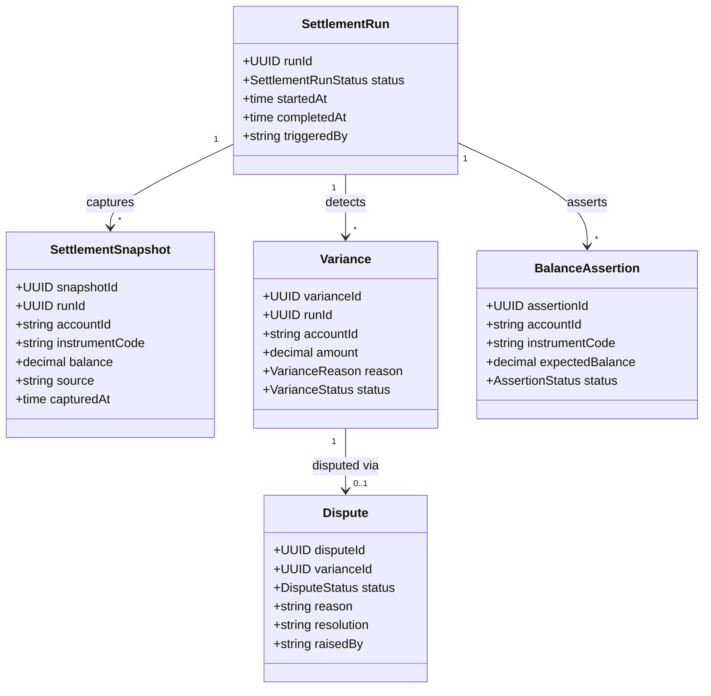

# reconciliation

BIAN Account Reconciliation service that compares balance positions across services and
manages variances and disputes through their resolution lifecycle. Part of the
[Observability and Routing layer](../../docs/architecture-layers.md#8-observability-and-routing).

## Overview

| Attribute | Value |
|-----------|-------|
| **BIAN Domain** | Account Reconciliation |
| **Layer** | Observability and Routing |
| **Port** | 50060 (gRPC), 9090 (HTTP metrics and health) |
| **Database** | CockroachDB (tenant-scoped schemas) |
| **Standalone** | No (requires CockroachDB and `position-keeping` gRPC for snapshot capture; Redis required only when `SETTLEMENT_SCHEDULER_ENABLED=true`) |

## API Surface

### gRPC

| Service | RPC | Purpose |
|---------|-----|---------|
| `AccountReconciliationService` | `InitiateAccountReconciliation` | Create and start a settlement run |
| `AccountReconciliationService` | `ExecuteAccountReconciliation` | Trigger the reconciliation pipeline for an existing run |
| `AccountReconciliationService` | `RetrieveAccountReconciliation` | Fetch a settlement run by ID |
| `AccountReconciliationService` | `ListAccountReconciliations` | List settlement runs with optional filters |
| `AccountReconciliationService` | `ControlAccountReconciliation` | Pause, resume, or cancel a settlement run |
| `AccountReconciliationService` | `ListReconciliationResults` | List variances for a settlement run |
| `AccountReconciliationService` | `AssertBalance` | Assert that an account's balance matches expectations |
| `AccountReconciliationService` | `InitiateDispute` | Raise a dispute against a detected variance |
| `AccountReconciliationService` | `ControlDispute` | Transition a dispute to investigating or resolved |
| `AccountReconciliationService` | `RetrieveDispute` | Fetch a dispute by ID |
| `AccountReconciliationService` | `ListDisputes` | List disputes with optional filters |
| `AccountReconciliationService` | `UpdateDispute` | Update dispute reason or resolution notes |
| `AccountReconciliationService` | `ListBalanceAssertions` | List balance assertions with optional filters |

Proto: [`api/proto/meridian/reconciliation/v1/reconciliation.proto`](../../api/proto/meridian/reconciliation/v1/reconciliation.proto).

## Domain Model

`SettlementRun.status`: `PENDING` -> `IN_PROGRESS` -> `COMPLETED` or `FAILED`.
`Variance.status`: `OPEN` -> `UNDER_REVIEW` -> `RESOLVED` or `DISPUTED`.
`Dispute.status`: `OPEN` -> `INVESTIGATING` -> `RESOLVED`.

## Dependencies

| Service | Protocol | Purpose |
|---------|----------|---------|
| `position-keeping` | gRPC | Snapshot capture (position balances) and balance assertions |
| `current-account` | gRPC | Party resolution for variance valuation (optional) |
| `reference-data` | gRPC | Instrument lookup for variance valuation (optional) |
| CockroachDB | SQL | Persists settlement runs, snapshots, variances, disputes, assertions |
| Redis | TCP | Distributed leader election for the settlement scheduler |
| Kafka | Producer (outbox) | Publishes reconciliation events via the outbox pattern |

## Dependents

| Service | Entry Point | Purpose |
|---------|-------------|---------|
| `api-gateway` | proxies `AccountReconciliationService` gRPC | Exposes reconciliation RPCs to external callers |
| `mcp-server` | `services/mcp-server/internal/clients/clients.go` | Surfaces reconciliation as an MCP tool |

## Load-Bearing Files

Paths are relative to `services/reconciliation/`.

| File | Why It Matters |
|------|----------------|
| `config/config.go` | All configuration fields and defaults; the only source of env var names |
| `app/container.go` | Dependency injection; wires snapshot capturer, balance assertor, variance components, scheduler, and Redis |
| `service/server.go` | gRPC service implementation and pipeline coordination |
| `service/grpc_settlement_endpoints.go` | `Initiate`, `Retrieve`, `List` handlers for settlement runs |
| `service/grpc_pipeline_endpoints.go` | `Execute` and pipeline orchestration logic |
| `adapters/persistence/settlement_run_repository.go` | Settlement run persistence; status transitions enforced here |
| `adapters/persistence/variance_repository.go` | Variance storage and filtering |
| `worker/scheduler_adapters.go` | Scheduler executor that calls `ExecuteAccountReconciliation` via gRPC self-loop |

## Configuration

| Variable | Required | Default | Purpose |
|----------|----------|---------|---------|
| `DATABASE_URL` | Yes | - | CockroachDB connection string |
| `GRPC_PORT` | No | `50060` | gRPC listen port |
| `METRICS_PORT` | No | `9090` | HTTP metrics and health port |
| `POSITION_KEEPING_URL` | No | - | gRPC address of `position-keeping` (enables snapshot capture and balance assertions) |
| `CURRENT_ACCOUNT_URL` | No | - | gRPC address of `current-account` (enables party resolution in variance valuation) |
| `REFERENCE_DATA_URL` | No | - | gRPC address of `reference-data` (enables instrument lookup for valuation) |
| `FINANCIAL_ACCOUNTING_URL` | No | - | gRPC address of `financial-accounting` (reserved for future source verification) |
| `PAYMENT_ORDER_URL` | No | - | gRPC address of `payment-order` (reserved for future settlement execution) |
| `REDIS_URL` | No | - | Redis connection URL (required when `SETTLEMENT_SCHEDULER_ENABLED=true`) |
| `KAFKA_BROKERS` | No | - | Comma-separated broker addresses (enables outbox worker when set) |
| `SETTLEMENT_SCHEDULER_ENABLED` | No | `false` | Enable cron-based automated settlement scheduling |
| `SCHEDULER_POLL_INTERVAL` | No | `1h` | How often to refresh settlement schedules from reference data |
| `SCHEDULER_SHUTDOWN_TIMEOUT` | No | `30s` | Maximum wait for in-flight jobs on shutdown |
| `SCHEDULER_LEADER_LOCK_TTL` | No | `30s` | Redis leader election lock TTL |
| `SCHEDULER_LEADER_RENEW_INTERVAL` | No | `10s` | Redis leader lock renewal interval |
| `ENVIRONMENT` | No | `development` | Deployment environment label |
| `LOG_LEVEL` | No | `info` | Log verbosity (`debug`, `info`, `warn`, `error`) |
| `GRACEFUL_SHUTDOWN_TIMEOUT` | No | `30s` | Maximum wait on graceful shutdown |
| `DB_MAX_OPEN_CONNS` | No | `25` | Database connection pool maximum |
| `DB_MAX_IDLE_CONNS` | No | `5` | Database idle connection pool size |

## References

- BIAN Account Reconciliation domain: [`docs/architecture/bian-service-boundaries.md`](../../docs/architecture/bian-service-boundaries.md)
- Outbox pattern: [`docs/patterns.md`](../../docs/patterns.md#1-outbox-pattern)
- Architecture layers: [`docs/architecture-layers.md`](../../docs/architecture-layers.md#8-observability-and-routing)
