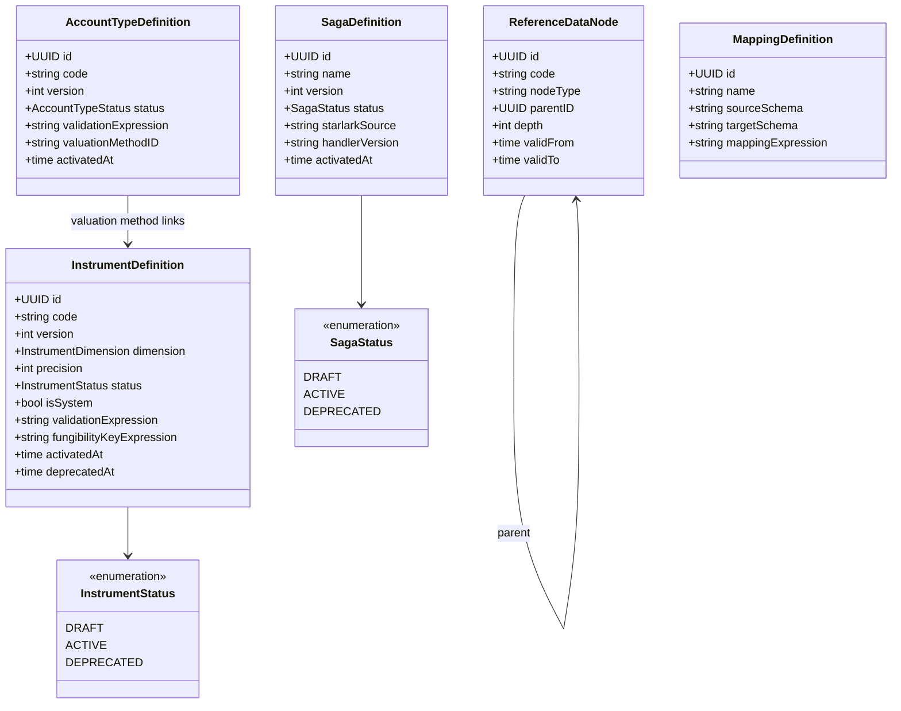

# reference-data

Instrument definitions, saga definitions, account type registry, hierarchical node
registry, and field mapping rules. The contract layer that every ledger and
orchestration service reads to understand what it is operating on.

Sits on the [Reference and Registry layer](../../docs/architecture-layers.md#6-reference-and-registry)
of the Meridian architecture.

## Overview

| Attribute | Value |
|-----------|-------|
| **BIAN Domain** | Reference Data Directory |
| **Layer** | Reference and Registry |
| **Port** | 50059 (gRPC), 8082 (HTTP metrics) |
| **Database** | CockroachDB (`meridian_reference_data` and per-tenant schemas) |
| **Standalone** | No (requires CockroachDB) |

## API Surface

Five gRPC services are registered on the same binary.

### ReferenceDataService

| RPC | Purpose |
|-----|---------|
| `RegisterInstrument` | Create a new instrument draft (`GBP`, `KWH`, `TONNE_CO2E`) |
| `UpdateInstrument` | Modify a DRAFT instrument definition |
| `ActivateInstrument` | Transition DRAFT to ACTIVE (immutable thereafter) |
| `DeprecateInstrument` | Transition ACTIVE to DEPRECATED |
| `RetrieveInstrument` | Fetch one instrument by code and version |
| `ListInstruments` | Paginated list with status filter |
| `EvaluateInstrument` | Run CEL validation against a quantity |
| `GetAttributeSchema` | Return JSON Schema for instrument attributes |

Proto: [`api/proto/meridian/reference_data/v1/instrument.proto`](../../api/proto/meridian/reference_data/v1/instrument.proto).

### NodeService

| RPC | Purpose |
|-----|---------|
| `CreateNode` | Create a node in the hierarchy |
| `UpdateNode` | Modify node metadata |
| `GetNode` | Fetch a single node |
| `GetChildren` | Fetch direct children |
| `GetAncestors` | Fetch ancestors to root |
| `GetSubtree` | Fetch subtree rooted at node |
| `GetNodeAsAt` | Bi-temporal point-in-time lookup |
| `GetNodeHistory` | Full version history for a node |
| `ImportNodes` | Bulk import from YAML/JSON |

Proto: [`api/proto/meridian/reference_data/v1/node.proto`](../../api/proto/meridian/reference_data/v1/node.proto).

### AccountTypeRegistryService

| RPC | Purpose |
|-----|---------|
| `CreateDraft` | Create a new account type definition draft |
| `UpdateDefinition` | Modify a DRAFT account type |
| `ActivateAccountType` | Transition DRAFT to ACTIVE |
| `DeprecateAccountType` | Transition ACTIVE to DEPRECATED |
| `GetDefinition` | Fetch by ID |
| `GetActiveDefinition` | Fetch the current ACTIVE version by code |
| `ListActive` | List all ACTIVE account type definitions |
| `ListAll` | List all definitions regardless of status |
| `ValidateProductDefinition` | Validate a CEL product definition against the registry |

Proto: [`api/proto/meridian/reference_data/v1/account_type.proto`](../../api/proto/meridian/reference_data/v1/account_type.proto).

### SagaRegistryService

| RPC | Purpose |
|-----|---------|
| `CreateSagaDraft` | Register a new Starlark saga draft |
| `UpdateSagaDefinition` | Modify a DRAFT saga |
| `ActivateSaga` | Compile and activate a saga |
| `DeprecateSaga` | Transition ACTIVE to DEPRECATED |
| `GetSaga` | Fetch by ID |
| `GetActiveSaga` | Fetch current ACTIVE saga by name |
| `ListSagas` | Paginated list |
| `ValidateSagaDraft` | Validate Starlark without persisting |
| `ValidateSaga` | Validate a persisted saga definition |
| `AnalyzeDeprecationImpact` | Report callers affected before deprecation |
| `DescribeHandlers` | List available handler names for Starlark authoring |

Proto: [`api/proto/meridian/saga/v1/saga_registry.proto`](../../api/proto/meridian/saga/v1/saga_registry.proto).

### MappingService

| RPC | Purpose |
|-----|---------|
| `CreateMapping` | Create a CEL-based field mapping rule |
| `GetMapping` | Fetch a mapping rule by ID |
| `ListMappings` | Paginated list |
| `UpdateMapping` | Modify a mapping rule |
| `DeleteMapping` | Remove a mapping rule |
| `DryRunMapping` | Execute a mapping without persisting output |

Proto: [`api/proto/meridian/mapping/v1/mapping.proto`](../../api/proto/meridian/mapping/v1/mapping.proto).

## Domain Model

Instruments cannot be hard-deleted. Positions in `position-keeping` reference
instrument codes by value; deleting an instrument orphans those positions.

## Dependencies

| Service | Protocol | Purpose |
|---------|----------|---------|
| CockroachDB | SQL | All entity persistence (instruments, sagas, nodes, account types, mappings) |

Reference Data has no outbound gRPC dependencies. It is a leaf node in the dependency graph.

## Dependents

Services that call this one. Grepped from `rg "reference_data" services/` across the codebase.

| Service | Entry Point | Purpose |
|---------|-------------|---------|
| `position-keeping` | `services/position-keeping/app/container.go` | Resolve instrument definitions for position calculations |
| `current-account` | `services/current-account/service/validators.go` | Validate instrument codes on account operations |
| `control-plane` | `services/control-plane/internal/applier/reference_data_client.go` | Register and activate instruments/sagas during manifest apply |
| `payment-order` | `services/payment-order/adapters/clients/reference_data_client.go` | Instrument lookups for payment validation |
| `reconciliation` | `services/reconciliation/service/grpc_reference_data_provider.go` | Instrument metadata for materiality thresholds |
| `forecasting` | `services/forecasting/validation/strategy_validator.go` | Validate dataset references in Starlark strategies |
| `internal-account` | `services/internal-account/service/client_interfaces.go` | Instrument and account type lookups |
| `mcp-server` | `services/mcp-server/internal/tools/refdata.go` | Expose instrument and saga tools to LLM clients |
| `financial-accounting` | `services/financial-accounting/app/container.go` | Instrument dimension lookup for ledger posting |

## Load-Bearing Files

Paths are relative to `services/reference-data/`.

| File | Why It Matters |
|------|----------------|
| `cmd/main.go` | Wires all five gRPC services; startup order affects which connections fail first |
| `handler/grpc_handler.go` | ReferenceDataService gRPC contract; signature changes break all dependents |
| `registry/` | Core instrument registry; owns the DRAFT/ACTIVE/DEPRECATED lifecycle and CEL compile |
| `saga/registry.go` | SagaRegistry interface; controls which Starlark sagas are executable |
| `saga/defaults/` | Platform-bundled default sagas (deposit, payment_execution, stripe_payment, etc.) |
| `node/` | Reference data node hierarchy; bi-temporal queries depend on valid_from/valid_to columns |
| `accounttype/` | AccountTypeRegistry; account type definitions link to valuation methods |
| `mapping/` | MappingService; CEL-based field transformation rules |
| `cel/` | CEL compiler and program cache; shared across instrument and mapping validation |
| `migrations/` | Atlas-managed schema; never edit applied files |

## Configuration

| Variable | Required | Default | Purpose |
|----------|----------|---------|---------|
| `DATABASE_URL` | Yes | `postgres://meridian_reference_data_user@localhost:26257/meridian_reference_data?sslmode=disable` | CockroachDB connection string (relative to service startup directory) |
| `GRPC_PORT` | No | `50059` | gRPC listen port |
| `METRICS_PORT` | No | `8082` | HTTP port for `/metrics`, `/health`, `/ready` endpoints |
| `LOG_LEVEL` | No | `info` | Structured log level (`debug`, `info`, `warn`, `error`) |

## Security Considerations

All gRPC RPCs pass through the shared `bootstrap.AuthInterceptor`. RBAC method permissions
are declared in `rbac/method_permissions.go`. System instruments (`is_system = true`) are
write-protected at the handler layer - attempts to create, update, or deprecate them return
`PERMISSION_DENIED`.

## References

- [`docs/architecture-layers.md`](../../docs/architecture-layers.md) - Reference and Registry layer description
- [`api/proto/meridian/reference_data/v1/`](../../api/proto/meridian/reference_data/v1/) - Proto definitions
- [`api/proto/meridian/saga/v1/`](../../api/proto/meridian/saga/v1/) - Saga registry proto
- ADR-0002: Microservices per BIAN Domain
