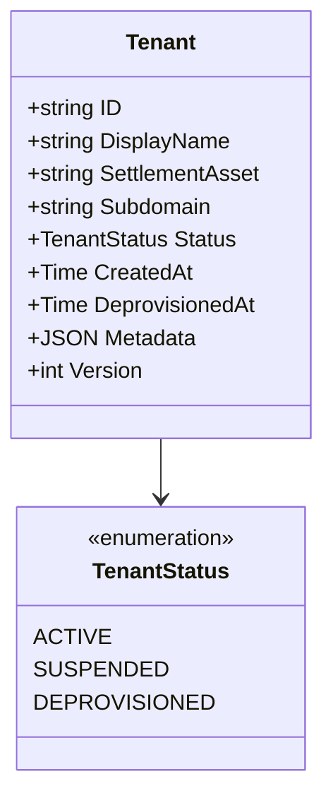
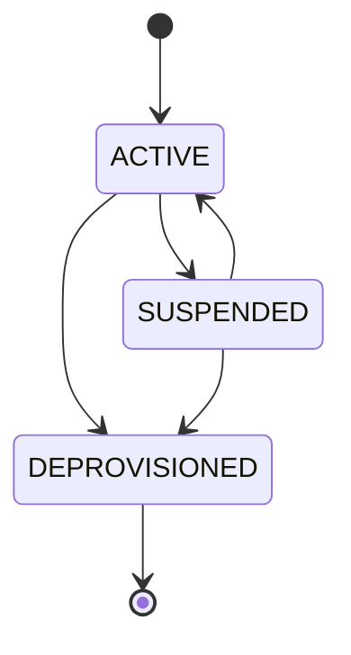
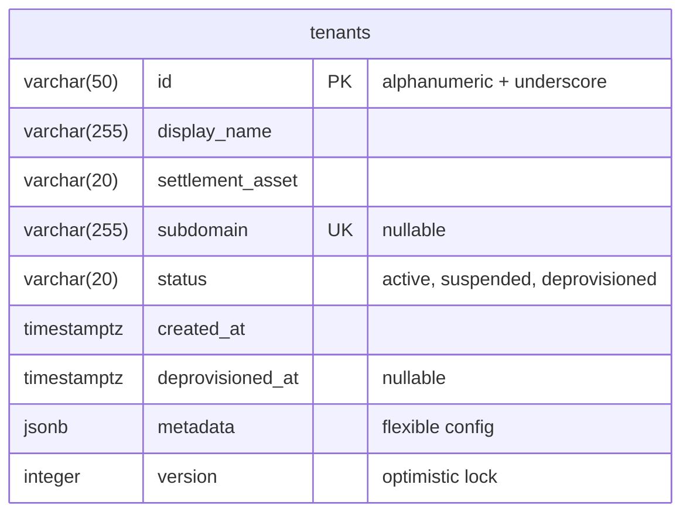

# Tenant Service

Platform infrastructure service for multi-tenant management with PostgreSQL schema isolation.

## Overview

| Attribute | Value |
|-----------|-------|
| **Type** | Infrastructure (not BIAN) |
| **Port** | 50056 (gRPC) |
| **Language** | Go |
| **Database** | PostgreSQL/CockroachDB |
| **Standalone** | Yes |

**Note**: This service is not part of the BIAN standard. It provides essential multi-tenancy
infrastructure for shared-cluster deployments requiring data isolation between organisations.

## gRPC Methods

| Method | HTTP | Purpose |
|--------|------|---------|
| `InitiateTenant` | `POST /v1/tenants` | Create new tenant |
| `RetrieveTenant` | `GET /v1/tenants/{tenant_id}` | Get tenant details |
| `UpdateTenantStatus` | `PATCH /v1/tenants/{tenant_id}/status` | Change lifecycle status |
| `ListTenants` | `GET /v1/tenants` | List with filters |

## Domain Model



**Field Notes:**

- `ID`: Alphanumeric + underscore, 1-50 chars (used for schema name `org_{id}`)
- `SettlementAsset`: e.g., GBP, USD, GPU-HOUR

### Tenant Status

| Status | Description |
|--------|-------------|
| `ACTIVE` | Tenant is operational |
| `SUSPENDED` | Temporarily disabled (recoverable) |
| `DEPROVISIONED` | Terminal state (no operations) |

**Note:** API enum uses uppercase (ACTIVE), DB stores lowercase (active).

**Status Transitions:**



- DEPROVISIONED is terminal (cannot be reactivated)
- SUSPENDED can return to ACTIVE

## Schema Isolation

Each tenant's data is isolated in a dedicated PostgreSQL schema:

```text
org_{tenant_id}
```

Example: Tenant `acme_bank` → Schema `org_acme_bank`

The tenant registry itself is stored in the shared `platform` schema.

## Database Schema

**Schema**: `platform`



**Constraints:**

- `valid_status`: status IN ('active', 'suspended', 'deprovisioned')
- `valid_org_id`: id matches `^[a-zA-Z0-9_]{1,50}$`
- Subdomain unique when not null

## Cached Registry

In-memory tenant cache for validation middleware:

| Setting | Value |
|---------|-------|
| Refresh interval | 60 seconds |
| Per-refresh timeout | 30 seconds |
| Strategy | Fail-open (uses stale cache if refresh fails) |

**Fail-open guardrails:**

- Only allows previously-seen tenants (cached entries)
- Never accepts unknown tenant IDs during refresh failures
- Emits metrics/alerts when operating in stale-cache mode
- Cache populated on startup before accepting traffic

## Configuration

| Variable | Default | Purpose |
|----------|---------|---------|
| `GRPC_PORT` | 50056 | gRPC server port |
| `METRICS_PORT` | 9090 | Prometheus metrics endpoint port |
| `DATABASE_URL` | - | PostgreSQL connection string |
| `DB_MAX_OPEN_CONNS` | 25 | Connection pool size |
| `DB_MAX_IDLE_CONNS` | 5 | Idle connections |
| `DB_CONN_MAX_LIFETIME` | 5m | Connection max age |

## Observability

### Metrics Endpoint

The service exposes Prometheus metrics on port 9090:

- **Endpoint**: `http://localhost:9090/metrics`
- **Health Check**: `http://localhost:9090/healthz`

**Provisioning Metrics:**

| Metric | Type | Labels | Description |
|--------|------|--------|-------------|
| `tenant_provisioning_duration_seconds` | Histogram | status | Duration of tenant provisioning operations |
| `tenant_provisioning_queue_depth` | Gauge | - | Number of tenants in PROVISIONING_PENDING status awaiting provisioning |
| `tenant_service_provisioning_failures_total` | Counter | service_name | Service-specific provisioning failures |
| `tenant_provisioning_retries_total` | Counter | - | Provisioning retry attempts across all tenants |

**Prometheus Scrape Configuration:**

```yaml
scrape_configs:
  - job_name: 'tenant-service'
    kubernetes_sd_configs:
      - role: endpoints
    relabel_configs:
      - source_labels: [__meta_kubernetes_service_annotation_prometheus_io_scrape]
        action: keep
        regex: true
      - source_labels: [__meta_kubernetes_service_annotation_prometheus_io_port]
        action: replace
        target_label: __address__
        regex: ([^:]+)(?::\d+)?;(\d+)
        replacement: $1:$2
      - source_labels: [__meta_kubernetes_service_annotation_prometheus_io_path]
        action: replace
        target_label: __metrics_path__
        regex: (.+)
```

## Key Patterns

### Tenant ID Validation

Must match: `^[a-zA-Z0-9_]{1,50}$`

Used for:

- PostgreSQL schema routing (`org_{id}`)
- API subdomain routing

### No Delete Operations

Tenants are managed through status transitions, not deletion:

- Audit compliance (full history preserved)
- Recoverable: suspended can be reactivated
- Data integrity: no cascade delete complexities

### Optimistic Locking

Updates check `WHERE version = expected_version`. Returns conflict error on mismatch.

## Kubernetes Deployment

| Setting | Value |
|---------|-------|
| Replicas | 2 |
| CPU | 50m-200m |
| Memory | 64Mi-256Mi |
| User | 65532 (non-root) |
| Filesystem | Read-only |

## References

- [Service Architecture](../README.md)
- [Proto Definitions](../../api/proto/meridian/tenant/v1/)
- [ADR-0002: Microservices per BIAN Domain](../../docs/adr/0002-microservices-per-bian-domain.md)
