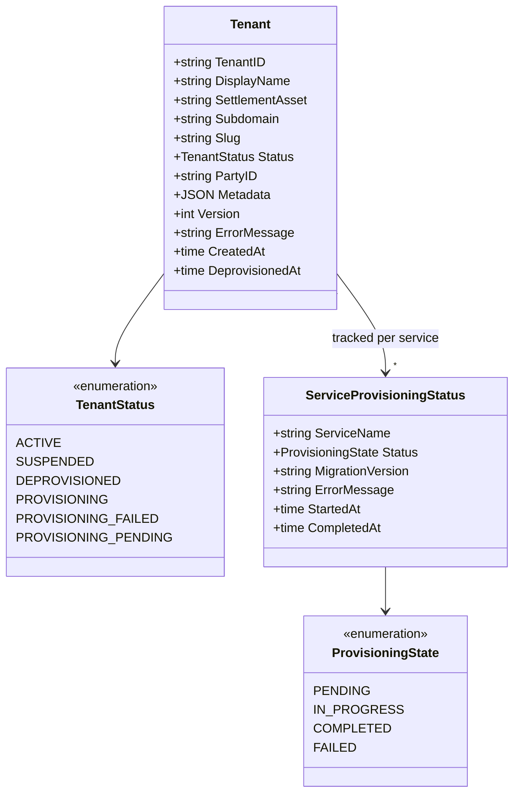

# tenant

Platform multi-tenancy registry and schema provisioner. Maintains tenant lifecycle
state and creates `org_{tenant_id}` schemas across all CockroachDB service databases.

## Overview

| Attribute | Value |
|-----------|-------|
| **BIAN Domain** | Infrastructure (non-BIAN) |
| **Layer** | Lifecycle Orchestration |
| **Port** | 50056 (gRPC) |
| **Database** | CockroachDB platform schema (`platform`) for tenant registry; provisions `org_{tenant_id}` in all service databases |
| **Standalone** | No - requires `party` at runtime when `PARTY_SERVICE_ENABLED=true`; requires per-service database URLs for schema provisioning |

## API Surface

### gRPC

| Service | RPC | Purpose |
|---------|-----|---------|
| `TenantService` | `InitiateTenant` | Register a new tenant; triggers async schema provisioning |
| `TenantService` | `RetrieveTenant` | Get tenant details; used to poll provisioning status |
| `TenantService` | `UpdateTenantStatus` | Lifecycle transitions (active, suspended, deprovisioned) with optimistic locking |
| `TenantService` | `ListTenants` | Paginated list with optional status filter |
| `TenantService` | `ReconcileMigrations` | Apply new service migrations to existing tenant schemas |
| `TenantService` | `GetTenantProvisioningStatus` | Per-service provisioning progress with migration versions and error details |

Proto: `api/proto/meridian/tenant/v1/tenant.proto` (relative to repo root).

## Domain Model

Tenant ID is alphanumeric plus underscore (1-50 chars) and is used directly as
the schema name suffix (`org_{tenant_id}`). Slug is a DNS label (lowercase
alphanumeric with hyphens, 3-63 chars) used for subdomain routing.

Status transitions: `PROVISIONING_PENDING -> PROVISIONING -> ACTIVE` (happy path).
`PROVISIONING_FAILED` is retryable (transitions back to `PROVISIONING`).
`DEPROVISIONED` is terminal. Tenants are never hard-deleted.

`Version` field enables optimistic locking. `UpdateTenantStatus` returns `ABORTED`
on version mismatch; callers should retry with a fresh `RetrieveTenant`.

## Dependencies

| Service | Protocol | Purpose |
|---------|----------|---------|
| `party` | gRPC | Registers the organization as a BIAN Party on tenant creation and stores the returned `party_id` (requires `PARTY_SERVICE_ENABLED=true`) |
| All service CockroachDB databases | Direct SQL | Creates `org_{tenant_id}` schema and applies service migrations during provisioning |

Services whose databases receive schemas during provisioning: `party`, `current-account`,
`position-keeping`, `financial-accounting`, `payment-order`, `market-information`,
`reference-data`, `internal-account`, `reconciliation`, `identity`, `control-plane`.

## Dependents

| Service | Entry Point | Purpose |
|---------|-------------|---------|
| `api-gateway` | `services/api-gateway/registration_handler.go` | Tenant creation during user self-registration flow |
| `identity` | `services/identity/bootstrap/self_registered_admin.go` | Tenant domain types for operator admin bootstrap |

## Load-Bearing Files

Paths are relative to `services/tenant/`.

| File | Why It Matters |
|------|----------------|
| `cmd/main.go` | Wires gRPC server with platform admin interceptor; loads worker config and controls startup order |
| `app/container.go` | Dependency injection container; initialization order and worker lifecycle; controls which features are enabled based on env vars |
| `service/server.go` | gRPC `TenantService` implementation; delegates to repository and provisioner |
| `service/grpc_provisioning_endpoints.go` | `ReconcileMigrations` and `GetTenantProvisioningStatus` gRPC handlers |
| `provisioner/provisioner.go` | Orchestrates multi-service schema provisioning; `DefaultConfig` enumerates all provisioned services |
| `provisioner/postgres_provisioner.go` | Creates `org_{tenant_id}` schemas and runs migrations per service database; circuit breaker per service |
| `domain/tenant.go` | Tenant entity and status transition invariants; all status changes validated here |
| `adapters/persistence/repository.go` | CockroachDB GORM repository; GORM hooks for audit trail |

## Configuration

### Core

| Variable | Required | Default | Purpose |
|----------|----------|---------|---------|
| `DATABASE_URL` | Yes | - | CockroachDB connection string (platform schema) |
| `GRPC_PORT` | No | `50056` | gRPC listen port |
| `LOG_LEVEL` | No | `info` | Log verbosity: `debug`, `info`, `warn`, `error` |

### Schema Provisioning

| Variable | Required | Default | Purpose |
|----------|----------|---------|---------|
| `SCHEMA_PROVISIONING_ENABLED` | No | `false` | Enable per-tenant schema creation and migration on `InitiateTenant` |
| `MIGRATIONS_BASE_PATH` | No | `/migrations` | Base path for service migration directories, relative to container root |
| `PARTY_DATABASE_URL` | Conditional | derived from `DATABASE_URL` | CockroachDB URL for `party` service schema provisioning |
| `CURRENT_ACCOUNT_DATABASE_URL` | Conditional | derived | CockroachDB URL for `current-account` schema provisioning |
| `POSITION_KEEPING_DATABASE_URL` | Conditional | derived | CockroachDB URL for `position-keeping` schema provisioning |
| `FINANCIAL_ACCOUNTING_DATABASE_URL` | Conditional | derived | CockroachDB URL for `financial-accounting` schema provisioning |
| `PAYMENT_ORDER_DATABASE_URL` | Conditional | derived | CockroachDB URL for `payment-order` schema provisioning |

Per-service database URLs are derived from `DATABASE_URL` by substituting the database
name if a specific `{SERVICE}_DATABASE_URL` variable is not set.

### Party Client

| Variable | Required | Default | Purpose |
|----------|----------|---------|---------|
| `PARTY_SERVICE_ENABLED` | No | `true` | Register BIAN party on tenant creation |
| `K8S_NAMESPACE` | No | `default` | Kubernetes namespace for party service discovery |

### Provisioning Worker

| Variable | Required | Default | Purpose |
|----------|----------|---------|---------|
| `PROVISIONING_WORKER_POLL_INTERVAL` | No | `10s` | Polling interval for `PROVISIONING_PENDING` jobs |
| `PROVISIONING_MAX_RETRIES` | No | `5` | Maximum retry attempts per provisioning job |
| `PROVISIONING_RETRY_BASE_DELAY` | No | `2s` | Initial retry backoff delay |
| `PROVISIONING_RETRY_MAX_DELAY` | No | `30s` | Maximum retry backoff delay |
| `PROVISIONING_MAX_CONCURRENT` | No | `5` | Maximum concurrent provisioning jobs |

### Alerting

| Variable | Required | Default | Purpose |
|----------|----------|---------|---------|
| `PAGERDUTY_ENABLED` | No | `false` | Enable PagerDuty alerting on provisioning failure |
| `PAGERDUTY_ROUTING_KEY` | Conditional | - | PagerDuty routing key (required when `PAGERDUTY_ENABLED=true`) |
| `SLACK_WEBHOOK_URL` | No | - | Slack webhook URL for provisioning failure notifications |

## References

- [`docs/architecture-layers.md`](../../docs/architecture-layers.md) - Lifecycle Orchestration layer (section 5)
- [`api/proto/meridian/tenant/v1/tenant.proto`](../../api/proto/meridian/tenant/v1/tenant.proto)
