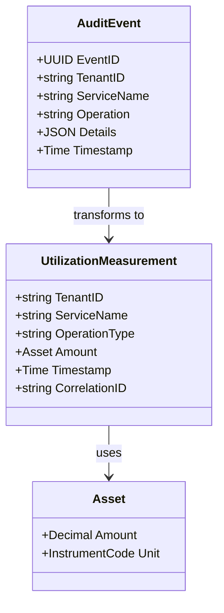
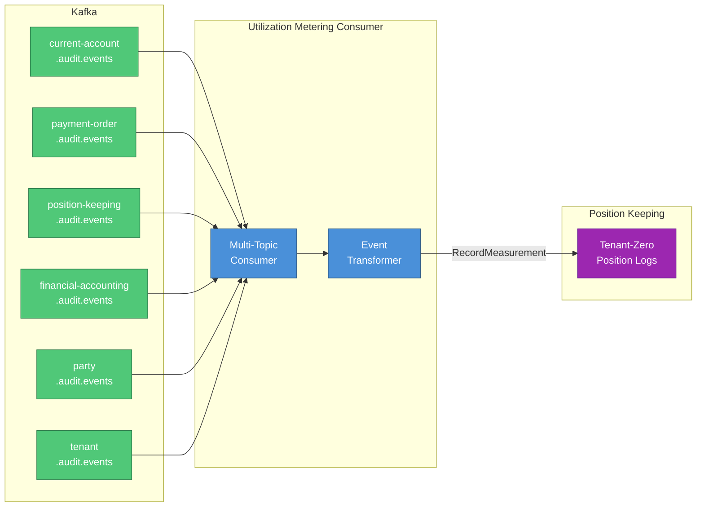

# Utilization Metering Consumer

Centralised Kafka consumer for platform billing that transforms audit events into utilization measurements.

## Overview

| Attribute | Value |
|-----------|-------|
| **BIAN Domain** | Infrastructure (Platform Billing) |
| **Port** | 8080 (HTTP) |
| **Language** | Go |
| **Database** | None (stateless consumer) |
| **Standalone** | No (requires Kafka, Position Keeping) |

## Purpose

The Utilization Metering Consumer provides platform-level billing by:

- Consuming audit events from all 6 domain services
- Transforming events into standardized utilization measurements
- Recording measurements to Position Keeping's tenant-zero for billing
- Enabling multi-dimensional usage tracking (transactions, API calls, storage, etc.)

This allows Meridian to track and bill for platform usage across all tenants without coupling
billing logic into individual domain services.

## HTTP Endpoints

| Endpoint | Method | Purpose |
|----------|--------|---------|
| `/healthz` | GET | Liveness probe (always returns OK) |
| `/ready` | GET | Readiness probe (checks consumer initialisation) |
| `/metrics` | GET | Prometheus metrics endpoint |

## Domain Model



**Key Fields:**

- `TenantID`: Customer being billed (mapped from audit event tenant)
- `ServiceName`: Source service (current-account, payment-order, etc.)
- `OperationType`: Operation performed (CreateAccount, ProcessPayment, etc.)
- `Amount`: Measured quantity using Universal Asset System (e.g., 1 TRANSACTION, 5 API_CALL)
- `CorrelationID`: Links measurement back to original audit event

## Architecture

### Centralised Consumer Design

Unlike per-service audit consumers, this service:

- Runs as a **single deployment** (not one per service)
- Consumes from **multiple topics** (all 6 service audit topics)
- Writes to **tenant-zero** in Position Keeping (platform billing isolation)
- Uses **HPA** for scaling based on aggregate Kafka consumer lag



### Event Transformation Pipeline

1. **Consume**: Read audit event from Kafka topic
2. **Parse**: Deserialize Protobuf event
3. **Map**: Determine billing account using tenant account mapping
4. **Transform**: Convert event to utilization measurement with appropriate instrument
5. **Record**: Send measurement to Position Keeping tenant-zero via gRPC
6. **Commit**: Commit Kafka offset (at-least-once semantics)

## Kafka Configuration

### Consumer Settings

| Setting | Value | Purpose |
|---------|-------|---------|
| **Group ID** | `utilization-metering-consumer` | Ensures single active consumer per partition |
| **Auto Offset Reset** | `earliest` | Process all historical events on first start |
| **Enable Auto Commit** | `false` | Manual commit for at-least-once semantics |
| **Session Timeout** | 30s | Kafka consumer group health check |
| **Max Poll Records** | 500 | Batch size for processing |

### Consumed Topics

| Service | Topic Pattern | Example |
|---------|---------------|---------|
| CurrentAccount | `current-account.audit.events` | Account operations |
| PaymentOrder | `payment-order.audit.events` | Payment processing |
| PositionKeeping | `position-keeping.audit.events` | Transaction logging |
| FinancialAccounting | `financial-accounting.audit.events` | Ledger postings |
| Party | `party.audit.events` | Party management |
| Tenant | `tenant.audit.events` | Tenant provisioning |

## Service Dependencies

| Service | Port | Purpose |
|---------|------|---------|
| Kafka | 9092 | Audit event streaming |
| Position Keeping | 50053 | Record measurements to tenant-zero |

## Configuration

| Variable | Required | Default | Purpose |
|----------|----------|---------|---------|
| `KAFKA_BOOTSTRAP_SERVERS` | Yes | `kafka:9092` | Kafka broker addresses |
| `CONSUMER_GROUP_ID` | Yes | `utilization-metering-consumer` | Consumer group identifier |
| `AUDIT_TOPICS` | Yes | Service audit topics | Comma-separated list of topics to consume |
| `POSITION_KEEPING_ENDPOINT` | Yes | `position-keeping:50053` | Position Keeping gRPC endpoint |
| `TENANT_ZERO_ID` | Yes | - | UUID of platform billing tenant |
| `TENANT_ACCOUNT_MAPPING` | No | `{}` | JSON mapping of tenant IDs to billing accounts |
| `HTTP_PORT` | No | `8080` | HTTP server port for health/metrics |
| `K8S_NAMESPACE` | No | `default` | Kubernetes namespace for service discovery |

### Tenant Account Mapping

The `TENANT_ACCOUNT_MAPPING` environment variable configures which billing account to charge
for each tenant's usage. This allows flexible billing structures (e.g., resellers, subsidiaries).

**Format:** JSON object mapping tenant UUIDs to billing account UUIDs

```json
{
  "tenant-id-1": "billing-account-1",
  "tenant-id-2": "billing-account-1",
  "tenant-id-3": "billing-account-2"
}
```

**Default Behaviour:** If a tenant is not in the mapping, it maps to itself (tenant bills itself).

**Tenant-Zero Special Case:** Tenant-zero always maps to itself to prevent circular billing.

## Utilization Instruments

The service uses Meridian's Universal Asset System to track different types of platform usage:

| Instrument Code | Unit | Description |
|----------------|------|-------------|
| `TRANSACTION` | count | Financial transaction processed |
| `API_CALL` | count | API request handled |
| `STORAGE_GB` | gigabytes | Data storage consumed |
| `COMPUTE_HOUR` | hours | Compute resources used |
| `NETWORK_GB` | gigabytes | Network bandwidth consumed |

**Future Extensibility:** New instrument types can be added without code changes by updating
the Reference Data service's instrument registry.

## Prometheus Metrics

### Event Processing Metrics

| Metric | Type | Labels | Description |
|--------|------|--------|-------------|
| `meridian_utilization_metering_events_consumed_total` | Counter | `service`, `topic` | Events consumed by service/topic |
| `meridian_utilization_metering_measurements_recorded_total` | Counter | `service`, `asset_type` | Measurements recorded by service/asset |
| `meridian_utilization_metering_event_processing_duration_seconds` | Histogram | `service` | Event processing latency |

### Error Metrics

| Metric | Type | Labels | Description |
|--------|------|--------|-------------|
| `meridian_utilization_metering_transformation_errors_total` | Counter | `service`, `error_type` | Transformation errors by type |
| `meridian_utilization_metering_position_keeping_api_errors_total` | Counter | `error_type` | API errors by type |

### Consumer Health Metrics

| Metric | Type | Labels | Description |
|--------|------|--------|-------------|
| `meridian_utilization_metering_kafka_consumer_lag_messages` | Gauge | `topic`, `partition` | Consumer lag by topic/partition |

## Autoscaling (HPA)

The HorizontalPodAutoscaler scales based on:

1. **Kafka Consumer Lag** (primary trigger)
   - Scale up when lag > 1000 messages
   - Scale down when lag < 100 messages

2. **CPU Utilization** (70% threshold)

3. **Memory Utilization** (80% threshold)

**Scaling Behaviour:**

- **Min Replicas:** 1 (always at least one consumer)
- **Max Replicas:** 5 (limit concurrent consumers)
- **Scale Up:** After 1 minute of sustained load (100% increase per minute)
- **Scale Down:** After 5 minutes of reduced load (50% decrease per minute)

**Partition Assignment:**

Kafka automatically redistributes partitions across consumer instances when scaling.
Max parallelism is bounded by the number of partitions per topic.

## Key Patterns

### At-Least-Once Semantics

- Manual Kafka offset commits after successful processing
- Duplicate measurements may occur on retry (idempotency handled by Position Keeping)
- Guarantees no lost billing events

### Fire-and-Forget Event Publishing

Unlike transactional outbox patterns, this consumer:

- Does NOT guarantee exactly-once processing
- Prioritizes throughput over strict consistency
- Relies on Position Keeping's idempotency for deduplication

**Trade-off:** Simpler architecture vs potential duplicate measurements (which are idempotent).

### Stateless Consumer

- No local database (pure transformation pipeline)
- All state stored in Position Keeping tenant-zero
- Enables horizontal scaling without data partitioning concerns

## Error Handling

### Transformation Errors

| Error Type | Handling | Impact |
|------------|----------|--------|
| Invalid Event Format | Log error, skip event, commit offset | Single event lost (logged for investigation) |
| Unknown Service | Log warning, use default instrument, continue | Measurement recorded with generic type |
| Missing Tenant Mapping | Use tenant-as-billing-account, continue | Tenant bills itself (default behaviour) |

### Position Keeping API Errors

| Error Type | Handling | Impact |
|------------|----------|--------|
| Transient (UNAVAILABLE) | Retry with exponential backoff (3 attempts) | Temporary lag, auto-recovers |
| Permanent (INVALID_ARGUMENT) | Log error, skip event, commit offset | Single event lost (logged for investigation) |
| Timeout (DEADLINE_EXCEEDED) | Retry with backoff | Temporary lag, auto-recovers |

**Circuit Breaker:** Position Keeping client includes circuit breaker to fail fast when
downstream service is unhealthy (opens after 5 consecutive failures).

## Monitoring & Alerting

### Recommended Alerts

**High Consumer Lag (Critical):**

```yaml
alert: UtilizationMeteringHighLag
expr: meridian_utilization_metering_kafka_consumer_lag_messages > 5000
for: 5m
annotations:
  summary: Utilization metering consumer is falling behind
  description: Consumer lag is {{ $value }} messages
```

**Transformation Error Rate (Warning):**

```yaml
alert: UtilizationMeteringTransformationErrors
expr: rate(meridian_utilization_metering_transformation_errors_total[5m]) > 0.1
for: 2m
annotations:
  summary: High transformation error rate
  description: {{ $value }} errors per second
```

**Position Keeping API Errors (Warning):**

```yaml
alert: UtilizationMeteringAPIErrors
expr: rate(meridian_utilization_metering_position_keeping_api_errors_total[5m]) > 0.05
for: 2m
annotations:
  summary: Position Keeping API errors
  description: {{ $value }} errors per second
```

## Deployment

### Via Tilt (Local Development)

```bash
tilt up utilization-metering-consumer
```

The Tiltfile automatically:

- Builds the Docker image
- Deploys Kubernetes manifests
- Port-forwards 8081:8080 for metrics access
- Hot-reloads on code changes

### Via kubectl (Manual)

```bash
kubectl apply -f services/utilization-metering-consumer/k8s/
```

## Troubleshooting

### Consumer Not Starting

```bash
# Check logs for initialisation errors
kubectl logs -f deployment/utilization-metering-consumer

# Common issues:
# 1. Kafka not reachable: Verify KAFKA_BOOTSTRAP_SERVERS
# 2. Position Keeping unavailable: Check POSITION_KEEPING_ENDPOINT
# 3. Invalid TENANT_ZERO_ID: Verify UUID format
# 4. Missing topics: Create audit event topics first
```

### High Consumer Lag

```bash
# Check HPA status
kubectl get hpa utilization-metering-consumer-hpa

# View current lag per partition
kubectl exec -it deployment/utilization-metering-consumer -- \
  curl -s http://localhost:8080/metrics | grep consumer_lag

# Check if HPA is scaling up
kubectl describe hpa utilization-metering-consumer-hpa
```

### Transformation Errors

```bash
# View error breakdown by service and type
kubectl exec -it deployment/utilization-metering-consumer -- \
  curl -s http://localhost:8080/metrics | grep transformation_errors

# Check logs for specific error details
kubectl logs -f deployment/utilization-metering-consumer | grep "transformation error"
```

### Position Keeping API Errors

```bash
# Check circuit breaker state
kubectl logs -f deployment/utilization-metering-consumer | grep "circuit breaker"

# Verify Position Keeping service health
kubectl exec -it deployment/position-keeping -- curl http://localhost:9090/healthz
```

## Directory Structure

```text
services/utilization-metering-consumer/
├── cmd/                    # Entry point (main.go)
├── domain/                 # Domain models
│   ├── measurement.go      # UtilizationMeasurement type
│   ├── instruments.go      # Instrument code mapping
│   ├── metrics.go          # Prometheus metrics
│   └── tenant_mapping.go   # Tenant-to-account mapping
├── adapters/               # External adapters
│   ├── messaging/          # Kafka consumer
│   └── grpc/              # Position Keeping client
├── app/                    # Application configuration
│   └── config.go           # Config loading
└── k8s/                    # Kubernetes manifests
    ├── deployment.yaml     # Deployment with HPA
    ├── service.yaml        # ClusterIP service
    └── configmap.yaml      # Configuration
```

## References

- [Service Architecture](../README.md)
- [Kubernetes Deployment Guide](k8s/README.md)
- [Position Keeping Service](../position-keeping/README.md)
- [ADR-0009: Application-Level Audit Logging](../../docs/adr/0009-application-level-audit-logging.md)
- [Universal Asset System](../../docs/prd/001-universal-asset-system.md)
