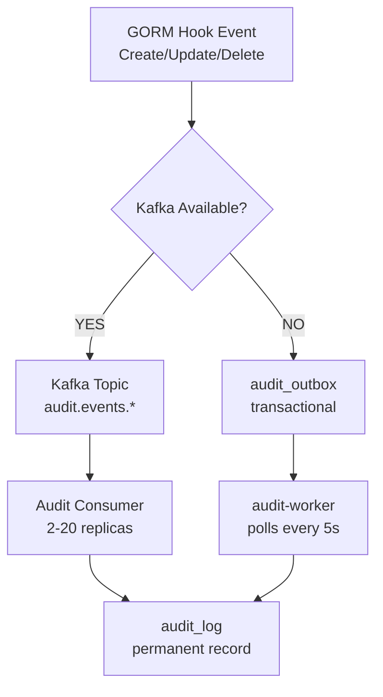

# Audit Hook Helpers

This package provides reusable generic helper functions for adding audit logging to GORM entities.
Instead of copying the same hook patterns to each model, you can implement a simple interface
and call the helper functions.

## Architecture Overview

The audit system uses a **dual-path approach** for guaranteed delivery:

1. **Primary Path (Kafka)**: GORM hooks → Kafka topic → Audit Consumer → `audit_log` table
   - High throughput, asynchronous processing
   - Scales with Kafka consumer replicas (2-20 per service)

2. **Fallback Path (Outbox)**: GORM hooks → `audit_outbox` table → audit-worker → `audit_log` table
   - Automatic failover when Kafka unavailable
   - Transactional guarantees (outbox written in same transaction as business data)

This ensures audit events are never lost, even during Kafka outages.

### Dual-Path Flow Diagram



**Key characteristics:**

- **Primary path**: Low latency (~2ms), high throughput (1000s/sec)
- **Fallback path**: Reliable recovery during Kafka outages, 5s polling interval
- **Transactional safety**: Outbox entries written atomically with business data
- **No lost events**: Dual-path guarantees delivery under all conditions

**Note**: This is separate from the event outbox system (`shared/platform/events/`) which handles
domain events (SUSPEND/RESUME). The audit outbox is specifically for audit logging only.

## Quick Start

### 1. Implement the `Auditable` interface on your entity

```go
import "github.com/meridianhub/meridian/shared/platform/audit"

type MyEntity struct {
    ID   uuid.UUID `gorm:"type:uuid;primaryKey"`
    Name string
    // ... other fields
}

// TableName returns the GORM table name
func (MyEntity) TableName() string {
    return "my_entity"
}

// AuditID returns the record ID as a string for audit logging.
// For UUID-based entities, return id.String().
// For string-based entities, return the ID directly.
func (e MyEntity) AuditID() string {
    return e.ID.String()
}

// AuditTableName returns the table name for audit logging.
func (e MyEntity) AuditTableName() string {
    return "my_entity"
}
```

### 2. Add GORM hooks that call the helpers

```go
import (
    "github.com/meridianhub/meridian/shared/platform/audit"
    "gorm.io/gorm"
)

// AfterCreate records an INSERT audit entry
func (e *MyEntity) AfterCreate(tx *gorm.DB) error {
    return audit.RecordCreate(tx, *e)
}

// BeforeUpdate captures old values for audit
func (e *MyEntity) BeforeUpdate(tx *gorm.DB) error {
    // If your entity embeds BaseModel, call its BeforeUpdate first:
    // if err := e.BaseModel.BeforeUpdate(tx); err != nil {
    //     return err
    // }
    return audit.CaptureOldValue(tx, *e)
}

// AfterUpdate records an UPDATE audit entry with old and new values
func (e *MyEntity) AfterUpdate(tx *gorm.DB) error {
    return audit.RecordUpdate(tx, *e)
}

// AfterDelete records a DELETE audit entry
func (e *MyEntity) AfterDelete(tx *gorm.DB) error {
    return audit.RecordDelete(tx, *e)
}
```

## API Reference

### Types

#### `Auditable` interface

```go
type Auditable interface {
    // AuditID returns the record ID as a string for audit logging.
    AuditID() string

    // AuditTableName returns the table name for audit logging.
    AuditTableName() string
}
```

#### `AuditOutbox` struct

Represents an audit record waiting to be processed by the background worker. Records are written
to the outbox within the same transaction as the business operation, ensuring atomicity.

#### `AuditLog` struct

Represents a permanent audit log entry. Records are moved from the audit_outbox to audit_log
by the background worker.

### Functions

#### `RecordCreate[T Auditable](tx *gorm.DB, entity T) error`

Writes an audit outbox entry for an INSERT operation. Call from your `AfterCreate` hook.

#### `CaptureOldValue[T Auditable](tx *gorm.DB, entity T) error`

Fetches and stores the old entity values before an update. Call from your `BeforeUpdate` hook. The function:

- Queries the database for the current record state
- Stores it in the transaction context for later retrieval
- Skips silently if the entity ID is empty (handles map-based updates)

#### `RecordUpdate[T Auditable](tx *gorm.DB, entity T) error`

Writes an audit outbox entry for an UPDATE operation with both old and new values.
Call from your `AfterUpdate` hook. The function:

- Retrieves the old values captured by `CaptureOldValue`
- Skips silently if old values are not available

#### `RecordDelete[T Auditable](tx *gorm.DB, entity T) error`

Writes an audit outbox entry for a DELETE operation. Call from your `AfterDelete` hook.

## Behaviour Notes

### Empty IDs

The helpers skip audit recording when the entity ID is empty or nil. This handles:

- Map-based updates (`db.Model(&Entity{}).Updates(map...)`) which don't populate the model
- Defensive programming for edge cases

### Context Keys

Each entity type gets its own context key for storing old values, based on the table name.
This allows multiple entity types to be updated in the same transaction without key collisions.

### Error Handling

- `ErrNilTransaction`: Returned when `tx` is nil
- `ErrOldValueType`: Returned when the stored old value has an unexpected type
- `ErrOldValueNotFound`: Returned when old values are expected but not found

## Migration from Manual Hooks

Before (repeated in each entity):

```go
// 100+ lines of recordAudit function
// 50+ lines of context handling
// Error variables
// Context key definitions
```

After (per entity):

```go
func (e MyEntity) AuditID() string       { return e.ID.String() }
func (e MyEntity) AuditTableName() string { return "my_entity" }

func (e *MyEntity) AfterCreate(tx *gorm.DB) error  { return audit.RecordCreate(tx, *e) }
func (e *MyEntity) BeforeUpdate(tx *gorm.DB) error { return audit.CaptureOldValue(tx, *e) }
func (e *MyEntity) AfterUpdate(tx *gorm.DB) error  { return audit.RecordUpdate(tx, *e) }
func (e *MyEntity) AfterDelete(tx *gorm.DB) error  { return audit.RecordDelete(tx, *e) }
```

## Monitoring and Metrics

For operators monitoring the audit system, see:

- [ADR-0009: Application-Level Audit Logging](../../../docs/adr/0009-application-level-audit-logging.md) -
  Complete architecture and Prometheus metrics reference
- [audit-worker README](../../../services/audit-worker/README.md) - Fallback worker metrics and operational
  guidance

**Key Prometheus metrics:**

- `meridian_audit_kafka_events_published_total` - Primary path usage (Kafka) (counter)
- `meridian_audit_kafka_fallback_used_total` - Fallback path activations (counter)
- `meridian_audit_worker_outbox_depth` - Queue depth (gauge, alert if > 1000)
- `meridian_audit_kafka_events_consumed_total` - Consumer throughput (counter)

See ADR-0009 for complete metrics reference and alerting thresholds.

## Configuration Options

### Worker Configuration

The audit worker can be customised with functional options:

```go
worker := audit.NewAuditWorker(db, "my_service", logger,
    audit.WithBatchSize(200),                                    // Default: 100
    audit.WithPollInterval(10*time.Second),                      // Default: 5s
    audit.WithMaxRetries(5),                                     // Default: 3
    audit.WithAdaptivePolling(100*time.Millisecond, 30*time.Second),  // Optional
)
worker.Start(ctx)
defer worker.Stop()
```

### Adaptive Polling

Adaptive polling automatically adjusts the poll interval based on workload:

- When entries are found: Interval decreases to `minPollInterval` (100ms default)
- When outbox is empty: Interval increases exponentially up to `maxPollInterval` (30s default)

This reduces database load during idle periods while maintaining responsiveness under load.

## Troubleshooting

### Audit entries not appearing in audit_log

1. **Check outbox depth**: `SELECT COUNT(*) FROM audit_outbox WHERE status = 'pending'`
2. **Check for failed entries**: `SELECT * FROM audit_outbox WHERE status = 'failed'`
3. **Verify worker is running**: Check for `meridian_audit_worker_outbox_depth` metric
4. **Check Kafka connectivity**: Look for `meridian_audit_kafka_fallback_used_total` metric

### Map-based updates not audited

GORM hooks are bypassed for map-based updates (e.g., `db.Model(&Entity{}).Updates(map...)`).
Use `audit.RecordUpdateManual()` for these cases:

```go
func (r *Repository) Update(ctx context.Context, entity *Entity) error {
    return r.db.Transaction(func(tx *gorm.DB) error {
        // Fetch old values first
        var oldEntity Entity
        if err := tx.First(&oldEntity, entity.ID).Error; err != nil {
            return err
        }

        // Perform map-based update (e.g., for optimistic locking)
        result := tx.Model(&Entity{}).
            Where("id = ? AND version = ?", entity.ID, oldEntity.Version).
            Updates(map[string]interface{}{
                "name":    entity.Name,
                "version": entity.Version + 1,
            })
        if result.RowsAffected == 0 {
            return ErrOptimisticLock
        }

        // Manually record audit
        return audit.RecordUpdateManual(tx, &oldEntity, entity)
    })
}
```

### ErrNilTransaction errors

Ensure audit functions are called within a GORM transaction context:

```go
// Wrong - no transaction context
audit.RecordCreate(db, entity)

// Correct - within transaction or GORM hooks
db.Transaction(func(tx *gorm.DB) error {
    return audit.RecordCreate(tx, entity)
})
```

### High outbox depth

If outbox depth is consistently high:

1. **Check worker health**: Ensure audit-worker pods are running
2. **Check for processing errors**: `SELECT last_error FROM audit_outbox WHERE status = 'failed'`
3. **Increase worker batch size**: Configure with `WithBatchSize(200)` or higher
4. **Scale Kafka consumers**: Increase `current-account-audit-consumer` replicas

## Examples

See the following files for real-world usage:

- `shared/domain/models/customer.go` - UUID-based entity
- `shared/domain/models/account.go` - UUID-based entity
- `services/party/adapters/persistence/party_entity.go` - Service-level entity
- `services/tenant/adapters/persistence/audit.go` - String ID entity

## Related Documentation

- [ADR-0009: Application-Level Audit Logging](../../../docs/adr/0009-application-level-audit-logging.md)
- [ADR-0020: Per-Service Audit Workers](../../../docs/adr/0020-per-service-audit-workers.md) - Deployment pattern
- [Audit Monitoring Guide](../../../docs/operations/audit-monitoring.md) - Operations runbook
- [Adding Audit to a New Service](../../../docs/development/audit-adding-new-service.md) - Step-by-step guide
